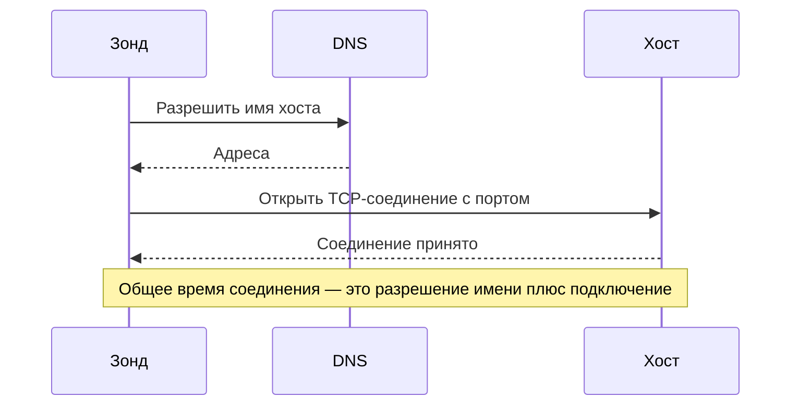

# Мониторинг портов

Монитор порта проверяет, что хост принимает TCP-соединения на порту, и измеряет, сколько длится соединение. Используйте его для сервисов, которые не говорят по HTTP или чей HTTP вы не хотите проверять: баз данных, почтовых серверов, SSH, брокеров сообщений и подобного.

:::cards
- [Создать монитор](#создание-монитора-порта): Шесть шагов в панели управления.
- [Время соединения](#время-соединения): Что измеряют время DNS, TCP и общее время.
- [Критерии мониторинга](#критерии-мониторинга): Доступность и время соединения.
- [Устранение неполадок](#устранение-неполадок): Когда сервис работает, а монитор говорит, что он не в сети.
:::

## Как это работает

При каждой проверке зонд разрешает имя хоста, если вы его указали, и открывает TCP-соединение с портом. Порт в сети, как только соединение принято; затем зонд закрывает его, ничего не отправляя. Соединение, которое отклонено или превысило тайм-аут, повторяется — столько раз, сколько повторных попыток вы разрешили. Затем OneUptime пропускает результат через критерии монитора.

Зонд открывает только TCP-соединения: сервис, который слушает только UDP, например агент SNMP, нельзя проверить монитором порта.

Когда проверка не проходит, зонд также трассирует маршрут до хоста, определяет его имя и прикладывает найденное к результату как **Network Path at Time of Failure**, чтобы вы видели, где оборвался маршрут. Зонд, потерявший собственное сетевое подключение, не сообщает никакого результата, поэтому не может пометить ваш сервис как не в сети.

## Перед началом

- **Роль, которая может создавать мониторы**: Project Owner, Project Admin, Project Member, Monitor Admin или Monitor Member либо пользовательская роль с разрешением Create Monitor.
- **Зонд, который может достучаться до порта.** Зонды проекта по умолчанию выбираются для каждого нового монитора. Если перед сервисом стоит брандмауэр, разрешите [IP-адресам зондов OneUptime Cloud](/docs/configuration/ip-addresses) подключаться к порту. Сервису в частной сети, например базе данных, нужен [пользовательский зонд](/docs/probe/custom-probe) внутри этой сети.

## Создание монитора порта

:::steps
### Начните новый монитор

Перейдите в **Мониторы** и нажмите **Создать монитор**. В **Тип монитора** выберите **Порт**.

### Назовите его

Введите **Имя**, например `Orders database`, и нажмите **Далее**.

### Введите хост и порт

В **Имя хоста или IP-адрес** введите хост, на котором находится порт, например `db.example.com` или `10.0.0.12`. В **Порт** введите номер порта, например `5432`.

### Протестируйте его

Нажмите **Протестировать монитор**, выберите зонд в **Выберите зонд** и нажмите **Запустить тест**. **Результат теста монитора** показывает, открылось ли соединение и сколько длилась каждая часть.

### Проверьте критерии

**Критерии монитора** начинаются с [критериев по умолчанию](#критерии-по-умолчанию): не в сети, когда порт не принимает соединение, в сети, когда принимает. Измените их при необходимости и нажмите **Далее**.

### Выберите зонды и создайте

Оставьте или измените **Зонды** и **Интервал мониторинга** (он начинается с **Каждые 5 минут**) и нажмите **Создать монитор**. Откроется страница монитора.
:::

## Параметры конфигурации

| Поле | По умолчанию | Что ввести |
| --- | --- | --- |
| **Имя хоста или IP-адрес** | Нет | Хост, например `example.com`, `192.168.1.1` или `2001:db8::1`. Вводите только хост, без `http://`. |
| **Порт** | Нет | TCP-порт для подключения, от `1` до `65535`. |
| **Тайм-аут запроса (секунды)** (в **Дополнительные поля**) | `60` | Сколько может длиться одна попытка — разрешение DNS и TCP-соединение вместе. Максимум — 60 секунд. |
| **Повторные попытки при сбое** (в **Дополнительные поля**) | Значение зонда по умолчанию, обычно `3` | Сколько раз повторять неудачную попытку. Максимум — 3. |

**Повторные попытки при сбое** считает повторы _после_ первой попытки, поэтому `0` выполняет проверку один раз, а `2` — до трёх раз. Если поле пустое, используется значение зонда по умолчанию: 3, если только `PROBE_MONITOR_RETRY_LIMIT` зонда не задаёт другое. Повторяется любой сбой, включая тайм-ауты, с паузой в одну секунду между попытками. Успешное соединение, которое заняло больше 10 секунд, тоже проверяется повторно.

Распространённые порты:

| Порт | Сервис |
| --- | --- |
| `22` | SSH |
| `25` | SMTP |
| `80` | HTTP |
| `443` | HTTPS |
| `3306` | MySQL |
| `5432` | PostgreSQL |
| `6379` | Redis |
| `27017` | MongoDB |

> [!NOTE]
> Многие хостинг-провайдеры блокируют исходящий SMTP. На зонде, который не может отправлять ping (именно так зонд замечает, что работает у такого провайдера), проверка порта `25`, превысившая тайм-аут, считается успешной. Чтобы надёжно проверять порт `25` почтового сервера, запустите монитор на [пользовательском зонде](/docs/probe/custom-probe), которому разрешено к нему подключаться.

## Время соединения

Для имени хоста зонд измеряет проверку в две фазы:

| Фаза | С | До |
| --- | --- | --- |
| **Разрешение DNS** | Начала проверки | Первой попытки TCP-соединения |
| **TCP-соединение** | Первой попытки TCP-соединения | Принятия соединения, включая время на переключение между адресами IPv6 и IPv4 |

**Total Connection Time (DNS + TCP)** длится от начала проверки до принятия соединения. Это также время ответа монитора порта, поэтому существующие критерии, оповещения и графики, использующие время ответа, продолжают работать.

Когда целью является IP-адрес, разрешения DNS нет, поэтому эта фаза пропускается. Результаты проверок, сделанных до появления времени по фазам, показывают только общее время соединения.

## Критерии мониторинга

Критерии определяют, когда порт считается в сети, деградировавшим или не в сети, и объявляется ли при этом инцидент или создаётся оповещение. Каждый критерий проверяет один или несколько фильтров:

| Фильтр | Условия | Что проверяет |
| --- | --- | --- |
| **Is Online** | **Истина**, **Ложь** | Принял ли порт соединение. |
| **Total Connection Time (DNS + TCP) (in ms)** | **Greater Than**, **Less Than**, **Greater Than Or Equal To**, **Less Than Or Equal To** | Полное время соединения, включая разрешение DNS для имени хоста. |
| **Port DNS Lookup Time (in ms)** | **Greater Than**, **Less Than**, **Greater Than Or Equal To**, **Less Than Or Equal To** | Разрешение DNS перед первой попыткой TCP. Не имеет значения, когда целью является IP-адрес. |
| **Port TCP Connect Time (in ms)** | **Greater Than**, **Less Than**, **Greater Than Or Equal To**, **Less Than Or Equal To** | От первой попытки TCP до принятия соединения, включая переключение между IPv6 и IPv4. |
| **Is Request Timeout** | **Истина**, **Ложь** | Превышали ли разрешение DNS или TCP-соединение тайм-аут при каждой попытке. |

Критерию по времени разрешения DNS нечего оценивать, когда целью является IP-адрес. Для критериев, которые должны одинаково работать с именами хостов и IP-адресами, используйте общее время или время TCP-соединения.

При двух и более фильтрах **Условие совпадения** решает, должны ли совпасть **Все** или достаточно **Любой** из них. **Действия** критерия определяют, что он делает: меняет статус монитора, создаёт оповещение, объявляет инцидент или делает несколько из этого.

### Критерии по умолчанию

Новый монитор порта начинает с двух критериев:

- **Не в сети** — порт не принимает соединение после всех повторных попыток. Монитор помечается как **Не в сети**, и создаётся инцидент с названием «_monitor name_ is offline». Инцидент разрешается сам, когда порт снова принимает соединения.
- **В сети** — порт принимает соединение. Монитор помечается как **Работает**.

Критерии проверяются сверху вниз, и первый совпавший решает, что произойдёт. Если ни один не совпал, монитор показывает статус по умолчанию: **Работает**, если вы не выберете другой в разделе **Дополнительные поля** под критериями.

### Оценка за период времени

**Оценивать этот критерий в течение определённого периода времени** — флажок под фильтром, доступный для **Is Online**, **Total Connection Time (DNS + TCP) (in ms)**, **Port DNS Lookup Time (in ms)** и **Port TCP Connect Time (in ms)**. Включите его, чтобы оценивать окно прошлых проверок, а не только последнюю: выберите агрегацию в **Оценить** и окно от 2 до 60 минут в **За последние (в минутах)**.

| Агрегация | Совпадает, когда |
| --- | --- |
| **Среднее**, **Сумма**, **Maximum Value**, **Minimum Value** | Это значение за окно удовлетворяет условию. Только для числовых фильтров. |
| **All Values** | Каждая проверка в окне удовлетворяет условию. |
| **Any Value** | Хотя бы одна проверка в окне удовлетворяет условию. |

**All Values** совпадает только тогда, когда окно действительно покрыто данными. У только что созданного монитора или монитора, проверки которого перестали записываться, недостаточно истории, чтобы что-то сказать о последних N минутах, поэтому критерий ждёт, а не срабатывает по единственному имеющемуся значению. **Any Value** — это настройка для «сообщи мне сразу, как только хоть одна проверка превысит порог», и она по-прежнему срабатывает немедленно.

**Если нет данных** определяет, что происходит, пока окно не может подкрепить критерий:

| Вариант | Что происходит | Для чего использовать |
| --- | --- | --- |
| **Ignore** (по умолчанию) | Критерий не совпадает. | Обычные пороговые оповещения. |
| **Триггер** | Отсутствие данных считается проблемой. | Проверки, где молчание само по себе — сбой. |
| **Treat As Zero** | Окно сравнивается как один ноль. | Счётчики, где отсутствие событий действительно означает ноль. |

### Примеры критериев

| Цель | Фильтр | Условие | Значение |
| --- | --- | --- | --- |
| Не в сети, когда порт закрыт | **Is Online** | **Ложь** | — |
| Оповещать, когда подключение медленное | **Total Connection Time (DNS + TCP) (in ms)** | **Greater Than** | `500` |
| Помечать сервис деградировавшим, когда он медленно подключается | **Total Connection Time (DNS + TCP) (in ms)** | **Greater Than** | `200` |
| Оповещать, когда DNS медленный | **Port DNS Lookup Time (in ms)** | **Greater Than** | `100` |
| Оповещать, когда TCP-рукопожатие медленное | **Port TCP Connect Time (in ms)** | **Greater Than** | `250` |

## Устранение неполадок

:::details Сервис работает, но монитор говорит, что он не в сети
Зонд не смог открыть соединение: его отбрасывает брандмауэр, сервис слушает только частный интерфейс или указан неверный порт. Корневая причина инцидента и **Журналы мониторинга** монитора показывают ошибку, а **Network Path at Time of Failure** показывает, как далеко дошёл маршрут. Пропустите зонды через брандмауэр или используйте [пользовательский зонд](/docs/probe/custom-probe) внутри сети.
:::

:::details Время разрешения DNS всегда пустое
Цель — IP-адрес, поэтому разрешать нечего. Используйте вместо этого **Total Connection Time (DNS + TCP) (in ms)** или **Port TCP Connect Time (in ms)**.
:::

:::details Мне нужно проверить UDP-сервис
Мониторы портов открывают только TCP-соединения. Для DNS-сервера используйте [монитор DNS](/docs/monitor/dns-monitor), а для сервера времени на UDP-порту 123 — [монитор NTP](/docs/monitor/ntp-monitor). Оба отправляют настоящие запросы.
:::

## Дальнейшие шаги

:::cards
- [Мониторинг Ping](/docs/monitor/ping-monitor): Проверить, что доступен сам хост.
- [Мониторинг SSL-сертификатов](/docs/monitor/ssl-certificate-monitor): Проверить сертификат на TLS-порту.
- [Мониторинг состояния баз данных](/docs/monitor/database-health-monitor): Выйти за рамки открытого порта и следить за состоянием базы данных.
- [Пользовательские probes](/docs/probe/custom-probe): Проверять порты в вашей собственной сети.
:::
