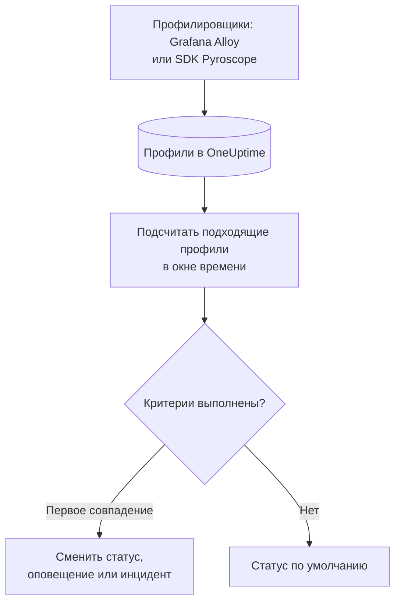

# Мониторинг профилей

Монитор профилей считает за окно времени непрерывные профили, которые ваши сервисы отправляют в OneUptime и которые соответствуют вашим фильтрам (тип профиля, сервис, атрибуты). Когда число удовлетворяет вашим критериям, он меняет статус монитора, создаёт оповещение или объявляет инцидент. Главное его применение — заметить, что данные профилирования перестали приходить от сервиса.

> [!IMPORTANT]
> **Создать монитор** в панели управления не предлагает Profiles: формы для его фильтров пока нет. Создайте монитор профилей через [API](/docs/api-reference/api-reference) или [Terraform](/docs/terraform/monitor-steps), как описано ниже. Когда он создан, его критерии можно просматривать и изменять на странице **Критерии** монитора в панели управления; его фильтры можно изменить только через API или Terraform.

:::cards
- [Создание монитора](#создание-монитора-профилей): Конфигурация, которую нужно отправить через API или Terraform.
- [Что он запрашивает](#что-он-запрашивает): Типы профилей, сервисы, атрибуты и окно.
- [Критерии](#критерии): Условия, которые можно использовать.
- [Разобранный пример](#разобранный-пример-профили-перестают-приходить): Узнайте, когда сервис перестаёт отправлять профили.
:::

## Как это работает



Каждую минуту OneUptime подсчитывает профили, которые соответствуют фильтрам монитора и начались в пределах его окна времени. Он сравнивает это число с критериями монитора сверху вниз, и первый совпавший критерий решает, что произойдёт. Если не совпал ни один, монитор возвращается к своему статусу по умолчанию.

## Перед началом

- Ваши сервисы отправляют данные непрерывного профилирования в OneUptime через Grafana Alloy (eBPF) или SDK Pyroscope. См. [Непрерывное профилирование](/docs/telemetry/profiles).
- У вас есть ключ API, который может создавать мониторы, или настроенный провайдер Terraform для OneUptime.
- Вы знаете ID каждого сервиса телеметрии, за которым нужно следить, и типы профилей, которые он отправляет, например `cpu`, `wall`, `alloc_objects`, `alloc_space` или `goroutine`.

## Создание монитора профилей

:::steps
### Выберите, что считать

Напишите конфигурацию шага `profileMonitor`. Эта считает профили CPU одного сервиса за последние пять минут:

```json
{
  "profileMonitor": {
    "telemetryServiceIds": [],
    "profileTypes": ["cpu"],
    "profileType": "",
    "attributes": {},
    "lastXSecondsOfProfiles": 300
  }
}
```

Укажите ID сервиса в `telemetryServiceIds` или оставьте список пустым, чтобы считать профили всех сервисов. Каждое поле описано в разделе [Что он запрашивает](#что-он-запрашивает).

### Создайте монитор

Создайте через [API](/docs/api-reference/api-reference) или [Terraform](/docs/terraform/monitor-steps) монитор с типом `Profiles` и шагом, который содержит эту конфигурацию и хотя бы один критерий. В Terraform передайте конфигурацию как атрибут шага `profile_monitor`, записанный с помощью `jsonencode()`.

### Проверьте его в панели управления

Откройте монитор из раздела **Мониторы**. Его первая оценка выполнится в течение минуты, а статус изменится, как только совпадёт какой-либо критерий.
:::

## Что он запрашивает

| Поле | Чему соответствует | По умолчанию |
| --- | --- | --- |
| `profileTypes` | Профили любого из этих типов при точном совпадении, например `cpu`. | Пусто: все типы |
| `profileType` | Профили, тип которых содержит этот текст, без учёта регистра. Если поле задано, `profileTypes` игнорируется. | Пусто |
| `telemetryServiceIds` | Профили любого из этих сервисов телеметрии. | Пусто: все сервисы |
| `entityKeys` | Профили любого из этих хостов, подов, контейнеров и других сущностей инфраструктуры. | Пусто: все сущности |
| `attributes` | Профили, атрибуты которых имеют эти значения. | Пусто: без условий |
| `lastXSecondsOfProfiles` | Профили, начавшиеся за это число секунд до оценки. | Нет: задавайте его всегда, иначе учитывается каждый сохранённый профиль и число никогда не падает до 0 |

Чтобы профиль был учтён, должны совпасть все заданные вами фильтры.

## Как он оценивается

- **Каждую минуту.** Монитор профилей не проверяется зондами, поэтому у него нет интервала для настройки и нет страницы **Зонды и интервал**.
- **Одно число на оценку.** Монитор считает профили, которые соответствуют всем фильтрам и начались в пределах `lastXSecondsOfProfiles`. Профилировщик выгружает данные с постоянным интервалом, поэтому дайте окну место для нескольких выгрузок.
- **Отсутствие профилей — это число 0.** Сервис, профилировщик которого перестал выгружать данные, даёт 0.
- **Простой самого OneUptime — это не тишина.** Пока окно времени содержит период, когда сам OneUptime не получал данные (перезапускался, обновлялся или догонял отставание), проверка ждёт: статус не меняется, и ни один инцидент или оповещение не открывается и не закрывается. См. [Когда OneUptime не получает данные](/docs/monitor/when-oneuptime-is-not-receiving).
- **Критерии сверху вниз.** Решает первый совпавший критерий, поэтому ставьте самый серьёзный первым.

Каждая смена статуса вместе с причиной записывается в **Хронология статуса** монитора.

## Критерии

У критериев монитора профилей один фильтр, **Profile Count**: число профилей, совпавших в окне. Сравните его со значением:

| Условие фильтра | Совпадает, когда число профилей… |
| --- | --- |
| **Greater Than** | выше значения |
| **Greater Than Or Equal To** | равно значению или выше |
| **Less Than** | ниже значения |
| **Less Than Or Equal To** | равно значению или ниже |
| **Equal To** | ровно равно значению |
| **Not Equal To** | любое, кроме этого значения |

У числа профилей нет условий аномалий: нет базовой линии, с которой их можно было бы сравнить.

## Разобранный пример: профили перестают приходить

Сервис оформления заказов использует SDK Pyroscope, который выгружает профили CPU. Вам нужен инцидент, когда они перестают приходить на пять минут:

- `profileTypes`: `["cpu"]`, `telemetryServiceIds`: сервис оформления заказов, `lastXSecondsOfProfiles`: `300`
- Критерий 1: **Profile Count** **Equal To** `0`: перевести монитор в состояние «не в сети» и объявить инцидент
- Критерий 2: **Profile Count** **Greater Than** `0`: перевести монитор в состояние «в сети»

Пока SDK выгружает данные, каждая оценка насчитывает несколько профилей, и критерий 2 держит монитор в сети. Когда сервис развёртывают без SDK, через пять минут после последней выгрузки число падает до 0, совпадает критерий 1, и объявляется инцидент. Первая выгрузка после исправления снова поднимает число выше 0, и инцидент устраняется сам, если для него включено **Автоустранение инцидента**.

## Устранение неполадок

:::details Монитор считает 0, но профили видны в OneUptime
Сравните фильтры с профилями, которые вы видите: `profileTypes` должен точно совпадать с типом, а `telemetryServiceIds` — содержать правильные ID сервисов. Короткое `lastXSecondsOfProfiles` также может попадать между двумя выгрузками.
:::

:::details Profiles нет в Создать монитор
Так и задумано: в панели управления пока нет формы для фильтров монитора профилей. Создайте его через API или Terraform, как описано в разделе [Создание монитора профилей](#создание-монитора-профилей).
:::

## Что дальше

:::cards
- [Непрерывное профилирование](/docs/telemetry/profiles): Отправляйте профили из Grafana Alloy или SDK Pyroscope.
- [Шаги монитора](/docs/terraform/monitor-steps): Передавайте конфигурацию шага из Terraform.
- [Мониторинг трассировок](/docs/monitor/traces-monitor): Оповещения о неудачных спанах.
- [Мониторинг метрик](/docs/monitor/metrics-monitor): Оповещения о CPU, памяти и других метриках.
:::
