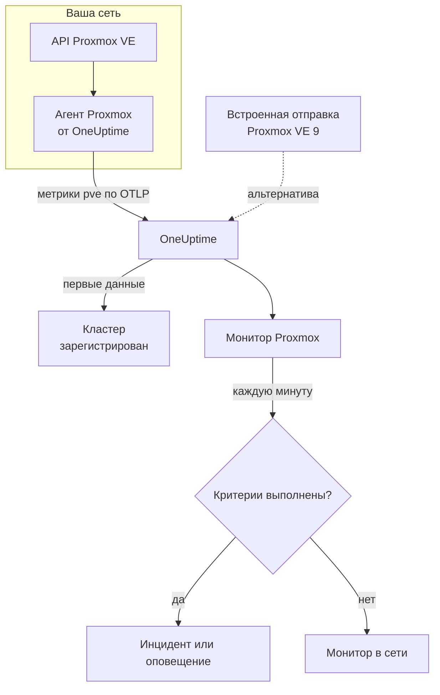

# Мониторинг Proxmox

Монитор Proxmox следит за одним кластером Proxmox VE – его узлами, виртуальными машинами и контейнерами LXC, хранилищем, состоянием HA, охватом заданий резервного копирования и репликацией хранилища – и сообщает, когда узел уходит в офлайн, гостевая система останавливается или хранилище заполняется. Он читает метрики `pve_*`, которые собирает агент Proxmox от OneUptime, поэтому ничего не опрашивается снаружи.

:::cards
- [Создание монитора](#создание-монитора-proxmox): Шесть шагов в панели управления.
- [Шаблоны](#готовые-шаблоны-оповещений): Одиннадцать готовых оповещений, по одному инциденту на узел, гостевую систему или том.
- [Идентификация ресурсов](#идентификация-ресурсов): Как нацелиться на один узел, гостевую систему или том хранилища.
- [Метрики](#собираемые-метрики): Каждый ряд `pve_*`, по которому монитор может оповещать.
:::

## Как это работает

Агент Proxmox от OneUptime работает на машине, которой доступен API Proxmox VE. Каждые 30 секунд он опрашивает prometheus-pve-exporter коллекторами кластера и узлов, помечает каждый ряд ресурсом, который тот описывает, и отправляет метрики в OneUptime по OTLP с именем кластера, `proxmox.cluster.name`. Первые данные регистрируют кластер. Proxmox VE 9 и новее может вместо этого сам отправлять метрики, ничего не устанавливая; см. [встроенную отправку](#встроенная-отправка-proxmox-ve).

Монитор Proxmox привязан к одному кластеру. Каждую минуту он выполняет свой запрос по метрикам этого кластера и сравнивает результат со своими критериями.

## Перед началом работы

- **Установите агент Proxmox** там, откуда доступен API Proxmox VE, с API-токеном только для чтения. [Руководство по агенту Proxmox](/docs/telemetry/proxmox) описывает токен, установку и встроенную отправку.
- **Убедитесь, что кластер зарегистрирован.** Он появляется в разделе **Продукты → Инфраструктура → Proxmox → Все кластеры** под именем из `PROXMOX_CLUSTER_NAME` агента примерно через минуту после первого опроса.

## Создание монитора Proxmox

:::steps
### Начните новый монитор

Перейдите в **Мониторы** и нажмите **Создать монитор**.

### Выберите Proxmox

В разделе **Тип монитора** нажмите **Другие типы мониторов** и выберите **Proxmox** в группе **Инфраструктура** или введите `proxmox` в поле поиска. Введите **Имя** – оно используется в заголовках инцидентов и оповещений – и нажмите **Далее**.

### Выберите кластер

В разделе **Proxmox Monitor Configuration** выберите кластер в поле **Proxmox Cluster**. В списке есть каждый кластер, который присылал данные.

### Выберите, что отслеживать

Выберите одну из трёх вкладок:

- **Quick Setup** – нажмите на [шаблон](#готовые-шаблоны-оповещений). Он задаёт метрики, фильтры, агрегацию, диапазон времени и пороги и заменяет критерии ниже своими. Поле **Диапазон времени** по-прежнему можно изменить.
- **Custom Metric** – выберите одну метрику в поле **Proxmox Metric**, затем задайте **Агрегация** и **Диапазон времени**. [Фильтры](#настройки-монитора) сужают её до вида ресурса или до одного ресурса.
- **Расширенный** – сами постройте запросы и формулы в разделе **Выберите метрики**, например процент памяти из `pve_memory_usage_bytes / pve_memory_size_bytes`. Используйте **Group by** `id`, чтобы оценивать каждый ресурс отдельно.

### Проверьте критерии

Откройте каждый критерий в разделе **Критерии монитора** и проверьте его поля **Метрика**, **Агрегация**, **Условие** и **Threshold**. Шаблон заполняет их. С **Custom Metric** или **Расширенный** монитор начинает со [стандартных критериев](#стандартные-критерии), которые замечают только падение метрики до нуля, поэтому задайте собственный порог.

### Создайте монитор

Нажмите **Создать монитор**. OneUptime откроет страницу монитора и будет оценивать его каждую минуту. Инциденты и оповещения, которые он открывает, также видны на страницах кластера **Инциденты** и **Оповещения**.
:::

> [!TIP]
> Чтобы настроить сразу несколько шаблонов, откройте кластер через **Продукты → Инфраструктура → Proxmox** и перейдите в **Recommendations**. Выберите нужные шаблоны и тех, кого вызывать, и OneUptime создаст по одному монитору на шаблон.

## Настройки монитора

| Поле | Вкладка | Что делает |
| --- | --- | --- |
| **Proxmox Cluster** | Все | Обязательно. Ограничивает каждый запрос значением `resource.proxmox.cluster.name`. |
| **Область ресурса** | Custom Metric, Расширенный | Необязательно. **Узел**, **Guest (VM / container)**, **Хранилище** или **Кластер** – точное совпадение с `pve.scope`. |
| **PVE ID** | Custom Metric, Расширенный | Необязательно. Точное совпадение с `pve.id`: имя узла (`pve1`), VMID (`100`) или `<node>/<storage>` (`pve1/local`). Сочетайте с областью, чтобы нацелиться на один ресурс. |
| **Имя узла** | Custom Metric, Расширенный | Необязательно. Только собственные ряды узла (`pve.scope = node` и `pve.id`). Он не может выбрать гостевые системы или хранилище на этом узле. |
| **Guest ID** | Custom Metric, Расширенный | Необязательно. Точное совпадение с исходной меткой `id`, например `qemu/100` или `lxc/101`. Если оно задано, остальные фильтры игнорируются. |
| **Proxmox Metric** | Custom Metric | Одна метрика из [каталога](#собираемые-метрики). |
| **Агрегация** | Custom Metric | Как объединяются замеры: **Среднее**, **Максимум**, **Минимум**, **Сумма** или **Количество**. Начинается с обычной агрегации метрики. |
| **Диапазон времени** | Все | Скользящее окно, которое читает запрос, от **Past 1 Minute** до **Past 365 Days**. Новый монитор начинает с **Past 1 Minute**; шаблоны задают свой. |
| **Выберите метрики** | Расширенный | Конструктор запросов: **Метрика**, **Aggregate by**, **Filter by attributes**, **Group by**, а также **Добавить метрику** и **Добавить формулу** для объединения запросов. |

## Идентификация ресурсов

Каждый ряд несёт метку точки данных `id`, которая называет ресурс Proxmox, к которому он относится:

| Значение `id` | Ресурс |
| --- | --- |
| `node/<name>` | Узел кластера, например `node/pve1`. |
| `qemu/<vmid>` | Виртуальная машина QEMU, например `qemu/100`. |
| `lxc/<vmid>` | Контейнер LXC, например `lxc/101`. |
| `storage/<node>/<storage>` | Том хранилища на узле, например `storage/pve1/local`. |

Два исключения: ряды репликации (`pve_replication_*`) несут в `id` идентификатор **задания** репликации (например `100-0`), а общекластерный `pve_not_backed_up_total` вообще не имеет `id`.

Фильтры сравнивают на равенство, а не по префиксу, поэтому агент также разбивает `id` на три атрибута, по которым можно фильтровать. Шаблоны опираются на них:

| Атрибут | Значения | Для `qemu/100` |
| --- | --- | --- |
| `pve.scope` | `node`, `guest`, `storage`, `cluster` (`qemu` и `lxc` – оба `guest`) | `guest` |
| `pve.type` | `node`, `qemu`, `lxc`, `storage` | `qemu` |
| `pve.id` | Всё после первого `/` в `id` (`pve1`, `100`, `pve1/local`) | `100` |

Фильтруйте по `pve.scope` или `pve.type` для одного вида ресурсов, по `pve.id` или `id` для одного ресурса и группируйте по `id`, чтобы оценивать каждый ресурс отдельно.

## Готовые шаблоны оповещений

**Quick Setup** предлагает 11 шаблонов. Каждый строит полный монитор – запросы, фильтры по атрибутам, группировку, критерий, который срабатывает, и критерий, который восстанавливает. Большинство группирует по `id`, поэтому каждый узел, гостевая система, том или задание получает собственный инцидент и собственное оповещение. Пороги – отправная точка, их можно менять.

Шаблоны читают последние 5 минут, если в таблице не сказано иное. Критерий срабатывает, только когда условие выполняется в каждую минуту его окна, а пороговый критерий восстанавливается на 10 % за своим порогом, чтобы значение, колеблющееся у границы, не переключалось туда-обратно.

| Шаблон | Серьёзность | Что отслеживает | Срабатывает, когда | Восстанавливается, когда |
| --- | --- | --- | --- | --- |
| Node Offline | Критический | `pve_up` для `pve.scope = node`, Min по `id` | Меньше 1 | Равно 1 |
| Guest Down | Warning | `pve_up` и `pve_onboot_status` для `pve.scope = guest`, Min по `id` | `pve_up` меньше 1, а `pve_onboot_status` равно 1 | `pve_up` снова равно 1 или запуск при загрузке выключен |
| Cluster Quorum at Risk | Критический | `pve_up` ÷ `pve_node_info` × 100 для `pve.scope = node` (оба Сумма): доля узлов в сети | 50 % или меньше | Выше 55 % |
| High Node CPU Usage | Warning | `pve_cpu_usage_ratio` для `pve.scope = node`, Avg по `id` | Выше 0,9 (90 % ядер узла) | 0,81 или ниже |
| High Node Memory Usage | Warning | `pve_memory_usage_bytes` ÷ `pve_memory_size_bytes` × 100 для `pve.scope = node`, по `id` | Выше 85 % | 76,5 % или ниже |
| High Guest CPU Usage | Warning | `pve_cpu_usage_ratio` для `pve.scope = guest`, Avg по `id`, последние 15 минут | Выше 0,95 (95 % её vCPU) все 15 минут | 0,855 или ниже |
| Storage Near Full | Warning | `pve_disk_usage_bytes` ÷ `pve_disk_size_bytes` × 100 для `pve.scope = storage`, по `id` | Выше 85 % | 76,5 % или ниже |
| Container Root Disk Near Full | Warning | То же соотношение для диска, для `pve.type = lxc`, по `id` | Выше 90 % | 81 % или ниже |
| HA Resource in Error State | Критический | `pve_ha_state` для `state = error`, Max по `id` | Выше 0 | Равно 0 |
| Guest Not Backed Up | Warning | `pve_not_backed_up_total`, Max (один общекластерный ряд) | Выше 0 | Равно 0 |
| Replication Failing | Критический | `pve_replication_failed_syncs`, Max по `id` (идентификатор задания) | Выше 0 | Равно 0 |

**Серьёзность** – это метка, которую показывает список выбора. Инцидент и оповещение, которые создаёт шаблон, начинаются с самого серьёзного уровня инцидентов и оповещений вашего проекта; измените их в критериях.

- **Шаблоны недоступности используют Минимум**, поэтому один опрос, в котором ресурс был недоступен, вызывает срабатывание, а не теряется среди опросов, где он работал.
- **Guest Down** смотрит только на гостевые системы, которые должны запускаться при загрузке, поэтому гостевая система, остановленная намеренно, никогда никого не вызывает.
- **Cluster Quorum at Risk** – это приближение: у pve-exporter нет метрики corosync, поэтому шаблон считает узлы в сети.
- **High Guest CPU Usage** выше и медленнее шаблона для узла: гостевая система должна использовать свои vCPU, поэтому вызов происходит, только если нагрузка никогда не спадает.
- **Формулы соотношений** берут **Сумма** обеих частей. Обе приходят из одного опроса, поэтому результат – настоящий процент.
- **Container Root Disk Near Full** не учитывает виртуальные машины QEMU: без гостевого агента QEMU их использование диска равно 0.
- **Guest Not Backed Up** охватывает только участие в заданиях резервного копирования. pve-exporter не сообщает, выполнялось ли резервное копирование и было ли оно успешным; сгруппируйте `pve_not_backed_up_info` по `id`, чтобы получить список гостевых систем.
- **Устаревание репликации** (текущее время минус последняя синхронизация) не может вызывать оповещение, потому что критерии не умеют считать время. Его показывает страница кластера **Обзор**; вместо этого оповещайте с **Replication Failing**.

### Встроенная отправка Proxmox VE

Proxmox VE 9 и новее может отправлять метрики через встроенный сервер метрик OpenTelemetry, ничего не устанавливая, – см. [руководство по агенту Proxmox](/docs/telemetry/proxmox). OneUptime превращает такую отправку в те же ряды `pve_*`, поэтому каталог и шаблоны для CPU, памяти и хранилища работают с ней.

**Node Offline** и **Cluster Quorum at Risk** тоже работают: каждый узел отправляет только собственный статус, поэтому узел, переставший присылать данные, объявляют недоступным (`pve_up` = 0) узлы, которые ещё работают, – см. [Когда узел перестаёт присылать данные](/docs/telemetry/proxmox#when-a-node-stops-reporting). **Guest Down**, **HA Resource in Error State**, **Guest Not Backed Up** и **Replication Failing** требуют данных, которые собирает только агент.

## Собираемые метрики

Агент опрашивает prometheus-pve-exporter каждые 30 секунд коллекторами и кластера, и узлов, что также охватывает коллекторы экспортёра `backup-info` и `replication` (оба включены по умолчанию).

### Доступность

| Метрика | Единица | Описание |
| --- | --- | --- |
| `pve_up` | — | 1, когда узел или гостевая система работает, иначе 0. |
| `pve_uptime_seconds` | секунды | Время работы узла или гостевой системы. |
| `pve_version_info` | количество | Версия Proxmox VE в метках. Всегда 1. |

### Узел

| Метрика | Единица | Описание |
| --- | --- | --- |
| `pve_node_info` | количество | Метаданные узла, всегда 1. Просуммируйте, чтобы посчитать присылающие данные узлы. |
| `pve_cpu_usage_ratio` | доля | Используемый CPU как доля 0–1 от доступного CPU. |
| `pve_cpu_usage_limit` | ядра | Доступный CPU в ядрах. Для гостевой системы – её vCPU. |
| `pve_memory_usage_bytes` | байты | Используемая память. |
| `pve_memory_size_bytes` | байты | Общая память. |

Ряды CPU и памяти также сообщаются для каждой гостевой системы, с идентификаторами `qemu/*` и `lxc/*`.

### Гостевая система

| Метрика | Единица | Описание |
| --- | --- | --- |
| `pve_guest_info` | количество | Метаданные гостевой системы (имя, узел, тип `qemu` или `lxc`) в метках. Всегда 1. |
| `pve_network_receive_bytes` | байты | Байты, полученные гостевой системой. Счётчик за всё время жизни. |
| `pve_network_transmit_bytes` | байты | Байты, отправленные гостевой системой. Счётчик за всё время жизни. |
| `pve_disk_read_bytes` | байты | Байты, прочитанные гостевой системой с диска. Счётчик за всё время жизни. |
| `pve_disk_write_bytes` | байты | Байты, записанные гостевой системой на диск. Счётчик за всё время жизни. |
| `pve_onboot_status` | количество | 1, когда гостевая система запускается при загрузке узла. Остановленная гостевая система с этой настройкой – обычно незапланированный простой. |

### Хранилище

| Метрика | Единица | Описание |
| --- | --- | --- |
| `pve_disk_usage_bytes` | байты | Занятые байты на диске или в хранилище. Для гостевой системы QEMU равно 0, если не установлен гостевой агент QEMU. |
| `pve_disk_size_bytes` | байты | Общий размер диска или хранилища. |
| `pve_storage_info` | количество | Метаданные хранилища, всегда 1. Просуммируйте, чтобы посчитать тома хранилища. |

### HA

| Метрика | Единица | Описание |
| --- | --- | --- |
| `pve_ha_state` | — | Один ряд на каждое состояние HA (`started`, `stopped`, `error`, …) для каждого ресурса HA, 1 в текущем состоянии. Фильтруйте по метке `state`, чтобы оповещать о состоянии. |

### Резервное копирование

Из общекластерного коллектора экспортёра `backup-info`. Они сообщают только об охвате **заданиями** резервного копирования:

| Метрика | Единица | Описание |
| --- | --- | --- |
| `pve_not_backed_up_total` | количество | Гостевые системы, не входящие ни в одно задание резервного копирования. Один общекластерный ряд без `id`. |
| `pve_not_backed_up_info` | количество | Один ряд на каждую неохваченную гостевую систему, всегда 1, с меткой `id` гостевой системы. Он исчезает, как только гостевая система попадает в задание резервного копирования. |

### Репликация

Из коллектора экспортёра `replication` уровня узла. Ряды существуют только тогда, когда в кластере есть задания репликации, и несут идентификатор задания в `id`:

| Метрика | Единица | Описание |
| --- | --- | --- |
| `pve_replication_failed_syncs` | количество | Неудачные попытки синхронизации подряд. Больше 0 означает, что реплика устаревает. |
| `pve_replication_duration_seconds` | секунды | Сколько длилась последняя синхронизация. |
| `pve_replication_last_sync_timestamp_seconds` | секунды | Время Unix последней **успешной** синхронизации. |
| `pve_replication_last_try_timestamp_seconds` | секунды | Время Unix последней **попытки**. Если оно новее последней синхронизации, последняя попытка не удалась. |
| `pve_replication_next_sync_timestamp_seconds` | секунды | Время Unix следующей запланированной синхронизации. |
| `pve_replication_info` | количество | Метаданные задания – тип, источник, цель, гостевая система – в метках. Всегда 1. |

## Критерии мониторинга

Критерий сравнивает один из запросов или формул монитора с порогом. У критериев монитора Proxmox нет поля **Тип фильтра**: каждое правило проверяет значение метрики с такими полями.

| Поле | Что делает |
| --- | --- |
| **Метрика** | Запрос или формула для проверки, по имени переменной. |
| **Агрегация** | Как значения в окне превращаются в один ответ: **Среднее**, **Сумма**, **Maximum Value**, **Minimum Value**, **All Values** (совпасть должно каждое значение) или **Any Value** (достаточно одного). |
| **Условие** | **Greater Than**, **Less Than**, **Greater Than Or Equal To**, **Less Than Or Equal To** или **Equal To** – или условие аномалии: **Anomalously High**, **Anomalously Low** или **Anomalous**. |
| **Threshold** | Значение для сравнения. Рядом стоит список единиц, если у метрики есть единица. Не показывается для условий аномалий. |
| **Чувствительность** | Только для условий аномалий. **Низкий** (4σ), **Средний** (3σ, по умолчанию) или **Высокий** (2σ). |
| **Окно базовой линии** | Только для условий аномалий. 14 дней (по умолчанию), 28, 60 или 90 дней истории. |
| **Если нет данных** | В разделе **Дополнительные поля**. Что происходит, когда в окне нет замеров: **Ignore** (по умолчанию), **Treat As Zero** или **Триггер**. |

Условия аномалий сравнивают каждое значение с тем же часом недели в базовой линии. Они остаются в состоянии «Learning» и ничего не создают, пока окно базовой линии не накопит достаточно истории.

Каждый критерий также указывает, что делать при совпадении: изменить статус монитора, создать оповещение или объявить инцидент. Критерии проверяются сверху вниз, и решает первый совпавший.

### Стандартные критерии

Монитор, который вы создаёте не из шаблона, начинает с двух критериев:

| Порядок | Критерий | Срабатывает, когда | Затем |
| --- | --- | --- | --- |
| 1 | Check if _monitor name_ is offline | Любое значение первого запроса равно `0` | Помечает монитор как **Не в сети** и объявляет инцидент «_monitor name_ is offline», который закрывается сам, когда монитор восстанавливается. |
| 2 | Check if _monitor name_ is online | Любое значение больше `0` | Помечает монитор как **Работает**. |

> [!IMPORTANT]
> Молчание не совпадает ни с одним из критериев: кластер, который перестал присылать данные, оставляет монитор в прежнем состоянии. Чтобы узнавать о прекращении данных, установите для **Если нет данных** значение **Триггер** в одном из критериев. Время, когда OneUptime сам не принимал данные, никогда не считается отсутствием данных: проверка, окно которой включает такое время, вместо этого ждёт, как объясняет страница [Когда OneUptime не получает данные](/docs/monitor/when-oneuptime-is-not-receiving).

## Устранение неполадок

:::details Кластера нет в списке Proxmox Cluster
Кластеры регистрируются сами по данным агента. Проверьте, что агент работает и отправляет данные (см. [руководство по агенту Proxmox](/docs/telemetry/proxmox)), и что задан `PROXMOX_CLUSTER_NAME`.
:::

:::details Нет метрик гостевых систем
Ряды гостевых систем приходят от коллектора кластера экспортёра, который поставляемая конфигурация включает параметром опроса `cluster=1`. Если вы меняли конфигурацию коллектора, восстановите её.
:::

:::details High Node CPU Usage никогда не срабатывает
Шаблон усредняет `pve_cpu_usage_ratio` по `id`, поэтому каждый узел проверяется отдельно. Если вы построили собственный запрос, сгруппируйте его по `id`: среднее по всем узлам тянут вниз простаивающие.
:::

:::details Node Offline продолжает срабатывать для узла, удалённого из кластера
При встроенной отправке Proxmox VE узел, выведенный из кластера, выглядит так же, как вышедший из строя: он перестал присылать данные, поэтому работающие узлы продолжают объявлять его недоступным. Откройте страницу узла и нажмите **Remove Node** – узел исчезнет, а его оповещение закроется. Иначе он остаётся не в сети до 7 дней. У агента такой проблемы нет: он спрашивает кластер, в списке которого узла больше нет.
:::

:::details Нет метрик резервного копирования или репликации
`pve_not_backed_up_*` приходит от коллектора экспортёра `backup-info`, а `pve_replication_*` – от его коллектора `replication`. Оба включены по умолчанию и охвачены параметрами опроса `cluster=1` и `node=1` поставляемой конфигурации. Если вы запускаете собственный экспортёр, проверьте, что не выключили их. `pve_replication_*` существует только тогда, когда в кластере есть задания репликации хранилища.
:::

:::details Счётчики вроде pve_network_receive_bytes только растут
Ряды сетевого и дискового ввода-вывода – это счётчики за всё время жизни, а критерии сравнивают исходные значения: оператора скорости нет, а **Convert to per-second rate** в конструкторе запросов меняет только график. Стройте по ним график скорости или оповещайте об их росте с помощью формулы, например запрос **Максимум** минус запрос **Минимум** того же счётчика.
:::

## Дальнейшие шаги

:::cards
- [Агент Proxmox](/docs/telemetry/proxmox): Установите агент или настройте встроенную отправку.
- [Мониторинг Ceph](/docs/monitor/ceph-monitor): Следите за хранилищем Ceph за кластером Proxmox.
- [Мониторинг VMware](/docs/monitor/vmware-monitor): Монитор того же типа для vSphere.
- [Обзор инцидентов](/docs/incidents/index): Что происходит после того, как критерий объявил инцидент.
:::
