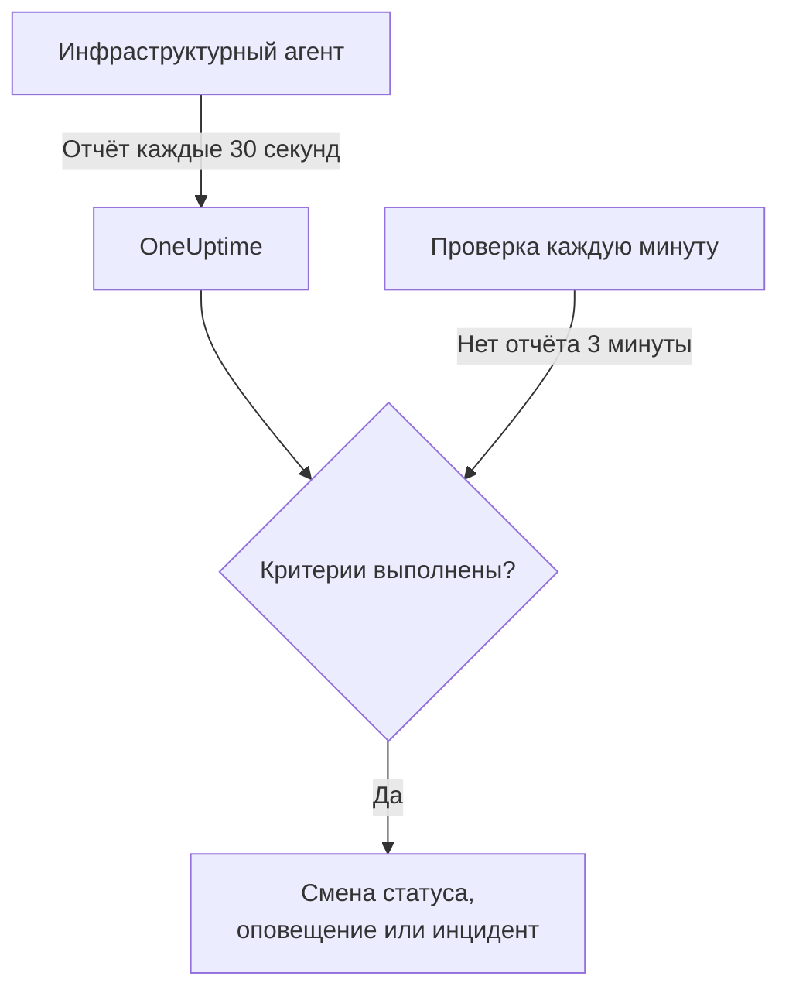

# Мониторинг сервера / ВМ

Монитор Server / VM следит за одной машиной через инфраструктурный агент OneUptime (`oneuptime-infrastructure-agent`) – небольшую службу, которая каждые 30 секунд отправляет в OneUptime данные о CPU, памяти, дисках, нагрузке, сети и запущенных процессах. На этой странице показано, как подключить агент к монитору Server / VM, что сообщает агент и как написать критерии, которые решают, когда сервер в сети, а когда нет.

> [!IMPORTANT]
> **Создать монитор** больше не предлагает тип **Server / VM**. Уже созданные мониторы Server / VM продолжают работать, и всё на этой странице относится к ним. Чтобы следить за новым сервером, создайте вместо этого [монитор хоста](/docs/monitor/host-monitor): он оповещает по метрикам хоста, которые отправляет [OpenTelemetry-коллектор на хосте](/docs/telemetry/host-otel-collector).

:::cards
- [Подключение агента](#подключение-агента): Установите его, передайте ему секретный ключ монитора и запустите.
- [Что сообщает агент](#что-сообщает-агент): CPU, память, диски, нагрузка, сеть и процессы.
- [Критерии мониторинга](#критерии-мониторинга): Решите, когда сервер считается в сети или не в сети.
- [Устранение неполадок](#устранение-неполадок): Агент не отправляет отчёты, или монитор никогда не уходит в офлайн.
:::

## Как это работает

Агент работает как системная служба. Каждые 30 секунд он собирает отчёт и отправляет его на ваш URL OneUptime, подписав секретным ключом монитора. OneUptime сохраняет значения как метрики монитора и проверяет отчёт по критериям монитора.

Молчание проверяется отдельно. Каждую минуту OneUptime заново оценивает критерии **Is Online** каждого монитора Server / VM, который не присылал отчётов 3 минуты или дольше, и сервер, молчащий дольше, чем допускают его критерии (по умолчанию 3 минуты), считается не в сети. Монитор без критерия **Is Online** никогда не помечается как не в сети только потому, что агент замолчал. В это молчание засчитывается только время, когда OneUptime принимал данные: время, когда OneUptime сам перезапускался, обновлялся или догонял отставание, не учитывается, как объясняет страница [Когда OneUptime не получает данные](/docs/monitor/when-oneuptime-is-not-receiving).



## Перед началом работы

- Монитор Server / VM в вашем проекте.
- Право редактировать мониторы. Секретный ключ и содержащие его команды настройки видны только тем, кто может редактировать мониторы.
- Права root (Linux, macOS) или администратора (Windows) на сервере. Агент устанавливает себя как системную службу.
- Исходящий HTTPS с сервера на ваш URL OneUptime, напрямую или через HTTP-прокси.

## Подключение агента

В командах ниже используются `https://oneuptime.com` и `YOUR_SECRET_KEY`. В собственных командах настройки монитора ваш URL OneUptime и секретный ключ монитора уже подставлены, поэтому по возможности копируйте их из монитора.

:::steps
### Откройте команды настройки монитора

Перейдите в **Мониторы**, откройте монитор Server / VM и выберите **Документация**. Карточки **Set up your Server Monitor (Linux/Mac)** и **Set up your Server Monitor (Windows)** содержат команды для этого монитора. Пока агент не прислал первый отчёт, их показывает и **Обзор** монитора.

### Установите агент

:::tabs
@tab Linux
```bash
curl -sSL https://oneuptime.com/docs/static/scripts/infrastructure-agent/install.sh | sudo bash
```
@tab macOS
```bash
curl -sSL https://oneuptime.com/docs/static/scripts/infrastructure-agent/install.sh | sudo bash
```
@tab Windows
1. Скачайте агент из [последнего релиза на GitHub](https://github.com/OneUptime/oneuptime/releases/latest): `oneuptime-infrastructure-agent_windows_amd64.zip` для x64 или `oneuptime-infrastructure-agent_windows_arm64.zip` для ARM64.
2. Распакуйте zip-архив. В нём находится `oneuptime-infrastructure-agent.exe`.
3. Откройте **Командную строку** от имени администратора в папке, куда вы его распаковали.
:::

Скрипт установки загружает последний релиз для вашей операционной системы и процессора (x86-64 или ARM64) и помещает исполняемый файл `oneuptime-infrastructure-agent` в `$HOME/bin`. При самостоятельном размещении скрипт отдаётся с вашего собственного URL OneUptime.

### Подключите его к монитору

:::tabs
@tab Linux
```bash
sudo oneuptime-infrastructure-agent configure --secret-key=YOUR_SECRET_KEY --oneuptime-url=https://oneuptime.com
```
@tab macOS
```bash
sudo oneuptime-infrastructure-agent configure --secret-key=YOUR_SECRET_KEY --oneuptime-url=https://oneuptime.com
```
@tab Windows
```shell
oneuptime-infrastructure-agent configure --secret-key=YOUR_SECRET_KEY --oneuptime-url=https://oneuptime.com
```
:::

`configure` сохраняет секретный ключ и URL в файле конфигурации агента и устанавливает агент как системную службу. Оба флага обязательны. При самостоятельном размещении замените `https://oneuptime.com` своим URL.

Если сервер выходит в интернет через прокси, добавьте `--proxy-url`:

```bash
sudo oneuptime-infrastructure-agent configure --proxy-url=http://proxy.example.com:8080 --secret-key=YOUR_SECRET_KEY --oneuptime-url=https://oneuptime.com
```

### Запустите агент

:::tabs
@tab Linux
```bash
sudo oneuptime-infrastructure-agent start
```
@tab macOS
```bash
sudo oneuptime-infrastructure-agent start
```
@tab Windows
```shell
oneuptime-infrastructure-agent start
```
:::

При запуске агент проверяет секретный ключ в OneUptime и сразу отправляет первый отчёт.

### Проверьте, что он отправляет отчёты

Выполните `sudo oneuptime-infrastructure-agent status` (без `sudo` в Windows): команда выведет `Service is running`. В OneUptime **Обзор** монитора перестаёт показывать команды настройки, как только приходит первый отчёт, а вкладка **Метрики** начинает строить графики по серверу.
:::

## Справочник по агенту

### Команды

| Команда | Что она делает |
| --- | --- |
| `configure --secret-key=<key> --oneuptime-url=<url>` | Сохраняет настройки и устанавливает агент как системную службу. Добавьте `--proxy-url=<url>`, чтобы отправлять отчёты через прокси. |
| `start` | Запускает службу. Она отказывается запускаться, пока не выполнена `configure`. |
| `stop` | Останавливает службу. |
| `restart` | Перезапускает службу. |
| `status` | Выводит, работает служба или остановлена. |
| `logs` | Выводит последние 100 строк журнала агента. `-n <lines>` выводит другое число строк, а `-f` следит за новыми. |
| `uninstall` | Удаляет службу и файл конфигурации агента. |
| `help` | Перечисляет команды. |

Запускайте их с `sudo` в Linux и macOS и из **Командной строки** с правами администратора в Windows. Чтобы изменить секретный ключ, URL или прокси настроенного агента, выполните `stop` и `uninstall`, а затем снова `configure` и `start`.

### Файлы

| Файл | Linux и macOS | Windows |
| --- | --- | --- |
| Конфигурация | `/etc/oneuptime-infrastructure-agent/config.json` | `%PROGRAMDATA%\oneuptime-infrastructure-agent\config.json` |
| Журнал | `/var/log/oneuptime-infrastructure-agent/oneuptime-infrastructure-agent.log` | `%PROGRAMDATA%\oneuptime-infrastructure-agent\oneuptime-infrastructure-agent.log` |

Если агент не может писать в эти каталоги, он использует вместо них `~/.oneuptime-infrastructure-agent/`. Переменные окружения `ONEUPTIME_AGENT_CONFIG_PATH` и `ONEUPTIME_AGENT_LOG_PATH` явно задают любой из этих путей.

## Что сообщает агент

Каждый отчёт содержит имя хоста сервера и:

| Область | Что сообщается |
| --- | --- |
| CPU | Использование в %, число ядер, использование по ядрам и время в режимах user, system, idle, ожидания ввода-вывода, steal, nice, IRQ и soft IRQ |
| Память | Всего, занято, свободно и доступно памяти, буферы и кеш, использование в %, а также swap: всего, занято, свободно и использование в % |
| Диски | Для каждого смонтированного диска: точка монтирования, устройство, файловая система, общий, занятый и свободный объём, использование в %, прочитанные и записанные байты и операции, время ввода-вывода |
| Нагрузка | Средняя нагрузка за 1, 5 и 15 минут |
| Сеть | Для каждого интерфейса: отправленные и полученные байты и пакеты, ошибки и отброшенные пакеты на входе и выходе; а также установленные и слушающие соединения |
| Хост | Операционная система, платформа и версия, версия ядра и архитектура, время работы, время загрузки, виртуализация и число процессов |
| Процессы | Каждый запущенный процесс: имя, PID, команда, CPU в %, память, статус, потоки, пользователь и время запуска |

Значения, которых операционная система не предоставляет, опускаются. Вкладка **Метрики** монитора строит графики доступности, CPU, памяти, использования диска и дискового ввода-вывода, средней нагрузки, swap, сетевого трафика и ошибок, соединений, времени работы и числа процессов.

## Критерии мониторинга

Критерии решают, когда монитор в сети, работает с ухудшением или не в сети, и когда он открывает оповещение или инцидент. У каждого фильтра в критерии есть **Тип фильтра**, **Условие фильтра** и для большинства типов значение.

| Тип фильтра | Что проверяет | Условия фильтра |
| --- | --- | --- |
| Is Online | Присылал ли агент отчёт недавно (по умолчанию за последние 3 минуты) | Истина, Ложь |
| CPU Usage (in %) | Общее использование CPU | Greater Than, Less Than, Greater Than Or Equal To, Less Than Or Equal To |
| Memory Usage (in %) | Используемая память | Как для CPU |
| Disk Usage (in %) | Использование диска, указанного в **Путь к диску** | Как для CPU |
| Swap Usage (in %) | Используемый swap | Как для CPU |
| CPU IO Wait (in %) | Доля времени CPU в ожидании ввода-вывода | Как для CPU |
| Load Average (1 minute) | Средняя нагрузка за последнюю минуту | Как для CPU |
| Load Average (5 minute) | Средняя нагрузка за последние 5 минут | Как для CPU |
| Load Average (15 minute) | Средняя нагрузка за последние 15 минут | Как для CPU |
| Server Process Name | Запущен ли процесс с этим именем (без учёта регистра) | Is Executing, Is Not Executing |
| Server Process Command | Запущен ли процесс именно с этой командной строкой (без учёта регистра) | Is Executing, Is Not Executing |
| Server Process PID | Запущен ли процесс с этим PID | Is Executing, Is Not Executing |

**Путь к диску** принимает точку монтирования или устройство, например `/`, `/mnt/data`, `C:\` или `/dev/sda1`; если поле пустое, это `/`. Введите `*`, чтобы проверять каждый диск, о котором сообщает агент: каждый диск, превысивший порог, получает собственное оповещение, так что второй заполняющийся диск не прячется за открытым оповещением первого.

### Оценка за период времени

**Оценивать этот критерий в течение определённого периода времени** – это отдельный флажок в форме критерия, а не условие фильтра. Он доступен для **Is Online** и для каждого числового типа фильтра. Включите его, чтобы сравнивать агрегат – выбранный в **Оценить** (Среднее, Сумма, Maximum Value, Minimum Value, All Values, Any Value) за окно, заданное в **За последние (в минутах)**, – вместо значения последней проверки. Для фильтра **Is Online** окно – это время, которое агент может молчать, прежде чем сервер будет считаться не в сети.

**All Values** срабатывает только тогда, когда окно действительно покрыто данными. У только что созданного монитора или у монитора, проверки которого перестали записываться, недостаточно истории, чтобы что-то сказать о последних N минутах, поэтому критерий ждёт, а не срабатывает по единственному имеющемуся значению. **Any Value** – это настройка для «сообщи, как только одна проверка выйдет за порог», и он по-прежнему срабатывает сразу.

**Если нет данных** определяет, что происходит, пока окно не может подтвердить критерий:

| Если нет данных | Поведение | Для чего использовать |
| --- | --- | --- |
| **Ignore** (по умолчанию) | Критерий не срабатывает. | Обычные пороговые оповещения. |
| **Триггер** | Отсутствие данных считается проблемой. | Проверки в стиле heartbeat, где молчание само по себе – сбой. |
| **Treat As Zero** | Окно сравнивается как один ноль. | Счётчики, где «нет событий» действительно означает ноль. |

> [!TIP]
> CPU и нагрузка постоянно дают короткие всплески. Оценивайте их за несколько минут с **Среднее** или **All Values**, а не оповещайте по одному отчёту.

### Примеры критериев

| Цель | Тип фильтра | Условие фильтра | Значение |
| --- | --- | --- | --- |
| Пометить сервер как не в сети, когда агент перестаёт присылать отчёты | Is Online | Ложь | — |
| Оповещать, когда использование CPU выше 90 % | CPU Usage (in %) | Greater Than | `90` |
| Оповещать, когда корневой диск заполнен более чем на 85 % | Disk Usage (in %), **Путь к диску** `/` | Greater Than | `85` |
| Оповещать о любом диске, заполненном более чем на 85 %, по одному оповещению на диск | Disk Usage (in %), **Путь к диску** `*` | Greater Than | `85` |
| Оповещать, когда использование памяти выше 80 % | Memory Usage (in %) | Greater Than | `80` |
| Оповещать, когда nginx перестаёт работать | Server Process Name | Is Not Executing | `nginx` |

## Устранение неполадок

:::details Агент не отправляет отчёты
- Проверьте, что служба работает: `sudo oneuptime-infrastructure-agent status`.
- Прочитайте её журнал: `sudo oneuptime-infrastructure-agent logs -n 50`. Строка `Metrics successfully pushed to OneUptime server` означает, что отчёты доходят.
- Агент проверяет секретный ключ при запуске и завершается, если OneUptime его отклоняет, записывая в журнал `Secret key is invalid`. Сравните ключ с ключом на странице **Настройки** монитора, в разделе **Сбросить секретный ключ серверного монитора**.
- Убедитесь, что сервер может достучаться до вашего URL OneUptime по HTTPS и что брандмауэр не блокирует исходящие соединения.
:::

:::details `sudo` сообщает, что команда не найдена
Скрипт установки помещает исполняемый файл в `$HOME/bin` пользователя, от имени которого он запускался, и выводит использованный каталог. Запускайте агент по полному пути, например `sudo /root/bin/oneuptime-infrastructure-agent configure ...`. Чтобы вместо этого установить его в каталог из системного пути, передайте скрипту `-b`:

```bash
curl -sSL https://oneuptime.com/docs/static/scripts/infrastructure-agent/install.sh | sudo bash -s -- -b /usr/local/bin
```
:::

:::details `start` сообщает, что конфигурация службы не найдена
`configure` не выполнялась, или `uninstall` удалила её конфигурацию. Выполните `configure` с секретным ключом и URL, а затем `start`.
:::

:::details Монитор никогда не уходит в офлайн, когда сервер выключен
Пометить молчащий сервер как не в сети может только критерий **Is Online**. Добавьте его с **Условие фильтра**, равным **Ложь**, и задайте статус монитора, на который он переключает.
:::

:::details Отчёты не проходят через прокси
- Проверьте URL прокси и порт, переданные в `--proxy-url`.
- Убедитесь, что прокси разрешает соединения с вашим URL OneUptime.
- Чтобы сменить прокси, выполните `stop` и `uninstall`, затем `configure` с новым `--proxy-url` и `start`.
:::

## Дальнейшие шаги

:::cards
- [Мониторинг хостов](/docs/monitor/host-monitor): Монитор для новых серверов, построенный на метриках хоста OpenTelemetry.
- [OpenTelemetry-коллектор на хосте](/docs/telemetry/host-otel-collector): Отправляйте метрики и журналы хоста с Linux, macOS и Windows.
- [Шаблоны инцидентов и оповещений](/docs/monitor/incident-alert-templating): Добавляйте сведения о CPU, памяти, дисках и процессах в заголовки инцидентов.
:::
