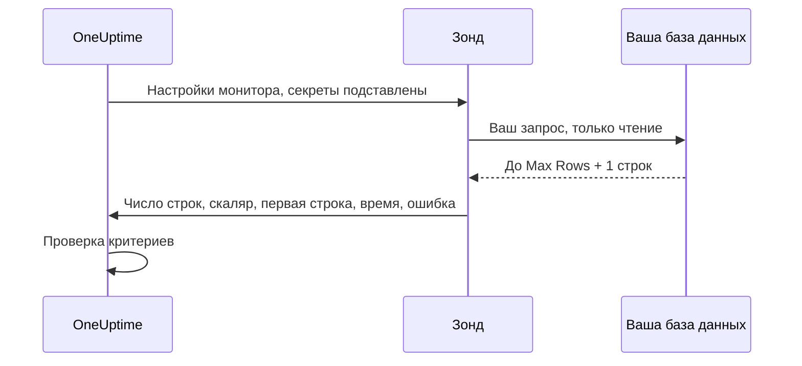

# Мониторинг SQL-запросов

Монитор SQL-запросов по расписанию выполняет с зонда SQL-запрос только для чтения и оповещает по его результату: по числу возвращённых строк, скалярному значению, времени выполнения запроса или ошибке запроса. Он создан для сценария «выполнить запрос и открыть инцидент», например чтобы оповещать, когда число отменённых заказов за последние пять минут резко растёт, когда таблица очереди становится слишком большой или когда пропадает важная строка.

:::cards
- [Создайте пользователя только для чтения](#создайте-пользователя-только-для-чтения): Учётная запись базы данных, под которой должен работать монитор.
- [Создайте монитор](#создание-монитора-sql-запросов): Подключите зонд и введите запрос.
- [Напишите запрос](#написание-запроса): Поместите значение, по которому оповещаете, в первый столбец.
- [Настройте критерии](#настройка-критериев): Оповещайте по количеству, значению, медленному запросу или ошибке.
:::

## Как это работает

При каждой проверке зонд подключается к вашей базе данных, выполняет запрос в контексте только для чтения, считывает не больше ограниченного числа строк и отправляет в OneUptime компактную выжимку. Затем критерии монитора проверяются по этой выжимке.

Поскольку запрос выполняется с зонда внутри вашей сети, OneUptime никогда не нужно прямое подключение к базе данных, а полный набор результатов никогда не покидает зонд: обратно отправляется только небольшая ограниченная выжимка результата.



Зонд сообщает только:

| Значение | Что это |
|---|---|
| **Row Count** | Число строк, которые вернул запрос (ограничено лимитом Max Rows). |
| **Скалярное значение** | Первый столбец первой строки. Это естественное значение для запроса вида `SELECT COUNT(*)`. |
| **First Row** | Первая строка в виде пар «столбец — значение», которая показывается в сводке проверки для контекста. |
| **Execution Time** | Сколько длилась проверка, в миллисекундах, включая подключение, а не только запрос. |
| **Ошибка запроса** | Очищенное сообщение об ошибке, если запрос не выполнился. |

Полный набор результатов никогда не отправляется в OneUptime, поэтому данные клиентов не копируются в хранилище OneUptime.

## Поддерживаемые базы данных

| База данных | Порт по умолчанию |
|---|---|
| **PostgreSQL** | `5432` |
| **MySQL** | `3306` |
| **Microsoft SQL Server** | `1433` |

Движки, совместимые с MySQL и PostgreSQL, которые используют тот же сетевой протокол и диалект SQL, как правило, тоже работают, но официально протестированы только три движка выше.

Если хост и порт, к которым подключается монитор, — это одна из конечных точек базы данных на странице [Базы данных](/docs/telemetry/databases), его оповещения и инциденты появляются и на странице этой базы данных (см. [Оповещения по базе данных](/docs/telemetry/databases#alerts-on-a-database)). Хост, заданный ссылкой на секрет мониторинга, не сопоставляется.

## Модель безопасности

Выполнять предоставленный клиентом запрос на рабочей базе данных — дело деликатное, поэтому монитор SQL-запросов изначально работает только на чтение и сочетает несколько уровней защиты:

| Защита | Что она делает |
|---|---|
| **Пользователь базы данных с минимальными правами** (основная защита) | Всегда подключайтесь отдельным пользователем базы данных только для чтения, у которого есть доступ лишь к таблицам, нужным запросу. Это самая важная защита: см. [Создайте пользователя только для чтения](#создайте-пользователя-только-для-чтения). |
| **Выполнение только для чтения** | В PostgreSQL и MySQL зонд открывает транзакцию `READ ONLY`, которая отклоняет любую запись (включая записывающие CTE) независимо от текста запроса. В Microsoft SQL Server, где нет транзакций только для чтения, зонд работает внутри транзакции, которая всегда откатывается. |
| **Одна инструкция, разрешённые запросы** | Запрос должен быть одной инструкцией, начинающейся с `SELECT`, `WITH`, `VALUES` или `TABLE`. Составные инструкции (`SELECT 1; DROP TABLE …`) и ключевые слова записи или DDL, такие как `INSERT`, `UPDATE`, `DELETE`, `DROP`, `EXEC` и `INTO`, зонд отклоняет ещё до подключения. Эта проверка — страховка, а не граница: граница — пользователь только для чтения. |
| **Тайм-аут инструкции** | У каждого запроса есть жёсткий лимит времени. Слишком долгий запрос отменяется. |
| **Ограничение строк** | Считывается не больше Max Rows строк (плюс одна, чтобы заметить усечение), что ограничивает память зонда и объём данных. |
| **Скрытие учётных данных** | Ошибки базы данных очищаются перед сохранением: пароль, хост, имя пользователя, имя базы данных и любая строка подключения скрываются, поэтому учётные данные никогда не попадают в сообщения об ошибках. |

## Перед началом

- **Зонд** с сетевым доступом к хосту и порту вашей базы данных. Это может быть зонд, размещённый OneUptime (если база данных доступна из интернета), или [собственный зонд](/docs/probe/custom-probe), работающий внутри вашей сети.
- **Пользователь базы данных только для чтения** и параметры подключения (хост, порт, имя базы данных, имя пользователя, пароль) или учётная запись Windows или домена только для чтения при встроенной проверке подлинности SQL Server.

## Создайте пользователя только для чтения

Всегда подключайтесь отдельным пользователем только для чтения. Выполните инструкции для своего движка от имени администратора, заменив `orders` на свою базу данных:

:::tabs
@tab PostgreSQL
```sql
-- PostgreSQL
CREATE USER oneuptime_ro WITH PASSWORD 'a-strong-password';
GRANT CONNECT ON DATABASE orders TO oneuptime_ro;
GRANT USAGE ON SCHEMA public TO oneuptime_ro;
GRANT SELECT ON ALL TABLES IN SCHEMA public TO oneuptime_ro;
-- Include tables created in the future:
ALTER DEFAULT PRIVILEGES IN SCHEMA public GRANT SELECT ON TABLES TO oneuptime_ro;
```
@tab MySQL
```sql
-- MySQL
CREATE USER 'oneuptime_ro'@'%' IDENTIFIED BY 'a-strong-password';
GRANT SELECT ON orders.* TO 'oneuptime_ro'@'%';
FLUSH PRIVILEGES;
```
@tab Microsoft SQL Server
```sql
-- Microsoft SQL Server
CREATE LOGIN oneuptime_ro WITH PASSWORD = 'a-strong-password';
USE orders;
CREATE USER oneuptime_ro FOR LOGIN oneuptime_ro;
ALTER ROLE db_datareader ADD MEMBER oneuptime_ro;
```
:::

Чтобы сузить права, выдайте пользователю `SELECT` только на те таблицы, которые читает ваш запрос.

## Создание монитора SQL-запросов

:::steps
### Начните новый монитор

Откройте **Мониторы** и нажмите **Создать монитор**. В разделе **Тип монитора** нажмите **Другие типы мониторов** и выберите **SQL Query** в группе **Database Monitoring** или введите `query` в поле поиска. Укажите **Имя** и нажмите **Далее**.

### Введите параметры подключения

Выберите **Database Type** (порт сменится на порт по умолчанию для этого движка), затем заполните хост, имя базы данных и учётные данные пользователя только для чтения. Вместо того чтобы вводить пароль, сошлитесь на него как на [секрет мониторинга](#секрет-мониторинга-для-пароля). Все поля описаны в разделе [Конфигурация](#конфигурация).

### Введите запрос

Введите одну инструкцию только для чтения в **SQL Query** (см. [Написание запроса](#написание-запроса)).

### Протестируйте его

Нажмите **Протестировать монитор**, чтобы перед сохранением один раз выполнить запрос с зонда.

### Задайте критерии

Проверьте критерии, с которых начинается монитор, и добавьте свои (см. [Настройка критериев](#настройка-критериев)). Затем нажмите **Далее**.

### Выберите зонды и создайте монитор

Выберите **Зонды**, которые могут достучаться до базы данных, и **Интервал мониторинга**, затем нажмите **Создать монитор**.
:::

## Конфигурация

| Поле | Что ввести |
|---|---|
| **Database Type** | PostgreSQL, MySQL или Microsoft SQL Server. Выбор типа задаёт порт по умолчанию. |
| **Хост** | Хост базы данных, доступный зонду (например, `db.internal`). |
| **Порт** | Порт базы данных. |
| **Имя базы данных** | База данных, к которой выполняется запрос. |
| **Use Windows Integrated Authentication** | Только Microsoft SQL Server. Проверка подлинности под учётной записью, от имени которой работает зонд, а не по имени пользователя и паролю SQL. См. [Встроенная проверка подлинности Windows](#встроенная-проверка-подлинности-windows). |
| **Имя пользователя** | Пользователь базы данных только для чтения с минимальными правами. |
| **Пароль** | Пароль базы данных. Настоятельно рекомендуем ссылаться на [секрет мониторинга](/docs/monitor/monitor-secrets) через `{{monitorSecrets.name}}`, а не вводить пароль открытым текстом (см. [Секрет мониторинга для пароля](#секрет-мониторинга-для-пароля)). |
| **SQL Query** | Запрос только для чтения, который нужно выполнять (см. [Написание запроса](#написание-запроса)). |
| **Use SSL/TLS** | Включите, чтобы подключаться по TLS. Когда это включено, можно выключить **Verify server certificate**, если база данных использует самоподписанный сертификат. |

### Дополнительные поля

| Поле | По умолчанию | Максимум | Что ограничивает |
|---|---|---|---|
| **Connection Timeout (ms)** | `10000` | `30000` | Сколько ждать установки подключения. |
| **Statement Timeout (ms)** | `15000` | `60000` | Жёсткий предел времени выполнения запроса. |
| **Max Rows** | `100` | `1000` | Верхнюю границу числа строк, считываемых из базы данных. |

Значение выше максимума снижается до максимума.

### Встроенная проверка подлинности Windows

Для Microsoft SQL Server включите **Use Windows Integrated Authentication**, чтобы открыть доверенное подключение с учётными данными процесса зонда. Поля «Имя пользователя» и «Пароль» в этом режиме игнорируются и не передаются драйверу. Поскольку зонду нужна учётная запись, которой доверяет ваш домен, для этого режима используйте самостоятельно размещённый зонд.

| Зонд работает на | Что настроить |
|---|---|
| **Windows** | Запустите службу зонда под доменной учётной записью, у которой есть вход в SQL Server только для чтения. |
| **Linux или macOS** | Настройте Kerberos для домена SQL Server и выдайте процессу зонда действительный билет (например, через keytab). Официальный Linux-образ зонда включает Microsoft ODBC Driver 18, unixODBC и клиент Kerberos. Смонтируйте в контейнер конфигурацию Kerberos и кэш билетов, сделайте их доступными для чтения процессу зонда и задайте `KRB5_CONFIG` или `KRB5CCNAME`, если они лежат не на стандартных местах. |

Зонду нужен Microsoft ODBC Driver for SQL Server, установленный на хосте, где он работает. Официальный образ зонда включает **ODBC Driver 18**. Когда вы запускаете самостоятельно размещённый или собственный зонд, он автоматически находит и использует самый новый `ODBC Driver N for SQL Server`, зарегистрированный на хосте (например, Driver 17, если установлен он): именно Driver 18 не обязателен. Чтобы закрепить конкретный драйвер, задайте на зонде переменную окружения `SQL_SERVER_ODBC_DRIVER` с точным именем драйвера (например, `ODBC Driver 17 for SQL Server`).

У SQL Server должно быть подходящее имя субъекта-службы `MSSQLSvc`, часы зонда и контроллера домена должны быть синхронизированы, а зонд должен находить SQL Server и подключаться к нему по имени хоста, которое покрывает это имя субъекта-службы. Выдайте доверенной учётной записи только те права в базе данных, которые нужны запросу мониторинга.

## Написание запроса

Запрос должен быть **одной инструкцией только для чтения**. Он должен начинаться с `SELECT`, `WITH`, `VALUES` или `TABLE`. Точка с запятой в конце допустима, несколько инструкций — нет. Ключевые слова записи и DDL отклоняются в любом месте запроса, включая `INTO`, поэтому `SELECT … INTO` тоже отклоняется.

Зонд проверяет запрос при каждой проверке, а не при сохранении. Запрос, нарушающий эти правила, сохраняется, а затем каждая проверка завершается ошибкой "Only read-only queries are allowed (must start with SELECT, WITH, VALUES, or TABLE)." — и критерии по умолчанию переводят монитор в офлайн.

Делайте запросы дешёвыми и узкими: они выполняются при каждой проверке, поэтому предпочитайте индексированные столбцы и узкие временные окна. Этот запрос считает заказы, отменённые за последние пять минут:

:::tabs
@tab PostgreSQL
```sql
-- Count recent cancellations (PostgreSQL)
SELECT COUNT(*) AS cancelled
FROM orders
WHERE status = 'CANCELLED'
  AND created_at > NOW() - INTERVAL '5 minutes';
```
@tab MySQL
```sql
-- The same idea on MySQL
SELECT COUNT(*) AS cancelled
FROM orders
WHERE status = 'CANCELLED'
  AND created_at > NOW() - INTERVAL 5 MINUTE;
```
@tab Microsoft SQL Server
```sql
-- The same idea on Microsoft SQL Server
SELECT COUNT(*) AS cancelled
FROM orders
WHERE status = 'CANCELLED'
  AND created_at > DATEADD(minute, -5, GETDATE());
```
:::

> [!TIP]
> Для запроса вида `COUNT(*)` количество доступно и как **Row Count** (оно равно `1`, потому что возвращается одна строка), и как **Скалярное значение** (само количество из первого столбца). Чтобы оповещать по «сколько», сравнивайте со **Скалярным значением**.

## Секрет мониторинга для пароля

Чтобы пароль базы данных никогда не хранился в мониторе открытым текстом, создайте [секрет мониторинга](/docs/monitor/monitor-secrets) и сошлитесь на него из поля «Пароль»:

:::steps
1. Откройте **Мониторы → Настройки → Секреты** и создайте секрет мониторинга.
2. Дайте ему имя (например, `dbPassword`) и откройте этому монитору доступ к нему.
3. В поле монитора **Пароль** введите `{{monitorSecrets.dbPassword}}`.
:::

OneUptime подставляет секрет на сервере, прежде чем передать конфигурацию зонду. OneUptime никогда не создаёт такие секреты за вас: ссылаться ли на них, решаете вы. Поля **Имя пользователя**, **Хост**, **Имя базы данных** и **SQL Query** тоже принимают ссылки на секреты, а **Порт** — нет.

## Настройка критериев

Добавьте критерии, которые решают, когда монитор считается онлайн, деградировавшим или офлайн. Для монитора SQL-запросов доступны такие проверки:

| Тип фильтра | Что он проверяет |
|---|---|
| **SQL Is Online** | Была ли база данных доступна и выполнился ли запрос. |
| **SQL Query Row Count** | Число возвращённых строк. Сравнивайте операторами вроде «больше», «меньше» или «равно». |
| **SQL Query Scalar Value** | Первый столбец первой строки. Сравнивается как число, если введённое вами значение — число, иначе как строка. Это проверка для запросов вида `COUNT(*)`. |
| **SQL Query Execution Time (in ms)** | Сколько длился запрос. Помогает заметить медленную базу данных. |
| **SQL Query Error** | Сообщение об ошибке запроса. Оповещайте, когда оно пустое (или не пустое) либо совпадает с определённой строкой. |
| **JavaScript Expression** | Вычисление собственного выражения JavaScript над `rowCount`, `scalarValue`, `firstRow`, `executionTimeInMs`, `queryError` и `isOnline`. См. [Выражения JavaScript](/docs/monitor/javascript-expression#мониторы-sql-запросов). |

Числовые пороги — целые числа: пишите `10`, а не `10.5`. Фильтры SQL Query нельзя вычислять за период времени: каждая проверка рассматривается сама по себе.

Новый монитор SQL-запросов начинается с двух критериев: **SQL Is Online** ложно — монитор переходит в офлайн и объявляет инцидент, который закрывается сам, — и **SQL Is Online** истинно, что помечает его как онлайн. **Добавить критерии** добавляет критерий в конец списка; перетащите его выше критерия онлайн, потому что критерии проверяются сверху вниз и решает первый совпавший.

### Пример: оповещение при всплеске отмен

С запросом выше:

| Критерий | Фильтр |
|---|---|
| **Деградация** | `SQL Query Scalar Value` больше `10`. |
| **Не в сети** | `SQL Query Scalar Value` больше `50` или `SQL Is Online` равно `false`. |

Привяжите к критерию политику дежурств, чтобы вызывались нужные люди. У монитора SQL-запросов нет собственных переменных шаблона: заголовок инцидента может назвать монитор через `{{monitorName}}`, но не может процитировать результат запроса.

## Что нужно учитывать

- Запрос выполняется при каждой проверке, поэтому делайте его дешёвым. Используйте индексы и узкие временные окна и полагайтесь на Statement Timeout как на страховку.
- Сообщаются только число строк, первая ячейка (скаляр) и первая строка: стройте запрос так, чтобы значение, по которому нужно оповещать, было в первом столбце.
- Если результат усечён, потому что превысил Max Rows, в сводке проверки показывается **Rows Truncated**: "Yes (result capped)". Увеличивайте Max Rows, только если это нужно: большие наборы результатов занимают больше памяти на зонде.
- Запись и DDL отклоняются всегда. Если нужно проверить путь записи, этот монитор для этого не предназначен.
- Предпочитайте секрет мониторинга паролю в открытом виде, чтобы учётные данные хранились зашифрованными.
- Проверка, запрос которой завершился ошибкой, повторяется через секунду, до трёх раз, прежде чем сообщить об ошибке, поэтому кратковременный обрыв соединения не переводит монитор в офлайн. На самостоятельно размещённом зонде число повторов задаёт `PROBE_MONITOR_RETRY_LIMIT`.

## Устранение неполадок

:::details Каждая проверка завершается ошибкой "Only read-only queries are allowed"
Запрос не начинается с `SELECT`, `WITH`, `VALUES` или `TABLE`. Комментарий перед ним допустим, а `SET` или `DECLARE` — нет. Перепишите его как одну инструкцию только для чтения.
:::

:::details Проверка завершается ошибкой "Disallowed SQL keyword"
Где-то в запросе, даже внутри `SELECT`, есть ключевое слово записи, DDL или выполнения, например `INTO` или `EXEC`. Слова внутри строк в кавычках и в комментариях не учитываются. Уберите ключевое слово или перенесите логику в представление, которое может читать пользователь только для чтения.
:::

:::details Проверка завершается по тайм-ауту
Зонд не смог подключиться за **Connection Timeout (ms)**, или запрос выполнялся дольше **Statement Timeout (ms)**. Убедитесь, что зонд достаёт до хоста и порта, а затем удешевите запрос: фильтруйте по индексированным столбцам в коротком временном окне.
:::

:::details Подключение завершается ошибкой сертификата
Сертификат базы данных самоподписанный, или зонд ему не доверяет. Выключите **Verify server certificate** (оно появляется, когда включено **Use SSL/TLS**) или выдайте базе данных сертификат, которому доверяет зонд.
:::

:::details Встроенная проверка подлинности Windows не работает
Зонду нужен Microsoft ODBC Driver for SQL Server и учётная запись, которой доверяет ваш домен. Используйте официальный образ зонда или установите драйвер, а затем проверьте настройку по разделу [Встроенная проверка подлинности Windows](#встроенная-проверка-подлинности-windows).
:::

## Следующие шаги

:::cards
- [Мониторинг состояния баз данных](/docs/monitor/database-health-monitor): Следите за подключениями, блокировками и репликацией без написания SQL.
- [Секреты мониторинга](/docs/monitor/monitor-secrets): Храните пароль базы данных в зашифрованном виде.
- [Выражения JavaScript](/docs/monitor/javascript-expression): Пишите критерии, объединяющие несколько значений.
- [Пользовательские probes](/docs/probe/custom-probe): Выполняйте проверки изнутри своей сети.
:::
