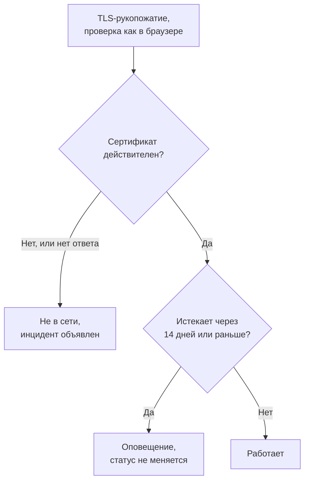

# Мониторинг SSL-сертификатов

Монитор SSL-сертификатов проверяет TLS-сертификаты, которые предъявляют ваши сайты и службы, так же как это делает браузер, и предупреждает вас до истечения их срока. Он также переводит монитор в состояние «не в сети», когда сертификат больше не действителен: истёк, самоподписан, выпущен для другого имени хоста или центром сертификации, которому браузеры не доверяют.

:::cards
- [Создать монитор](#создание-монитора-ssl-сертификатов): Шесть шагов в панели управления.
- [Критерии по умолчанию](#критерии-по-умолчанию): Предупреждение об истечении за 14 дней, без настройки.
- [Критерии мониторинга](#критерии-мониторинга): Действительность, срок действия и самоподписанные сертификаты.
- [Устранение неполадок](#устранение-неполадок): Самоподписанные и внутренние сертификаты.
:::

## Как это работает

При каждой проверке зонд открывает TLS-соединение с хостом и портом из URL — портом `443`, если URL не указывает другой, — и проверяет сертификат так, как это сделал бы браузер: доверенный центр сертификации, совпадающее имя хоста и срок действия, включающий сегодняшний день. Если сертификат не проходит проверку, зонд всё равно его читает, так что дата истечения, издатель и отпечатки записываются в любом случае. Соединение, которое завершается ошибкой, превышает тайм-аут или предъявляет недействительный сертификат, повторяется — столько раз, сколько повторных попыток вы разрешили. Затем OneUptime пропускает результат через критерии монитора.

Зонд, потерявший собственное сетевое подключение, не сообщает никакого результата, поэтому не может пометить ваш сертификат как недействительный.

## Перед началом

- **Роль, которая может создавать мониторы**: Project Owner, Project Admin, Project Member, Monitor Admin или Monitor Member либо пользовательская роль с разрешением Create Monitor.
- **Зонд, который может достучаться до хоста и порта.** Зонды проекта по умолчанию выбираются для каждого нового монитора. Службе в частной сети нужен [пользовательский зонд](/docs/probe/custom-probe) внутри этой сети.

## Создание монитора SSL-сертификатов

:::steps
### Начните новый монитор

Перейдите в **Мониторы** и нажмите **Создать монитор**. В **Тип монитора** выберите **SSL Certificate**.

### Назовите его

Введите **Имя**, например `example.com certificate`, и нажмите **Далее**.

### Введите URL

В **URL веб-сайта** введите сайт, сертификат которого нужно проверять, например `https://example.com`. Для службы на другом порту укажите его: `https://example.com:8443`.

### Протестируйте его

Нажмите **Протестировать монитор**, выберите зонд в **Выберите зонд** и нажмите **Запустить тест**. **Результат теста монитора** показывает сертификат, полученный зондом, с его издателем и датой истечения.

### Проверьте критерии

**Критерии монитора** начинаются с [критериев по умолчанию](#критерии-по-умолчанию): не в сети, когда сертификат недействителен, оповещение, когда он истекает через 14 дней или раньше. Измените их при необходимости и нажмите **Далее**.

### Выберите зонды и создайте

Оставьте или измените **Зонды** и **Интервал мониторинга** (он начинается с **Каждые 5 минут**; для мониторов SSL-сертификатов доступны интервалы от 5 минут и больше), затем нажмите **Создать монитор**. Откроется страница монитора.
:::

## Параметры конфигурации

| Поле | По умолчанию | Что ввести |
| --- | --- | --- |
| **URL веб-сайта** | Нет | Сайт, сертификат которого проверяется, например `https://example.com` или `https://example.com:8443`. Используются только хост и порт; путь игнорируется. |
| **Тайм-аут запроса (секунды)** (в **Дополнительные поля**) | `60` | Сколько ждать TLS-рукопожатия в каждой попытке. Максимум — 60 секунд. |
| **Повторные попытки при сбое** (в **Дополнительные поля**) | Значение зонда по умолчанию, обычно `3` | Сколько раз повторять неудачную попытку. Максимум — 3. |

**Повторные попытки при сбое** считает повторы _после_ первой попытки, поэтому `0` выполняет проверку один раз, а `2` — до трёх раз. Если поле пустое, используется значение зонда по умолчанию: 3, если только `PROBE_MONITOR_RETRY_LIMIT` зонда не задаёт другое. Ошибки соединения, неудачные проверки сертификата и тайм-ауты повторяются, с паузой в одну секунду между попытками.

## Критерии мониторинга

Критерии определяют, когда сертификат считается в порядке, деградировавшим или неисправным, и объявляется ли при этом инцидент или создаётся оповещение. Каждый критерий проверяет один или несколько фильтров:

| Фильтр | Условия | Что проверяет |
| --- | --- | --- |
| **Is Valid Certificate** | **Истина**, **Ложь** | Сертификат проходит проверки браузера: доверенный центр сертификации, совпадающее имя хоста и срок действия, включающий сегодняшний день. **Ложь**, когда конечная точка не ответила. |
| **Is Not A Valid Certificate** | **Истина**, **Ложь** | Противоположность **Is Valid Certificate**: **Истина**, когда сертификат не проходит эти проверки или его не удалось проверить. |
| **Is Expired Certificate** | **Истина**, **Ложь** | Дата истечения сертификата прошла. |
| **Is Self Signed Certificate** | **Истина**, **Ложь** | Сертификат или один из сертификатов его цепочки самоподписан. |
| **Expires In Days** | **Greater Than**, **Less Than**, **Greater Than Or Equal To**, **Less Than Or Equal To** | Дней до истечения сертификата. |
| **Expires In Hours** | **Greater Than**, **Less Than**, **Greater Than Or Equal To**, **Less Than Or Equal To** | Часов до истечения сертификата. |

**Expires In Days** считает целые дни: у сертификата, который истекает через 14 дней и 20 часов, осталось 14 дней. **Expires In Hours** так же считает целые часы.

При двух и более фильтрах **Условие совпадения** решает, должны ли совпасть **Все** или достаточно **Любой** из них. **Действия** критерия определяют, что он делает: меняет статус монитора, создаёт оповещение, объявляет инцидент или делает несколько из этого.

### Критерии по умолчанию

Новый монитор SSL-сертификатов начинает с трёх критериев, поэтому он предупреждает вас до истечения сертификата без какой-либо настройки:

1. **Сертификат недействителен** — сертификат истёк, самоподписан, выпущен для другого имени хоста или недоверенным центром сертификации либо его не удалось проверить, потому что конечная точка не ответила. Монитор помечается как **Не в сети**, и создаётся инцидент с названием «_monitor name_ certificate is not valid». Его первопричина говорит, какой из этих случаев произошёл. Инцидент разрешается сам, как только сертификат снова становится действительным.
2. **Сертификат скоро истекает** — сертификат действителен, но истекает через 14 дней или раньше. Создаётся **оповещение** с названием «_monitor name_ certificate expires soon».
3. **Сертификат действителен** — монитор помечается как **Работает**.

Предупреждение «скоро истекает» — это оповещение, а не инцидент: оно не показывается на ваших страницах статуса, никого не вызывает, пока вы не добавите к нему политику дежурств, и не меняет статус монитора. Оно использует вторую серьёзность оповещений вашего проекта, **Low** в новом проекте. Когда обновлённый сертификат подхватывается, монитор возвращается к «Сертификат действителен», и оповещение разрешается само.

Критерии проверяются сверху вниз, и первый совпавший решает, что произойдёт. Поэтому «скоро истекает» стоит выше «действителен»: истекающий сертификат всё ещё действителен, так что он совпал бы с обоими.

Чтобы получать предупреждение раньше, измените значение фильтра **Expires In Days** в критерии «скоро истекает», например на `30`. Чтобы вместо этого вызывать дежурного, откройте **Действия** этого критерия: включите **Когда фильтры совпадают, объявить инцидент.** или оставьте оповещение и добавьте к нему политику дежурств в **Политики дежурств**.

:::details Добавить предупреждение в монитор, созданный до его появления
У мониторов, созданных до того, как OneUptime добавил это предупреждение, нет критерия «скоро истекает». Чтобы добавить его:

1. Откройте на мониторе **Конфигурация → Критерии** и нажмите **Редактировать: Критерии мониторинга**.
2. Нажмите **Добавить критерии**. Установите его фильтр на **Is Valid Certificate** / **Истина**, нажмите **Добавить фильтр** и установите второй на **Expires In Days** / **Less Than Or Equal To** / `14`. Оставьте **Условие совпадения** на **Все** (оно появляется под фильтрами, как только их становится два).
3. В **Действия** включите **Когда фильтры совпадают, создать оповещение.** и оставьте **Когда фильтры совпадают, изменить статус монитора.** выключенным, чтобы критерий создавал оповещение и не менял статус монитора.
4. Перетащите новый критерий выше критерия, который помечает монитор как работающий, и сохраните.
:::

### Примеры критериев

| Цель | Фильтр | Условие | Значение |
| --- | --- | --- | --- |
| Предупреждать за месяц | **Expires In Days** | **Less Than Or Equal To** | `30` |
| Вызывать дежурного в последний день | **Expires In Hours** | **Less Than** | `24` |
| Не в сети только после истечения сертификата | **Is Expired Certificate** | **Истина** | — |
| Отмечать самоподписанный сертификат | **Is Self Signed Certificate** | **Истина** | — |

Критерий об истечении должен стоять выше критерия, который помечает сертификат действительным: сертификат, срок которого скоро истекает, всё ещё действителен, а побеждает первый совпавший критерий.

## Лучшие практики

1. **Оставляйте себе время на продление** — Предупреждение по умолчанию приходит за 14 дней до истечения, что подходит для сертификатов, которые продлеваются сами. Если продление занимает у вас больше времени (покупной сертификат или процесс согласования изменений), увеличьте его до 30 дней.
2. **Отслеживайте каждую конечную точку** — Если у вас несколько доменов или поддоменов, создайте монитор для каждого. У каждого может быть свой сертификат.
3. **Учитывайте другие порты** — У служб, которые отдают TLS на порту, отличном от `443`, например `8443`, тоже есть сертификаты. Укажите порт в URL.
4. **Проверяйте после продления** — После продления сертификата посмотрите следующий результат монитора: показанная дата истечения должна быть новой.

## Устранение неполадок

:::details В браузере сертификат в порядке, а монитор говорит, что он недействителен
Первопричина инцидента объясняет почему. Частая причина — сервер, который отправляет свой сертификат без промежуточных сертификатов: браузеры часто сами восполняют пробел, а зонд — нет. Настройте сервер так, чтобы он отправлял полную цепочку. Другая причина — URL, имени хоста которого нет в сертификате.
:::

:::details Я отслеживаю внутреннюю службу с самоподписанным сертификатом
Самоподписанный сертификат никогда не бывает действительным, поэтому критерии по умолчанию держат монитор в состоянии «не в сети». **Is Self Signed Certificate**, **Is Expired Certificate** и **Expires In Days** для него по-прежнему работают, поэтому стройте критерии на них. В **Конфигурация → Критерии**:

1. В критерии «недействителен» нажмите **Добавить фильтр**, установите новый фильтр на **Is Self Signed Certificate** / **Ложь** и установите **Условие совпадения** на **Все**. Критерий по-прежнему переводит монитор в «не в сети», когда конечная точка не отвечает или сертификат неверен как-то иначе.
2. Добавьте критерий с **Is Expired Certificate** / **Истина**, который помечает монитор как **Не в сети** и объявляет инцидент, и перетащите его наверх.
3. В критерии «скоро истекает» замените **Is Valid Certificate** / **Истина** на **Is Expired Certificate** / **Ложь**, чтобы предупреждение распространялось и на самоподписанный сертификат.

Пока сертификат действует, ни один критерий не совпадает, и монитор показывает свой статус по умолчанию, **Работает**.
:::

:::details Монитор не в сети с сообщением «could not be checked because the endpoint is not reachable»
Зонд не смог открыть TLS-соединение с хостом и портом. Проверьте порт в URL и то, что брандмауэр пропускает зонды. Хосту в частной сети нужен [пользовательский зонд](/docs/probe/custom-probe).
:::

## Дальнейшие шаги

:::cards
- [Мониторинг веб-сайта](/docs/monitor/website-monitor): Проверка того, что отвечает сам сайт.
- [Мониторинг домена](/docs/monitor/domain-monitor): Предупреждение до истечения регистрации домена.
- [Правила эскалации](/docs/on-call/escalation-rules): Решите, кого вызывают оповещения и инциденты.
- [Обзор инцидентов](/docs/incidents/index): Что происходит после того, как монитор объявил инцидент.
:::
