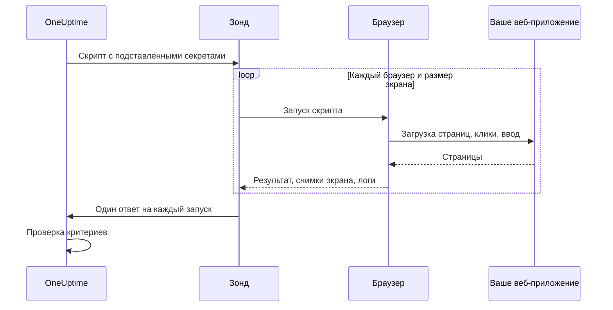

# Синтетический мониторинг

Синтетический монитор по расписанию управляет вашим веб-приложением в настоящем браузере с помощью написанного вами скрипта Playwright: он открывает страницы, заполняет формы и проходит пользовательский сценарий, а когда сценарий ломается, проверка не проходит. Используйте его, чтобы ловить поломки, которых не видит проверка доступности: вход, который больше не работает, кнопку оформления заказа, которая ничего не делает, дашборд, который никак не догружается.

:::cards
- [Создайте монитор](#создание-синтетического-монитора): Напишите скрипт, выберите браузеры и размеры экрана.
- [Напишите скрипт](#написание-скрипта): Готовый к запуску сценарий входа, с которого можно начать.
- [Снимки экрана](#снимки-экрана): Посмотрите, как выглядела страница, когда запуск провалился.
- [Что доступно скрипту](#модули-доступные-в-скрипте): Playwright, HTTP, криптография и метрики.
:::

## Как это работает

При каждой проверке зонд запускает ваш скрипт по одному разу для каждого выбранного браузера и размера экрана, один за другим. Каждый запуск открывает новый браузер без cookies и хранилища от прошлых запусков; скрипт управляет своей страницей, делает снимки экрана и возвращает результат или выбрасывает ошибку. Зонд сообщает о каждом запуске, а OneUptime проверяет по ним ваши критерии.



| Тип экрана | Область просмотра |
| --- | --- |
| Mobile | 360 × 640 |
| Tablet | 1024 × 768 |
| Desktop | 1920 × 1080 |

Браузеры — Chromium и Firefox.

## Перед началом

- **Зонд**, который может достучаться до вашего веб-приложения. Для приложения внутри вашей сети используйте [собственный зонд](/docs/probe/custom-probe). Docker-образ зонда включает Chromium и Firefox; зонду, запущенному вне Docker, они нужны установленными.
- Все пароли и токены, нужные сценарию, сохранённые как [секреты мониторинга](/docs/monitor/monitor-secrets).

## Создание синтетического монитора

:::steps
### Начните новый монитор

Откройте **Мониторы** и нажмите **Создать монитор**. В разделе **Тип монитора** нажмите **Другие типы мониторов** и выберите **Synthetic Monitor** в группе **Synthetic Monitoring** или введите `playwright` в поле поиска. Укажите **Имя** и нажмите **Далее**.

### Добавьте скрипт

Напишите скрипт в редакторе **Playwright Code**. Начните с [примера ниже](#написание-скрипта).

### Выберите браузеры и размеры экрана

Отметьте браузеры в **Тип браузера** и размеры в **Тип экрана**. Скрипт запускается по одному разу для каждой комбинации, поэтому два браузера и три размера дают шесть запусков за проверку. В **Дополнительные поля** параметр **Количество повторных попыток при ошибке** повторяет проваленный запуск до 5 раз.

### Протестируйте его

Нажмите **Протестировать монитор**, чтобы один раз запустить скрипт с зонда, и проверьте результат, логи и снимки экрана каждого запуска.

### Проверьте критерии

Монитор начинается с двух критериев: он переходит в офлайн и объявляет инцидент, когда какой-либо запуск проваливается, и становится онлайн, когда не проваливается ни один. Измените их или добавьте свои (см. [Критерии](#критерии)), затем нажмите **Далее**.

### Выберите зонды и создайте монитор

Выберите **Зонды** и **Интервал мониторинга** (для синтетических мониторов доступны интервалы от 5 минут и больше), затем нажмите **Создать монитор**.
:::

## Написание скрипта

Скрипт — это тело функции `async`. `page` — уже открытая страница, совместимая с Playwright; управляйте ею, верните результат через `return` и используйте `throw` (или дайте вызову Playwright завершиться по тайм-ауту), чтобы провалить запуск. Этот пример выполняет вход и проверяет, что дашборд загружается:

```javascript title="Synthetic monitor script"
await page.goto("https://app.example.com/login");
screenshots["login-page"] = await page.screenshot();

await page.fill("#email", "monitoring@example.com");
await page.fill("#password", "{{monitorSecrets.AppPassword}}");
await page.click("button[type=submit]");

// Fails the run if the dashboard does not appear within 10 seconds.
await page.waitForSelector(".dashboard", { timeout: 10000 });
screenshots["dashboard"] = await page.screenshot();

console.log(`Signed in on ${browserType}, ${screenSizeType}`);

return {
  data: { title: await page.title() },
};
```

| Чтобы | Сделайте так | Что записывает OneUptime |
| --- | --- | --- |
| Сообщить результат | `return { data: ... }` | **Результат** запуска. Сохраняется только `data`. |
| Провалить запуск | `throw new Error("...")` или дайте ожиданию истечь | **Ошибка скрипта** запуска. |
| Сохранить доказательство | `screenshots["name"] = await page.screenshot()` | Снимок экрана, который сохраняется даже при проваленном запуске. |
| Оставить след | `console.log(...)` | Сообщения лога запуска. |

Чтобы посмотреть запуски, откройте **Обзор** монитора: в карточке **Сводка монитора** есть по блоку на каждый браузер и размер экрана, а **Показать больше деталей** показывает снимки экрана каждого запуска.

### Использование Playwright

Мы используем Playwright для имитации действий пользователя. Значение `page` — это безопасный фасад, совместимый с Playwright, для страницы, созданной для этого выполнения. Доступны распространённые методы `Page`, `Locator`, `Frame`, `ElementHandle`, `JSHandle`, `Request`, `Response`, клавиатуры, мыши и контекста браузера. Сюда входят навигация, локаторы, клики, ввод в формы, вычисления на странице, всплывающие окна, дополнительные страницы, разбор ответов и снимки экрана. Контекст браузера этого выполнения доступен через `page.context()`, например чтобы открыть новую страницу или обработать всплывающее окно.

Синтетические скрипты не выполняются в процессе Node.js зонда. Значения пересекают границу среды выполнения как скопированные данные или непрозрачные возможности, привязанные к выполнению, поэтому некоторые API Playwright работают иначе или не работают совсем:

| Недоступно | Что использовать вместо этого |
| --- | --- |
| Методы запуска браузера или подключения к нему, сеансы CDP, маршрутизация запросов, открытые привязки, приватные поля Playwright и любые параметры, которые читают или пишут путь в файловой системе хоста. Поэтому `page.context().browser()` недоступен. | Страницу и контекст браузера, которые вам даны. |
| Обработчики событий (`page.on(...)`, `page.once(...)`): их вызов завершается понятной ошибкой. | `page.waitForEvent(...)` для диалогов и всплывающих окон или ожидания ответов и запросов с сопоставлением по строке или регулярному выражению. |
| Функции-предикаты для методов ожидания событий, запросов, ответов и URL. | Сопоставление по строке или регулярному выражению, локаторы или явный опрос. |
| Синхронные методы доступа к фреймам (`page.frames()`, `page.mainFrame()`, `page.frame(...)`). | `page.frameLocator(...)` для iframe. |
| `page.request.*` | Глобальный `axios` для HTTP-запросов. |
| Снимки всей страницы и вывод в PDF. | Снимки области просмотра, которые сохраняют описанное ниже поведение с доказательствами сбоев. |

`page.waitForNavigation(...)`, `page.setDefaultTimeout(...)` и `page.setDefaultNavigationTimeout(...)` поддерживаются. `page.waitForEvent(...)` ожидает `dialog`, `domcontentloaded`, `load`, `popup`, `request`, `requestfailed`, `requestfinished` и `response`. Функции вычисления, передаваемые в методы вроде `page.evaluate()`, выполняются на отслеживаемой странице браузера, а не в процессе зонда. Каждое выполнение может использовать до восьми страниц.

Разрешения браузера ограничены геолокацией и уведомлениями. Буфер обмена, камера, микрофон, MIDI, локальные шрифты и другие разрешения для устройств хоста скриптам мониторинга недоступны.

### Что возвращает скрипт

Данные, возвращённые скриптом, перед сохранением сериализуются в JSON: в обычных объектах и массивах `NaN` и `Infinity` становятся `null`, свойства со значением `undefined` и функции отбрасываются, а объекты `Date` становятся строками ISO — так же, как их обрабатывает `JSON.stringify`. Экземпляры классов и другие необычные объекты отбрасываются целиком. `BigInt` становится строкой. Результат с циклическими ссылками, вложенностью глубже 30 уровней или размером больше 5 МБ вместо этого проваливает запуск.

### Оповещения по возвращённым данным

То, что скрипт возвращает как `data`, — это **Result Value** монитора, которое может сравнивать критерий. Если `data` — объект или массив, заполните **Путь к полю (необязательно)** в фильтре Result Value, чтобы сравнивать одно поле, например `status`, `timings.loadTime` или `errors[0].message`. Фильтр проверяется по данным каждого браузера и размера экрана, на которых работает монитор, и срабатывает, когда совпадает любой из них. Как работают пути и условия, описано в разделе [Оповещения по возвращённым данным](/docs/monitor/custom-code-monitor#оповещения-по-возвращённым-данным).

## Снимки экрана

В контексте скрипта заранее объявлен объект `screenshots`. Записывайте в него снимки экрана в любом месте скрипта: эти снимки сохраняются, **даже если скрипт выбрасывает ошибку** (в том числе при проваленных проверках, тайм-аутах и неожиданных ошибках), поэтому вы точно видите, как выглядела страница, когда запуск провалился. Сохранённые снимки появляются в дашборде OneUptime для этого конкретного запуска монитора.

```javascript
// Capture screenshots via the `screenshots` side-channel — they are preserved on both success and failure.

await page.goto("https://app.example.com/login");
screenshots["login-page"] = await page.screenshot();

await page.fill("#email", "user@example.com");
await page.fill("#password", "wrong");
await page.click("button[type=submit]");

// If the next assertion throws, the `login-page` screenshot above is still captured.
await page.waitForSelector(".dashboard", { timeout: 5000 });

screenshots["dashboard"] = await page.screenshot();

return {
  data: "Login succeeded",
};
```

Запуск сохраняет до 20 снимков экрана, каждый до 10 МБ и всего до 50 МБ. Снимок экрана можно также показать в инциденте или оповещении, которое открывает проваленный запуск (на его странице и в письмах о нём), поместив его в описание инцидента или оповещения монитора. См. [Показ снимка экрана](/docs/monitor/incident-alert-templating#синтетические-мониторы).

:::details Возврат снимков экрана (устаревший способ)
Для обратной совместимости снимки экрана можно также вернуть из скрипта как часть возвращаемого значения. Снимки, возвращённые так, сохраняются, **только** когда скрипт завершается нормально: если скрипт выбрасывает ошибку, они теряются. Когда нужны доказательства сбоев, предпочитайте описанный выше побочный канал.

```javascript
// Legacy pattern — screenshots only captured on successful return.
const screenshots = {};
screenshots["screenshot-name"] = await page.screenshot();

return {
  data: "Hello World",
  screenshots: screenshots,
};
```
:::

## Использование секретов мониторинга

Ссылайтесь на секрет как `{{monitorSecrets.NAME}}` в любом месте скрипта. OneUptime заменяет ссылку значением секрета, как обычный текст, ещё до того, как скрипт попадёт на зонд. Поэтому заключайте секрет в кавычки, чтобы использовать его как строку, и оставляйте без кавычек, чтобы использовать как число или логическое значение:

```javascript
// Used as a string: wrap it in quotes.
const password = "{{monitorSecrets.AppPassword}}";

// Used as a number or a boolean: leave it bare.
const retryLimit = {{monitorSecrets.RetryLimit}};
const verbose = {{monitorSecrets.Verbose}};
```

Как создать секрет и выбрать мониторы, которые могут его использовать, описано в разделе [Секреты мониторинга](/docs/monitor/monitor-secrets).

## Пользовательские метрики

Скрипт может собирать пользовательские метрики с помощью функции `oneuptime.captureMetric()`. Эти метрики хранятся в OneUptime, и их можно выводить на графиках дашбордов через Metric Explorer.

```javascript
oneuptime.captureMetric(name, value, attributes);
```

| Параметр | Тип | Описание |
| --- | --- | --- |
| `name` | string, обязательный | Имя метрики (например, `"dashboard.load.time"`). Оно автоматически сохраняется с префиксом `custom.monitor.`. |
| `value` | number, обязательный | Числовое значение метрики. |
| `attributes` | object, необязательный | Пары «ключ-значение» для дополнительного контекста. |

### Пример

```javascript
await page.goto("https://app.example.com");

const startTime = Date.now();
await page.waitForSelector("#dashboard-loaded");
const loadTime = Date.now() - startTime;

// Capture page load time, tagged with this run's browser and screen size
oneuptime.captureMetric("dashboard.load.time", loadTime, {
  page: "dashboard",
  browser: browserType,
  screen: screenSizeType,
});

screenshots["dashboard"] = await page.screenshot();

return {
  data: { loadTime },
};
```

После сбора эти метрики появляются в Metric Explorer под именами вида `custom.monitor.dashboard.load.time`, а также на странице монитора **Метрики** в разделе **Пользовательские метрики**. OneUptime добавляет к каждой точке данных монитор и зонд; чтобы фильтровать по браузеру или размеру экрана, передайте их как атрибуты, как в примере.

Запуск может собрать не больше 100 метрик, только с числовыми значениями, и OneUptime хранит не больше 100 на проверку по всем её запускам. Как и у монитора собственного кода, некоторые имена атрибутов [зарезервированы](/docs/monitor/custom-code-monitor#зарезервированные-ключи-атрибутов) и отбрасываются, если скрипт их задаёт.

## Критерии

| Тип фильтра | Что он проверяет |
| --- | --- |
| **Ошибка** | Ошибку, которую выбросил запуск, если она была. |
| **Result Value** | `data`, которые вернул запуск. |
| **Время выполнения (в ms)** | Сколько длился запуск. |
| **Тип браузера** | Браузер, который использовал запуск: **Equal To** или **Not Equal To**. |
| **Screen Size** | Размер экрана, который использовал запуск: **Equal To** или **Not Equal To**. |

Каждый фильтр проверяется по каждому запуску и срабатывает, когда с ним совпадает хотя бы один запуск. Фильтры проверяются по отдельности, а не запуск за запуском: **Ошибка** Is Not Empty вместе с **Тип браузера** Equal To `Firefox` срабатывает, когда какой-либо запуск провалился и один из запусков использовал Firefox, а не только когда провалился запуск в Firefox. Чтобы следить за одним браузером отдельно, заведите для него собственный монитор.

В шаблонах инцидентов и оповещений все запуски доступны в `{{syntheticResponses}}`: см. [Шаблоны инцидентов и оповещений](/docs/monitor/incident-alert-templating#синтетические-мониторы).

## Модули, доступные в скрипте

| Имя | Что это |
| --- | --- |
| `page` | Безопасный фасад, совместимый с Playwright, для работы с браузером. Через `page.context()` доступен контекст браузера этого выполнения, чтобы создавать страницы или обрабатывать всплывающие окна, но запуск браузера и подключение к нему, CDP, маршрутизация, привязки, приватные поля и параметры с путями хоста недоступны. |
| `screenshots` | Заранее объявленный объект, в который вы записываете снимки экрана (например, `screenshots['login-page'] = await page.screenshot()`). Записанные сюда снимки сохраняются, даже если скрипт позже выбросит ошибку. |
| `browserType` | Браузер этого запуска: `Chromium` или `Firefox`. |
| `screenSizeType` | Размер экрана этого запуска: `Mobile`, `Tablet` или `Desktop`. |
| `axios` | HTTP-клиент на промисах, который поддерживает вызов Axios как функции, а также `request`, `get`, `head`, `options`, `post`, `put`, `patch`, `delete` и `create`. Тело запроса может быть до 1 МБ, ответ — до 5 МБ; клиент выполняет до 5 перенаправлений и завершается по тайм-ауту не позже чем через 30 секунд. Собственные транспорты, адаптеры, сокеты, агенты и переопределение прокси недоступны. |
| `crypto` | Реализация в браузерном воркере хешей SHA-256, HMAC-SHA-256, `randomBytes`, `randomInt` и `randomUUID`. |
| `console` | `console.log`, `info`, `warn` и `error`. Сообщения сохраняются вместе с каждым запуском. |
| `oneuptime.captureMetric` | Записывает пользовательскую метрику. См. [Пользовательские метрики](#пользовательские-метрики). |
| `http` | Буферизованный фасад совместимости только для клиента, который поддерживает `request`, `get` и `Agent`. |
| `https` | HTTPS-аналог клиентского фасада `http`. |
| `Buffer`, `setTimeout`, `setInterval` | И их функции `clear`. |

Скрипт выполняется в браузерном воркере, а не в Node.js, и не может открывать собственные сетевые подключения: `fetch`, `XMLHttpRequest` и `WebSocket` заблокированы. Для HTTP-запросов используйте `axios`.

## Ограничения

| Ограничение | По умолчанию | Настройка зонда |
| --- | --- | --- |
| Тайм-аут скрипта | 60 секунд. Воркеры, превысившие тайм-аут, и все дочерние процессы браузера завершаются. | `PROBE_SYNTHETIC_MONITOR_SCRIPT_TIMEOUT_IN_MS` |
| Память на всё дерево процессов запуска | 1,5 ГиБ | `PROBE_SYNTHETIC_MONITOR_MAX_PROCESS_TREE_RSS_BYTES` |
| Записываемое хранилище браузера | 256 МиБ | `PROBE_SYNTHETIC_MONITOR_MAX_DISK_BYTES` |
| Одновременных запусков на одном зонде | 4 | `PROBE_SYNTHETIC_MONITOR_MAX_CONCURRENCY` |
| Страниц на выполнение | 8 | — |

Превышение лимита памяти или хранилища завершает это выполнение и удаляет его временный профиль. Настройки зонда применяются к самостоятельно размещённым зондам; Helm-чарт задаёт те же значения для каждого зонда (например, `syntheticMonitorScriptTimeoutInMs`).

Браузеры поставляются внутри Docker-образа зонда, поэтому самостоятельно размещённый зонд получает более новые браузеры, когда вы обновляете его образ.

## Устранение неполадок

:::details Запуск проваливается, но непонятно почему
Записывайте снимки экрана в объект `screenshots` перед каждым рискованным шагом. Они сохраняются даже при проваленном запуске и показывают, как выглядела страница в этот момент.
:::

:::details `page.on(...)` выбрасывает ошибку
Обработчики событий не могут пересечь границу изоляции. Используйте `page.waitForEvent(...)` для диалогов и всплывающих окон или ожидание ответа или запроса с сопоставлением по строке или регулярному выражению.
:::

:::details Запуск завершается по тайм-ауту
Ожидайте конкретные элементы с помощью `page.waitForSelector(...)` и `timeout` короче собственного лимита скрипта, чтобы запуск проваливался на медленном шаге с понятной ошибкой.
:::

:::details Самостоятельно размещённый зонд сообщает, что исполняемый файл браузера не найден
Зонд работает вне своего Docker-образа, и Chromium или Firefox не установлены. Запустите образ зонда или установите браузеры на эту машину.
:::

## Следующие шаги

:::cards
- [Мониторинг собственного кода](/docs/monitor/custom-code-monitor): Проверяйте API скриптом, без браузера.
- [Показ снимка экрана](/docs/monitor/incident-alert-templating#синтетические-мониторы): Добавьте в инцидент снимок экрана проваленного запуска.
- [Секреты мониторинга](/docs/monitor/monitor-secrets): Не храните учётные данные в скрипте.
:::
