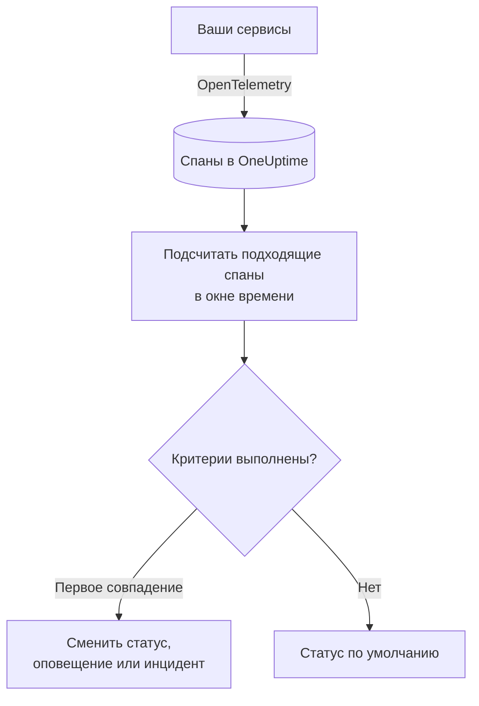

# Мониторинг трассировок

Монитор трассировок считает за окно времени спаны, которые ваши сервисы отправляют в OneUptime и которые соответствуют вашим фильтрам (имя спана, статус, сервис, атрибуты). Когда число удовлетворяет вашим критериям, он меняет статус монитора, создаёт оповещение или объявляет инцидент. Используйте его для оповещений о неудачных запросах к эндпоинту, всплеске спанов с ошибками или сервисе, который перестал отправлять трассировки.

:::cards
- [Создание монитора](#создание-монитора-трассировок): Выберите, какие спаны считать и когда оповещать.
- [Коды статуса спанов](#коды-статуса-спанов): Что означают OK, ERROR и UNSET и по какому фильтровать.
- [Как он оценивается](#как-он-оценивается): Окно времени, подсчёт и цикл в одну минуту.
- [Критерии](#критерии): Пороги, обнаружение аномалий и значения по умолчанию.
:::

## Как это работает

Каждую минуту OneUptime подсчитывает спаны, которые соответствуют фильтрам монитора и начались в пределах его окна времени. Он сравнивает это число с критериями монитора сверху вниз, и первый совпавший критерий решает, что произойдёт. Если не совпал ни один, монитор возвращается к своему статусу по умолчанию.

## Перед началом

- Ваши сервисы отправляют трассировки в OneUptime через OpenTelemetry. См. [OpenTelemetry](/docs/telemetry/open-telemetry).
- Найдите в обозревателе трассировок точное имя спана, за которым хотите следить: имена спанов задаёт ваше инструментирование, например `POST /api/checkout` или `GET`.

## Создание монитора трассировок

:::steps
### Начните новый монитор

Перейдите в **Мониторы** и нажмите **Создать монитор**.

### Выберите Traces

В разделе **Тип монитора** нажмите **Другие типы мониторов** и выберите **Трассировки** в группе **Телеметрия** или введите `traces` в поле поиска. Введите **Имя** и нажмите **Далее**.

### Выберите, какие спаны считать

В **Конфигурация монитора трассировок** задайте **Имя span**, **Трассировка монитора за (время)** и **Фильтровать по статусу span**. Фильтр, оставленный пустым, соответствует всем спанам. **Предпросмотр spans** под фильтрами показывает спаны, которым они соответствуют прямо сейчас.

### Сузьте выборку (необязательно)

Откройте **Дополнительные поля**, чтобы фильтровать по сервису телеметрии, сущности инфраструктуры или атрибуту.

### Задайте критерии

Карточка **Критерии монитора** начинается с двух критериев: не в сети, с инцидентом, когда ни один спан не подходит; в сети, когда подходит хотя бы один. Измените их под то, о чём вы хотите получать оповещения (см. [Критерии](#критерии)).

### Создайте монитор

Нажмите **Создать монитор**. Монитор откроется на своей странице **Обзор**, и его первая оценка выполнится в течение минуты.
:::

> [!TIP]
> Чтобы узнавать, когда функция ИИ отвечает плохо (неудачные, отклонённые, оборванные, пустые, помеченные или медленные ответы), выберите вместо этого **ИИ / LLM** в группе **Телеметрия**. Этот монитор сам читает вызовы ИИ в ваших трассировках, без фильтров по спанам, которые нужно писать. См. [Наблюдаемость ИИ / LLM](/docs/telemetry/ai-llm-observability#узнавайте-когда-ии-отвечает-плохо).

## Что он запрашивает

| Поле | Чему соответствует | По умолчанию |
| --- | --- | --- |
| **Имя span** | Спаны, имя которых содержит этот текст, без учёта регистра. | Пусто: все спаны |
| **Трассировка монитора за (время)** | Спаны, начавшиеся за период от последних 5 секунд до последних 24 часов. | **Последняя 1 минута** |
| **Фильтровать по статусу span** | Спаны с любым из выбранных статусов: **Не задано**, **Ок** или **Ошибка**. | Пусто: все статусы |
| **Фильтровать по сервису телеметрии** (в **Дополнительные поля**) | Спаны любого из выбранных сервисов. | Пусто: все сервисы |
| **Filter by Infrastructure Entity** (в **Дополнительные поля**) | Спаны любого из выбранных хостов, подов, контейнеров и других сущностей. | Пусто: все сущности |
| **Фильтровать по атрибутам** (в **Дополнительные поля**) | Спаны, атрибуты которых удовлетворяют всем условиям. У каждого условия свой оператор, например «равно» или «содержит». | Пусто: без условий |

Чтобы спан был учтён, должны совпасть все заданные вами фильтры.

### Коды статуса спанов

- **OK** — операция явно помечена как успешная кодом приложения или пайплайном трассировок
- **ERROR** — операция завершилась с ошибкой
- **UNSET** — статус ошибки не задан. Это статус OpenTelemetry по умолчанию

UNSET не означает, что данные отсутствуют. Инструментирование OpenTelemetry устанавливает ERROR, когда операция завершается сбоем, и оставляет успешные спаны в статусе UNSET, поэтому у исправно работающего сервиса большинство спанов имеют статус UNSET. OneUptime отображает их зелёным цветом с подписью «Unset (no error)». Регистрация исключения не меняет статус спана, поэтому у спана со статусом UNSET всё равно могут быть исключения; они перечислены вместе со спаном. Чтобы получать оповещения о сбоях, фильтруйте по ERROR. Чтобы подсчитать все спаны, которые не завершились сбоем, выберите и OK, и UNSET.

Если вы хотите, чтобы успешные запросы отображались как OK, добавьте пайплайн трассировок в разделе **Трассировки > Настройки > Пайплайны** с условием фильтра **Статус = Не задано** и процессором **Преобразователь статуса**, который преобразует значения `http.response.status_code`, например `200`, в Ok.

## Как он оценивается

- **Каждую минуту.** Монитор трассировок не проверяется зондами, поэтому у него нет интервала для настройки и нет страницы **Зонды и интервал**.
- **Одно число на оценку.** Монитор считает спаны, которые соответствуют всем фильтрам и начались в пределах **Трассировка монитора за (время)** до оценки. При **Последние 5 минут** каждая оценка смотрит на пять минут назад, поэтому окна последовательных оценок перекрываются.
- **Отсутствие спанов — это число 0.** Сервис, который перестал отправлять трассировки, даёт 0, и именно это ищет критерий «не в сети» по умолчанию.
- **Простой самого OneUptime — это не тишина.** Пока окно времени содержит период, когда сам OneUptime не получал данные (перезапускался, обновлялся или догонял отставание), проверка ждёт: статус не меняется, и ни один инцидент или оповещение не открывается и не закрывается. См. [Когда OneUptime не получает данные](/docs/monitor/when-oneuptime-is-not-receiving).
- **Критерии сверху вниз.** Решает первый совпавший критерий, поэтому ставьте самый серьёзный первым.

Каждая смена статуса вместе с причиной записывается в **Хронология статуса** монитора.

## Критерии

У критериев монитора трассировок один **Тип фильтра**: **Span Count**, число спанов, совпавших в окне. Выберите **Условие фильтра** и, для порогового условия, **Значение**.

| Условие фильтра | Совпадает, когда число спанов… |
| --- | --- |
| **Greater Than** | выше значения |
| **Greater Than Or Equal To** | равно значению или выше |
| **Less Than** | ниже значения |
| **Less Than Or Equal To** | равно значению или ниже |
| **Equal To** | ровно равно значению |
| **Anomalously High** | выше ожидаемого диапазона для этого часа недели |
| **Anomalously Low** | ниже этого диапазона |
| **Anomalous** | вне этого диапазона в любую сторону |

У условий аномалий нет **Значение**. Выберите **Чувствительность** (Low, Medium — по умолчанию — или High) и **Окно базовой линии** в 14 (по умолчанию), 28, 60 или 90 дней. OneUptime переводит число в скорость в минуту и сравнивает её с тем же часом недели за это окно. Базовая линия охватывает только сервисы и статусы спанов монитора: его фильтры по имени спана и атрибутам в неё не входят. Пока у этого часа недели недостаточно истории, критерий ещё обучается и не срабатывает.

Новый монитор трассировок начинает с этих критериев:

| Критерий | Фильтр | Действие |
| --- | --- | --- |
| Check if … is offline | **Span Count** **Equal To** `0` | Переводит монитор в состояние «не в сети» и объявляет инцидент, который устраняется автоматически |
| Check if … is online | **Span Count** **Greater Than** `0` | Переводит монитор в состояние «в сети» |

## Разобранный пример: неудачные запросы оформления заказа

За пять минут сервис оформления заказов записывает 1 200 спанов с именем `POST /api/checkout`: 1 150 UNSET, 20 OK и 30 ERROR. Один и тот же монитор считает очень разные числа в зависимости от **Фильтровать по статусу span**:

| Фильтровать по статусу span | Span Count | Что измеряет |
| --- | --- | --- |
| **Ошибка** | 30 | Запросы, завершившиеся сбоем |
| **Ок** | 20 | Только запросы, которые ваш код пометил как успешные |
| **Не задано** и **Ок** | 1 170 | Все запросы, не завершившиеся сбоем |
| Пусто | 1 200 | Все запросы |

Чтобы вас вызывали, когда за пять минут сбоем завершается больше 10 запросов оформления заказа:

- **Имя span**: `POST /api/checkout`
- **Трассировка монитора за (время)**: **Последние 5 минут**
- **Фильтровать по статусу span**: **Ошибка**
- Критерий 1: **Span Count** **Greater Than** `10`: перевести монитор в состояние «не в сети» и объявить инцидент
- Критерий 2: **Span Count** **Less Than Or Equal To** `10`: перевести монитор в состояние «в сети»

При 30 неудачных запросах совпадает критерий 1, и объявляется инцидент. Когда проходит пять минут с 10 сбоями или меньше, совпадает критерий 2, монитор снова в сети, и инцидент устраняется сам.

## Устранение неполадок

:::details Монитор не считает ни одного спана для моего эндпоинта
**Имя span** сравнивается с именем спана, а инструментирование часто называет серверные спаны по маршруту (`POST /api/checkout`) или только по методу (`GET`). Найдите точное имя в обозревателе трассировок. Затем откройте страницу **Критерии** монитора (в разделе **Конфигурация**) и нажмите **Edit Monitoring Criteria**: **Предпросмотр spans** показывает, чему фильтры соответствуют прямо сейчас.
:::

:::details Успешные запросы не учитываются, когда я фильтрую по Ок
Большинство инструментирований оставляет успешные спаны в статусе UNSET, а не OK (см. [Коды статуса спанов](#коды-статуса-спанов)). Выберите и **Не задано**, и **Ок** или добавьте описанный там пайплайн трассировок.
:::

:::details У спана есть исключение, но он не учитывается как ошибка
Регистрация исключения не меняет статус спана. Фильтруйте по **Ошибка** или используйте [монитор исключений](/docs/monitor/exceptions-monitor), чтобы получать оповещения о самих исключениях.
:::

:::details Критерий аномалии никогда не срабатывает
Он ещё обучается: у часа недели, с которым он сравнивает, пока недостаточно истории в пределах **Окно базовой линии**.
:::

## Что дальше

:::cards
- [Мониторинг исключений](/docs/monitor/exceptions-monitor): Оповещения об исключениях, которые записывают ваши сервисы.
- [Мониторинг журналов](/docs/monitor/logs-monitor): Оповещения об объёме и содержимом логов.
- [Синтаксис поиска](/docs/telemetry/search-syntax): Ищите имена и статусы спанов в обозревателе трассировок.
- [Шаблоны инцидентов и оповещений](/docs/monitor/incident-alert-templating): Пишите полезные заголовки и описания оповещений.
:::
