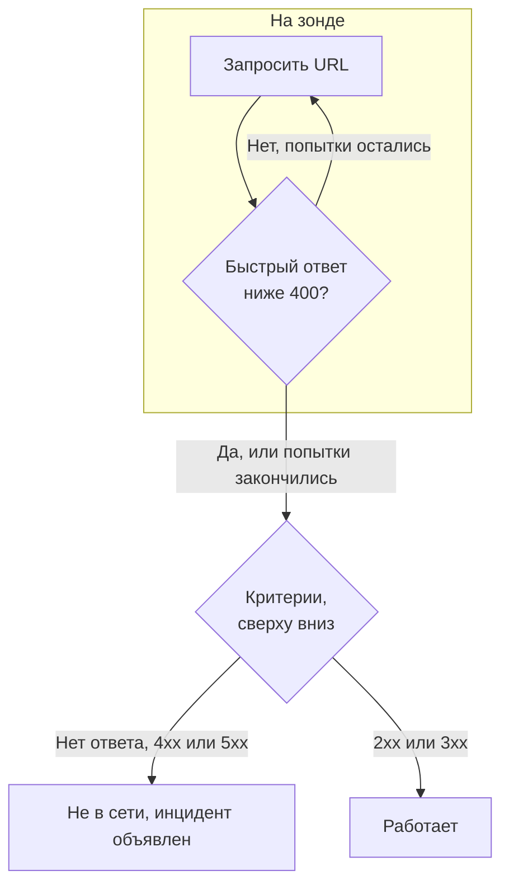

# Мониторинг веб-сайта

Монитор веб-сайта проверяет, что веб-страница отвечает. При каждой проверке зонд запрашивает URL страницы, и монитор переходит в состояние «не в сети» и объявляет инцидент, когда страница не отвечает или отвечает ошибкой. Чтобы вызвать эндпоинт с методом, заголовками или телом, используйте вместо этого [монитор API](/docs/monitor/api-monitor).

:::cards
- [Создать монитор](#создание-монитора-веб-сайта): Шесть шагов в панели управления.
- [Параметры конфигурации](#параметры-конфигурации): Плейсхолдеры в URL, перенаправления, сертификаты, тайм-ауты и повторные попытки.
- [Критерии мониторинга](#критерии-мониторинга): Что сразу считается работающим или упавшим.
- [Устранение неполадок](#устранение-неполадок): Когда монитор и ваш браузер не согласны.
:::

## Как это работает

При каждой проверке зонд запрашивает URL, следует перенаправлениям и записывает, что вернулось: код статуса, время ответа, заголовки и, когда это нужно критерию, тело. Запрос, который завершается ошибкой, превышает тайм-аут, отвечает статусом `4xx` или `5xx` или длится дольше 10 секунд, повторяется — столько раз, сколько повторных попыток вы разрешили. Затем OneUptime пропускает результат через критерии монитора.



Если ни один из критериев монитора не читает тело ответа (фильтр **Тело ответа** или **JavaScript Expression**), зонд отправляет запрос `HEAD` вместо `GET` и повторяет его как `GET`, если сервер отклоняет `HEAD`. В журналах доступа вашего сервера может появиться любой из них.

Зонд, потерявший собственное сетевое подключение, не сообщает никакого результата, поэтому не может пометить ваш сайт как не в сети.

## Перед началом

- **Роль, которая может создавать мониторы**: Project Owner, Project Admin, Project Member, Monitor Admin или Monitor Member либо пользовательская роль с разрешением Create Monitor.
- **Зонд, который может достучаться до сайта.** Зонды проекта по умолчанию выбираются для каждого нового монитора. Если перед сайтом стоит брандмауэр, разрешите [IP-адреса зондов OneUptime Cloud](/docs/configuration/ip-addresses). Сайту в частной сети нужен [пользовательский зонд](/docs/probe/custom-probe) внутри этой сети с разрешением обращаться к частным адресам: см. [Доступ к частной сети](/docs/self-hosted/private-network-access).

## Создание монитора веб-сайта

:::steps
### Начните новый монитор

Перейдите в **Мониторы** и нажмите **Создать монитор**. В **Тип монитора** выберите **Веб-сайт**.

### Назовите его

Введите **Имя**, например `Marketing site`, и нажмите **Далее**.

### Введите URL

В **URL веб-сайта** введите полный адрес страницы, включая `https://`, например `https://example.com`. Чтобы изменить перенаправления, сертификаты, тайм-аут или повторные попытки, откройте ниже **Дополнительные поля** (см. [Параметры конфигурации](#параметры-конфигурации)).

### Протестируйте его

Нажмите **Протестировать монитор**, выберите зонд в **Выберите зонд** и нажмите **Запустить тест**. **Результат теста монитора** показывает, что получил зонд.

### Проверьте критерии

**Критерии монитора** начинаются с [критериев по умолчанию](#критерии-по-умолчанию): не в сети, когда сайт не отвечает или отвечает ошибкой, в сети при любом статусе `2xx` или `3xx`. Измените их при необходимости и нажмите **Далее**.

### Выберите зонды и создайте

Оставьте или измените **Зонды** и **Интервал мониторинга** (он начинается с **Каждые 5 минут**) и нажмите **Создать монитор**. Откроется страница монитора.
:::

## Параметры конфигурации

### URL веб-сайта

Страница для проверки в виде полного URL со схемой: `https://example.com`, `https://example.com/pricing` или `http://example.com:8080/health`. В URL можно вставить [секрет монитора](/docs/monitor/monitor-secrets) как `{{monitorSecrets.NAME}}`, например токен в строке запроса.

### Динамические плейсхолдеры в URL

Когда перед сайтом стоит CDN или кэширующий прокси, зонд может получить ответ из кэша, а не от вашего сервера. Чтобы обойти кэш, добавьте в URL плейсхолдер; зонд заменяет его новым значением при каждой проверке.

| Плейсхолдер | Заменяется на | Пример значения |
| --- | --- | --- |
| `{{timestamp}}` | Текущее время Unix в секундах | `1719500000` |
| `{{random}}` | Случайную уникальную строку из 32 шестнадцатеричных символов | `3f2b8c1d9e7a4b6c8d0e1f2a3b4c5d6e` |

URL с плейсхолдером:

```text
https://example.com/health?cb={{timestamp}}
```

Что запрашивает зонд при двух проверках с интервалом в пять минут:

```text
https://example.com/health?cb=1719500000
https://example.com/health?cb=1719500300
```

`{{random}}` используется так же: `https://example.com/health?nocache={{random}}`.

### Дополнительные поля

Эти настройки свёрнуты в разделе **Дополнительные поля** под URL. Свёрнутый заголовок перечисляет их и показывает, какие вы изменили.

| Поле | По умолчанию | Что делает |
| --- | --- | --- |
| **Не следовать перенаправлениям** | Выкл. | Оценивать первый ответ, а не следовать перенаправлениям. См. [ниже](#не-следовать-перенаправлениям). |
| **Разрешить самоподписанные сертификаты** | Выкл. | Пропускать проверку TLS-сертификата для собственного имени хоста монитора. |
| **Использовать клиентский сертификат (mTLS)** | Выкл. | Предъявлять клиентский сертификат и закрытый ключ. См. [Клиентский сертификат (mTLS)](#клиентский-сертификат-mtls). |
| **Тайм-аут запроса (секунды)** | `60` | Сколько ждать каждую попытку. Максимум — 60 секунд. |
| **Повторные попытки при сбое** | Значение зонда по умолчанию, обычно `3` | Сколько раз повторять неудачную попытку. Максимум — 3. См. [Повторные попытки и тайм-ауты](#повторные-попытки-и-тайм-ауты). |

#### Не следовать перенаправлениям

По умолчанию зонд следует перенаправлениям (`301`, `302`, `303`, `307` и `308`), не более 10, и оценивает страницу, на которой оказывается. Включите **Не следовать перенаправлениям**, чтобы вместо этого оценивать сам ответ с перенаправлением, например чтобы проверить, что `http://` перенаправляет на `https://`. [Критерии по умолчанию](#критерии-по-умолчанию) считают ответ с перенаправлением работающим.

**Разрешить самоподписанные сертификаты** следует перенаправлениям, которые остаются на собственном имени хоста монитора. Перенаправление на другое имя хоста проверяется как обычно.

#### Клиентский сертификат (mTLS)

Если сайт требует взаимного TLS, включите **Использовать клиентский сертификат (mTLS)** и заполните:

| Поле | Что ввести |
| --- | --- |
| **Клиентский сертификат (PEM)** | Клиентский сертификат в кодировке PEM, который предъявляется. |
| **Закрытый ключ клиента (PEM)** | Соответствующий закрытый ключ в кодировке PEM. |
| **Парольная фраза закрытого ключа клиента** | Необязательно. Парольная фраза, только если закрытый ключ зашифрован. |

Это эквивалент флагов `--cert` и `--key` в curl:

```bash
curl --cert client.crt --key client.key https://example.com/health
```

Чтобы не хранить ключ в настройках монитора, сохраните сертификат и ключ как [секреты монитора](/docs/monitor/monitor-secrets) и введите в эти поля `{{monitorSecrets.NAME}}`. Секреты подставляются на сервере, а их значения никогда не появляются в панели управления.

Клиентский сертификат предъявляется только пока запрос остаётся в источнике URL монитора (та же схема, хост и порт). После перенаправления в другой источник зонд продолжает без него.

#### Повторные попытки и тайм-ауты

**Повторные попытки при сбое** считает повторы _после_ первой попытки, поэтому `0` выполняет проверку один раз, а `2` — до трёх раз. Если поле пустое, используется значение зонда по умолчанию: 3, если только `PROBE_MONITOR_RETRY_LIMIT` зонда не задаёт другое. Между попытками зонд ждёт одну секунду, и каждая попытка получает полный **Тайм-аут запроса (секунды)**.

Повторяются такие сбои: ошибки соединения, тайм-ауты, ответы `4xx` и `5xx` и ответы медленнее 10 секунд. Не повторяются те, которые повтор не изменит: недопустимый или заблокированный URL, более 10 перенаправлений и ответ больше 512 КиБ.

## Критерии мониторинга

Критерии определяют, когда веб-сайт считается в сети, деградировавшим или не в сети, и объявляется ли при этом инцидент или создаётся оповещение. Каждый критерий проверяет один или несколько фильтров:

| Фильтр | Условия | Что проверяет |
| --- | --- | --- |
| **Is Online** | **Истина**, **Ложь** | Ответил ли сайт вообще, независимо от кода статуса. |
| **Код статуса ответа** | **Equal To**, **Not Equal To**, **Greater Than**, **Less Than**, **Greater Than Or Equal To**, **Less Than Or Equal To** | HTTP-код статуса. |
| **Время ответа (в мс)** | **Greater Than**, **Less Than**, **Greater Than Or Equal To**, **Less Than Or Equal To** | Сколько длился запрос, включая перенаправления. |
| **Тело ответа** | **Содержит**, **Not Contains** | Текст в теле ответа. Сравнение учитывает регистр. |
| **Response Header** | **Содержит**, **Not Contains** | Есть ли в ответе заголовок с этим именем. Вводите имя в нижнем регистре, например `x-cache`. |
| **Response Header Value** | **Содержит**, **Not Contains** | Имеет ли заголовок ровно это значение, сравниваемое в нижнем регистре, например `no-store`. |
| **JavaScript Expression** | **Evaluates To True** | Выражение над ответом. См. [Выражения JavaScript](/docs/monitor/javascript-expression). |
| **Is Request Timeout** | **Истина**, **Ложь** | Превышал ли запрос тайм-аут при каждой попытке. |

**Добавить критерии** добавляет критерий, уже названный по его фильтру, например _Response Time (in ms) is above 3000_. Имя меняется вместе с фильтрами, пока вы не введёте своё. Описание необязательно: чтобы добавить его, откройте **Настройки** критерия.

При двух и более фильтрах **Условие совпадения** решает, должны ли совпасть **Все** или достаточно **Любой** из них. **Действия** критерия определяют, что он делает: меняет статус монитора, создаёт оповещение, объявляет инцидент или делает несколько из этого.

### Критерии по умолчанию

Новый монитор веб-сайта начинает с двух критериев, поэтому работает без изменений:

- **Не в сети** — веб-сайт не отвечает или отвечает кодом статуса `400` и выше (или ниже `200`). Монитор помечается как **Не в сети**, и создаётся инцидент. Инцидент разрешается сам, когда сайт возвращается.
- **В сети** — веб-сайт отвечает любым кодом статуса `2xx` или `3xx`, например `200`, `204` или `301`. Монитор помечается как **Работает**.

В списке критериев они названы по монитору: _Check if (name) is offline_ и _Check if (name) is online_.

Поэтому страница, отвечающая `204 No Content`, или перенаправление, за которым вы следите с включённым **Не следовать перенаправлениям**, считается работающей. Если для вас исправным считается только один код статуса, измените оба критерия на странице монитора **Конфигурация → Критерии**: например **Код статуса ответа** / **Equal To** / `200` в критерии «в сети» и **Not Equal To** / `200` в критерии «не в сети» вместо двух фильтров по коду статуса в каждом.

Критерии проверяются сверху вниз, и первый совпавший решает, что произойдёт.

Если ни один не совпал, монитор возвращается к статусу по умолчанию: **Работает**, если вы не выберете другой в разделе **Дополнительные поля** под критериями. Свёрнутый заголовок **Дополнительные поля** показывает, какой это статус.

Мониторы, созданные до того, как OneUptime изменил эти значения по умолчанию, сохраняют критерии, с которыми были созданы, и считают работающим только `200`. Мониторы, созданные через API или Terraform, используют критерии, которые вы передаёте.

### Оценка за период времени

**Оценивать этот критерий в течение определённого периода времени** — флажок под фильтром, доступный для **Is Online**, **Код статуса ответа** и **Время ответа (в мс)**. Включите его, чтобы оценивать окно прошлых проверок, а не только последнюю: выберите агрегацию в **Оценить** и окно от 2 до 60 минут в **За последние (в минутах)**.

| Агрегация | Совпадает, когда |
| --- | --- |
| **Среднее**, **Сумма**, **Maximum Value**, **Minimum Value** | Это значение за окно удовлетворяет условию. Только для числовых фильтров. |
| **All Values** | Каждая проверка в окне удовлетворяет условию. |
| **Any Value** | Хотя бы одна проверка в окне удовлетворяет условию. |

**All Values** совпадает только тогда, когда окно действительно покрыто данными. У только что созданного монитора или монитора, проверки которого перестали записываться, недостаточно истории, чтобы что-то сказать о последних N минутах, поэтому критерий ждёт, а не срабатывает по единственному имеющемуся значению. **Any Value** — это настройка для «сообщи мне сразу, как только хоть одна проверка превысит порог», и она по-прежнему срабатывает немедленно.

**Если нет данных** определяет, что происходит, пока окно не может подкрепить критерий:

| Вариант | Что происходит | Для чего использовать |
| --- | --- | --- |
| **Ignore** (по умолчанию) | Критерий не совпадает. | Обычные пороговые оповещения. |
| **Триггер** | Отсутствие данных считается проблемой. | Проверки, где молчание само по себе — сбой. |
| **Treat As Zero** | Окно сравнивается как один ноль. | Счётчики, где отсутствие событий действительно означает ноль. |

### Примеры критериев

| Цель | Фильтр | Условие | Значение |
| --- | --- | --- | --- |
| Помечать сайт деградировавшим, когда он медленный | **Время ответа (в мс)** | **Greater Than** | `3000` |
| Поймать страницу ошибки, отданную с `200` | **Тело ответа** | **Not Contains** | `Welcome` |
| Проверить наличие заголовка CDN | **Response Header** | **Содержит** | `x-cache` |
| Принимать как исправный только `200` | **Код статуса ответа** | **Equal To** | `200` |

## Устранение неполадок

:::details Монитор не в сети, но сайт открывается в моём браузере
Зонд получил другой ответ, чем ваш браузер. Корневая причина инцидента и **Журналы мониторинга** монитора показывают, что увидел зонд. Частые причины:

- Брандмауэр или фильтр ботов блокирует зонды. Разрешите [IP-адреса зондов OneUptime Cloud](/docs/configuration/ip-addresses).
- Сайт доступен только в вашей сети. Используйте [пользовательский зонд](/docs/probe/custom-probe) внутри неё.
- Сертификат самоподписанный или выпущен частным центром сертификации. Включите **Разрешить самоподписанные сертификаты** или отслеживайте сертификат отдельно с помощью [монитора SSL-сертификата](/docs/monitor/ssl-certificate-monitor).
:::

:::details Проверка завершается ошибкой «Remote response exceeded the allowed size.»
Зонд читает не более 512 КиБ ответа, а эта страница больше. Направьте монитор на страницу поменьше, например на эндпоинт проверки работоспособности, или уберите фильтры **Тело ответа** и **JavaScript Expression**, чтобы зонду нужны были только заголовки.
:::

:::details Проверка завершается ошибкой «Monitor target exceeded 10 redirects.»
URL перенаправляет больше 10 раз, обычно по кругу. Откройте URL с помощью `curl -IL`, чтобы увидеть цепочку, и направьте монитор на страницу, на которой цепочка должна заканчиваться.
:::

:::details Проверка завершается ошибкой с сообщением о частном сетевом адресе
URL разрешается в частный адрес, а зонду, выполнившему проверку, не разрешено обращаться к частным адресам. На собственном зонде включите это с помощью `PROBE_ALLOW_PRIVATE_NETWORK_MONITORS`: см. [Доступ к частной сети](/docs/self-hosted/private-network-access).
:::

## Дальнейшие шаги

:::cards
- [Мониторинг API](/docs/monitor/api-monitor): Вызвать эндпоинт с методом, заголовками и телом.
- [Мониторинг SSL-сертификатов](/docs/monitor/ssl-certificate-monitor): Получить предупреждение до истечения сертификата сайта.
- [Секреты мониторинга](/docs/monitor/monitor-secrets): Не хранить токены и ключи в настройках мониторов.
- [Инциденты](/docs/incidents/index): Что происходит после того, как монитор объявил инцидент.
:::
