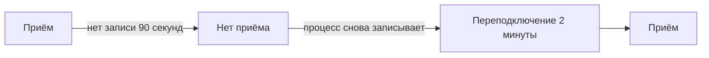

# Когда OneUptime не получает данные

Пока OneUptime перезапускается, обновляется или разбирает накопившуюся очередь, ничто из того, что отправляют ваши агенты, коллекторы, зонды и отправители heartbeat, не может дойти до ваших мониторов. OneUptime записывает, когда это происходит, и никогда не засчитывает это время против сервера, хоста или любого другого ресурса: это время не отслеживалось, поэтому это не простой.

## Как это работает

Каждый процесс OneUptime, принимающий данные, каждые 30 секунд записывает, что он получает данные, пока может достучаться до баз данных, в которых хранит данные. OneUptime не учитывает три вида времени:

- Нет приёма: ни один процесс ничего не записывал дольше 90 секунд. OneUptime был остановлен, перезапускался или обновлялся либо не мог достучаться до одной из своих баз данных.
- Переподключение: первые 2 минуты после того, как OneUptime снова получает данные, пока агенты переподключаются и отправляют то, что придержали.
- Догоняние: пока очередь данных, ожидающих обработки, отстаёт больше чем на минуту, время с момента самых старых данных, всё ещё ждущих в ней.



Перезапуск короче 90 секунд не является перерывом: коллекторы повторно отправляют то, что не смогли доставить.

## Что меняется в это время

| Где | Что делает OneUptime |
| --- | --- |
| Мониторы сервера / ВМ | **Is Online** считает только минуты, когда OneUptime получал данные: по умолчанию сервер считается офлайн после 3 минут тишины, которую OneUptime мог бы услышать. |
| Мониторы входящих запросов и входящей почты | **Recieved In Minutes** и **Not Recieved In Minutes** считают только минуты, когда OneUptime получал данные. Когда такой критерий срабатывает, его причина сообщает, сколько из этих минут не учтено. |
| Мониторы хостов, Kubernetes, Docker, метрик, логов, трассировок и другие мониторы, читающие телеметрию | Проверка, в окне которой есть время без приёма, ждёт, пока это время не покинет окно, и не дольше 15 минут после его окончания. До тех пор ничего не меняется: ни смены статуса, ни открытия или разрешения инцидента или оповещения. Пока очередь отстаёт, проверка читает до того места, где находится очередь, а не до текущего момента. |
| Хосты, кластеры и остальной инвентарь | Ресурс становится **Отключено** только после того, как его порог тишины, у большинства 15 минут, истечёт за время, когда OneUptime получал данные. |
| Зонды и агенты ИИ | Становятся **Отключено** после 3 минут тишины за время, когда OneUptime получал данные. |
| Графики **Доступность** хостов, хостов Docker и Podman и кластеров Kubernetes | Это время закрашивается как **Не отслеживается**, а линия там прерывается, вместо того чтобы падать до «недоступен». Значок uptime не учитывает это время; интервал с данными по-прежнему считается доступным. |
| Uptime на страницах состояния и SLO | Оба вычисляются из статусов мониторов: без ложной смены статуса нет ложного простоя. |

> [!NOTE]
> Не учитывать время — не значит заполнять его. Ресурс никогда не показывается доступным за время, когда OneUptime не мог его услышать: это время просто не оценивается. Как только OneUptime снова получает данные, ресурс, который действительно недоступен, с этого момента оценивается по тому, что он отправляет или не отправляет.

## Самостоятельно размещённые установки

### При запуске

Пока процесс OneUptime запускается, он отвечает на любой запрос, кроме своих проверок состояния, кодом `503 Service Unavailable` с `Retry-After: 5`, а браузер получает страницу, которая сама перезагружается. Коллекторы и SDK OpenTelemetry повторяют такой запрос, а не отбрасывают данные. `/status/ready` не проходит, пока процесс не готов, поэтому Kubernetes до этого не направляет на него трафик.

### Реплики worker

Процесс записывает, что OneUptime получает данные, только если до него может дойти входящий трафик. Если вы запускаете реплики, которые только обрабатывают очереди и перед которыми нет ingress, задайте на них `RECEIVES_INGRESS_TRAFFIC` значение `false`. Иначе они продолжают записывать, пока все реплики, принимающие трафик, не работают, и этот сбой снова засчитывается против ваших ресурсов. Helm-чарт уже задаёт это на своих worker-подах, а одному контейнеру OneUptime ничего не нужно.

```yaml title="Контейнер worker"
env:
  - name: RECEIVES_INGRESS_TRAFFIC
    value: "false"
```

### Что записывается

OneUptime начинает вести эту запись, когда вы обновляетесь до версии, в которой она есть; время до этого оценивается как всегда. Пока ни один процесс не записывает, что получает данные, время с последней записи считается перерывом не дольше часа; после этого тишина снова учитывается, так что запись, которая перестала обновляться, не может надолго скрыть сбой ваших ресурсов. Записи хранятся 400 дней, а если OneUptime не может их прочитать, он оценивает тишину так, будто всё время получал данные.

## Следующие шаги

:::cards
- [Мониторинг хостов](/docs/monitor/host-monitor): Оповещения по метрикам хоста.
- [Мониторинг сервера / ВМ](/docs/monitor/server-monitor): Узнать, когда агент сервера перестал отправлять отчёты.
- [Мониторинг входящих запросов](/docs/monitor/incoming-request-monitor): Превратить heartbeat в «выключатель мёртвого человека».
- [Обновление](/docs/installation/upgrading): Обновить самостоятельно размещённую установку.
:::
