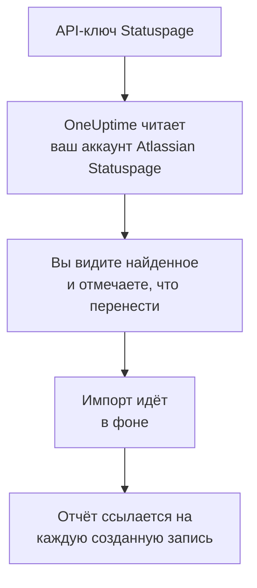

# Переход с Atlassian Statuspage

**Импорт из другого инструмента** переносит ваши страницы из Atlassian Statuspage в OneUptime за несколько минут. С API-ключом Statuspage OneUptime читает ваши страницы, их компоненты и группы и подписчиков по email, показывает, что нашёл, и создаёт то, что вы отметите. В Statuspage ничего не меняется.

:::cards
- [Импорт аккаунта](#импорт-аккаунта-atlassian-statuspage): Создайте ключ, прочитайте аккаунт и отметьте, что перенести.
- [Что переносится](#что-переносится): Во что превращается в OneUptime каждая страница, компонент и подписчик Statuspage.
- [Завершите переход](#завершите-переход): Что сделать после импорта.
:::

## Как это работает

- **Ключ используется один раз.** Пока OneUptime читает ваш аккаунт, ключ хранится в зашифрованном виде, а когда чтение заканчивается, удаляется — успешно оно прошло или нет. Он больше никогда не показывается и не пишется в журналы.
- **OneUptime только читает.** Он обращается только к API самого Atlassian Statuspage: `api.statuspage.io`. Он делает один запрос в секунду — столько, сколько Statuspage разрешает одному ключу. Если Atlassian Statuspage просит снизить темп, он ждёт и повторяет попытку.
- **Ничего не создаётся, пока вы не начнёте импорт.** Предпросмотр показывает для каждого элемента, новый ли он, есть ли он уже в OneUptime (и используется как есть), перенёс ли его предыдущий импорт или почему его нельзя перенести.
- **Повторный импорт никогда не создаёт дубликатов.** OneUptime помнит, что перенёс каждый импорт, по ID в Atlassian Statuspage. Запустите импорт снова, когда добавите страницы или компоненты в Atlassian Statuspage, и будут созданы только новые.

## Прежде чем начать

- **Проект OneUptime и право создавать то, что вы переносите.** Владельцы и администраторы проекта могут перенести всё. Другие роли тоже могут запустить импорт и перенести те типы записей, которые им разрешено создавать. Остальное показано как не перенесённое, с причиной.
- **API-ключ Statuspage.** Создать его может только владелец аккаунта. Импорт никогда ничего не записывает в Statuspage и читает каждую страницу, которую видит ключ.
- **Место для ваших страниц в OneUptime Cloud.** В вашем тарифе есть место для определённого числа страниц статуса и подписчиков. То, что не помещается, показано как не перенесённое. Компоненты становятся ручными мониторами, а они бесплатны.

## Импорт аккаунта Atlassian Statuspage

:::steps
### Создайте API-ключ в Statuspage
В Statuspage выберите свой аватар внизу слева, затем **API info**. Выберите **Create key**, назовите ключ `OneUptime import` и скопируйте его.

### Откройте страницу импорта
В OneUptime перейдите в **Настройки проекта** > **Импорт из другого инструмента** и выберите **Atlassian Statuspage**.

### Подключите Atlassian Statuspage
Вставьте ключ в поле **API-ключ Atlassian Statuspage** и выберите **Прочитать мой аккаунт Atlassian Statuspage**. Большой аккаунт читается несколько минут, и на это время можно уйти со страницы.

### Отметьте, что перенести
Предпросмотр показывает найденное, по разделу на каждый тип. Всё, что будет создано, изначально отмечено, кроме подписчиков. Под каждым элементом OneUptime пишет, что перенесётся не в точности как было. Если отмеченная страница статуса показывает монитор, который вы не отметили, это будет сказано, а кнопка **Отметить и их** отметит его. Чтобы перенести подписчиков, отметьте их и подтвердите под ними, что они согласились получать ваши обновления и что вы можете их перенести. Никому не отправляется письмо.

### Начните импорт
Выберите **Начать импорт**. Импорт идёт в фоне: можно уйти со страницы, а отчёт будет ждать вас там.
:::

Отчёт показывает, сколько записей создано и что не перенесено, и перечисляет каждый элемент со ссылкой на запись, которой он стал, — сначала ошибки. Предыдущие импорты перечислены в разделе **Предыдущие импорты** на той же странице.

## Что переносится

| В Atlassian Statuspage | В OneUptime | Как |
| --- | --- | --- |
| Components | Ручные мониторы | Каждый компонент становится ручным монитором, который показывает страница статуса. Ничто его не проверяет: вы задаёте его статус в OneUptime, как делали в Statuspage. Группа компонентов становится группой на странице. |
| Pages | Страницы статуса | Каждая страница переносится с названием и описанием, компонентами в их группах, а также доступностью и историей для компонентов, которые она выделяет. Страница, которую видят только некоторые люди, переносится как закрытая. |
| Email subscribers | Подписчики страницы статуса | Подтверждённые подписчики по email переносятся, когда вы подтвердите, что можете их перенести, и следят за теми же компонентами. Никому не отправляется письмо, а в каждом обновлении от OneUptime есть ссылка для отписки. |

Компоненты переносятся как работающие. Предпросмотр называет каждый, который сейчас в Statuspage не показан как работающий, чтобы вы задали его статус после импорта.

## Что не переносится

- **Инциденты, плановое обслуживание и их история.** Инцидент в OneUptime — живая запись, которая оповещает людей, поэтому прошлые остаются в Statuspage.
- **Подписчики по SMS, вебхуку, Slack или Microsoft Teams.** Предпросмотр их подсчитывает. Переносятся только подписчики по email.
- **Шаблоны инцидентов и системные метрики.** Добавьте в OneUptime то, что ещё нужно.
- **Собственный домен и оформление страницы статуса.** В OneUptime добавьте домен в разделе **Пользовательские домены**, а логотип — в разделе **Брендинг**.

## Ограничения

Один импорт создаёт не больше 2 000 записей: не больше 1 000 мониторов и 50 страниц статуса. Подписчики в это число не входят: один импорт переносит не больше 5 000 подписчиков. Всё, что выходит за ограничение, показано как не перенесённое. Запустите импорт снова, чтобы перенести остальное.

В OneUptime Cloud страницы статуса и подписчики, для которых в вашем тарифе нет места, показаны как не перенесённые, с тем, что для этого нужно.

Предпросмотр хранится один день. Отмечать элементы и начинать импорт может только тот, кто прочитал аккаунт. Владельцы и администраторы проекта видят ход и отчёт каждого импорта.

## Завершите переход

:::steps
### Проверьте страницы статуса
В разделе **Страницы состояния** откройте каждую страницу и сравните её со страницей в Statuspage. Каждый компонент — это ручной монитор: меняйте его статус в OneUptime, когда что-то меняется.

### Направьте адрес страницы статуса на OneUptime
В разделе **Страницы состояния** откройте страницу, добавьте свой домен в **Пользовательские домены**, затем измените его DNS-запись. После этого посетители и подписчики попадут на новую страницу.

### Отключите свою страницу в Atlassian Statuspage
Когда ваш домен будет указывать на OneUptime, закройте страницу в Statuspage, чтобы её подписчиков не оповещали дважды.
:::

## Устранение неполадок

:::details Atlassian Statuspage не принял API-ключ
Проверьте, что вы скопировали ключ целиком и что его создал владелец аккаунта в разделе **API info**. Ключ принадлежит одной организации Statuspage и читает только её страницы. Затем выберите **Повторить попытку**.
:::

:::details Подписчиков нельзя перенести
Отметьте поле под ними, которое подтверждает, что они согласились получать ваши обновления и что вы можете их перенести: **Начать импорт** ждёт этой отметки. Подписчики, которые так и не подтвердили подписку в Statuspage, остаются там.
:::

:::details Некоторые элементы нельзя отметить
У каждого указана причина: название, которое уже есть в проекте, то, что перенёс предыдущий импорт, или запись, которую вам нельзя создавать или которой нет в вашем тарифе.
:::

## Что дальше

:::cards
- [Обзор страниц статуса](/docs/status-pages/index): Что показывает страница статуса и кто может её видеть.
- [Подписчики и объявления](/docs/status-pages/subscribers): Как подписчики узнают об инцидентах.
- [Ручной мониторинг](/docs/monitor/manual-monitor): Монитор, статус которого вы задаёте сами.
:::
