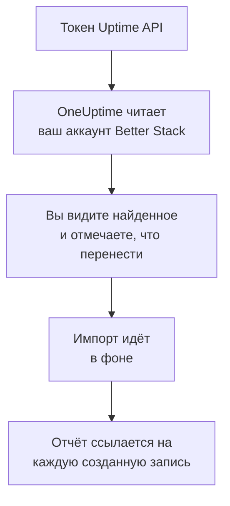

# Переход с Better Stack

**Импорт из другого инструмента** переносит ваши мониторы Uptime, heartbeat-проверки и страницы статуса из Better Stack в OneUptime за несколько минут. С токеном Uptime API от Better Stack OneUptime читает ваши мониторы, heartbeat-проверки, страницы статуса и их подписчиков по email, показывает, что нашёл, и создаёт то, что вы отметите. В Better Stack ничего не меняется.

:::cards
- [Импорт аккаунта](#импорт-аккаунта-better-stack): Создайте токен, прочитайте аккаунт и отметьте, что перенести.
- [Что переносится](#что-переносится): Во что превращается в OneUptime каждый монитор, heartbeat и страница статуса Better Stack.
- [Завершите переход](#завершите-переход): Что сделать после импорта.
:::

## Как это работает

- **Ключ используется один раз.** Пока OneUptime читает ваш аккаунт, ключ хранится в зашифрованном виде, а когда чтение заканчивается, удаляется — успешно оно прошло или нет. Он больше никогда не показывается и не пишется в журналы.
- **OneUptime только читает.** Он обращается только к API самого Better Stack: `incidents.betterstack.com`. Если Better Stack просит снизить темп, он ждёт и повторяет попытку.
- **Ничего не создаётся, пока вы не начнёте импорт.** Предпросмотр показывает для каждого элемента, новый ли он, есть ли он уже в OneUptime (и используется как есть), перенёс ли его предыдущий импорт или почему его нельзя перенести.
- **Повторный импорт никогда не создаёт дубликатов.** OneUptime помнит, что перенёс каждый импорт, по ID в Better Stack. Запустите импорт снова, когда добавите мониторы или heartbeat-проверки в Better Stack, и будут созданы только новые.

## Прежде чем начать

- **Проект OneUptime и право создавать то, что вы переносите.** Владельцы и администраторы проекта могут перенести всё. Другие роли тоже могут запустить импорт и перенести те типы записей, которые им разрешено создавать. Остальное показано как не перенесённое, с причиной.
- **Токен Uptime API от Better Stack.** Используйте командный токен Uptime: он читает мониторы, heartbeat-проверки и страницы статуса этой команды. Импорт никогда ничего не записывает в Better Stack.
- **Способ оплаты в OneUptime Cloud.** Мониторы, которые выполняют проверки, оплачиваются по использованию даже на тарифе Free, поэтому до импорта добавьте способ оплаты в разделе **Настройки проекта** > **Биллинг**. Без него такие мониторы показаны как не перенесённые.

## Импорт аккаунта Better Stack

:::steps
### Создайте API-токен в Better Stack
В Better Stack откройте **API tokens** > **Team-based tokens** и выберите свою команду. В разделе **Uptime API tokens** создайте токен с именем `OneUptime import` и скопируйте его.

### Откройте страницу импорта
В OneUptime перейдите в **Настройки проекта** > **Импорт из другого инструмента** и выберите **Better Stack**.

### Подключите Better Stack
Вставьте токен в поле **API-ключ Better Stack** и выберите **Прочитать мой аккаунт Better Stack**. Большой аккаунт читается несколько минут, и на это время можно уйти со страницы.

### Отметьте, что перенести
Предпросмотр показывает найденное, по разделу на каждый тип. Всё, что будет создано, изначально отмечено, кроме приостановленных мониторов, которые перенесутся приостановленными, если их отметить, и подписчиков. Под каждым элементом OneUptime пишет, что перенесётся не в точности как было. Если отмеченная страница статуса показывает монитор, который вы не отметили, это будет сказано, а кнопка **Отметить и их** отметит его. Чтобы перенести подписчиков, отметьте их и подтвердите под ними, что они согласились получать ваши обновления и что вы можете их перенести. Никому не отправляется письмо.

### Начните импорт
Выберите **Начать импорт**. Импорт идёт в фоне: можно уйти со страницы, а отчёт будет ждать вас там.
:::

Отчёт показывает, сколько записей создано и что не перенесено, и перечисляет каждый элемент со ссылкой на запись, которой он стал, — сначала ошибки. Предыдущие импорты перечислены в разделе **Предыдущие импорты** на той же странице.

## Что переносится

| В Better Stack | В OneUptime | Как |
| --- | --- | --- |
| Monitors and heartbeats | Мониторы | Каждый монитор становится монитором того же типа с тем же адресом, интервалом и тайм-аутом. Каждая heartbeat-проверка становится монитором входящих запросов. |
| Status pages | Страницы статуса | Каждая страница переносится с разделами в виде групп и мониторами и heartbeat-проверками, которые она показывает. Элемент, который вы ведёте вручную, становится ручным монитором. Страница с паролем или списком разрешённых IP переносится как закрытая. |
| Email subscribers | Подписчики страницы статуса | Подтверждённые подписчики по email переносятся, когда вы подтвердите, что можете их перенести, и следят за теми же ресурсами. Никому не отправляется письмо, а в каждом обновлении от OneUptime есть ссылка для отписки. |

- **Мониторы status, expected status code, keyword и keyword absence** становятся мониторами веб-сайта или, если они отправляют другой метод, заголовки или тело JSON, мониторами API. Монитор status работает при любом ответе 2xx, а монитор expected status code — при кодах из своего списка.
- **Мониторы ping и TCP** становятся мониторами ping и портов. **Мониторы SMTP, POP и IMAP** становятся мониторами своего порта: OneUptime проверяет, что порт отвечает, но не почтовый обмен.
- **Мониторы DNS** становятся мониторами DNS для имени, которое они запрашивают, у того же сервера.
- **Heartbeat-проверки** становятся мониторами входящих запросов, которые срабатывают, если за период и льготное время не пришёл ни один запрос. У каждого в OneUptime новый адрес.
- **Предупреждения об истечении SSL.** Монитор, который предупреждает об истечении сертификата, получает ещё и монитор SSL-сертификата с его именем, который предупреждает за то же число дней.

Каждый монитор проверяется зондами вашего проекта, как и созданный вручную. Интервал, которого нет в OneUptime, заменяется ближайшим доступным, а тайм-аут больше минуты — одной минутой. Предпросмотр сообщает, когда меняется одно или другое.

## Что не переносится

- **История доступности, время ответа и инциденты.** OneUptime начинает проверки, когда импорт завершён.
- **Контакты для оповещений и интеграции.** Выберите в OneUptime, кого оповещать, как описано в разделе [Завершите переход](#завершите-переход).
- **Пароли и заголовки, которые могут содержать секрет.** Монитор, который входит с паролем или отправляет заголовок `Authorization`, cookie или токен, переносится без него: добавьте его как [секрет монитора](/docs/monitor/monitor-secrets).
- **Мониторы UDP и Playwright.** В OneUptime нет монитора, который делает то же самое, и предпросмотр называет каждый из них.
- **Подписчики, которые так и не подтвердили подписку.** Они остаются в Better Stack.
- **То, что страница статуса показывает помимо мониторов, heartbeat-проверок и элементов, которые ведутся вручную.** Предпросмотр называет каждый такой элемент.
- **Собственный домен и оформление страницы статуса.** В OneUptime добавьте домен в разделе **Пользовательские домены**, а логотип — в разделе **Брендинг**.

## Ограничения

Один импорт создаёт не больше 2 000 записей: не больше 1 000 мониторов и 50 страниц статуса. Подписчики в это число не входят: один импорт переносит не больше 5 000 подписчиков. Всё, что выходит за ограничение, показано как не перенесённое. Запустите импорт снова, чтобы перенести остальное.

В OneUptime Cloud мониторам, которые выполняют проверки, нужен способ оплаты, а то, для чего в вашем тарифе нет места, показано как не перенесённое, с тем, что для этого нужно.

Предпросмотр хранится один день. Отмечать элементы и начинать импорт может только тот, кто прочитал аккаунт. Владельцы и администраторы проекта видят ход и отчёт каждого импорта.

## Завершите переход

:::steps
### Проверьте мониторы
Откройте каждый в разделе **Мониторы** и проверьте первые результаты. У heartbeat-монитора новый адрес: направьте туда задачу, которая его вызывает.

### Выберите, кого оповещать
Добавьте владельцев мониторам или политику дежурств из раздела **Дежурство** > **Политики дежурств** инцидентам, которые они открывают, чтобы нужные люди узнавали, когда что-то перестаёт работать.

### Направьте адрес страницы статуса на OneUptime
В разделе **Страницы состояния** откройте страницу, добавьте свой домен в **Пользовательские домены**, затем измените его DNS-запись. После этого посетители и подписчики попадут на новую страницу.

### Отключите проверки в Better Stack
Когда OneUptime начнёт проверять то же самое, приостановите проверки в Better Stack, чтобы никого не оповещали дважды.
:::

## Устранение неполадок

:::details Better Stack не принял API-ключ
Проверьте, что вы скопировали токен целиком и что это токен команды из **Uptime API tokens**, а не токен Telemetry. Затем выберите **Повторить попытку**.
:::

:::details Монитор показан как не перенесённый
У него указана причина: тип монитора, которого нет в OneUptime, адрес, который OneUptime не может прочитать, или проект без места или без способа оплаты для него. Монитор, который OneUptime уже выполняет с тем же названием, типом и адресом, используется как есть.
:::

:::details Некоторые элементы нельзя отметить
У каждого указана причина: название, которое уже есть в проекте, то, что перенёс предыдущий импорт, или запись, которую вам нельзя создавать или которой нет в вашем тарифе.
:::

## Что дальше

:::cards
- [Мониторинг входящих запросов](/docs/monitor/incoming-request-monitor): Как heartbeat работает в OneUptime.
- [Обзор страниц статуса](/docs/status-pages/index): Что показывает страница статуса и кто может её видеть.
- [Переход с UptimeRobot](/docs/moving-to-oneuptime/uptimerobot): Перенесите проверки из UptimeRobot.
:::
