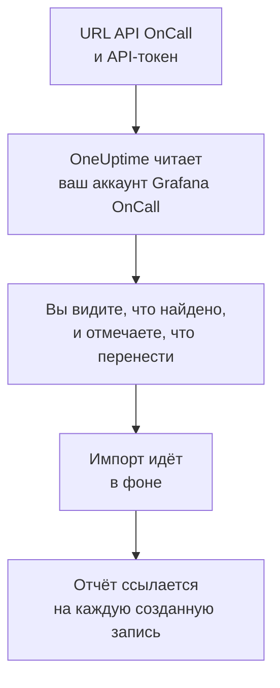

# Переход с Grafana OnCall

Grafana Labs отправила открытую версию Grafana OnCall в архив в марте 2026 года, а в Grafana Cloud она продолжает жить как часть Grafana Cloud IRM. Где бы ни работала ваша, **Импорт из другого инструмента** переносит ваши настройки дежурств в OneUptime за несколько минут. С URL API OnCall и API-токеном OneUptime читает ваших пользователей, команды, расписания и цепочки эскалации, показывает, что нашёл, и создаёт то, что вы отметите. В Grafana OnCall ничего не меняется.

:::cards
- [Импорт аккаунта](#импорт-аккаунта-grafana-oncall): Создайте токен, прочитайте аккаунт и отметьте, что перенести.
- [Что переносится](#что-переносится): Во что превращается в OneUptime каждая запись Grafana OnCall.
- [Завершите переход](#завершите-переход): Что сделать после импорта.
:::

## Как это работает

- **Токен используется один раз.** Пока OneUptime читает ваш аккаунт, токен хранится в зашифрованном виде вместе с URL API, а когда чтение заканчивается, удаляется — успешно оно прошло или нет. Он больше никогда не показывается и не пишется в журналы.
- **OneUptime только читает, и только по адресу, который вы указали.** Он обращается только к URL API OnCall, который вы вставили, не чаще раза в секунду, и так укладывается в ограничение Grafana OnCall в 300 запросов на токен за пять минут. Если Grafana OnCall просит снизить темп, он ждёт и повторяет попытку.
- **Адрес проверяется перед каждым запросом.** OneUptime никогда не обращается к машине, на которой работает, или к облачному сервису метаданных и никогда не следует перенаправлениям. В OneUptime Cloud адрес, кроме того, должен быть публичным и начинаться с `https://`. Самостоятельно размещённый OneUptime может читать и Grafana OnCall в вашей собственной сети, если его администратор это не отключил, как описано в [Private Network Access](/docs/self-hosted/private-network-access).
- **Ничего не создаётся, пока вы не начнёте импорт.** Предпросмотр показывает для каждого элемента, новый ли он, есть ли он уже в OneUptime (и используется как есть), перенёс ли его предыдущий импорт или почему его нельзя перенести.
- **Повторный импорт никогда не создаёт дубликатов.** OneUptime помнит, что перенёс каждый импорт, по ID в Grafana OnCall. Запустите импорт снова, когда добавите людей или расписания в Grafana OnCall, и будут созданы только новые.

## Прежде чем начать

- **Проект OneUptime и право создавать то, что вы переносите.** Владельцы и администраторы проекта могут перенести всё. Другие роли тоже могут запустить импорт и перенести те типы записей, которые им разрешено создавать. Остальное показано как не перенесённое, с причиной.
- **API-токен Grafana OnCall.** Используйте API-токен OnCall, а не токен сервисного аккаунта Grafana. Импорт никогда ничего не записывает в Grafana OnCall. Удалите токен, когда импорт закончится.
- **URL API OnCall.** Настройки OnCall показывают его рядом с API-токенами. В Grafana Cloud он выглядит как `https://oncall-prod-us-central-0.grafana.net/oncall`. В вашей собственной установке это адрес вашего движка OnCall.

## Импорт аккаунта Grafana OnCall

:::steps
### Создайте API-токен в Grafana OnCall
В Grafana откройте **OnCall** > **Settings**. В Grafana Cloud откройте **IRM** > **Settings** > **Admin & API**. Скопируйте показанный там URL API OnCall. В разделе **API tokens** создайте токен с именем `OneUptime import` и скопируйте его.

### Откройте страницу импорта
В OneUptime откройте **Настройки проекта** > **Импорт из другого инструмента** и выберите **Grafana OnCall**.

### Подключите Grafana OnCall
Вставьте адрес в поле **URL API Grafana OnCall**, а токен — в поле **API-ключ Grafana OnCall** и выберите **Прочитать мой аккаунт Grafana OnCall**. Большой аккаунт читается несколько минут, и на это время можно уйти со страницы.

### Отметьте, что перенести
Предпросмотр показывает найденное, по разделу на каждый тип. Всё, что будет создано, изначально отмечено, кроме людей, которые не входят ни в одну команду, расписание или цепочку эскалации. Под каждым элементом OneUptime пишет, что перенесётся не в точности как было. Если отмеченный элемент использует то, что вы не отметили, это будет сказано, а кнопка **Отметить и их** отметит недостающее.

### Начните импорт
Если будут приглашены люди, выберите в поле **Приглашать новых людей в** команду, в которую они войдут. Затем выберите **Начать импорт**. Импорт идёт в фоне: можно уйти со страницы, а отчёт будет ждать вас там.
:::

Отчёт показывает, сколько записей создано, сколько людей приглашено и что не перенесено, и перечисляет каждый элемент со ссылкой на запись, которой он стал, — сначала ошибки. Предыдущие импорты перечислены в разделе **Предыдущие импорты** на той же странице.

## Что переносится

| В Grafana OnCall | В OneUptime | Как |
| --- | --- | --- |
| Пользователи | Участники проекта | Сопоставляются по адресу электронной почты. Всех, кого ещё нет в проекте, приглашают в выбранную вами команду. |
| Команды | Команды | Создаются вместе с участниками. Команда, название которой уже есть в проекте, используется как есть, а её участники не меняются. |
| Расписания | Расписания дежурств | Каждая ротация становится слоем с теми же людьми, началом, передачей смены и часами дежурства, в часовом поясе расписания и во владении команды расписания. Ротация на более высоком слое по-прежнему перекрывает слои под ней. |
| Цепочки эскалации | Политики дежурств | Шаги, которые уведомляют людей, команду или дежурного по расписанию, становятся правилами эскалации, а шаг ожидания — ожиданием перед следующим правилом. Шаг, который повторяет цепочку, становится повторами политики. |

Ротации одного слоя, которые дежурят одновременно, и ротация, которая ставит на дежурство сразу нескольких человек, становятся каждая отдельным расписанием OneUptime, потому что в расписании OneUptime дежурит один человек за раз. Каждая политика дежурств, которая оповещала расписание, оповещает их все.

## Что не переносится

- **Группы оповещений и их история.** OneUptime начинает с ваших настроек, а не с прошлых оповещений.
- **Интеграции, маршруты и исходящие вебхуки.** Вместо этого направьте мониторы и источники оповещений в OneUptime, как описано в разделе [Завершите переход](#завершите-переход).
- **Замены, разовые смены и уже закончившиеся ротации.** Добавьте нужные замены в OneUptime после импорта.
- **Смены из ссылки на календарь.** Расписание, смены которого берутся из ссылки iCal, переносится без слоёв, поэтому добавьте их в OneUptime.
- **Правила уведомлений каждого человека.** Каждый выбирает, как его оповещать, в своих **Настройки пользователя** после того, как примет приглашение.
- **Шаги, у которых нет точного аналога в OneUptime.** Шаг, который уведомляет группу пользователей или канал Slack, вызывает вебхук, объявляет инцидент или решает оповещение, не переносится. Шаг, который уведомляет людей по одному, оповещает всех сразу, шаг, который продолжает только в определённые часы или при определённом числе оповещений, продолжает всегда, а предпросмотр говорит, что меняется.

## Ограничения

Один импорт создаёт не больше 2 000 записей: не больше 500 человек, 200 команд, 200 расписаний дежурств и 200 политик дежурств. Всё, что выходит за ограничение, показано как не перенесённое. Запустите импорт снова, чтобы перенести остальное.

В OneUptime Cloud записи, которых нет в вашем тарифе, показаны как не перенесённые, с нужным тарифом.

Предпросмотр хранится один день. Отмечать элементы и начинать импорт может только тот, кто прочитал аккаунт. Владельцы и администраторы проекта видят ход и отчёт каждого импорта.

## Завершите переход

:::steps
### Проверьте расписания дежурств
Откройте каждое расписание в разделе **Дежурство** > **Расписания дежурств** и проверьте, кто дежурит сейчас и кто следующий.

### Убедитесь, что всех можно оповестить
Приглашённые люди принимают приглашение, а затем добавляют номер телефона, адрес электронной почты или мобильное приложение для оповещений. **Дежурство** > **Готовность** показывает, до кого пока нельзя достучаться.

### Отправляйте оповещения в OneUptime
Направьте свои мониторы и инструменты, которые создают оповещения, в OneUptime и один раз оповестите себя для проверки.

### Отключите оповещения в Grafana OnCall
Когда OneUptime будет оповещать нужных людей, отключите уведомления в Grafana OnCall, чтобы никого не оповещали дважды.
:::

## Устранение неполадок

:::details Grafana OnCall не принял API-ключ
Проверьте, что вы скопировали токен целиком, что это API-токен OnCall, а не токен сервисного аккаунта Grafana, и что URL API — тот, что показан рядом с ним. Затем выберите **Повторить попытку**.
:::

:::details OneUptime не обратился к URL API
Вставьте URL API OnCall точно так, как его показывают настройки OnCall. В OneUptime Cloud он должен начинаться с `https://` и быть доступен из интернета. Самостоятельно размещённый OneUptime может обратиться и к адресу в вашей собственной сети, если его администратор это не отключил, но никогда — к адресу на машине, где работает OneUptime.
:::

:::details В предпросмотре нет какого-то типа записей
Токен не смог его прочитать, и предпросмотр пишет об этом вверху. Токен читает то, что может видеть создавший его человек, поэтому создайте его как администратор Grafana OnCall и прочитайте аккаунт снова.
:::

:::details Некоторые элементы нельзя отметить
У каждого указана причина: название, которое уже есть в проекте, то, что перенёс предыдущий импорт, или запись, которую вам нельзя создавать или которой нет в вашем тарифе.
:::

## Что дальше

:::cards
- [Расписания дежурств](/docs/on-call/schedules): Слои, ограничения и передачи смен.
- [Правила эскалации](/docs/on-call/escalation-rules): Как политики дежурств оповещают людей.
- [Переход с PagerDuty](/docs/moving-to-oneuptime/pagerduty): Перенесите команду из PagerDuty.
:::
