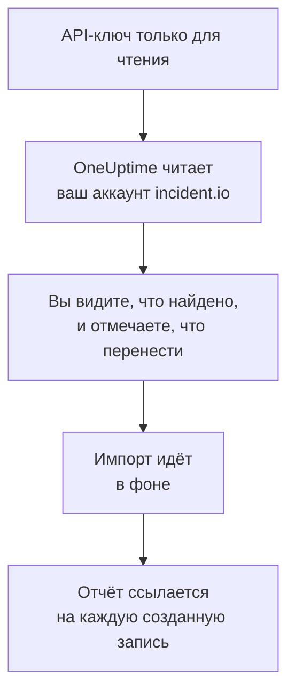

# Переход с incident.io

**Импорт из другого инструмента** за несколько минут переносит ваши настройки incident.io в OneUptime. С API-ключом incident.io только для чтения OneUptime читает ваших пользователей, команды, расписания, пути эскалации, службы и настройки инцидентов, показывает, что нашёл, и создаёт то, что вы отметите. В incident.io ничего не меняется.

:::cards
- [Импорт аккаунта](#импорт-аккаунта-incidentio): Создайте ключ, прочитайте аккаунт и отметьте, что перенести.
- [Что переносится](#что-переносится): Во что превращается в OneUptime каждая запись incident.io.
- [Завершите переход](#завершите-переход): Что сделать после импорта.
:::

## Как это работает

- **Ключ используется один раз.** Пока OneUptime читает ваш аккаунт, ключ хранится в зашифрованном виде, а когда чтение заканчивается, удаляется — успешно оно прошло или нет. Он больше никогда не показывается и не пишется в журналы.
- **OneUptime только читает.** Он обращается только к API самого incident.io, `api.incident.io`. Если incident.io просит снизить темп, он ждёт и повторяет попытку.
- **Ничего не создаётся, пока вы не начнёте импорт.** Предпросмотр показывает для каждого элемента, новый ли он, есть ли он уже в OneUptime (и используется как есть), перенёс ли его предыдущий импорт или почему его нельзя перенести.
- **Повторный импорт никогда не создаёт дубликатов.** OneUptime помнит, что перенёс каждый импорт, по ID в incident.io. Запустите импорт снова, когда добавите людей или расписания в incident.io, и будут созданы только новые.

## Прежде чем начать

- **Проект OneUptime и право создавать то, что вы переносите.** Владельцы и администраторы проекта могут перенести всё. Другие роли тоже могут запустить импорт и перенести те типы записей, которые им разрешено создавать. Остальное показано как не перенесённое, с причиной.
- **API-ключ incident.io, который может только просматривать данные.** Импорт никогда ничего не записывает в incident.io, поэтому ключу не нужны права на создание, изменение или управление.

## Импорт аккаунта incident.io

:::steps
### Создайте API-ключ в incident.io
В incident.io откройте **Settings** > **API keys** и выберите **Add new**. Назовите его `OneUptime import`, дайте ему только права на просмотр данных, без прав на создание, изменение или управление, и скопируйте ключ.

### Откройте страницу импорта
В OneUptime откройте **Настройки проекта** > **Импорт из другого инструмента** и выберите **incident.io**.

### Подключите incident.io
Вставьте ключ в поле **API-ключ incident.io** и выберите **Прочитать мой аккаунт incident.io**. Большой аккаунт читается несколько минут, и на это время можно уйти со страницы.

### Отметьте, что перенести
Предпросмотр показывает найденное, по разделу на каждый тип. Всё, что будет создано, изначально отмечено, кроме людей, которые не входят ни в одну команду, расписание или путь эскалации. Под каждым элементом OneUptime пишет, что перенесётся не в точности как было. Если отмеченный элемент использует то, что вы не отметили, это будет сказано, а кнопка **Отметить и их** отметит недостающее.

### Начните импорт
Если будут приглашены люди, выберите в поле **Приглашать новых людей в** команду, в которую они войдут. Затем выберите **Начать импорт**. Импорт идёт в фоне: можно уйти со страницы, а отчёт будет ждать вас там.
:::

Отчёт показывает, сколько записей создано, сколько людей приглашено и что не перенесено, и перечисляет каждый элемент со ссылкой на запись, которой он стал, — сначала ошибки. Предыдущие импорты перечислены в разделе **Предыдущие импорты** на той же странице.

## Что переносится

| В incident.io | В OneUptime | Как |
| --- | --- | --- |
| Пользователи | Участники проекта | Сопоставляются по адресу электронной почты. Всех, кого ещё нет в проекте, приглашают в выбранную вами команду. Деактивированные пользователи не переносятся. |
| Команды | Команды | Создаются вместе с участниками. Команда, название которой уже есть в проекте, используется как есть, а её участники не меняются. |
| Расписания | Расписания дежурств | Каждая ротация становится слоем с теми же людьми, началом, длиной смены и рабочими часами, в часовом поясе расписания. Переносится версия ротации, действующая сейчас. |
| Пути эскалации | Политики дежурств | Каждый уровень становится правилом эскалации, которое оповещает те же расписания, пользователей и команды после того же ожидания. Повтор становится повторами политики, а из ветвления переносится первый путь. |
| Службы каталога | Службы | Записи ваших типов каталога из категории служб, созданные в каталоге служб. Архивные записи пропускаются. |
| Уровни серьёзности | Серьёзности инцидентов | Создаются в порядке incident.io, начиная с самой серьёзной. Уровень серьёзности, название которого уже есть в проекте, используется как есть. |
| Статусы | Состояния инцидентов | Статус сортировки соответствует состоянию, в котором OneUptime начинает инциденты, а закрытый статус — состоянию, в котором инциденты устранены. Активные и приостановленные статусы создаются между «Подтверждён» и «Устранён». |
| Роли инцидентов | Роли инцидентов | Ведущая роль соответствует руководителю инцидента в OneUptime, а остальные роли создаются. OneUptime записывает, кто объявил каждый инцидент, поэтому роль автора сообщения не нужна. |
| Пользовательские поля | Пользовательские поля инцидента | Поля с одиночным выбором становятся раскрывающимися списками, поля с множественным выбором — раскрывающимися списками с множественным выбором, текстовые поля и поля-ссылки — текстом, а числовые поля — числами, вместе с вариантами. |

Ротация, в которой одновременно дежурят несколько человек, превращается в отдельное расписание OneUptime на каждого дежурного, потому что в расписании OneUptime дежурит один человек за раз. Каждая политика дежурств, которая оповещала это расписание, оповещает их все.

## Что не переносится

- **Инциденты, оповещения и их история.** OneUptime начинает с ваших настроек, а не с прошлых инцидентов.
- **Рабочие процессы, страницы статуса, маршруты оповещений и интеграции.** Вместо этого направьте мониторы и источники оповещений в OneUptime, как описано в разделе [Завершите переход](#завершите-переход).
- **Пользовательские поля, варианты которых берутся из каталога,** и статусы, для которых в OneUptime нет состояния: declined, merged, canceled и learning.
- **Замены в расписаниях и изменения ротации, запланированные на будущее.** Предпросмотр называет каждое запланированное изменение, чтобы вы внесли его в OneUptime, когда придёт время.
- **Шаги эскалации, у которых нет точного аналога в OneUptime.** Шаг, который публикует сообщение в канал Slack или Microsoft Teams, пропускается, потому что в OneUptime это делают правила уведомлений рабочего пространства; так же пропускается шаг, который передаёт управление другому пути эскалации. Шаг, который оповещает следующего дежурного, переносится как самое близкое, что есть в OneUptime, а предпросмотр говорит, что меняется.

## Ограничения

Один импорт создаёт не больше 2 000 записей: не больше 500 человек, 200 команд, 200 расписаний дежурств, 200 политик дежурств, 500 служб, 100 пользовательских полей инцидентов и по 25 серьёзностей, состояний и ролей инцидентов. Всё, что выходит за ограничение, показано как не перенесённое. Запустите импорт снова, чтобы перенести остальное.

В OneUptime Cloud записи, которых нет в вашем тарифе, показаны как не перенесённые, с нужным тарифом.

Предпросмотр хранится один день. Отмечать элементы и начинать импорт может только тот, кто прочитал аккаунт. Владельцы и администраторы проекта видят ход и отчёт каждого импорта.

## Завершите переход

:::steps
### Проверьте расписания дежурств
Откройте каждое расписание в разделе **Дежурство** > **Расписания дежурств** и проверьте, кто дежурит сейчас и кто следующий.

### Убедитесь, что всех можно оповестить
Приглашённые люди принимают приглашение, а затем добавляют номер телефона, адрес электронной почты или мобильное приложение для оповещений. **Дежурство** > **Готовность** показывает, до кого пока нельзя достучаться.

### Отправляйте оповещения в OneUptime
Направьте свои мониторы и инструменты, которые создают оповещения, в OneUptime и один раз оповестите себя для проверки.

### Отключите оповещения в incident.io
Когда OneUptime будет оповещать нужных людей, отключите уведомления в incident.io, чтобы никого не оповещали дважды.
:::

## Устранение неполадок

:::details incident.io не принял API-ключ
Проверьте, что вы скопировали ключ целиком и что он не удалён в **Settings** > **API keys**. Затем выберите **Повторить попытку**.
:::

:::details В предпросмотре нет какого-то типа записей
Ключ не смог его прочитать, и предпросмотр пишет об этом вверху. Дайте ключу право просматривать такие данные и прочитайте аккаунт снова.
:::

:::details Некоторые элементы нельзя отметить
У каждого указана причина: деактивированный пользователь, название, которое уже есть в проекте, то, что перенёс предыдущий импорт, или запись, которую вам нельзя создавать или которой нет в вашем тарифе.
:::

## Что дальше

:::cards
- [Расписания дежурств](/docs/on-call/schedules): Слои, ограничения и передачи смен.
- [Состояния и серьёзности инцидентов](/docs/incidents/states-and-severities): Состояния и уровни серьёзности, через которые проходят инциденты.
- [Переход с Opsgenie](/docs/moving-to-oneuptime/opsgenie): Перенесите команду из Opsgenie.
:::
