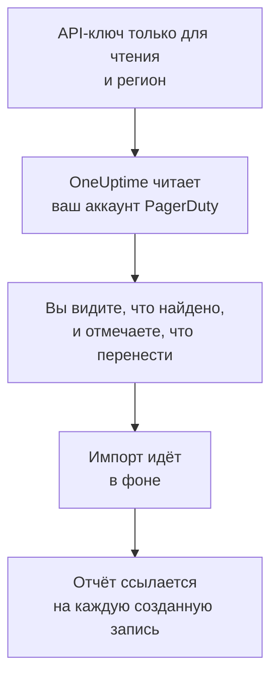

# Переход с PagerDuty

**Импорт из другого инструмента** переносит ваши настройки PagerDuty в OneUptime за несколько минут. С API-ключом PagerDuty только для чтения OneUptime читает ваших пользователей, команды, расписания, политики эскалации и службы, показывает, что нашёл, и создаёт то, что вы отметите. В PagerDuty ничего не меняется.

:::cards
- [Импорт аккаунта](#импорт-аккаунта-pagerduty): Создайте ключ, прочитайте аккаунт и отметьте, что перенести.
- [Что переносится](#что-переносится): Во что превращается в OneUptime каждая запись PagerDuty.
- [Завершите переход](#завершите-переход): Что сделать после импорта.
:::

## Как это работает

- **Ключ используется один раз.** Пока OneUptime читает ваш аккаунт, ключ хранится в зашифрованном виде, а когда чтение заканчивается, удаляется — успешно оно прошло или нет. Он больше никогда не показывается и не пишется в журналы.
- **OneUptime только читает.** Он обращается только к REST API самого PagerDuty: `api.pagerduty.com` или `api.eu.pagerduty.com` для аккаунта в Европе. Если PagerDuty просит снизить темп, он ждёт и повторяет попытку.
- **Ничего не создаётся, пока вы не начнёте импорт.** Предпросмотр показывает для каждого элемента, новый ли он, есть ли он уже в OneUptime (и используется как есть), перенёс ли его предыдущий импорт или почему его нельзя перенести.
- **Повторный импорт никогда не создаёт дубликатов.** OneUptime помнит, что перенёс каждый импорт, по ID в PagerDuty. Запустите импорт снова, когда добавите людей или расписания в PagerDuty, и будут созданы только новые.

## Прежде чем начать

- **Проект OneUptime и право создавать то, что вы переносите.** Владельцы и администраторы проекта могут перенести всё. Другие роли тоже могут запустить импорт и перенести те типы записей, которые им разрешено создавать. Остальное показано как не перенесённое, с причиной.
- **REST API-ключ PagerDuty только для чтения.** Его могут создать администраторы и владельцы аккаунта PagerDuty. Импорт никогда ничего не записывает в PagerDuty, поэтому ключу нужен только доступ на чтение.
- **Ваш регион PagerDuty.** Если адрес, на котором вы входите, заканчивается на `eu.pagerduty.com`, ваш аккаунт находится в Европе. Иначе он в США.

## Импорт аккаунта PagerDuty

:::steps
### Создайте API-ключ в PagerDuty
В PagerDuty откройте **Integrations** > **Developer Tools** > **API Access Keys** и выберите **Create New API Key**. Укажите описание `OneUptime import`, отметьте **Read-only API Key**, выберите **Create Key** и скопируйте ключ.

### Откройте страницу импорта
В OneUptime откройте **Настройки проекта** > **Импорт из другого инструмента** и выберите **PagerDuty**.

### Подключите PagerDuty
В разделе **Где находится ваш аккаунт PagerDuty?** выберите **США** или **Европа**. Вставьте ключ в поле **API-ключ PagerDuty** и выберите **Прочитать мой аккаунт PagerDuty**. Большой аккаунт читается несколько минут, и на это время можно уйти со страницы.

### Отметьте, что перенести
Предпросмотр показывает найденное, по разделу на каждый тип. Всё, что будет создано, изначально отмечено, кроме служб, выключенных в PagerDuty, и людей, которые не входят ни в одну команду, расписание или политику эскалации. Под каждым элементом OneUptime пишет, что перенесётся не в точности как было. Если отмеченный элемент использует то, что вы не отметили, это будет сказано, а кнопка **Отметить и их** отметит недостающее.

### Начните импорт
Если будут приглашены люди, выберите в поле **Приглашать новых людей в** команду, в которую они войдут. Затем выберите **Начать импорт**. Импорт идёт в фоне: можно уйти со страницы, а отчёт будет ждать вас там.
:::

Отчёт показывает, сколько записей создано, сколько людей приглашено и что не перенесено, и перечисляет каждый элемент со ссылкой на запись, которой он стал, — сначала ошибки. Предыдущие импорты перечислены в разделе **Предыдущие импорты** на той же странице.

## Что переносится

| В PagerDuty | В OneUptime | Как |
| --- | --- | --- |
| Пользователи | Участники проекта | Сопоставляются по адресу электронной почты. Всех, кого ещё нет в проекте, приглашают в выбранную вами команду. |
| Команды | Команды | Создаются вместе с участниками. Команда, название которой уже есть в проекте, используется как есть, а её участники не меняются. |
| Расписания | Расписания дежурств | Каждый слой становится слоем с теми же людьми, началом, длиной смены и ограничениями, в часовом поясе расписания и во владении команды расписания. Слои сохраняют свой порядок, поэтому верхний слой по-прежнему перекрывает слои под ним. |
| Политики эскалации | Политики дежурств | Каждое правило эскалации становится правилом эскалации, которое оповещает те же расписания и тех же пользователей и эскалирует после той же задержки. Повторы политики становятся повторами политики дежурств. |
| Службы | Службы | Создаются в каталоге служб и принадлежат своей команде. Служба, выключенная в PagerDuty, изначально не отмечена. |

Расписание PagerDuty остаётся одним расписанием OneUptime: его слои перекрывают друг друга так же, как в PagerDuty. Слой, смены которого длятся не целое число часов, переносится со сменами, округлёнными до часа, и предпросмотр об этом говорит.

## Что не переносится

- **Инциденты, оповещения и их история.** OneUptime начинает с ваших настроек, а не с прошлых инцидентов.
- **Интеграции, Event Orchestrations, Incident Workflows и страницы статуса.** Вместо этого направьте мониторы и источники оповещений в OneUptime, как описано в разделе [Завершите переход](#завершите-переход).
- **Замены в расписаниях и уже закончившиеся слои.** Добавьте нужные замены в OneUptime после импорта.
- **Расписания на основе смен.** Импорт читает расписания PagerDuty со слоями, а не его более новые расписания на основе смен (shift-based schedules). Если такие расписания есть в вашем аккаунте, предпросмотр пишет об этом вверху, а правило эскалации, которое оповещает одно из них, переносится без него. Создайте их в OneUptime.
- **Правила уведомлений каждого человека.** Каждый выбирает, как его оповещать, в своих **Настройки пользователя** после того, как примет приглашение.
- **Правила, у которых нет точного аналога в OneUptime.** Правило эскалации, которое назначает своих людей по очереди (round robin), в OneUptime оповещает всех сразу, а предпросмотр говорит, что меняется.

## Ограничения

Один импорт создаёт не больше 2 000 записей: не больше 500 человек, 200 команд, 200 расписаний дежурств, 200 политик дежурств и 500 служб. Всё, что выходит за ограничение, показано как не перенесённое. Запустите импорт снова, чтобы перенести остальное.

В OneUptime Cloud записи, которых нет в вашем тарифе, показаны как не перенесённые, с нужным тарифом.

Предпросмотр хранится один день. Отмечать элементы и начинать импорт может только тот, кто прочитал аккаунт. Владельцы и администраторы проекта видят ход и отчёт каждого импорта.

## Завершите переход

:::steps
### Проверьте расписания дежурств
Откройте каждое расписание в разделе **Дежурство** > **Расписания дежурств** и проверьте, кто дежурит сейчас и кто следующий.

### Убедитесь, что всех можно оповестить
Приглашённые люди принимают приглашение, а затем добавляют номер телефона, адрес электронной почты или мобильное приложение для оповещений. **Дежурство** > **Готовность** показывает, до кого пока нельзя достучаться.

### Отправляйте оповещения в OneUptime
Направьте свои мониторы и инструменты, которые создают оповещения, в OneUptime и один раз оповестите себя для проверки.

### Отключите оповещения в PagerDuty
Когда OneUptime будет оповещать нужных людей, отключите уведомления в PagerDuty, чтобы никого не оповещали дважды.
:::

## Устранение неполадок

:::details PagerDuty не принял API-ключ
Проверьте, что вы скопировали ключ целиком, что это REST API-ключ из **API Access Keys**, а не ключ интеграции, и что вы выбрали регион своего аккаунта. Затем выберите **Повторить попытку**.
:::

:::details В предпросмотре нет какого-то типа записей
Ключ не смог его прочитать, и предпросмотр пишет об этом вверху. Некоторые типы есть только в тарифах PagerDuty, которые их включают, например команды. Прочитайте аккаунт снова с ключом, который может их читать.
:::

:::details Некоторые элементы нельзя отметить
У каждого указана причина: название, которое уже есть в проекте, то, что перенёс предыдущий импорт, или запись, которую вам нельзя создавать или которой нет в вашем тарифе.
:::

## Что дальше

:::cards
- [Расписания дежурств](/docs/on-call/schedules): Слои, ограничения и передачи смен.
- [Правила эскалации](/docs/on-call/escalation-rules): Как политики дежурств оповещают людей.
- [Переход с Opsgenie](/docs/moving-to-oneuptime/opsgenie): Перенесите команду из Opsgenie.
:::
