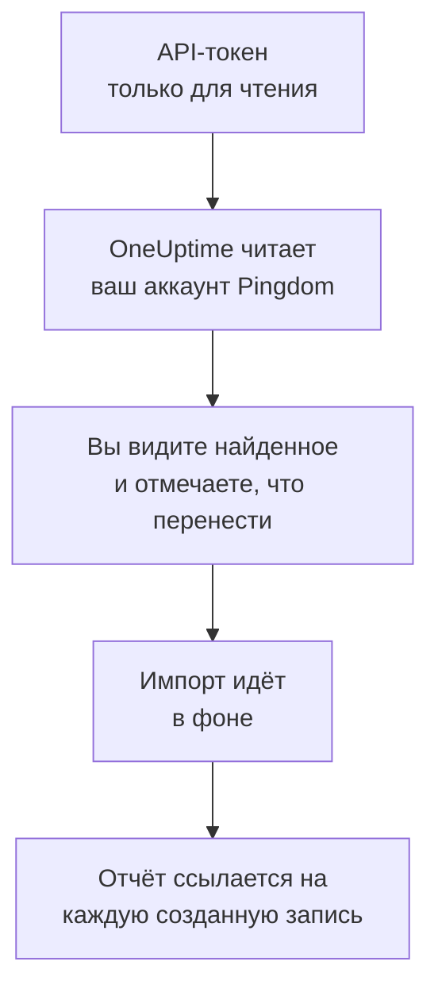

# Переход с Pingdom

**Импорт из другого инструмента** переносит ваши проверки доступности из Pingdom в OneUptime за несколько минут. С API-токеном Pingdom только для чтения OneUptime читает ваши проверки, показывает, что нашёл, и создаёт то, что вы отметите. В Pingdom ничего не меняется.

:::cards
- [Импорт аккаунта](#импорт-аккаунта-pingdom): Создайте токен, прочитайте аккаунт и отметьте, что перенести.
- [Что переносится](#что-переносится): Каким монитором OneUptime становится каждая проверка Pingdom.
- [Завершите переход](#завершите-переход): Что сделать после импорта.
:::

## Как это работает

- **Ключ используется один раз.** Пока OneUptime читает ваш аккаунт, ключ хранится в зашифрованном виде, а когда чтение заканчивается, удаляется — успешно оно прошло или нет. Он больше никогда не показывается и не пишется в журналы.
- **OneUptime только читает.** Он обращается только к API самого Pingdom: `api.pingdom.com`. Pingdom засчитывает каждый запрос в лимит токена, поэтому OneUptime читает настройки проверки, только если они у неё есть, по одному запросу за раз. Если Pingdom просит снизить темп, он ждёт и повторяет попытку.
- **Ничего не создаётся, пока вы не начнёте импорт.** Предпросмотр показывает для каждого элемента, новый ли он, есть ли он уже в OneUptime (и используется как есть), перенёс ли его предыдущий импорт или почему его нельзя перенести.
- **Повторный импорт никогда не создаёт дубликатов.** OneUptime помнит, что перенёс каждый импорт, по ID в Pingdom. Запустите импорт снова, когда добавите проверки в Pingdom, и будут созданы только новые.

## Прежде чем начать

- **Проект OneUptime и право создавать то, что вы переносите.** Владельцы и администраторы проекта могут перенести всё. Другие роли тоже могут запустить импорт и перенести те типы записей, которые им разрешено создавать. Остальное показано как не перенесённое, с причиной.
- **API-токен Pingdom с Read access.** Импорт никогда ничего не записывает в Pingdom.
- **Способ оплаты в OneUptime Cloud.** Мониторы, которые выполняют проверки, оплачиваются по использованию даже на тарифе Free, поэтому до импорта добавьте способ оплаты в разделе **Настройки проекта** > **Биллинг**. Без него такие мониторы показаны как не перенесённые.

## Импорт аккаунта Pingdom

:::steps
### Создайте API-токен в Pingdom
В My Pingdom откройте **Settings** > **Pingdom API** и выберите **Add API token**. Назовите его `OneUptime import`, выберите **Read access** и скопируйте токен.

### Откройте страницу импорта
В OneUptime перейдите в **Настройки проекта** > **Импорт из другого инструмента** и выберите **Pingdom**.

### Подключите Pingdom
Вставьте токен в поле **API-ключ Pingdom** и выберите **Прочитать мой аккаунт Pingdom**. Большой аккаунт читается несколько минут, и на это время можно уйти со страницы.

### Отметьте, что перенести
Предпросмотр показывает найденное, по разделу на каждый тип. Всё, что будет создано, изначально отмечено, кроме проверок, приостановленных в Pingdom: если их отметить, они перенесутся приостановленными. Под каждым элементом OneUptime пишет, что перенесётся не в точности как было.

### Начните импорт
Выберите **Начать импорт**. Импорт идёт в фоне: можно уйти со страницы, а отчёт будет ждать вас там.
:::

Отчёт показывает, сколько записей создано и что не перенесено, и перечисляет каждый элемент со ссылкой на запись, которой он стал, — сначала ошибки. Предыдущие импорты перечислены в разделе **Предыдущие импорты** на той же странице.

## Что переносится

| В Pingdom | В OneUptime | Как |
| --- | --- | --- |
| Uptime checks | Мониторы | Каждая проверка становится монитором того же типа с тем же адресом, интервалом и текстом, который страница должна или не должна содержать. |

- **Проверки HTTP** становятся мониторами веб-сайта или, если они отправляют данные или заголовки, мониторами API.
- **Проверки ping и TCP** становятся мониторами ping и портов. **Проверки SMTP, POP3 и IMAP** становятся мониторами своего порта: OneUptime проверяет, что порт отвечает, но не почтовый обмен.
- **Проверки DNS** становятся мониторами DNS, которые обращаются к тому же серверу имён.
- **Проверки сертификата.** Проверка HTTP, которая считает истекающий сертификат сбоем, получает ещё и монитор SSL-сертификата с её именем, который предупреждает за то же число дней.

Каждый монитор проверяется зондами вашего проекта, как и созданный вручную. Интервал, которого нет в OneUptime, заменяется ближайшим доступным, а тайм-аут больше минуты — одной минутой. Предпросмотр сообщает, когда меняется одно или другое.

## Что не переносится

- **История доступности, время ответа и инциденты.** OneUptime начинает проверки, когда импорт завершён.
- **Контакты для оповещений и интеграции.** Выберите в OneUptime, кого оповещать, как описано в разделе [Завершите переход](#завершите-переход).
- **Пароли и заголовки, которые могут содержать секрет.** Монитор, который входит с паролем или отправляет заголовок `Authorization`, cookie или токен, переносится без него: добавьте его как [секрет монитора](/docs/monitor/monitor-secrets).
- **Проверки UDP, пользовательского HTTP и транзакций.** В OneUptime нет монитора, который делает то же самое, и предпросмотр называет каждую из них. [Синтетический монитор](/docs/monitor/synthetic-monitor) может пройти по странице так же, как проверка транзакции.
- **Адрес, который ожидает проверка DNS.** Добавьте его как критерий в OneUptime.
- **Окна обслуживания.** Предпросмотр их подсчитывает: запланируйте их как плановое обслуживание в OneUptime.

## Ограничения

Один импорт создаёт не больше 2 000 записей и не больше 1 000 мониторов. Всё, что выходит за ограничение, показано как не перенесённое. Запустите импорт снова, чтобы перенести остальное.

В OneUptime Cloud мониторам, которые выполняют проверки, нужен способ оплаты, а то, для чего в вашем тарифе нет места, показано как не перенесённое, с тем, что для этого нужно.

Предпросмотр хранится один день. Отмечать элементы и начинать импорт может только тот, кто прочитал аккаунт. Владельцы и администраторы проекта видят ход и отчёт каждого импорта.

## Завершите переход

:::steps
### Проверьте мониторы
Откройте каждый в разделе **Мониторы** и проверьте первые результаты. У heartbeat-монитора новый адрес: направьте туда задачу, которая его вызывает.

### Выберите, кого оповещать
Добавьте владельцев мониторам или политику дежурств из раздела **Дежурство** > **Политики дежурств** инцидентам, которые они открывают, чтобы нужные люди узнавали, когда что-то перестаёт работать.

### Отключите проверки в Pingdom
Когда OneUptime начнёт проверять то же самое, приостановите проверки в Pingdom, чтобы никого не оповещали дважды.
:::

## Устранение неполадок

:::details Pingdom не принял API-ключ
Проверьте, что вы скопировали токен целиком и что это токен API 3.1 из **Pingdom API** с **Read access**. Затем выберите **Повторить попытку**.
:::

:::details Монитор показан как не перенесённый
У него указана причина: тип монитора, которого нет в OneUptime, адрес, который OneUptime не может прочитать, или проект без места или без способа оплаты для него. Монитор, который OneUptime уже выполняет с тем же названием, типом и адресом, используется как есть.
:::

:::details Некоторые элементы нельзя отметить
У каждого указана причина: название, которое уже есть в проекте, то, что перенёс предыдущий импорт, или запись, которую вам нельзя создавать или которой нет в вашем тарифе.
:::

## Что дальше

:::cards
- [Мониторинг веб-сайта](/docs/monitor/website-monitor): Что проверяет монитор веб-сайта и как.
- [Мониторинг портов](/docs/monitor/port-monitor): Что проверяет монитор порта и как.
- [Переход с StatusCake](/docs/moving-to-oneuptime/statuscake): Перенесите проверки из StatusCake.
:::
