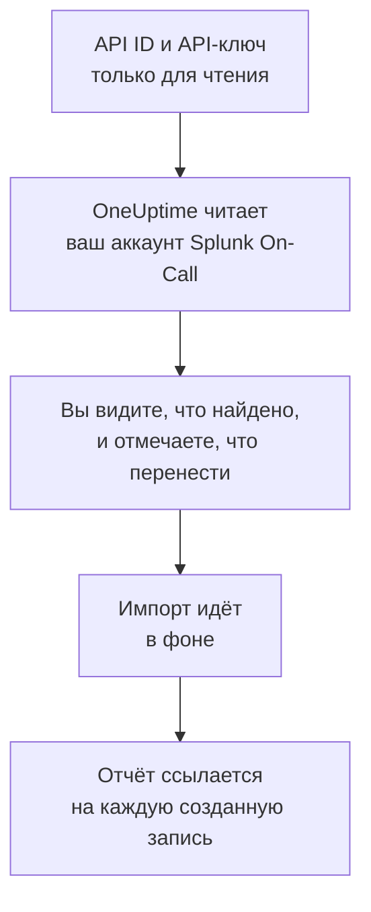

# Переход с Splunk On-Call

**Импорт из другого инструмента** переносит ваши настройки Splunk On-Call (раньше VictorOps) в OneUptime за несколько минут. С вашим API ID и API-ключом только для чтения OneUptime читает ваших пользователей, команды, ротации и политики эскалации, показывает, что нашёл, и создаёт то, что вы отметите. В Splunk On-Call ничего не меняется.

:::cards
- [Импорт аккаунта](#импорт-аккаунта-splunk-on-call): Создайте ключ, прочитайте аккаунт и отметьте, что перенести.
- [Что переносится](#что-переносится): Во что превращается в OneUptime каждая запись Splunk On-Call.
- [Завершите переход](#завершите-переход): Что сделать после импорта.
:::

## Как это работает

- **Ключ используется один раз.** Пока OneUptime читает ваш аккаунт, ключ хранится в зашифрованном виде вместе с API ID, а когда чтение заканчивается, удаляется — успешно оно прошло или нет. Он больше никогда не показывается и не пишется в журналы.
- **OneUptime только читает.** Он обращается только к API самого Splunk On-Call, `api.victorops.com`. Splunk On-Call отвечает на запросы каждого вида не чаще двух раз в секунду, поэтому OneUptime держит этот темп, а если Splunk On-Call просит снизить его, ждёт и повторяет попытку.
- **Ничего не создаётся, пока вы не начнёте импорт.** Предпросмотр показывает для каждого элемента, новый ли он, есть ли он уже в OneUptime (и используется как есть), перенёс ли его предыдущий импорт или почему его нельзя перенести.
- **Повторный импорт никогда не создаёт дубликатов.** OneUptime помнит, что перенёс каждый импорт, по ID в Splunk On-Call. Запустите импорт снова, когда добавите людей или ротации в Splunk On-Call, и будут созданы только новые.

## Прежде чем начать

- **Проект OneUptime и право создавать то, что вы переносите.** Владельцы и администраторы проекта могут перенести всё. Другие роли тоже могут запустить импорт и перенести те типы записей, которые им разрешено создавать. Остальное показано как не перенесённое, с причиной.
- **Ваш API ID Splunk On-Call и API-ключ только для чтения.** Оба находятся в Splunk On-Call в разделе **Integrations** > **API**. Импорт никогда ничего не записывает в Splunk On-Call, поэтому достаточно ключа только для чтения.

## Импорт аккаунта Splunk On-Call

:::steps
### Создайте API-ключ в Splunk On-Call
В Splunk On-Call откройте **Integrations** > **API**. Ваш API ID показан над вашими API-ключами. Создайте новый API-ключ с именем `OneUptime import`, отметьте **Read-only** и скопируйте API ID и ключ.

### Откройте страницу импорта
В OneUptime откройте **Настройки проекта** > **Импорт из другого инструмента** и выберите **Splunk On-Call**.

### Подключите Splunk On-Call
Вставьте API ID в поле **API ID Splunk On-Call**, а ключ — в поле **API-ключ Splunk On-Call** и выберите **Прочитать мой аккаунт Splunk On-Call**. Большой аккаунт читается несколько минут, и на это время можно уйти со страницы.

### Отметьте, что перенести
Предпросмотр показывает найденное, по разделу на каждый тип. Всё, что будет создано, изначально отмечено, кроме людей, которые не входят ни в одну команду, ротацию или политику эскалации. Под каждым элементом OneUptime пишет, что перенесётся не в точности как было. Если отмеченный элемент использует то, что вы не отметили, это будет сказано, а кнопка **Отметить и их** отметит недостающее.

### Начните импорт
Если будут приглашены люди, выберите в поле **Приглашать новых людей в** команду, в которую они войдут. Затем выберите **Начать импорт**. Импорт идёт в фоне: можно уйти со страницы, а отчёт будет ждать вас там.
:::

Отчёт показывает, сколько записей создано, сколько людей приглашено и что не перенесено, и перечисляет каждый элемент со ссылкой на запись, которой он стал, — сначала ошибки. Предыдущие импорты перечислены в разделе **Предыдущие импорты** на той же странице.

## Что переносится

| В Splunk On-Call | В OneUptime | Как |
| --- | --- | --- |
| Пользователи | Участники проекта | Сопоставляются по адресу электронной почты. Всех, кого ещё нет в проекте, приглашают в выбранную вами команду. |
| Команды | Команды | Создаются вместе с участниками. Команда, название которой уже есть в проекте, используется как есть, а её участники не меняются. |
| Ротации | Расписания дежурств | Каждая ротация становится расписанием во владении своей команды, а каждая её смена — слоем с теми же людьми, началом, передачей смены и теми же днями и часами дежурства. Кто дежурит в Splunk On-Call сейчас, тот дежурит и в OneUptime. |
| Политики эскалации | Политики дежурств | Принадлежат команде политики. Каждый шаг становится правилом эскалации, которое оповещает те же ротации и тех же пользователей. Тайм-аут шага становится ожиданием перед ним, а шаги без тайм-аута между ними оповещают вместе. |

Смены одной ротации, которые дежурят одновременно, становятся каждая отдельным расписанием OneUptime, потому что в расписании OneUptime дежурит один человек за раз. Каждая политика дежурств, которая оповещала ротацию, оповещает их все. Расписание сохраняет часовой пояс первой смены ротации, а у смены в другом часовом поясе часы пересчитываются в него.

## Что не переносится

- **Инциденты, оповещения и их история.** OneUptime начинает с ваших настроек, а не с прошлых инцидентов.
- **Интеграции, routing keys и alert rules.** Вместо этого направьте мониторы и источники оповещений в OneUptime, как описано в разделе [Завершите переход](#завершите-переход).
- **Запланированные замены.** Добавьте нужные замены в OneUptime после импорта.
- **Личная политика оповещений каждого человека.** Каждый выбирает, как его оповещать, в своих **Настройки пользователя** после того, как примет приглашение.
- **Шаги, у которых нет точного аналога в OneUptime.** Шаг, который вызывает вебхук или передаёт оповещение другой политике эскалации, не переносится, как и шаг, который отправляет письмо на адрес, не принадлежащий никому из переносимых людей. Шаг, который оповещает следующего или предыдущего дежурного, оповещает того, кто дежурит сейчас, а предпросмотр говорит, что меняется.

## Ограничения

Один импорт создаёт не больше 2 000 записей: не больше 500 человек, 200 команд, 200 расписаний дежурств и 200 политик дежурств. Всё, что выходит за ограничение, показано как не перенесённое. Запустите импорт снова, чтобы перенести остальное.

В OneUptime Cloud записи, которых нет в вашем тарифе, показаны как не перенесённые, с нужным тарифом.

Предпросмотр хранится один день. Отмечать элементы и начинать импорт может только тот, кто прочитал аккаунт. Владельцы и администраторы проекта видят ход и отчёт каждого импорта.

## Завершите переход

:::steps
### Проверьте расписания дежурств
Откройте каждое расписание в разделе **Дежурство** > **Расписания дежурств** и проверьте, кто дежурит сейчас и кто следующий.

### Убедитесь, что всех можно оповестить
Приглашённые люди принимают приглашение, а затем добавляют номер телефона, адрес электронной почты или мобильное приложение для оповещений. **Дежурство** > **Готовность** показывает, до кого пока нельзя достучаться.

### Отправляйте оповещения в OneUptime
Направьте свои мониторы и инструменты, которые создают оповещения, в OneUptime и один раз оповестите себя для проверки.

### Отключите оповещения в Splunk On-Call
Когда OneUptime будет оповещать нужных людей, отключите уведомления в Splunk On-Call, чтобы никого не оповещали дважды.
:::

## Устранение неполадок

:::details Splunk On-Call не принял API ID и API-ключ
Проверьте, что вы скопировали API ID и ключ целиком из **Integrations** > **API** и что ключ там не удалён. Затем выберите **Повторить попытку**.
:::

:::details В предпросмотре нет какого-то типа записей
Ключ не смог его прочитать, и предпросмотр пишет об этом вверху. Проверьте ключ в разделе **Integrations** > **API** и прочитайте аккаунт снова.
:::

:::details Некоторые элементы нельзя отметить
У каждого указана причина: название, которое уже есть в проекте, то, что перенёс предыдущий импорт, или запись, которую вам нельзя создавать или которой нет в вашем тарифе.
:::

## Что дальше

:::cards
- [Расписания дежурств](/docs/on-call/schedules): Слои, ограничения и передачи смен.
- [Правила эскалации](/docs/on-call/escalation-rules): Как политики дежурств оповещают людей.
- [Переход с PagerDuty](/docs/moving-to-oneuptime/pagerduty): Перенесите команду из PagerDuty.
:::
