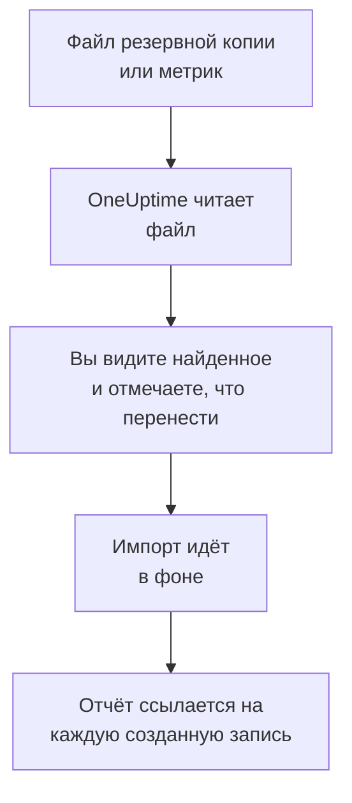

# Переход с Uptime Kuma

Uptime Kuma работает на ваших собственных машинах, поэтому **Импорт из другого инструмента** читает его из файла, а не по ключу: из резервной копии, которую экспортирует Uptime Kuma 1, или из страницы метрик, которую отдаёт любая версия. OneUptime читает из него ваши мониторы, показывает, что нашёл, и создаёт то, что вы отметите. В Uptime Kuma ничего не меняется.

:::cards
- [Импорт мониторов](#импорт-мониторов-uptime-kuma): Сохраните файл, прочитайте его и отметьте, что перенести.
- [Что переносится](#что-переносится): Во что превращается в OneUptime каждый монитор Uptime Kuma.
- [Завершите переход](#завершите-переход): Что сделать после импорта.
:::

## Как это работает

- **Файл читается один раз.** OneUptime читает его при загрузке, чтобы найти ваши мониторы, и никогда не сохраняет. Пароли, токены и push-ключи из него никогда не копируются.
- **OneUptime никогда не подключается к Uptime Kuma.** Всё берётся из файла. Файл, который не является ни резервной копией, ни страницей метрик Uptime Kuma, отклоняется с указанием причины.
- **Ничего не создаётся, пока вы не начнёте импорт.** Предпросмотр показывает для каждого элемента, новый ли он, есть ли он уже в OneUptime (и используется как есть), перенёс ли его предыдущий импорт или почему его нельзя перенести.
- **Повторный импорт никогда не создаёт дубликатов.** OneUptime помнит, что перенёс каждый импорт, по ID в Uptime Kuma. Прочитайте более новый файл, когда добавите мониторы, и будут созданы только новые.

## Прежде чем начать

- **Проект OneUptime и право создавать то, что вы переносите.** Владельцы и администраторы проекта могут перенести всё. Другие роли тоже могут запустить импорт и перенести те типы записей, которые им разрешено создавать. Остальное показано как не перенесённое, с причиной.
- **Файл из Uptime Kuma.** В Uptime Kuma 1 резервная копия JSON содержит каждый монитор с его настройками. В Uptime Kuma 2 резервной копии нет, поэтому сохраните страницу метрик: на ней есть название, тип и адрес каждого монитора, но нет того, как часто он проверяется и что ищет.
- **Способ оплаты в OneUptime Cloud.** Мониторы, которые выполняют проверки, оплачиваются по использованию даже на тарифе Free, поэтому до импорта добавьте способ оплаты в разделе **Настройки проекта** > **Биллинг**. Без него такие мониторы показаны как не перенесённые.

## Импорт мониторов Uptime Kuma

:::steps
### Сохраните файл в Uptime Kuma
В Uptime Kuma 1 откройте **Settings** > **Backup** и выберите **Export**. В Uptime Kuma 2 добавьте ключ в **Settings** > **API Keys**, откройте `/metrics` на своём Uptime Kuma, войдите без имени пользователя, указав ключ как пароль, и сохраните страницу как текстовый файл.

### Откройте страницу импорта
В OneUptime перейдите в **Настройки проекта** > **Импорт из другого инструмента** и выберите **Uptime Kuma**.

### Прочитайте файл
В поле **Файл резервной копии или метрик Uptime Kuma** выберите **Выбрать файл**, укажите сохранённый файл и выберите **Прочитать файл**. OneUptime сразу прочитает его и покажет, что нашёл.

### Отметьте, что перенести
Предпросмотр показывает найденное, по разделу на каждый тип. Всё, что будет создано, изначально отмечено, кроме мониторов, приостановленных в Uptime Kuma: если их отметить, они перенесутся приостановленными. Под каждым элементом OneUptime пишет, что перенесётся не в точности как было.

### Начните импорт
Выберите **Начать импорт**. Импорт идёт в фоне: можно уйти со страницы, а отчёт будет ждать вас там.
:::

Отчёт показывает, сколько записей создано и что не перенесено, и перечисляет каждый элемент со ссылкой на запись, которой он стал, — сначала ошибки. Предыдущие импорты перечислены в разделе **Предыдущие импорты** на той же странице.

## Что переносится

| В Uptime Kuma | В OneUptime | Как |
| --- | --- | --- |
| Monitors | Мониторы | Из резервной копии каждый монитор становится монитором того же типа с тем же адресом, интервалом, тайм-аутом и кодами состояния, которые считаются работоспособными. Со страницы метрик каждый переносится с проверкой раз в пять минут: проверьте каждый после импорта. |

- **Мониторы HTTP(S) и ключевых слов** становятся мониторами веб-сайта или, если они отправляют другой метод, заголовки или тело JSON, мониторами API, с ключевым словом там, где нужно.
- **Мониторы JSON-запросов** становятся мониторами API без запроса: добавьте его как критерий в OneUptime.
- **Мониторы ping, портов и DNS** становятся мониторами ping, портов и DNS.
- **Push-мониторы** становятся мониторами входящих запросов, которые срабатывают, если за интервал и повторные попытки не пришёл ни один запрос. У каждого в OneUptime новый адрес.
- **Ручные мониторы** остаются ручными мониторами. **Группы** — это папки, поэтому их мониторы переносятся по отдельности.
- **Истечение сертификатов.** Монитор, который предупреждает об истечении сертификата, получает ещё и монитор SSL-сертификата с его именем.

Каждый монитор проверяется зондами вашего проекта, как и созданный вручную. Интервал, которого нет в OneUptime, заменяется ближайшим доступным, а тайм-аут больше минуты — одной минутой. Предпросмотр сообщает, когда меняется одно или другое.

## Что не переносится

- **История доступности, время ответа и инциденты.** OneUptime начинает проверки, когда импорт завершён.
- **Уведомления.** Выберите в OneUptime, кого оповещать, как описано в разделе [Завершите переход](#завершите-переход).
- **Пароли и заголовки, которые могут содержать секрет.** Монитор, который входит с паролем или отправляет заголовок `Authorization`, cookie или токен, переносится без него: добавьте его как [секрет монитора](/docs/monitor/monitor-secrets).
- **Инвертированные мониторы**, которые считаются работающими, когда их проверка не проходит. В OneUptime нет монитора, который так делает.
- **Мониторы Docker, баз данных, игровых серверов, MQTT и другие, у которых нет аналога в OneUptime.** Предпросмотр называет каждый из них.
- **Страницы статуса и обслуживание.** Создайте в OneUptime нужные страницы статуса и покажите на них импортированные мониторы.

## Ограничения

Один импорт создаёт не больше 2 000 записей и не больше 1 000 мониторов. Файл может быть не больше 10 МБ. Всё, что выходит за ограничение, показано как не перенесённое. Запустите импорт снова, чтобы перенести остальное.

В OneUptime Cloud мониторам, которые выполняют проверки, нужен способ оплаты, а то, для чего в вашем тарифе нет места, показано как не перенесённое, с тем, что для этого нужно.

Предпросмотр хранится один день. Отмечать элементы и начинать импорт может только тот, кто прочитал файл. Владельцы и администраторы проекта видят ход и отчёт каждого импорта.

## Завершите переход

:::steps
### Проверьте мониторы
Откройте каждый в разделе **Мониторы** и проверьте первые результаты. У heartbeat-монитора новый адрес: направьте туда задачу, которая его вызывает.

### Выберите, кого оповещать
Добавьте владельцев мониторам или политику дежурств из раздела **Дежурство** > **Политики дежурств** инцидентам, которые они открывают, чтобы нужные люди узнавали, когда что-то перестаёт работать.

### Отключите проверки в Uptime Kuma
Когда OneUptime начнёт проверять то же самое, приостановите проверки в Uptime Kuma, чтобы никого не оповещали дважды.
:::

## Устранение неполадок

:::details Файл отклонён
OneUptime называет причину: файл больше 10 МБ, некорректный JSON или файл, который не является ни резервной копией, ни страницей метрик Uptime Kuma. Экспортируйте резервную копию заново или снова сохраните `/metrics` как обычный текст и выберите файл ещё раз.
:::

:::details Монитор показан как не перенесённый
У него указана причина: тип монитора, которого нет в OneUptime, адрес, который OneUptime не может прочитать, или проект без места или без способа оплаты для него. Монитор, который OneUptime уже выполняет с тем же названием, типом и адресом, используется как есть.
:::

:::details Некоторые элементы нельзя отметить
У каждого указана причина: название, которое уже есть в проекте, то, что перенёс предыдущий импорт, или запись, которую вам нельзя создавать или которой нет в вашем тарифе.
:::

## Что дальше

:::cards
- [Мониторинг веб-сайта](/docs/monitor/website-monitor): Что проверяет монитор веб-сайта и как.
- [Мониторинг входящих запросов](/docs/monitor/incoming-request-monitor): Как heartbeat работает в OneUptime.
- [Переход с UptimeRobot](/docs/moving-to-oneuptime/uptimerobot): Перенесите проверки из UptimeRobot.
:::
