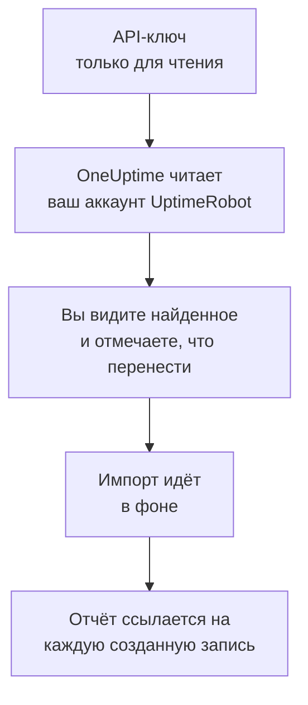

# Переход с UptimeRobot

**Импорт из другого инструмента** переносит ваши мониторы и страницы статуса из UptimeRobot в OneUptime за несколько минут. С API-ключом UptimeRobot только для чтения OneUptime читает ваши мониторы и публичные страницы статуса, показывает, что нашёл, и создаёт то, что вы отметите. В UptimeRobot ничего не меняется.

:::cards
- [Импорт аккаунта](#импорт-аккаунта-uptimerobot): Создайте ключ, прочитайте аккаунт и отметьте, что перенести.
- [Что переносится](#что-переносится): Во что превращается в OneUptime каждый монитор и страница статуса UptimeRobot.
- [Завершите переход](#завершите-переход): Что сделать после импорта.
:::

## Как это работает

- **Ключ используется один раз.** Пока OneUptime читает ваш аккаунт, ключ хранится в зашифрованном виде, а когда чтение заканчивается, удаляется — успешно оно прошло или нет. Он больше никогда не показывается и не пишется в журналы.
- **OneUptime только читает.** Он обращается только к API самого UptimeRobot: `api.uptimerobot.com`. Он делает один запрос каждые шесть секунд и укладывается в десять запросов в минуту, которые UptimeRobot разрешает аккаунту Free, поэтому большой аккаунт читается несколько минут. Если UptimeRobot просит снизить темп, он ждёт и повторяет попытку.
- **Ничего не создаётся, пока вы не начнёте импорт.** Предпросмотр показывает для каждого элемента, новый ли он, есть ли он уже в OneUptime (и используется как есть), перенёс ли его предыдущий импорт или почему его нельзя перенести.
- **Повторный импорт никогда не создаёт дубликатов.** OneUptime помнит, что перенёс каждый импорт, по ID в UptimeRobot. Запустите импорт снова, когда добавите мониторы в UptimeRobot, и будут созданы только новые.

## Прежде чем начать

- **Проект OneUptime и право создавать то, что вы переносите.** Владельцы и администраторы проекта могут перенести всё. Другие роли тоже могут запустить импорт и перенести те типы записей, которые им разрешено создавать. Остальное показано как не перенесённое, с причиной.
- **API-ключ UptimeRobot.** Достаточно Read-only API key: импорт никогда ничего не записывает в UptimeRobot. Main API key тоже подойдёт, а ключ отдельного монитора читает только этот монитор.
- **Способ оплаты в OneUptime Cloud.** Мониторы, которые выполняют проверки, оплачиваются по использованию даже на тарифе Free, поэтому до импорта добавьте способ оплаты в разделе **Настройки проекта** > **Биллинг**. Без него такие мониторы показаны как не перенесённые.

## Импорт аккаунта UptimeRobot

:::steps
### Создайте API-ключ в UptimeRobot
В UptimeRobot откройте **Integrations & API** > **API**. Создайте **Read-only API key** или скопируйте уже имеющийся.

### Откройте страницу импорта
В OneUptime перейдите в **Настройки проекта** > **Импорт из другого инструмента** и выберите **UptimeRobot**.

### Подключите UptimeRobot
Вставьте ключ в поле **API-ключ UptimeRobot** и выберите **Прочитать мой аккаунт UptimeRobot**. Большой аккаунт читается несколько минут, и на это время можно уйти со страницы.

### Отметьте, что перенести
Предпросмотр показывает найденное, по разделу на каждый тип. Всё, что будет создано, изначально отмечено, кроме мониторов, приостановленных в UptimeRobot: если их отметить, они перенесутся приостановленными. Под каждым элементом OneUptime пишет, что перенесётся не в точности как было. Если отмеченная страница статуса показывает монитор, который вы не отметили, это будет сказано, а кнопка **Отметить и их** отметит его.

### Начните импорт
Выберите **Начать импорт**. Импорт идёт в фоне: можно уйти со страницы, а отчёт будет ждать вас там.
:::

Отчёт показывает, сколько записей создано и что не перенесено, и перечисляет каждый элемент со ссылкой на запись, которой он стал, — сначала ошибки. Предыдущие импорты перечислены в разделе **Предыдущие импорты** на той же странице.

## Что переносится

| В UptimeRobot | В OneUptime | Как |
| --- | --- | --- |
| Monitors | Мониторы | Каждый монитор становится монитором того же типа с тем же адресом, интервалом и тайм-аутом и теми же кодами состояния, которые считаются работоспособными. |
| Public status pages | Страницы статуса | Каждая страница показывает те же мониторы: названные в ней, отмеченные её тегами или все, с доступностью и полосами истории, как раньше. Страница с паролем переносится как закрытая. |

- **Мониторы HTTP(S) и ключевых слов** становятся мониторами веб-сайта или, если они отправляют другой метод, заголовки или тело JSON, мониторами API. Монитор ключевого слова срабатывает, когда слово появляется или пропадает, как в UptimeRobot, и ищет его в точности, с учётом регистра.
- **Мониторы ping и портов** становятся мониторами ping и портов.
- **Heartbeat-мониторы** становятся мониторами входящих запросов, которые срабатывают, если за интервал и льготный период не пришёл ни один запрос. У каждого в OneUptime новый адрес.
- **Мониторы DNS и API** становятся мониторами DNS и API.
- **Напоминания об истечении SSL.** Монитор, который предупреждает об истечении сертификата, получает ещё и монитор SSL-сертификата с его именем, который предупреждает за то же число дней.

Каждый монитор проверяется зондами вашего проекта, как и созданный вручную. Интервал, которого нет в OneUptime, заменяется ближайшим доступным, а тайм-аут больше минуты — одной минутой. Предпросмотр сообщает, когда меняется одно или другое.

## Что не переносится

- **История доступности, время ответа и инциденты.** OneUptime начинает проверки, когда импорт завершён.
- **Контакты для оповещений и интеграции.** Выберите в OneUptime, кого оповещать, как описано в разделе [Завершите переход](#завершите-переход).
- **Пароли и заголовки, которые могут содержать секрет.** Монитор, который входит с паролем или отправляет заголовок `Authorization`, cookie или токен, переносится без него: добавьте его как [секрет монитора](/docs/monitor/monitor-secrets).
- **Мониторы UDP, визуального сравнения и зависимостей.** В OneUptime нет монитора, который делает то же самое, и предпросмотр называет каждый из них.
- **Мониторы портов, которые оповещают, пока порт открыт.** Они работают наоборот по сравнению с мониторами портов OneUptime.
- **Ответы, которые ожидает монитор DNS, и проверки монитора API.** Добавьте их как критерии в OneUptime.
- **Окна обслуживания.** Предпросмотр их подсчитывает: запланируйте их как плановое обслуживание в OneUptime.
- **Собственный домен и оформление страницы статуса.** В OneUptime добавьте домен в разделе **Пользовательские домены**, а логотип — в разделе **Брендинг**.

## Ограничения

Один импорт создаёт не больше 2 000 записей: не больше 1 000 мониторов и 50 страниц статуса. Всё, что выходит за ограничение, показано как не перенесённое. Запустите импорт снова, чтобы перенести остальное.

В OneUptime Cloud мониторам, которые выполняют проверки, нужен способ оплаты, а то, для чего в вашем тарифе нет места, показано как не перенесённое, с тем, что для этого нужно.

Предпросмотр хранится один день. Отмечать элементы и начинать импорт может только тот, кто прочитал аккаунт. Владельцы и администраторы проекта видят ход и отчёт каждого импорта.

## Завершите переход

:::steps
### Проверьте мониторы
Откройте каждый в разделе **Мониторы** и проверьте первые результаты. У heartbeat-монитора новый адрес: направьте туда задачу, которая его вызывает.

### Выберите, кого оповещать
Добавьте владельцев мониторам или политику дежурств из раздела **Дежурство** > **Политики дежурств** инцидентам, которые они открывают, чтобы нужные люди узнавали, когда что-то перестаёт работать.

### Направьте адрес страницы статуса на OneUptime
В разделе **Страницы состояния** откройте страницу, добавьте свой домен в **Пользовательские домены**, затем измените его DNS-запись. После этого посетители и подписчики попадут на новую страницу.

### Отключите проверки в UptimeRobot
Когда OneUptime начнёт проверять то же самое, приостановите проверки в UptimeRobot, чтобы никого не оповещали дважды.
:::

## Устранение неполадок

:::details UptimeRobot не принял API-ключ
Проверьте, что вы скопировали ключ целиком и что это Read-only или Main API key аккаунта из **Integrations & API**, а не ключ отдельного монитора. Затем выберите **Повторить попытку**.
:::

:::details Монитор показан как не перенесённый
У него указана причина: тип монитора, которого нет в OneUptime, адрес, который OneUptime не может прочитать, или проект без места или без способа оплаты для него. Монитор, который OneUptime уже выполняет с тем же названием, типом и адресом, используется как есть.
:::

:::details Некоторые элементы нельзя отметить
У каждого указана причина: название, которое уже есть в проекте, то, что перенёс предыдущий импорт, или запись, которую вам нельзя создавать или которой нет в вашем тарифе.
:::

## Что дальше

:::cards
- [Мониторинг веб-сайта](/docs/monitor/website-monitor): Что проверяет монитор веб-сайта и как.
- [Мониторинг входящих запросов](/docs/monitor/incoming-request-monitor): Как heartbeat работает в OneUptime.
- [Переход с Pingdom](/docs/moving-to-oneuptime/pingdom): Перенесите проверки из Pingdom.
:::
