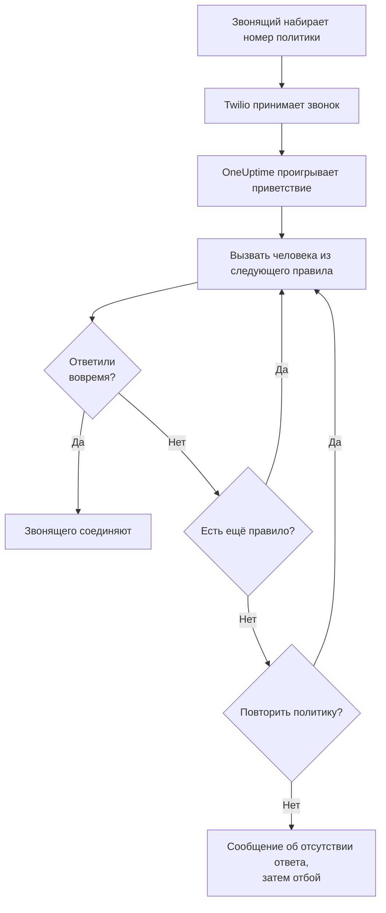
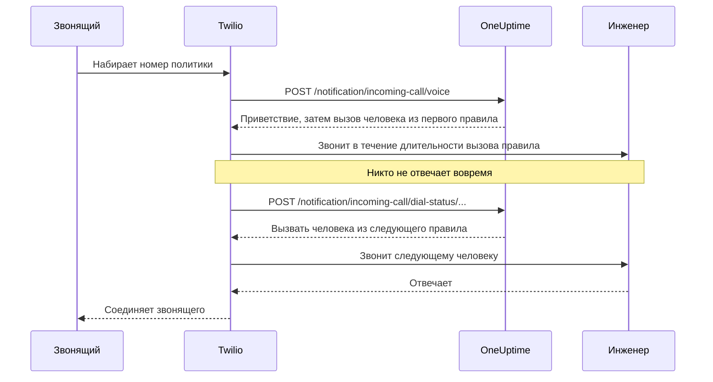

# Политика входящих вызовов

Политика входящих вызовов даёт вашей команде номер телефона, по которому можно дозвониться до дежурного. Когда кто-то звонит на него, OneUptime по очереди вызывает людей из правил эскалации политики, пока кто-нибудь не ответит, и соединяет с ним звонящего. Номера и звонки работают через вашу собственную учётную запись Twilio.

:::cards
- [Настройка политики](#настройка-политики): От учётной записи Twilio до тестового звонка за семь шагов.
- [Как маршрутизируется звонок](#как-маршрутизируется-звонок): Кого вызывают, как долго и что слышит звонящий.
- [Пропущенные звонки](#пропущенные-звонки): Кого уведомляют и как реагировать на них в рабочем процессе.
- [Устранение неполадок](#устранение-неполадок): Звонки, которые не доходят или не дозваниваются до инженера.
:::

## Перед началом

| Что нужно | Зачем |
| --- | --- |
| Учётная запись Twilio с её Account SID и Auth Token | Номера и звонки политики работают через неё, и Twilio выставляет за них счёт ей. |
| Тариф **Growth** в OneUptime Cloud | Он нужен проекту для собственной конфигурации Twilio. |
| Сервер OneUptime, доступный для Twilio, если вы размещаете его сами | Twilio отправляет каждый звонок на `https://<your host>/notification/incoming-call/voice`. |
| Включённые **SMS** в проекте | Номер каждого инженера подтверждается кодом, который приходит по SMS. |
| Подтверждённый номер у каждого инженера | Правило вызывает только тех, кто добавил и подтвердил номер для входящих вызовов в проекте. |

## Настройка политики

:::steps
### Добавьте учётную запись Twilio

Перейдите в **Настройки проекта** > **Уведомления** > **Настройки уведомлений**. На карточке **Конфигурация Twilio** нажмите **Create Twilio Config** и заполните форму:

- **Имя** и **Описание**: для чего эта учётная запись, например «Линия поддержки».
- **Twilio Account SID**: из Twilio Console. Начинается с `AC`.
- **Twilio Auth Token**: из Twilio Console.
- **Основной номер телефона Twilio**: номер этой учётной записи для SMS и звонков, которые она отправляет.
- **Дополнительные номера телефонов Twilio**: необязательно. Номера, которые отправляют вместо основного получателям в своей стране.
- **Установить по умолчанию для проекта**: включено для первой конфигурации Twilio в проекте, чтобы SMS и звонки участникам проекта тоже шли через эту учётную запись. Выключите, если эта учётная запись нужна только для входящих вызовов.

### Создайте политику

Перейдите в **Дежурство** > **Политики входящих звонков** и нажмите **Создать: Политика входящих звонков**. Задайте **Имя**, например «Линия поддержки», и при желании **Описание** и **Метки**. Затем откройте политику из списка.

### Выберите учётную запись Twilio

На странице **Обзор** политики есть карточка **Настройка** с тремя пронумерованными шагами. В первом нажмите **Выбрать**, выберите учётную запись в поле **Конфигурация Twilio** и нажмите **Сохранить**.

### Добавьте номер телефона

Во втором шаге нажмите **Add Phone Number**. Выберите **Use Existing Phone Number**, чтобы использовать номер, который уже есть в вашей учётной записи Twilio, или **Reserve New Phone Number**, чтобы получить новый. OneUptime направляет номер на себя, поэтому в Twilio ничего настраивать не нужно. См. [Номера телефонов](#номера-телефонов).

### Добавьте правила эскалации

В третьем шаге нажмите **Управление правилами**. Добавьте правило для каждого расписания дежурств или человека, которого нужно вызывать, в том порядке, в котором их вызывать. См. [Правила эскалации](#правила-эскалации).

### Подтвердите номер каждого инженера

Каждый, кого может вызвать правило, сам добавляет и подтверждает свой номер для входящих вызовов. См. [Номера телефонов инженеров](#номера-телефонов-инженеров).

### Позвоните на номер

Когда все три шага выполнены, карточка превращается в **Phone Numbers & Twilio Configuration**. Позвоните на номер с любого телефона, а затем откройте **Журналы вызовов** политики, чтобы увидеть, кого вызывали.
:::

## Как маршрутизируется звонок

1. Twilio передаёт звонок в OneUptime, который зачитывает **Приветственное сообщение** политики.
2. OneUptime вызывает человека, указанного в первом правиле эскалации: этого человека или того, кто в этот момент дежурит в расписании дежурств правила, с учётом переопределений пользователей. Его телефон показывает номер политики как номер звонящего.
3. Если он отвечает в пределах **Длительность вызова** правила, звонящего соединяют с ним, а журнал вызовов записывает, кто ответил.
4. Если нет, звонящий слышит "Connecting you to the next available engineer.", и вызывается человек из следующего правила.
5. После последнего правила политика начинает заново с первого правила, если включена **Политика повтора, если никто не отвечает**, столько раз, сколько указано в **Количество повторов политики**. Иначе звонящий слышит **Сообщение об отсутствии ответа**, и звонок завершается.

Правило пропускается, никого не вызывая, если по нему сейчас некого вызвать: в его расписании никто не дежурит, у человека нет подтверждённого номера для входящих вызовов в этом проекте или он больше не участник проекта. Если ни в одном правиле некого вызвать, звонящий слышит **Сообщение об отсутствии доступных людей**. Отключённая политика отвечает на каждый звонок фразой "Sorry, this service is currently disabled." и кладёт трубку.

OneUptime проверяет подпись Twilio в каждом запросе с помощью Auth Token из конфигурации Twilio и отклоняет запрос, который не может проверить.

> [!TIP]
> Сохраните номер политики в контактах телефона, например как «Линия поддержки», чтобы узнавать переадресованный звонок, когда он поступает.

## Правила эскалации

Правила эскалации определяют, кого вызывают, когда кто-то звонит на номер политики, — сверху вниз по списку. Откройте политику, выберите **Правила эскалации** в её боковом меню и нажмите **Добавить правило эскалации**. Правило — это один короткий шаг:

- **Кому звонить**: расписание дежурств или один человек. Расписание вызывает того, кто дежурит в нём в момент поступления звонка. Люди — это участники вашего проекта.
- **Длительность вызова (в секундах)**: сколько звонит их телефон, прежде чем звонок перейдёт к следующему правилу. Значение по умолчанию — 20 секунд, Twilio принимает от 5 до 600.
- **Имя** и **Описание** необязательны и находятся в разделе **Дополнительные поля**. Правило без имени показывается в списке по своему месту: **Level 1**, **Level 2**.

Правила вызываются сверху вниз по списку, а новое правило добавляется в конец. Чтобы изменить порядок, перетащите правило за маркер в его левом верхнем углу. С клавиатуры: переведите фокус на маркер, нажмите пробел, переместите правило клавишами со стрелками и снова нажмите пробел.

> [!WARNING]
> **Учитывайте голосовую почту**: делайте **Длительность вызова** короче времени, через которое телефон человека отправляет неотвеченный звонок на голосовую почту. Если голосовая почта ответит первой, звонящего соединят с ней, и звонок не перейдёт к следующему правилу. Twilio добавляет к каждому вызову несколько собственных секунд. Поэтому новое правило начинается с 20 секунд. Правила, добавленные, когда значение по умолчанию было 30 секунд, сохраняют свои 30: если их звонки уходят на голосовую почту, уменьшите **Длительность вызова** у этих правил.

Например, три правила, которые пробуют две ротации, а затем руководителя:

| Уровень | Кому звонить | Длительность вызова |
| --- | --- | --- |
| Level 1 | Основное расписание дежурств | 20 секунд |
| Level 2 | Резервное расписание дежурств | 20 секунд |
| Level 3 | Руководитель разработки (один человек) | 20 секунд |

## Номера телефонов

У политики может быть несколько номеров, и все они вызывают одни и те же правила. Каждый номер принадлежит одной политике. Добавляйте их кнопкой **Add Phone Number** на странице **Обзор** политики:

:::tabs
@tab Использовать имеющийся номер
1. Нажмите **Add Phone Number**, затем **Use Existing Phone Number**. OneUptime показывает номера учётной записи Twilio политики.
2. Нажмите **Выбрать** рядом с номером, затем **Назначить номер**.

Номер, звонки на который уже куда-то направлены, показывает "Currently has a webhook configured". Если назначить его, звонки на него будут направляться в OneUptime.
@tab Зарезервировать новый номер
1. Нажмите **Add Phone Number**, затем **Reserve New Phone Number** и **Поиск номеров**.
2. Выберите **Страна**. При желании заполните **Код региона (необязательно)**, например 415, или **Содержит (необязательно)** — цифры, которые должен содержать номер. Нажмите **Поиск**: будет показано до 10 местных номеров.
3. Нажмите **Зарезервировать** рядом с номером и подтвердите кнопкой **Зарезервировать**. Twilio списывает плату за номер с вашей учётной записи Twilio.
:::

OneUptime задаёт голосовой webhook номера как `https://<your host>/notification/incoming-call/voice`, собранный из `HOST` и `HTTP_PROTOCOL` в собственной установке. Чтобы перевести политику на другую учётную запись Twilio, сначала освободите её номера: учётную запись можно сменить, только пока у политики нет номеров.

Чтобы освободить номер, нажмите **Освободить** рядом с ним и подтвердите кнопкой **Освободить номер**.

> [!CAUTION]
> Освобождение номера возвращает его в Twilio — даже номер, который вы подключили через **Use Existing Phone Number**, — и получить его снова может не получиться. Удаление политики или конфигурации Twilio, которую она использует, тоже освобождает её номера.

## Номера телефонов инженеров

Правило вызывает человека по номеру, который он подтвердил для входящих вызовов в этом проекте, и пропускает тех, у кого такого номера нет. Каждый добавляет свой номер сам:

:::steps
1. Откройте **Настройки пользователя** > **Политика входящих звонков** > **Входящие номера телефонов**. **Политика входящих звонков** — раздел бокового меню, который изначально свёрнут.
2. На карточке **Номера телефонов для маршрутизации входящих вызовов** нажмите **Добавить: Номер телефона для маршрутизации входящих вызовов** и введите номер с кодом страны, например `+15551234567`.
3. Введите в поле **Код подтверждения** 6-значный код, который OneUptime отправляет на номер по SMS, и нажмите **Подтвердить**. **Send a new code** отправляет новый код.
:::

У каждого человека может быть один подтверждённый номер на проект. Чтобы сменить его, сначала удалите старый номер. Эти номера отделены от номеров телефонов в разделе **Методы уведомлений**, которые используются для оповещений о дежурствах.

Номера для входящих вызовов подтверждаются по SMS, поэтому **SMS** сначала нужно включить для проекта. Включить его может владелец проекта, **Billing Admin** или человек с **Manage Billing** — на карточке **Каналы уведомлений** на странице **Настройки проекта > Уведомления > Настройки уведомлений**.

## Голосовые сообщения и настройки политики

Откройте политику и выберите **Настройки** в разделе **Расширенный** её бокового меню. **Edit Messages** на карточке **Голосовые сообщения** меняет то, что слышат звонящие; **Edit Policy Settings** на карточке **Настройки политики** меняет остальное.

| Настройка | Что она делает | В новой политике |
| --- | --- | --- |
| **Приветственное сообщение** | Зачитывается, когда звонок принят, до вызова первого человека. | "Please wait while we connect you to the on-call engineer." |
| **Сообщение об отсутствии ответа** | Зачитывается, когда все правила испробованы и никто не ответил. | "No one is available. Please try again later." |
| **Сообщение об отсутствии доступных людей** | Зачитывается, когда ни в одном правиле некого вызвать. | "We are sorry, but no on-call engineer is currently available. Please try again later or contact support." |
| **Включено** | Отключённая политика отклоняет все звонки. | Да |
| **Политика повтора, если никто не отвечает** | После последнего правила начинает заново с первого. | Нет |
| **Количество повторов политики** | Сколько раз начинать заново. | 1 |

Twilio зачитывает сообщения синтезированным голосом, поэтому пишите их так, как хотите, чтобы они звучали.

## Журналы вызовов

Каждый звонок отображается на странице **Журналы вызовов** политики в разделе **Журналы** её бокового меню: **Звонящий**, **Number Called**, его **Статус**, кто ответил (**Кем отвечено**), **Длительность** и время начала (**Начало**). Нажмите **View Timeline** у звонка, чтобы увидеть его **Временная шкала вызовов**: каждого вызванного человека, по какому номеру и чем закончилась каждая попытка.

| Статус | Что произошло |
| --- | --- |
| **Initiated**, **Ringing**, **Escalated** | Звонок ещё идёт: он поступил, телефон звонит или звонок перешёл к следующему правилу. |
| **Завершено** | Кто-то ответил, и звонящего соединили. |
| **Нет ответа** | Все правила эскалации испробованы, и никто не ответил. Звонящий услышал ваше **Сообщение об отсутствии ответа**. |
| **Caller Hung Up** | Звонящий положил трубку, пока звонил телефон инженера. |
| **Не удалось** | Никого не удалось вызвать: ни в одном правиле эскалации не было дежурного пользователя с подтверждённым номером для входящих вызовов (звонящий услышал ваше **Сообщение об отсутствии доступных людей**), или политика отключена. |

## Пропущенные звонки

Звонок считается пропущенным, если он завершился, ни до кого не дозвонившись: его статус — **Нет ответа**, **Caller Hung Up** или **Не удалось**.

### Кого уведомляют

Когда звонок пропущен, OneUptime уведомляет владельцев политики: пользователей и участников команд, добавленных на странице **Владельцы** политики. Если у политики нет владельцев, вместо них уведомляются владельцы проекта.

Уведомление сообщает, кто звонил, на какой номер, почему никто не ответил, кого вызывали и чем закончилась каждая попытка. В нём есть ссылка на звонок в журнале вызовов.

По умолчанию владельцы получают письмо. Каждый может выбрать другие каналы (SMS, звонок, push и другие) или отключить уведомление в **Настройки пользователя** > **Настройки уведомлений**, в разделе **Дежурство** > **Политики входящих звонков** > **Пропущенный звонок**.

### Реагируйте на пропущенные звонки в рабочем процессе

Журналы входящих вызовов доступны как триггеры рабочих процессов:

- **On Create Incoming Call Log** срабатывает, когда поступает звонок.
- **On Update Incoming Call Log** срабатывает по ходу звонка. Обновление, которое задаёт **Ended At**, — это конец звонка.

Чтобы реагировать только на пропущенные звонки, например публиковать их в Slack или Microsoft Teams или открывать тикет:

:::steps
1. Добавьте триггер **On Update Incoming Call Log**. Укажите для **Listen on** значение **Ended At** и выберите поля, которые хотите использовать, например **Status**, **Caller Phone Number** и **Routing Phone Number**.
2. Добавьте шаг **If / Else**. Проверьте **Status** триггера со сравнением **is not equal to** и значением `Completed`.
3. Подключите свои шаги к порту **Yes**.
:::

Рабочий процесс может читать журналы вызовов с помощью **Find One** и **Find Many**, но не может создавать или изменять их.

## Кто может добавлять и освобождать номера телефонов

Номера телефонов политики подчиняются тем же ролям, что и сама политика:

- **Поиск номеров** - поиск в Twilio номера для резервирования или просмотр номеров, которые уже есть в вашей учётной записи Twilio, - требует разрешения на чтение политик входящих вызовов и на чтение конфигураций звонков и SMS, потому что читает вашу учётную запись Twilio через одну из них. Оба разрешения есть у **Project Owner**, **Project Admin**, **Project Member**, **Viewer**, **Settings Admin**, **Settings Member** и **Settings Viewer**. В пользовательской роли это **Read Incoming Call Policy** и **Read Call and SMS**.
- **Резервирование номера, использование существующего и освобождение номера** требуют разрешения на редактирование политик входящих вызовов: **Project Owner**, **Project Admin**, **Project Member**, **Settings Admin** и **Settings Member** или **Edit Incoming Call Policy** в пользовательской роли. Эти действия меняют номера политики, которую вы можете редактировать: при роли, ограниченной некоторыми метками, — политик с этими метками.

Блокировка команды без меток по одному из этих разрешений отнимает его. Для всех остальных **Add Phone Number** и **Освободить** остаются на странице, но заблокированы, а их подсказка говорит, что для них нужно. API отклоняет такой запрос фразой, в которой сказано, что нужно: "Looking up phone numbers needs permission to read incoming call policies and call and SMS settings." или "Adding or releasing a phone number needs permission to edit incoming call policies." Резервирование номера оплачивается с вашей собственной учётной записи Twilio, а не с баланса OneUptime, поэтому разрешение на биллинг для него не нужно.

## Создание политик через API или Terraform

| Ресурс | Маршрут API |
| --- | --- |
| Политики входящих вызовов | `/api/incoming-call-policy` |
| Их правила эскалации | `/api/incoming-call-policy-escalation-rule` |
| Их номера телефонов, только чтение | `/api/incoming-call-policy-phone-number` |
| Журналы вызовов, только чтение | `/api/incoming-call-log` |

Правило, созданное через API без `escalateAfterSeconds`, звонит 20 секунд — как и правило, которое Terraform создаёт без `escalate_after_seconds`.

### Настройки правила эскалации

| Настройка | Поле API | Что в нём хранится |
| --- | --- | --- |
| Кому звонить | `onCallDutyPolicyScheduleId` или `userId` | Одно из двух, никогда оба: расписание, дежурного которого вызывают, или человек. |
| Длительность вызова (в секундах) | `escalateAfterSeconds` | Сколько звонит телефон, прежде чем звонок пойдёт дальше (по умолчанию: 20; от 5 до 600). |
| Имя и Описание | `name`, `description` | Необязательно. Правило без имени показывается как Level 1, Level 2 и так далее — по своему месту в списке. |
| Порядок | `order` | Место правила в списке: правила вызываются сверху вниз. Новое правило без порядка добавляется в конец. |

## Устранение неполадок

:::details Звонки не доходят до OneUptime
- В Twilio Console откройте номер: в **A call comes in** должен быть webhook `https://<your host>/notification/incoming-call/voice` с HTTP POST. OneUptime задаёт его при добавлении номера, исходя из `HOST` и `HTTP_PROTOCOL`. Если они с тех пор изменились, исправьте webhook в Twilio.
- Собственная установка OneUptime должна быть доступна из Интернета по https. Журнал вызовов номера в Twilio Console и **Debugger** в Twilio показывают, что ответил OneUptime.
- Ответ `403` означает, что подпись запроса не прошла проверку. Убедитесь, что в конфигурации Twilio указан текущий **Twilio Auth Token** учётной записи, а прокси перед OneUptime передаёт хост и схему, по которым обращался Twilio (`X-Forwarded-Host` и `X-Forwarded-Proto`).
:::

:::details Звонок принят, но никого не вызывают
Журнал вызовов показывает **Не удалось**. Проверьте, что политика **Включено**, что в расписании дежурств каждого правила сейчас кто-то дежурит и что у людей, которых вызывают правила, есть подтверждённый номер в **Настройки пользователя** > **Политика входящих звонков** > **Входящие номера телефонов** в этом проекте. Правила вызывают только участников проекта.
:::

:::details Звонки уходят на голосовую почту
Если звонки уходят на голосовую почту инженера, задайте **Длительность вызова** правила меньше времени, через которое его телефон переходит на голосовую почту. Ответ голосовой почты считается ответом, и звонок на этом останавливается.
:::

:::details Не удаётся зарезервировать новый номер
Во многих странах Twilio требует одобренный regulatory bundle, прежде чем продавать местные номера, а для некоторых номеров нужен положительный баланс Twilio. Настройте это в Twilio Console или получите номер там и добавьте его через **Use Existing Phone Number**.
:::

:::details Не удаётся сменить учётную запись Twilio политики
Учётную запись можно сменить, только пока у политики нет номеров телефонов: страница сообщает "Remove all phone numbers to change". Освобождение номеров возвращает их в Twilio, поэтому сначала спланируйте переход.
:::

:::details Код для номера инженера не приходит
Для проекта должны быть включены SMS. В OneUptime Cloud проект без собственной конфигурации Twilio по умолчанию оплачивает SMS из своего баланса, который должен быть больше 1 USD. Коды могут приходить в течение минуты; нажмите **Send a new code**, чтобы отправить новый, а **Настройки проекта** > **Уведомления** > **Журналы уведомлений** показывает, что с ним произошло.
:::

## Дальнейшие шаги

:::cards
- [Правила эскалации](/docs/on-call/escalation-rules): Как политика дежурства оповещает людей уровень за уровнем.
- [Расписания дежурств](/docs/on-call/schedules): Постройте ротации, которые вызывают ваши правила.
- [Рабочие процессы](/docs/workflows/index): Реагируйте на пропущенные звонки: публикуйте их в канале или открывайте тикет.
- [Интеграция Twilio для SMS и голосовых звонков](/docs/self-hosted/twilio-integration): Настройте Twilio для собственной установки.
:::
