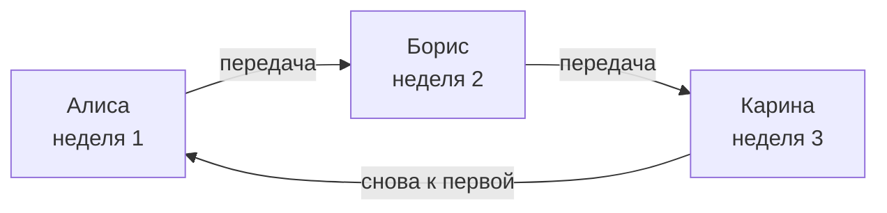
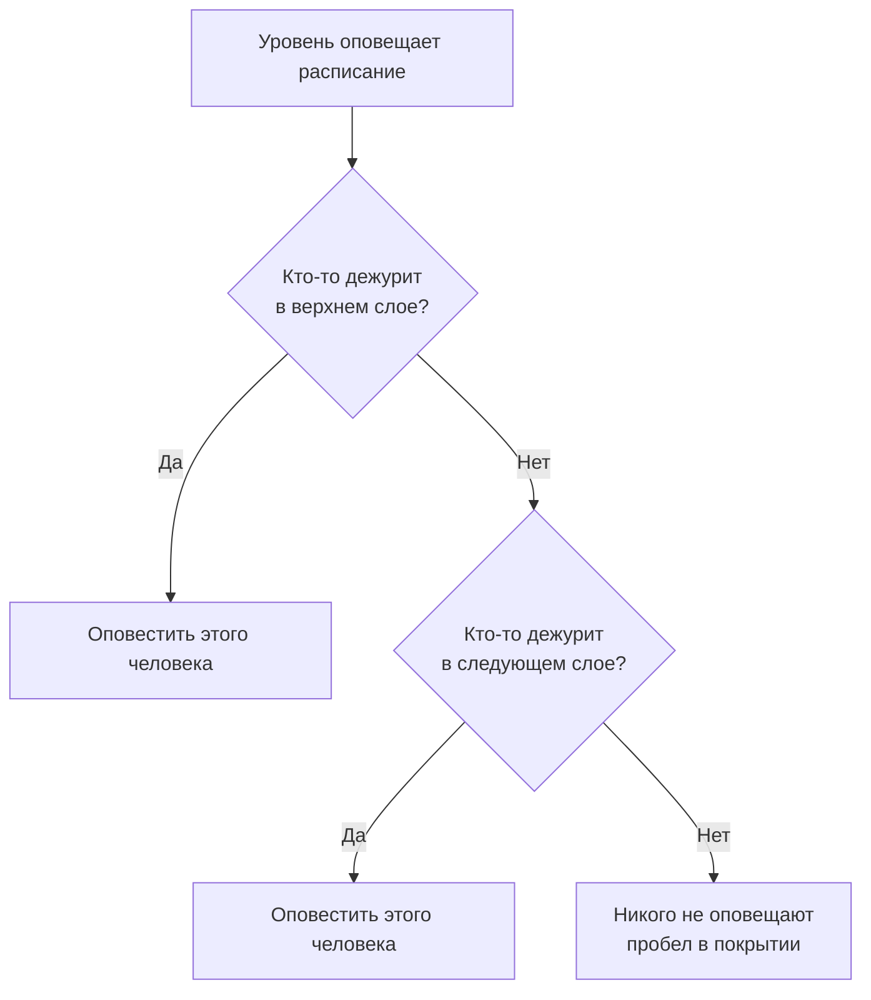

# Расписания дежурств

Расписание дежурств определяет, кто дежурит в любой момент времени. Люди дежурят в нём по очереди: каждый дежурит какое-то время, затем смену принимает следующий. Добавьте расписание в правила эскалации политики дежурства, и политика будет оповещать того, кто дежурит в нём, когда срабатывает этот уровень.

> [!NOTE]
> В OneUptime Cloud расписания дежурств доступны на тарифе **Growth** и выше. Расписание, которое у проекта ещё есть, продолжает оповещать своих людей через правила эскалации, в которых оно указано, после окончания пробного периода Growth или понижения тарифа. Поэтому ниже **Growth** страница **Расписания дежурств** показывает примечание о тарифе, а под ним — ещё настроенные расписания, которые там можно удалить. Чтобы создать или изменить расписание, нужен **Growth**.

:::cards
- [Кто дежурит по очереди](#кто-дежурит-по-очереди): Создайте расписание с первой ротацией.
- [Слои](#слои): Накладывайте ротации, ограничивайте часы дежурства и добавляйте резервное покрытие.
- [API и Terraform](#создание-расписаний-через-api-или-terraform): Создавайте расписания и их ротации в виде кода.
:::

## Кто дежурит по очереди

Когда вы создаёте расписание на странице **Расписания дежурств**, форма запрашивает его **Имя** и **Кто дежурит по очереди?**. Выбранные вами люди становятся первым слоем расписания, **Layer 1**, с круглосуточным дежурством.

:::steps
1. Перейдите в **Дежурство** > **Расписания дежурств** и нажмите **Создать расписание дежурств**.
2. Введите **Имя**.
3. В разделе **Кто дежурит по очереди?** нажмите **Добавить пользователя** и выберите людей в том порядке, в котором они дежурят.
4. При желании откройте **Дополнительные поля**, чтобы изменить продолжительность каждой смены, часовой пояс, описание или метки.
5. Нажмите **Создать расписание дежурств**. Новое расписание откроется на своей странице **Слои**, где можно изменить ротацию или добавить слои.
:::

Люди дежурят по одному, и первый начинает дежурить сразу после создания расписания:



**Кто дежурит по очереди?** — необязательный вопрос. Если оставить его пустым, расписание начинается без слоёв: оно никого не ставит на дежурство, пока вы не добавите слой на его странице **Слои**. Вопрос задаётся только тем, кто может добавлять слои.

Всё остальное находится в разделе **Дополнительные поля**, свёрнутом, пока вы его не откроете:

| Поле | Что оно делает |
| --- | --- |
| **Каждая смена длится** | **1 день**, **1 неделя**, **2 недели** или **1 месяц**; **1 неделя**, если не менять. Вопрос появляется, как только кто-то дежурит по очереди. Каждый человек дежурит столько времени, затем смену принимает следующий — в то время суток, когда было создано расписание. |
| **Часовой пояс** | Часовой пояс, в котором хранятся время передачи смен и часы дежурства. Изначально — ваш. |
| **Описание** | Заметки о расписании. |
| **Метки** | Метки для поиска и группировки расписания. |

Пока кто-то дежурит по очереди и в разделе **Дополнительные поля** ничего не изменено, его свёрнутый заголовок говорит, что произойдёт: каждый человек дежурит неделю, затем смену принимает следующий.

## Слои

Ротация расписания состоит из слоёв на его странице **Слои**. Слои читаются сверху вниз: оповещает самый верхний слой, в котором кто-то дежурит, поэтому основную ротацию ставьте наверх, а резервное покрытие — под неё.



**Добавить слой** добавляет слой, который начинается так же, как первый: дежурство с текущего момента, каждый человек по неделе, круглосуточно. Разверните слой, чтобы добавить в него людей и изменить, когда он начинается, как часто передаёт смену, когда делает первую передачу и в какие часы дежурит:

| Поле | Что оно задаёт |
| --- | --- |
| **Layer name** | Что покрывает слой, например «Основной по будням». |
| **Rotation starts at** | Дата и время начала ротации слоя. |
| **Rotate every** | Как часто дежурство переходит к следующему человеку в слое. |
| **First hand-off time** | Первая передача следующему человеку — в момент начала или позже. Следующие передачи происходят через каждый интервал ротации. |
| **Restrictions** | Часы, когда слой дежурит: **Без ограничений**, **Определённое время суток** или **Определённое время недели**, в часовом поясе расписания. Вне этих часов дежурство переходит к нижним слоям. |

Чтобы изменить, какой слой идёт первым, используйте **Move layer up (higher priority)** или **Move layer down (lower priority)** в меню слоя.

У каждого человека везде один цвет, чтобы его можно было отследить с одного взгляда: в каждом слое, в итоговом расписании и его переопределениях, а также на странице **Хронология дежурств**.

## Создание расписаний через API или Terraform

Расписания дежурств — это ресурс `/api/on-call-duty-policy-schedule`; их слои и люди в них — ресурсы `/api/on-call-duty-schedule-layer` и `/api/on-call-duty-schedule-layer-user`.

- Создание расписания с `firstLayerUsers` (списком идентификаторов пользователей в порядке их дежурства) в `miscDataProps` даёт ему первый слой, как это делает панель управления: **Layer 1**, дежурство с текущего момента, круглосуточно. `firstLayerRotation` задаёт продолжительность каждой смены в виде ротации, например `{"_type": "Recurring", "value": {"intervalType": "Week", "intervalCount": 1}}`; без него — неделя. Каждый пользователь должен быть участником проекта, а вызывающий должен иметь право создавать слои, иначе расписание не создаётся.
- Расписание, созданное без них, не имеет слоёв, как и раньше; ресурс расписания в Terraform их не отправляет.
- Слой, созданный без `rotation`, передаёт смену ежедневно, как всегда.

```bash
curl -X POST https://oneuptime.com/api/on-call-duty-policy-schedule \
  -H "apikey: $ONEUPTIME_API_KEY" \
  -H "Content-Type: application/json" \
  -d '{
    "data": {
      "projectId": "<project-id>",
      "name": "Primary on-call",
      "timezone": "Europe/Berlin"
    },
    "miscDataProps": {
      "firstLayerUsers": ["<user-id-1>", "<user-id-2>", "<user-id-3>"],
      "firstLayerRotation": {"_type": "Recurring", "value": {"intervalType": "Week", "intervalCount": 1}}
    }
  }'
```

## Дальнейшие шаги

:::cards
- [Правила эскалации](/docs/on-call/escalation-rules): Оповещайте это расписание с уровня политики дежурства.
- [Хронология дежурств](/docs/on-call/schedule-timeline): Смотрите все расписания рядом, с пробелами в покрытии.
- [Календарные ленты](/docs/on-call/calendar-feeds): Добавьте смены в Google Календарь, Outlook или Календарь Apple.
:::
