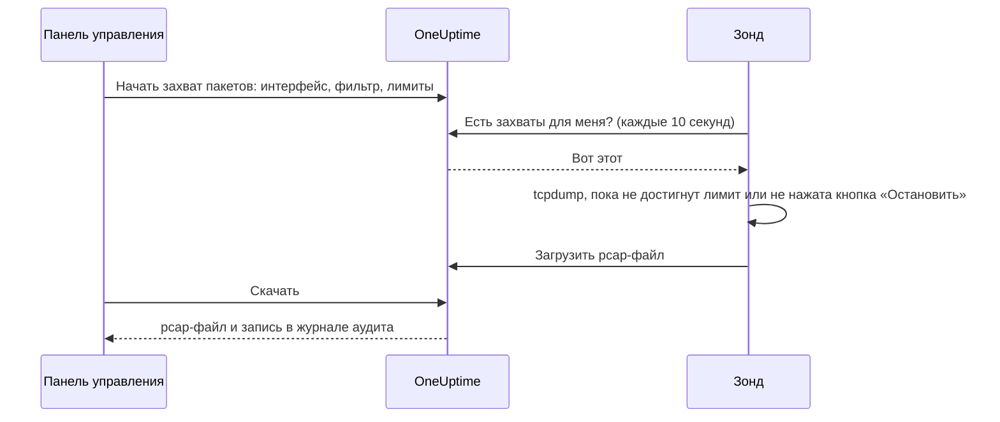

# Захват пакетов

Захватывайте трафик, который видит один из ваших зондов, прямо из панели управления и открывайте файл в Wireshark. Зонд уже стоит в сети, где вы ищете проблему: не нужно поднимать VPN и входить на jump-хост.

Захваты выключены на каждом зонде, пока их не включит тот, кто обслуживает зонд, и они работают только на собственных зондах вашего проекта.

:::cards
- [Как это работает](#как-это-работает): От «Начать захват пакетов» до файла в Wireshark.
- [Включить захват пакетов](#включить-захват-пакетов): Что настраивает тот, кто обслуживает зонд, для Docker, Docker Compose и Kubernetes.
- [Начать захват](#начать-захват): Выберите интерфейс, сузьте захват до нужного и скачайте файл.
- [Справочник](#справочник): Лимиты, фильтры, права доступа, журнал аудита и сколько хранятся файлы.
- [Устранение неполадок](#устранение-неполадок): Что означает сообщение неудавшегося захвата.
:::

## Как это работает



1. **Запуск.** Тот, кому разрешено запускать захваты, выбирает интерфейс зонда, фильтр и лимиты и нажимает **Начать захват**. OneUptime проверяет фильтр и лимиты на соответствие тому, что разрешает зонд, прежде чем сохранить захват.
2. **Получение.** Зонд каждые десять секунд спрашивает у OneUptime работу, так же как он спрашивает мониторы. Он берёт захват и запускает `tcpdump`.
3. **Захват.** Захват останавливается на первом из своих лимитов: длительности, лимите пакетов или размере файла. **Остановить** завершает его раньше и сохраняет то, что уже захвачено.
4. **Загрузка.** Зонд загружает pcap-файл. OneUptime хранит его как закрытый файл проекта.
5. **Скачивание.** Захват показывает **Завершено** и кнопку **Скачать**. Файл открывается в Wireshark, tcpdump или любой другой программе, которая читает pcap-файлы.

## Прежде чем начать

- **Собственный зонд вашего проекта.** Глобальные зонды передают трафик других проектов, поэтому они никогда не захватывают пакеты. Как установить собственный зонд, см. [Пользовательские зонды](/docs/probe/custom-probe).
- **Зонд этой версии или новее.** Старые зонды не сообщают, на чём они могут захватывать.
- **Нужные права доступа.** Чтобы запускать и останавливать захват, нужно право **Start Packet Capture**, а чтобы скачивать файл — **Download Packet Capture**. У владельцев и администраторов проекта есть оба. См. [Права доступа](#права-доступа).
- **Зеркальный порт для трафика, который не доходит до зонда.** Зонд видит только трафик на интерфейсах своего хоста. Чтобы захватить трафик между другими устройствами, зеркалируйте их порт коммутатора (SPAN) на свободный интерфейс хоста зонда.

## Включить захват пакетов

Тот, кто обслуживает зонд, включает захваты там, где работает зонд: панель управления этого не умеет, и так задумано. Зонду нужны три вещи:

| Настройка | Зачем |
| --- | --- |
| `PROBE_PACKET_CAPTURE_ENABLED=true` | Включает захваты. Любое другое значение или его отсутствие оставляет их выключенными. |
| Сеть хоста | Позволяет зонду видеть собственные интерфейсы хоста и зеркальный порт. Без неё зонд видит только сеть своего контейнера. |
| Возможность `NET_RAW` | Позволяет tcpdump захватывать пакеты. Docker выдаёт её по умолчанию. Стандарт Pod Security «restricted» в Kubernetes её убирает, поэтому добавьте её. |

:::tabs
@tab Docker
```bash
docker run --name oneuptime-probe --network host \
  --cap-add NET_RAW \
  -e PROBE_KEY=<probe-key> \
  -e PROBE_ID=<probe-id> \
  -e ONEUPTIME_URL=https://oneuptime.com \
  -e PROBE_PACKET_CAPTURE_ENABLED=true \
  -d oneuptime/probe:release
```
@tab Docker Compose
```yaml
services:
  oneuptime-probe:
    image: oneuptime/probe:release
    container_name: oneuptime-probe
    network_mode: host
    cap_add:
      - NET_RAW
    environment:
      - PROBE_KEY=<probe-key>
      - PROBE_ID=<probe-id>
      - ONEUPTIME_URL=https://oneuptime.com
      - PROBE_PACKET_CAPTURE_ENABLED=true
    restart: always
```
@tab Kubernetes
```yaml
apiVersion: apps/v1
kind: Deployment
metadata:
  name: oneuptime-probe
spec:
  selector:
    matchLabels:
      app: oneuptime-probe
  template:
    metadata:
      labels:
        app: oneuptime-probe
    spec:
      hostNetwork: true
      dnsPolicy: ClusterFirstWithHostNet
      containers:
        - name: oneuptime-probe
          image: oneuptime/probe:release
          securityContext:
            capabilities:
              add: ["NET_RAW"]
          env:
            - name: PROBE_KEY
              value: "<probe-key>"
            - name: PROBE_ID
              value: "<probe-id>"
            - name: ONEUPTIME_URL
              value: "https://oneuptime.com"
            - name: PROBE_PACKET_CAPTURE_ENABLED
              value: "true"
```
:::

При запуске зонд пишет в свой журнал `Packet capture is on: captures of up to 30 minutes and 25 MB can be started on this probe from the dashboard.` В течение минуты страница зонда в панели управления предлагает **Начать захват пакетов**.

Чтобы задать на этом зонде более низкий потолок, чем тот, которого придерживается каждый зонд, добавьте одну из этих переменных:

| Переменная | По умолчанию | Что она делает |
| --- | --- | --- |
| `PROBE_PACKET_CAPTURE_MAX_DURATION_IN_SECONDS` | `1800` | Самый длинный захват, который выполняет этот зонд, от 5 до 1800 секунд. |
| `PROBE_PACKET_CAPTURE_MAX_FILE_SIZE_IN_MB` | `25` | Самый большой файл захвата, который создаёт этот зонд, от 1 до 25 МБ. |

> [!NOTE]
> Зонды, которые поставляются с самостоятельно размещённой установкой OneUptime через Docker Compose или Helm-чарт, глобальные, поэтому они никогда не захватывают пакеты. Запустите пользовательский зонд в сети, где вы хотите захватывать трафик.

## Начать захват

:::steps
### Откройте зонд или устройство

Откройте **Мониторы → Настройки → Зонды** и нажмите на свой зонд: его карточка **Захваты пакетов** показывает его захваты. Или откройте сетевое устройство и перейдите на его страницу **Traffic**: захваты там выполняются на собственном зонде устройства и начинаются с фильтром по адресу устройства.

### Нажмите «Начать захват пакетов»

Форма говорит, что содержит захват, прежде чем вы его начнёте: пароли, токены и персональные данные, которые идут по сети, попадают в файл.

### Выберите интерфейс

**Все интерфейсы (any)** захватывает на каждом интерфейсе зонда. Выберите интерфейс, на который коммутатор зеркалирует трафик, когда захватываете зеркальный трафик.

### Выберите, какие пакеты

Заполните **Хост или сеть**, **Порт** и **Протокол**, чтобы сузить захват, или оставьте их пустыми, чтобы сохранить все пакеты. Форма показывает фильтр, который из них получается, например `host 10.0.0.5 and tcp port 443`. Нажмите **Написать фильтр BPF**, чтобы написать свой.

### Проверьте лимиты

**Дополнительные поля** содержат **Длительность**, **Лимит пакетов** и **Лимит размера файла (МБ)**. Их сводка говорит, когда захват остановится: `Останавливается через 1 мин., после 10 МБ или по достижении лимита пакетов (100 000), смотря что наступит раньше.`

### Нажмите «Начать захват»

Захват показывает **Ожидание**, пока зонд его не заберёт, затем **Выполняется** и сколько уже сделано. Нажмите **Остановить**, чтобы завершить его раньше.
:::

Когда захват покажет **Завершено**, нажмите **Скачать** и откройте файл `.pcap` в Wireshark. Захват на **Все интерфейсы (any)** — это Linux cooked capture, который Wireshark читает как любой другой.

## Справочник

### Лимиты

| Лимит | По умолчанию | Диапазон |
| --- | --- | --- |
| Длительность | 1 минута | от 5 секунд до 30 минут |
| Лимит пакетов | 100 000 | от 1 до 1 000 000 |
| Лимит размера файла | 10 МБ | от 1 до 25 МБ |

- Захват останавливается на первом достигнутом лимите. Файл, достигший своего лимита размера, обрезается после последнего целого пакета, поэтому он всегда открывается.
- Зонд выполняет не больше 2 захватов одновременно.
- Захват, который зонд не забрал в течение 5 минут, завершается неудачей и сообщает об этом.
- Зонд ещё раз проверяет каждый захват на эти лимиты и на свои собственные, более низкие.

### Фильтры

Поля формы составляют [фильтр BPF](https://www.tcpdump.org/manpages/pcap-filter.7.html) — язык фильтров захвата tcpdump и Wireshark:

| Хост или сеть | Порт | Протокол | Фильтр |
| --- | --- | --- | --- |
| `10.0.0.5` | | Любой протокол | `host 10.0.0.5` |
| `10.0.0.0/24` | `443` | TCP | `net 10.0.0.0/24 and tcp port 443` |
| | `5060` | UDP | `udp port 5060` |
| | `8000-8080` | Любой протокол | `portrange 8000-8080` |
| `10.0.0.5` | | ICMP | `host 10.0.0.5 and (icmp or icmp6)` |

Фильтр, который вы пишете сами, — это одна строка длиной не больше 500 символов из букв, цифр, пробелов и `. : / ( ) [ ] ! & | < > = + - * % ^ _`. OneUptime проверяет его перед сохранением, а tcpdump компилирует его на зонде. Зонд передаёт его tcpdump одним аргументом, никогда через оболочку.

### Права доступа

| Право | Позволяет | У кого есть по умолчанию |
| --- | --- | --- |
| **Start Packet Capture** | Запускать захваты и останавливать их | Project Owner, Project Admin |
| **Download Packet Capture** | Скачивать файлы захватов | Project Owner, Project Admin |
| **Delete Packet Capture** | Удалять захваты и их файлы | Project Owner, Project Admin |
| **Read Packet Capture** | Видеть захваты: когда они выполнялись, на каком зонде и с каким фильтром | Project Owner, Project Admin, Project Member, Viewer |

Чтобы дать команде **Start Packet Capture** или **Download Packet Capture**, откройте её в разделе **Настройки → Команды** и добавьте право на её странице **Права доступа**. См. [Права доступа](/docs/permissions/index).

### Журнал аудита и конфиденциальность

- Запуск захвата записывается в журнал аудита как **Create** объекта **Packet Capture**, а удаление — как **Delete**. Каждое скачивание записывается как **Download**, с тем, кто какой захват скачал.
- Файл — закрытый файл проекта. Его выдаёт только кнопка **Скачать**, при наличии **Download Packet Capture**.
- Захваты и их файлы удаляются через 7 дней после начала. Удаление захвата сразу удаляет его файл.

## Устранение неполадок

:::details «Захват пакетов выключен на этом зонде»
Зонд работает без `PROBE_PACKET_CAPTURE_ENABLED=true`. Перезапустите его с настройками из раздела [Включить захват пакетов](#включить-захват-пакетов).
:::

:::details "The probe is not allowed to capture packets on eth0"
tcpdump не смог открыть интерфейс. Дайте контейнеру зонда возможность `NET_RAW`: `--cap-add NET_RAW` в Docker, `cap_add` в Docker Compose, `securityContext.capabilities.add` в Kubernetes.
:::

:::details "The interface does not exist on the probe"
Интерфейс пропал с тех пор, как зонд последний раз о нём сообщил, или зонд работает без сети хоста и видит только интерфейсы своего контейнера. Запустите его с сетью хоста и выберите интерфейс заново.
:::

:::details "tcpdump could not use the filter"
tcpdump не смог скомпилировать фильтр. В сообщении есть собственные слова tcpdump, например `syntax error`. Сверьте фильтр с [руководством pcap-filter](https://www.tcpdump.org/manpages/pcap-filter.7.html).
:::

:::details "The probe did not pick up this capture within 5 minutes"
Зонд отключён, или захват пакетов на нём выключили после того, как захват был начат. Проверьте **Статус соединения** зонда и его журнал.
:::

:::details «Ни один пакет не подошёл под фильтр.»
Захват выполнился, и ничто на интерфейсе не подошло под фильтр. Проверьте, что трафик проходит через этот интерфейс: трафик между другими устройствами попадает на зонд только через зеркальный порт.
:::

:::details "This probe is already running 2 packet captures"
Зонд выполняет 2 захвата одновременно. Дождитесь, пока один закончится, или остановите один, и начните свой заново.
:::

## Что дальше

:::cards
- [Пользовательские зонды](/docs/probe/custom-probe): Установите зонд в сети, где вы хотите захватывать трафик.
- [Мониторинг сетевых устройств](/docs/monitor/network-device-monitor): Отслеживайте устройства, трафик которых вы захватываете.
- [Права доступа](/docs/permissions/index): Дайте команде права на захват пакетов.
:::
