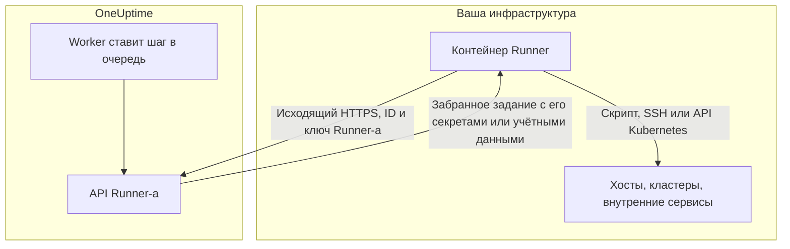
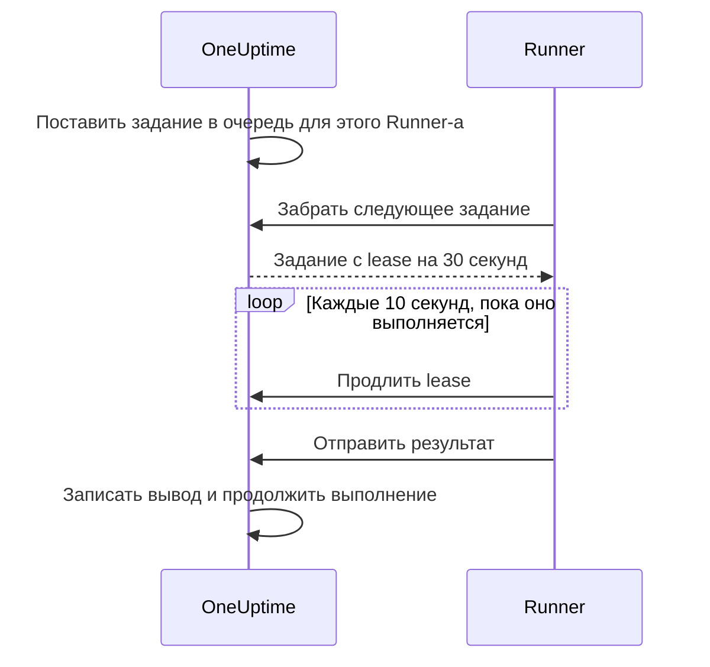

# Агенты runbook-ов

**Агент runbook-ов**, который в панели называется **Runner**, — это небольшой самостоятельно размещаемый процесс, выполняющий шаги JavaScript, Bash, SSH и Kubernetes ваших runbook-ов **в вашей собственной инфраструктуре**. OneUptime Worker никогда не выполняет ваши скрипты: он ставит их в очередь, а Runner, выбранный автором шага, забирает каждое задание, выполняет его и отправляет результат обратно. Эта страница для тех, кто устанавливает и эксплуатирует Runner-ы.

:::cards
- [Установка Runner-а](#установка-runner-а): От панели до подключённого контейнера за пять шагов.
- [Привязка шага к Runner-у](#привязка-шага-к-runner-у): Привяжите шаг к Runner-у, который должен его выполнять.
- [Тайм-ауты](#тайм-ауты): Тайм-ауты claim и выполнения и как они взаимодействуют.
- [Переменные окружения](#переменные-окружения): Что контейнер читает при запуске.
:::

## Как это работает



1. Вы создаёте Runner в OneUptime. OneUptime генерирует для него ID и секретный ключ.
2. Вы запускаете контейнер Runner на хосте в своей инфраструктуре с этим ID, этим ключом и URL вашего OneUptime.
3. Runner запрашивает у OneUptime работу каждые 5 секунд и каждые 60 секунд сообщает, что он жив.
4. Когда вы пишете шаг JavaScript, Bash, SSH или Kubernetes, вы выбираете Runner из выпадающего списка. Шаг привязывается к этому Runner-у.
5. Когда шаг выполняется, Worker ставит в очередь задание с `targetAgentId`, равным этому Runner-у. Забрать его может только этот Runner.
6. Runner выполняет задание локально — `bash -c <script>` для Bash, песочница `isolated-vm` для JavaScript, SSH-соединение или вызов API-сервера кластера с учётными данными шага, — записывает результат и отправляет его обратно. Worker продолжает runbook с этим результатом.

Runner-у нужен только **исходящий HTTPS** к вашему экземпляру OneUptime. Он не принимает входящих подключений.

У Runner-а есть только его ID и ключ. Всё остальное он получает вместе с заданием, которое забирает: скрипт с подставленными [секретами runbook-ов](/docs/runbooks/credentials#секреты-для-скриптов), назначенными ему, или [учётные данные](/docs/runbooks/credentials), на которые ссылается шаг SSH или Kubernetes. Поэтому любой, у кого есть ключ Runner-а, может действовать как этот Runner: обращайтесь с ключом так же, как с назначенными ему учётными данными.

## Почему скрипты выполняются на Runner-е

У выполнения скриптов на OneUptime Worker было две проблемы:

- **Граница доверия.** Любой, кто мог написать runbook, мог выполнить код на Worker с доступом ко всему, до чего Worker мог дотянуться.
- **Досягаемость.** Большинство полезных шагов действуют на _вашу_ инфраструктуру («перезапусти этот сервис», «найди запись в нашей внутренней базе данных»), а не на инфраструктуру OneUptime.

С Runner-ами эти шаги выполняются на хосте, которым вы управляете, и вы решаете, что этому хосту разрешено. Шаги HTTP-запросов и AI по-прежнему выполняются на Worker, потому что им ничего не нужно из вашей сети.

## Прежде чем начать

- **Хост с Docker** в вашей инфраструктуре, который может обращаться к URL вашего OneUptime по HTTPS и к системам, с которыми работают ваши шаги.
- **Роль, которая создаёт Runner-ы.** Создать его могут Project Owner, Project Admin, Project Member и Runbook Admin. Видеть ключ Runner-а, который содержится в команде установки, могут только Project Owner, Project Admin или Runbook Admin.

## Установка Runner-а

### 1. Создайте запись агента

Перейдите в **Сборники инструкций → Агенты runbook-ов** и создайте нового агента. Нажмите **Создать: Runner** и заполните два шага:

| Поле | Шаг | Примечания |
| --- | --- | --- |
| **Имя** | **Runner** | Понятное имя, обычно где он работает и до чего может достучаться, например `prod-eu-west-1`. Именно его вы выбираете при написании шага. |
| **Описание** | **Runner** | Необязательно. Предложение о том, к чему этот хост имеет доступ. |
| **Метки** | **Runner** (в **Дополнительные поля**) | Необязательно. |
| **Выполняет сценарии** | **Возможности** | Включено по умолчанию. Позволяет этому Runner-у забирать шаги runbook-ов. |
| **Выполняет ИИ-исправления кода** | **Возможности** | Выключено по умолчанию. Позволяет ему открывать pull request-ы с исправлениями кода от ИИ; см. [Fix Tasks](/docs/ai/ai-agent). |
| **Выполняет ИИ-команды устранения** | **Возможности** | Выключено по умолчанию. Позволяет автоматическому устранению с помощью ИИ выполнять на нём проверенные политикой команды. Чтобы включить это для Runner-а с учётными данными SSH, нужно разрешение на чтение учётных данных runbook-ов; см. [Runner-ы, выполняющие команды OneUptime AI](/docs/runbooks/credentials#runner-ы-выполняющие-команды-oneuptime-ai). |

Runner подхватывает изменение своих возможностей при следующем heartbeat; перезапускать его не нужно.

### 2. Скопируйте команду установки

Нажмите **Показать инструкции по настройке** в строке Runner-а. Диалог **Настройка агента сценария** показывает команду `docker run`, которая уже содержит ID и ключ этого Runner-а. Та же команда есть на собственной странице Runner-а в разделе **Инструкции по настройке**.

Прочитать ключ могут только Project Owner, Project Admin или Runbook Admin. Все остальные вместо команды видят «У вас нет прав на просмотр ключа этого агента сценария».

### 3. Запустите её на хосте в своей инфраструктуре

Запустите команду на хосте в своей среде, который может:

- обращаться к вашему экземпляру OneUptime по HTTPS и
- делать то, что нужно вашим шагам, например подключаться к другим хостам по SSH, вызывать API-сервер кластера или работать с базой данных.

```bash
docker run --name oneuptime-runner --restart unless-stopped \
  -e ONEUPTIME_RUNNER_ID=<runner-id> \
  -e ONEUPTIME_RUNNER_KEY=<runner-key> \
  -e ONEUPTIME_URL=https://oneuptime.yourdomain.com \
  -d oneuptime/runner:release
```

### 4. Убедитесь, что агент подключён

Вернитесь в **Сборники инструкций → Агенты runbook-ов**. В течение минуты после запуска контейнера **Статус** Runner-а должен показать **Подключено** со свежей **Последняя активность**. На собственной странице Runner-а карточка **Статус агента сценария** показывает его **Версия агента сценария** и **Хост**. Если он продолжает показывать **Никогда не подключался** или **Отключено**, см. [Устранение неполадок](#устранение-неполадок).

### 5. Обновляйте агента

Когда агент работает на более старой версии, чем ваш OneUptime, рядом с его **Версия агента сценария** на его странице появляется предупреждающий значок. Выберите его, чтобы узнать, как обновиться: скачайте новый образ, удалите контейнер и снова выполните команду установки из шага 2. Агент, установленный чартом агента Kubernetes, вместо этого обновляется вместе с чартом.

```bash
docker pull oneuptime/runner:release
docker rm -f oneuptime-runner
```

## Привязка шага к Runner-у

:::steps
### Добавьте шаг, который выполняется на Runner-е

Добавьте шаг JavaScript, Bash, SSH или Kubernetes в **Шаги** вашего runbook-а.

### Выберите Runner

Выпадающий список **Runner** шага показывает все Runner-ы проекта и то, подключены ли они. Если в проекте их ещё нет, шаг сообщает об этом и указывает на **Runbooks › Runners**.

### Сохраните шаги

Нажмите **Save Steps**. Когда выполнение доходит до шага, Worker ставит задание в очередь для ID этого Runner-а, и забрать его может только этот Runner.
:::

Bash выполняется через `bash -c`. JavaScript выполняется в песочнице `isolated-vm` на Runner-е без доступа к файловой системе и процессам; он может вызывать публичные HTTP API через `axios`, но не адреса в частной сети. Шаги SSH и Kubernetes используют [учётные данные](/docs/runbooks/credentials), указанные в шаге, и они должны быть назначены тому же Runner-у.

Нужно больше одного Runner-а? Создайте их и привяжите каждый шаг к нужному. Для отказоустойчивости запустите дополнительный Runner и распределите шаги между ними или держите резервный runbook, шаги которого указывают на другой Runner.

## Заметки по эксплуатации

### Тайм-ауты

К каждому шагу, выполняемому на Runner-е, применяются два тайм-аута:

| Тайм-аут | По умолчанию | Что контролирует |
| --- | --- | --- |
| **Claim timeout** | 2 минуты | Сколько Worker ждёт, пока выбранный Runner заберёт задание. Если Runner не заберёт его вовремя, шаг завершается сбоем по тайм-ауту, а runbook продолжается (или останавливается, в зависимости от **Продолжить при сбое**). |
| **Execution timeout** | 30 секунд | Сколько Runner даёт шагу выполняться, прежде чем остановить его. Bash получает `SIGKILL`; песочница JavaScript уничтожается. |

Оба настраиваются для каждого шага. Откройте **Runbooks › ваш runbook › Шаги**, разверните шаг и задайте **Execution timeout** и **Claim timeout** (в секундах) в его настройках. Оставьте поле пустым, чтобы использовать значение по умолчанию. Каждый принимает от 1 секунды до 1 часа; значения вне этого диапазона ограничиваются при выполнении шага.

Общее окно ожидания Worker — `claim timeout + execution timeout + a few seconds`. Выбирайте значения, подходящие для шага.

Две вещи, о которых стоит помнить, снижая claim timeout:

- Runner запрашивает работу циклами опроса (`ONEUPTIME_RUNNER_POLL_INTERVAL_MS`, по умолчанию 5 секунд). Claim timeout короче одного цикла может истечь раньше, чем совершенно исправный Runner вообще увидит задание, и тогда шаг завершается сбоем с тем же сообщением, что и при Runner-е не в сети.
- Runner по умолчанию выполняет одно задание за раз (`ONEUPTIME_RUNNER_CONCURRENCY`). Пока его занимает долгий шаг, другие шаги, указывающие на тот же Runner, ждут до истечения своих claim timeout. Если вы увеличиваете execution timeout до минут, соответственно увеличьте claim timeout у шагов, использующих этот Runner, или дайте им другой Runner.

### Lease и heartbeat



Забирая задание, Runner получает короткий lease (по умолчанию 30 секунд). Пока шаг выполняется, Runner продлевает lease каждые 10 секунд. Если Runner падает или теряет сеть посреди скрипта, lease истекает, и Worker помечает задание как `TimedOut`, а не ждёт вечно.

Подпроцессы Bash **не** отменяются автоматически, когда истекает lease (песочнице JavaScript тоже дают закончить, если она вообще заканчивает), но Worker перестаёт их ждать, а Runner не может отправить результат после того, как задание забрал кто-то другой. Пишите скрипты так, чтобы их можно было безопасно запустить повторно, если для вас важно ровно одно выполнение.

### Если OneUptime Worker перезапускается посреди шага

Выполнение runbook-а идёт на одном Worker от начала до конца, поэтому развёртывание или сбой могут прервать его, пока шаг выполняется. Что будет дальше, зависит от того, подхватят ли выполнение снова:

- **Оно возобновляется.** Worker, который его подхватывает, находит задание, уже созданное вашим шагом, и **снова подключается к нему**. Он ждёт это задание, а не отправляет вашему Runner-у ещё одну копию скрипта. Если Runner уже закончил, записанный результат используется как есть. Шаг отправляется на Runner не более одного раза за выполнение.
- **Оно не возобновляется.** Если выполнение так и не подхватят, очистка помечает его как `Failed`, когда оно выходит за окно claim и выполнения своего текущего шага, с сообщением, в котором назван шаг. Выполнение никогда не зависает в `Running`.

Единственное, чего это не может сказать, — как далеко зашёл скрипт до того, как Worker пропал. Шаг, который был в процессе выполнения, отмечается как неудавшийся с пометкой, что он мог выполниться частично: проверьте целевую систему, прежде чем запускать runbook снова.

### Нет агентов в сети

Если выбранный Runner не в сети, когда выполняется шаг, задание ждёт в `Pending`, пока не пройдёт claim timeout, а затем шаг завершается сбоем с «No runbook agent picked up this step before the wait window expired.» Страница **Агенты runbook-ов** — место, где проверяют покрытие перед тем, как запускать runbook по-настоящему.

### Ограничение вывода

stdout и stderr вместе ограничены **50 КБ** на шаг. Более длинный вывод обрезается с пометкой. Если нужен полный лог, запишите его из скрипта в хранилище логов или объектное хранилище и выведите URL через `echo`.

### Отмена

Отмена выполнения runbook-а со страницы выполнения или через API сразу помечает все его задания в `Pending`, `Claimed` и `Running` как `Cancelled`. Runner, который уже выполняет скрипт, доводит работу до конца, но сервер не принимает результат, и ни один последующий шаг runbook-а не отправляется.

### Параллельность

Каждый Runner по умолчанию выполняет одно задание за раз. Чтобы разрешить больше, задайте `ONEUPTIME_RUNNER_CONCURRENCY` в контейнере, но помните, что Runner делит хост со всем остальным, что на нём работает.

## Переменные окружения

Runner читает их при запуске:

| Переменная | Обязательна | По умолчанию | Примечания |
| --- | --- | --- | --- |
| `ONEUPTIME_URL` | да | — | Базовый URL вашего экземпляра OneUptime, например `https://oneuptime.yourdomain.com`. |
| `ONEUPTIME_RUNNER_ID` | да | — | ID Runner-а из его команды установки. |
| `ONEUPTIME_RUNNER_KEY` | да | — | Секретный ключ Runner-а из его команды установки. |
| `ONEUPTIME_RUNNER_POLL_INTERVAL_MS` | нет | `5000` | Как часто Runner запрашивает новые задания. Значение меньше `1000` заменяется значением по умолчанию. |
| `ONEUPTIME_RUNNER_HEARTBEAT_INTERVAL_MS` | нет | `60000` | Как часто Runner сообщает, что он жив. Значение меньше `5000` заменяется значением по умолчанию. |
| `ONEUPTIME_RUNNER_JOB_HEARTBEAT_INTERVAL_MS` | нет | `10000` | Как часто Runner продлевает lease выполняющегося задания. Значение меньше `1000` заменяется значением по умолчанию. |
| `ONEUPTIME_RUNNER_CONCURRENCY` | нет | `1` | Максимум одновременных заданий на этом Runner-е. |
| `ONEUPTIME_RUNNER_ENABLE_RUNBOOKS` | нет | — | Задайте `false`, чтобы этот Runner перестал забирать шаги runbook-ов, что бы ни говорила панель. Эта переменная может только выключить возможность. |
| `ONEUPTIME_RUNNER_ENABLE_CODE_FIXES` | нет | — | Задайте `false`, чтобы этот Runner перестал забирать исправления кода от ИИ, что бы ни говорила панель. |
| `ONEUPTIME_RUNNER_ENABLE_AI_COMMANDS` | нет | — | Задайте `false`, чтобы этот Runner перестал выполнять команды устранения от ИИ, что бы ни говорила панель. |

## Смена ключа агента

Если ключ утёк, сбросьте его. Старый ключ сразу перестаёт работать.

:::steps
### Сбросьте ключ

Откройте Runner из **Сборники инструкций → Агенты runbook-ов**, нажмите **Сбросить ключ агента сценария** и подтвердите. Runner перестаёт подключаться, пока у него нет нового ключа.

### Запустите контейнер с новым ключом

Скопируйте новую команду из **Инструкции по настройке** Runner-а, удалите старый контейнер и выполните новую команду на том же хосте:

```bash
docker rm -f oneuptime-runner
```

### Убедитесь, что он снова подключился

В **Сборники инструкций → Агенты runbook-ов** **Статус** Runner-а в течение минуты вернётся к **Подключено**.
:::

## Разрешения

Управление агентами находится в существующей группе разрешений Runbooks:

- `CreateRunner`, `EditRunner`, `DeleteRunner`, `ReadRunner` — управление записями агентов.
- `RunbookAdmin`, `RunbookMember`, `RunbookViewer` (роли) — `RunbookAdmin` создаёт runbook-и, их правила и Runner-ы, на которых они выполняются, и запускает их. `RunbookMember` открывает runbook-и и их выполнения и запускает их — начинает выполнение, завершает или пропускает его шаги и отменяет его, — но не создаёт, не изменяет и не удаляет ни runbook-и, ни Runner-ы. `RunbookViewer` читает runbook-и и их выполнения и ничего не запускает. `RunbookAdmin` объединяет все перечисленные выше детальные разрешения.

Чтобы запустить runbook (и тем самым отправить его шаги Runner-ам), нужна роль, которая запускает runbook-и, — `ProjectOwner`, `ProjectAdmin`, `ProjectMember`, `RunbookAdmin` или `RunbookMember`, — либо `CreateRunbookExecution`; для завершения, пропуска или отмены выполнения подходит также `EditRunbookExecution`. Роль запускает только те runbook-и, до которых дотягивается её область.

Ключ Runner-а могут прочитать только Project Owner, Project Admin и Runbook Admin.

## API для агентов

Для любопытных: Runner использует эти конечные точки, смонтированные под `/runner-ingest`. Путь до объединения, `/runbook-agent-ingest`, по-прежнему обслуживается для агентов, которые ещё не развёрнуты заново, чтобы обновление сервера их не сломало. Аутентификация — по ID и ключу Runner-а в теле JSON (`agentId` и `agentKey`) или в заголовках `x-agent-id` и `x-agent-key`.

| Конечная точка | Назначение |
| --- | --- |
| `POST /heartbeat` | Сигнал жизни. Обновляет время последней активности Runner-а, версию и сведения о хосте и возвращает возможности, которые ему предоставил проект. |
| `POST /claim-next-job` | Атомарно забрать самое старое задание в `Pending`, адресованное ID этого Runner-а. Возвращает `{ job: null }`, когда делать нечего. |
| `POST /job/:jobId/heartbeat` | Продлить lease задания. Возвращает 404, если lease истёк или задание завершено. |
| `POST /job/:jobId/result` | Отправить итоговый результат. Игнорируется, если lease уже перешёл дальше. |
| `POST /disconnect` | Отключиться при штатной остановке. |

Вызывать их вручную не придётся: это делает поставляемый Runner. Они описаны здесь, чтобы вы могли написать своего агента, если у вас есть ограничение, которому наш не подходит.

## Устранение неполадок

:::details Runner продолжает показывать Никогда не подключался или Отключено
- Проверьте логи контейнера командой `docker logs oneuptime-runner` на ошибки аутентификации или сети.
- Проверьте, что хост может достучаться до URL вашего OneUptime, например через `curl`.
- Проверьте, что ID и ключ скопированы без пробелов и что `ONEUPTIME_URL` — тот адрес, по которому вы открываете OneUptime.

**Никогда не подключался** означает, что Runner ни разу не выходил на связь. **Отключено** означает, что выходил, но не за последние 5 минут.
:::

:::details Шаги завершаются сбоем с «No runbook agent picked up this step before the wait window expired.»
Runner шага не забрал задание в пределах своего claim timeout. Проверьте, что Runner в состоянии **Подключено**, что для него включено **Выполняет сценарии** и что он не занят долгим шагом: он выполняет одно задание за раз, если вы не увеличили `ONEUPTIME_RUNNER_CONCURRENCY`. Claim timeout короче интервала опроса даёт сбой так же.
:::

:::details Шаги завершаются сбоем с «The runbook agent stopped responding while this step was running.»
Runner забрал задание, а затем перестал продлевать lease: он упал, перезапустился или потерял сеть. Убедитесь, что он в сети, а затем проверьте целевую систему, прежде чем запускать runbook снова.
:::

:::details Runner пишет в лог «No capability is enabled»
Для этого Runner-а выключены все возможности. Включите **Выполняет сценарии** на странице Runner-а в OneUptime. Он подхватит изменение при следующем heartbeat.
:::

## Дальнейшие шаги

:::cards
- [Написание runbook-а](/docs/runbooks/authoring): Напишите шаги, которые выполняются на вашем Runner-е.
- [Учётные данные runbook-ов](/docs/runbooks/credentials): Дайте шагам SSH и Kubernetes управляемый доступ.
- [Конфигурация и безопасность runbook-ов](/docs/runbooks/configuration): Ограничения, разрешения и защита.
:::
