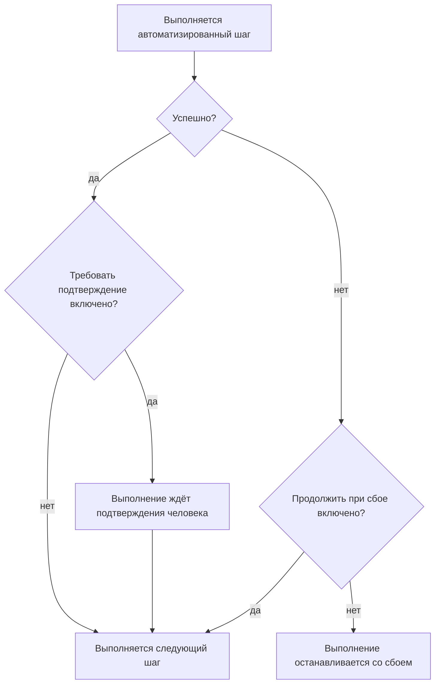

# Написание runbook-а

Runbook пишется как упорядоченный список шагов на его странице **Шаги**. Здесь показано, как создать runbook, как настроить каждый из семи типов шагов и как сбои и подтверждения меняют ход выполнения.

:::cards
- [Создание runbook-а](#создание-runbook-а): От пустого runbook-а до сохранённых шагов.
- [Типы шагов](#типы-шагов): Manual, JavaScript, HTTP request, Bash, SSH, Kubernetes и AI.
- [Обработка сбоев и подтверждения](#обработка-сбоев-и-подтверждения): Что происходит, когда шаг завершается сбоем или успешно.
- [Разбор примера](#разбор-примера): Переключение базы данных за пять шагов.
:::

## Прежде чем начать

- **Роль, которая пишет runbook-и.** Project Owner, Project Admin и Runbook Admin создают runbook-и и сохраняют их шаги. При детальных разрешениях вам нужны **Create Runbook** и **Edit Runbook**. См. [Разрешения](/docs/runbooks/configuration#разрешения).
- **Runner для шагов JavaScript, Bash, SSH и Kubernetes.** Эти шаги выполняются на [Runner-е](/docs/runbooks/agents) в вашей собственной инфраструктуре, никогда на OneUptime Worker. Сначала установите его.
- **Учётные данные для шагов SSH и Kubernetes и разрешение на их чтение.** См. [Учётные данные runbook-ов](/docs/runbooks/credentials). Шаг может ссылаться на учётные данные, только если вам разрешено читать учётные данные runbook-ов: Project Owner, Project Admin или **Read Runbook Credential**. Runbook Admin этого не включает.
- **LLM-провайдер для AI-шагов.** См. [Провайдеры LLM](/docs/ai/llm-provider).

## Создание runbook-а

:::steps
### Откройте runbook-и

Откройте **Продукты → Сборники инструкций**. Runbook-и находятся в группе **Дашборды и автоматизация**.

### Создайте runbook

Нажмите **Создать: Сценарий**, введите **Имя** и при желании **Описание** назначения runbook-а. В **Дополнительные поля** находятся переключатель **Включено**, по умолчанию включённый, и **Метки**. Новый runbook появится в списке: откройте его.

### Добавьте шаги

Перейдите в **Шаги**. В **Start your runbook** выберите тип первого шага; под последним шагом **Add another step** предлагает те же семь типов. Каждый шаг открывается со своими полями **Заголовок**, **Описание** (Markdown, показывается реагирующему) и настройками своего типа. Когда в runbook-е уже есть шаг, **Добавить шаг** вверху карточки добавляет Manual-шаг.

### Расставьте шаги по порядку

Шаги выполняются **по порядку**. Чтобы изменить порядок, перетащите шаг за маркер слева в его заголовке; с клавиатуры наведите фокус на маркер, нажмите пробел, переместите шаг клавишами со стрелками и снова нажмите пробел.

### Сохраните шаги

Нажмите **Save Steps**. До этого редактор показывает **Несохранённые изменения**. После сохранения вы увидите **Сохранено**, и runbook готов к [выполнению](/docs/runbooks/running).
:::

## Устройство шага

У каждого шага есть такие поля:

| Поле | Назначение |
| --- | --- |
| **Заголовок** | Короткая подпись, которая показывается в списке шагов и в каждом выполнении. |
| **Описание** | Необязательный контекст для реагирующего, в Markdown. Для Manual-шага это инструкция, которую читает человек. |
| **Продолжить при сбое** | Только для автоматизированных шагов. Если включено, сбой шага не останавливает выполнение: следующий шаг всё равно выполняется. |
| **Требовать подтверждение** | Только для автоматизированных шагов. Если включено, runbook приостанавливается после этого шага и ждёт, пока человек подтвердит, прежде чем выполнится следующий шаг. Переключатель называется **Требовать подтверждение перед выполнением следующего шага**. |
| Настройки типа | Скрипт, URL, Runner, учётные данные или промпт. См. [Типы шагов](#типы-шагов). |

## Типы шагов

| Тип | Где выполняется | Что нужно |
| --- | --- | --- |
| [Manual](#manual) | Человек | Ничего |
| [JavaScript](#javascript) | Runner | Runner |
| [HTTP request](#http-request) | OneUptime Worker | Ничего |
| [Bash](#bash) | Runner | Runner |
| [SSH](#ssh) | Runner | Runner и учётные данные SSH |
| [Kubernetes](#kubernetes) | Runner | Runner и учётные данные Kubernetes |
| [AI](#ai) | OneUptime Worker | LLM-провайдер |

### Manual

Пункт чек-листа для человека. Дойдя до Manual-шага, выполнение приостанавливается и остаётся в `WaitingForManualStep` (**Ожидает вас**), пока кто-нибудь не нажмёт **Mark complete** или **Пропустить**. Выполнение, ожидающее человека, никогда не истекает по времени.

Используйте его для того, что может проверить или сделать только человек: «Убедитесь в панели балансировщика нагрузки, что трафик переключился на резервный регион».

### JavaScript

Фрагмент JavaScript, который выполняется в песочнице `isolated-vm` на [агенте runbook-ов](/docs/runbooks/agents) в вашей собственной инфраструктуре, а не на OneUptime Worker.

| Поле | Что делает | По умолчанию |
| --- | --- | --- |
| **Runner** | Runner, который выполняет шаг. Забрать задание может только этот Runner. | — |
| **Script** | JavaScript для выполнения. Верните значение через `return`, чтобы записать его; каждая строка `console.log` тоже записывается. Выброшенная ошибка приводит к сбою шага. | — |
| **Execution timeout** | Сколько Runner даёт фрагменту выполняться, прежде чем уничтожить песочницу. | 30 секунд |
| **Claim timeout** | Сколько Worker ждёт, пока Runner заберёт задание. | 2 минуты |

```javascript
const start = Date.now();
// ... your logic ...
console.log("replica lag checked");
return { durationMs: Date.now() - start };
```

У песочницы 128 МБ памяти и нет доступа к файловой системе и процессам. Она может отправлять HTTP-запросы через `axios`, но только на публичные адреса: запрос в частную сеть, к собственному хосту Runner-а или к облачной конечной точке метаданных отклоняется. Чтобы обратиться к сервису в своей сети, используйте шаг [Bash](#bash) с `curl`.

### HTTP request

Исходящий HTTP-вызов, который делает OneUptime Worker. Runner не нужен.

| Поле | Что делает | По умолчанию |
| --- | --- | --- |
| **Method** | `GET`, `POST`, `PUT`, `PATCH`, `DELETE` или `HEAD`. | `GET` |
| **URL** | Вызываемая конечная точка. | Пусто |
| **Headers (JSON)** | JSON-объект, например `{ "Authorization": "Bearer ..." }`. Заголовки, которые не являются корректным JSON, приводят к сбою шага. | Нет |
| **Body** | Отправляется как JSON, если разбирается как JSON, иначе как текст. | Нет |
| **Request timeout** | Сколько ждать ответа конечной точки, прежде чем шаг завершится сбоем. | 30 секунд |

Шаг завершается успешно при ответе `2xx` или `3xx` и сбоем при любом другом, с ошибкой `HTTP <status>`. Перенаправления не выполняются. Статус ответа, заголовки и тело записываются, до 50 КБ.

> [!NOTE]
> Worker никогда не обращается к адресам loopback и link-local, например к облачной конечной точке метаданных. В OneUptime Cloud он обращается только к публичным адресам. Самостоятельно размещённый OneUptime достаёт и до частных сетей, если только `DATA_SOURCE_BLOCK_PRIVATE_ADDRESSES` не равно `true`. Чтобы вызвать сервис в своей сети из OneUptime Cloud, используйте шаг [Bash](#bash) с `curl`.

Полезно, чтобы: открыть инцидент в PagerDuty, отправить сообщение в вебхук Slack, вызвать API облачного провайдера или свой публичный API.

### Bash

Bash-скрипт, который выполняется через `bash -c <script>` на [агенте runbook-ов](/docs/runbooks/agents) в вашей собственной инфраструктуре. Bash никогда не выполняется на OneUptime Worker.

| Поле | Что делает | По умолчанию |
| --- | --- | --- |
| **Runner** | Runner, который выполняет шаг. Забрать задание может только этот Runner. | — |
| **Bash-скрипт** | Скрипт. Вывод (stdout и stderr) записывается до 50 КБ, а ненулевой код выхода приводит к сбою шага. | — |
| **Execution timeout** | Сколько Runner даёт скрипту выполняться, прежде чем завершить его через `SIGKILL`. Увеличьте его для шагов, которым по делу нужны минуты. | 30 секунд |
| **Claim timeout** | Сколько Worker ждёт, пока Runner заберёт задание. | 2 минуты |

Скрипт выполняется в контейнере Runner-а с инструментами, которые есть в его образе, такими как `curl`, `wget` и клиент `ssh`, и с сетевым доступом хоста, на котором он работает. Например, чтобы проверить сервис, доступный только из вашей сети:

```bash
set -euo pipefail
HTTP_CODE=$(curl -s -o /tmp/resp.txt -w "%{http_code}" "http://payments.internal:8080/health")
echo "HTTP $HTTP_CODE"
cat /tmp/resp.txt
if [[ "$HTTP_CODE" != "200" ]]; then
  echo "Health check failed"
  exit 1
fi
```

Если выбранный Runner не в сети, когда выполнение доходит до этого шага, шаг ждёт до **claim timeout** (по умолчанию 2 минуты), а затем завершается сбоем по тайм-ауту. Добавьте агента в **Сборники инструкций → Агенты runbook-ов**, прежде чем полагаться на Bash-шаг.

> [!TIP]
> Не храните пароли и токены в скрипте. Сохраните их как секреты runbook-ов и напишите `{{runbookSecrets.NAME}}` в скрипте Bash или JavaScript: Runner получит скрипт с подставленным значением. См. [Секреты для скриптов](/docs/runbooks/credentials#секреты-для-скриптов).

### SSH

Выполнить одну команду на хосте, до которого Runner может достучаться по SSH. В отличие от `ssh host cmd` в Bash-шаге, доступ здесь — это управляемые [учётные данные](/docs/runbooks/credentials), а не закрытый ключ на диске Runner-а: они зашифрованы при хранении, назначены определённым Runner-ам и больше никогда не читаются через API.

| Поле | Что делает |
| --- | --- |
| **Runner** | Runner, который открывает соединение. Он должен иметь сетевой доступ к хосту. |
| **Credential** | Учётные данные SSH с хостом, портом, пользователем и ключом или паролем. Они должны быть назначены выбранному Runner-у, иначе шаг завершится сбоем, а не выполнится с чужим доступом. |
| **Command** | Выполняется на удалённом хосте от имени пользователя из учётных данных. Вывод записывается до 50 КБ, а ненулевой код выхода приводит к сбою шага. |
| **Execution timeout** | Охватывает подключение, аутентификацию и выполнение команды вместе, поэтому зависшая команда не может держать шаг открытым. По умолчанию 30 секунд. |
| **Claim timeout** | Сколько Worker ждёт, пока Runner заберёт задание. По умолчанию 2 минуты. |

### Kubernetes

Перезапустить или масштабировать рабочую нагрузку в кластере. Действия намеренно ограничены закрытым набором: шаг, способный менять произвольные объекты, был бы оболочкой администратора кластера, а этот тип шага существует для того, чтобы сделать обычные исправления достаточно безопасными для автоматического устранения.

| Поле | Что делает |
| --- | --- |
| **Runner** | Runner, который обращается к API-серверу кластера. Он должен иметь к нему доступ. |
| **Credential** | Учётные данные Kubernetes: URL API-сервера, токен сервисного аккаунта и CA кластера. Привяжите этот сервисный аккаунт к роли, которая разрешает только то, что нужно вашим runbook-ам. |
| **Действие** | **Restart workload** изменяет шаблон пода, чтобы контроллер пересоздал поды, как это делает `kubectl rollout restart`. **Scale workload** задаёт число реплик. |
| **Workload kind** | **Развёртывание**, **StatefulSet** или **DaemonSet**. |
| **Пространство имен** и **Workload name** | Рабочая нагрузка, над которой выполняется действие. |
| **Реплики** | Только при масштабировании. Ноль допустим: опустошить рабочую нагрузку — законное исправление. DaemonSet запускает один под на узел и не масштабируется; вместо этого перезапустите его. |
| **Execution timeout** | Сколько Runner ждёт, пока API-сервер примет изменение. По умолчанию 30 секунд. |
| **Claim timeout** | Сколько Worker ждёт, пока Runner заберёт задание. По умолчанию 2 минуты. |

Если API-сервер отклоняет изменение, на шаге показывается его собственное сообщение, так что ошибка прав подскажет, какую привязку роли нужно расширить.

### AI

Попросите ИИ проанализировать, обобщить или решить что-то посреди выполнения. Ответ становится выводом шага в выполнении. AI-шаги выполняются на OneUptime Worker; Runner не нужен.

| Поле | Что делает |
| --- | --- |
| **Prompt** | Что должен сделать ИИ. Например: «Изучи вывод предыдущих шагов и скажи, безопасно ли продолжать устранение». |
| **LLM provider** | Необязательно. **Project default** использует провайдера проекта по умолчанию. Закрепите провайдера, когда шагу нужна определённая модель, например самостоятельно размещённая модель для данных, которые не должны покидать вашу сеть. См. [Провайдеры LLM](/docs/ai/llm-provider). |
| **Include previous step context** | Если включено, ИИ видит всё о шагах, выполненных до этого: заголовок, тип, статус, вывод и сообщения об ошибках. Он получает до 4 000 символов вывода каждого шага. |
| **Include trigger context** | Если включено, ИИ видит, что запустило выполнение: связанный инцидент, оповещение или событие планового обслуживания (описание, серьёзность, текущее состояние, затронутые мониторы, первопричину, хронологию состояний и публичные заметки) или того, кто запустил runbook вручную. |

Сочетайте AI-шаг с **Требовать подтверждение**, чтобы человек оставался в контуре: ИИ анализирует, человек читает ответ и подтверждает, и только затем выполняется следующий (исправляющий) шаг.

**Что ИИ никогда не видит.** Ответ AI-шага сохраняется как вывод шага в выполнении, а выполнения может читать любой, у кого есть право чтения runbook-ов, — более широкая аудитория, чем у инцидента. Поэтому контекст триггера не включает **приватные внутренние заметки** и **сообщения каналов Slack и Microsoft Teams**. Вывод предыдущих шагов проверяется на секреты (токены, ключи, учётные данные), которые маскируются до отправки модели. Встроенные изображения и длинные закодированные данные, например скриншот, вставленный в описание инцидента, тоже не включаются, а на их месте остаётся короткая пометка.

AI-шаги учитываются и тарифицируются, как любая другая функция ИИ. Шаг завершается сбоем с сообщением о причине, если у него нет промпта, если функции ИИ отключены для проекта, если нет доступного LLM-провайдера или если закреплённый провайдер больше не доступен проекту. Включите **Продолжить при сбое**, если остальная часть runbook-а всё равно должна выполниться.

## Обработка сбоев и подтверждения



По умолчанию сбой шага останавливает выполнение и помечает его как `Failed`, с ошибкой шага в качестве причины. Если включено **Продолжить при сбое**, сбой записывается и выполняется следующий шаг — это подходит для runbook-ов вида «попробуй эти три вещи, потом сообщи». **Требовать подтверждение** действует после успешного шага: выполнение ждёт на этом шаге, пока кто-нибудь не нажмёт **Approve & continue** или **Пропустить**.

## Сохранение и редактирование

Изменения шагов вступают в силу, когда вы нажимаете **Save Steps**. Каждое выполнение работает со снимком, сделанным при его запуске, поэтому идущие выполнения сохраняют шаги, с которыми начались, а редактирование никогда не переписывает историю прошлых запусков.

## Разбор примера

Runbook для «DB primary unreachable»:

| # | Тип | Что делает |
| --- | --- | --- |
| 1 | JavaScript | Получить текущий primary-хост из вашего сервиса конфигурации и записать его в лог. |
| 2 | Manual | «Убедитесь, что задержка репликации на secondary меньше 5 секунд.» |
| 3 | HTTP request | `POST` в API вашего оркестратора переключения. |
| 4 | Manual | «Проверьте, что запись теперь идёт в новый primary.» |
| 5 | HTTP request | `POST` сообщения об отбое тревоги в вебхук Slack. |

Реагирующий видит, как выполняется шаг 1, отмечает шаг 2, видит выполнение шага 3, отмечает шаг 4, и выполнение завершается шагом 5. Вывод каждого шага записывается для постмортема.

## Дальнейшие шаги

:::cards
- [Выполнение runbook-а](/docs/runbooks/running): Запустите выполнение и завершите, подтвердите или пропустите его шаги.
- [Правила runbook-ов](/docs/runbooks/rules): Запускайте этот runbook автоматически на подходящих инцидентах.
- [Агенты runbook-ов](/docs/runbooks/agents): Установите Runner, который нужен вашим шагам со скриптами.
- [Учётные данные runbook-ов](/docs/runbooks/credentials): Дайте шагам SSH и Kubernetes управляемый доступ.
:::
