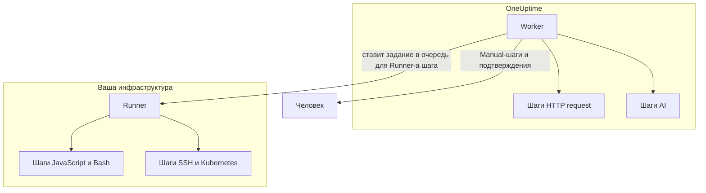

# Конфигурация и безопасность runbook-ов

Это справочник для эксплуатации и проверяющих безопасность: где выполняется каждый вид шага, каким ограничениям и тайм-аутам подчиняется шаг, кто что может делать и как защищены runbook-и.

:::cards
- [Где выполняется каждый тип шага](#где-выполняется-каждый-тип-шага): Worker, Runner или человек.
- [Ограничения вывода и тайм-ауты](#ограничения-вывода-и-тайм-ауты): Каждое ограничение, которому подчиняется шаг.
- [Разрешения](#разрешения): Детальные разрешения, три роли runbook-ов и до каких runbook-ов дотягивается роль.
- [Заметки о защите](#заметки-о-защите): Песочница, сетевой доступ и аутентификация Runner-ов.
:::

## Где выполняется каждый тип шага

| Тип шага | Где выполняется | Как |
| --- | --- | --- |
| Manual | Человек | Выполнение ждёт, пока кто-нибудь не завершит или не пропустит шаг. |
| JavaScript | Runner | В песочнице `isolated-vm`. |
| HTTP request | OneUptime Worker | Исходящий HTTP-вызов. |
| Bash | Runner | `bash -c <script>`. |
| SSH | Runner | SSH-соединение с [учётными данными](/docs/runbooks/credentials). |
| Kubernetes | Runner | Вызов API-сервера кластера с учётными данными. |
| AI | OneUptime Worker | Вызов LLM-провайдера проекта. |

## Как отправляются шаги для Runner-а

Шаги JavaScript, Bash, SSH и Kubernetes **никогда не выполняются на OneUptime Worker**. Они отправляются как задания определённому [агенту runbook-ов](/docs/runbooks/agents): небольшому процессу, который вы устанавливаете на хост в своей инфраструктуре.

Модель отправки:

1. Автор шага runbook-а выбирает Runner из выпадающего списка, когда пишет шаг.
2. Когда шаг выполняется, Worker вставляет в `RunnerJob` строку с `targetAgentId`, равным ID этого Runner-а, и статусом `Pending`.
3. Именно этот Runner (и только он) атомарно забирает задание, выполняет его локально — Bash через `bash -c <script>`, JavaScript в песочнице `isolated-vm`, SSH и Kubernetes с учётными данными шага — и отправляет результат обратно.
4. Worker продолжает runbook с этим результатом.

Флага окружения `RUNBOOK_BASH_ENABLED` больше нет. Работают ли эти шаги в установке, зависит только от того, есть ли в проекте подключённый Runner с включённым **Выполняет сценарии**.

## Ограничения вывода и тайм-ауты

| Ограничение | Значение | Применяется к |
| --- | --- | --- |
| Вывод на шаг | **50 КБ**. Более длинный вывод обрезается с пометкой. | Каждому автоматизированному шагу |
| Тайм-аут выполнения | По умолчанию **30 секунд** | Шагам JavaScript, Bash, SSH и Kubernetes |
| Тайм-аут запроса | По умолчанию **30 секунд** | Шагам HTTP request |
| Тайм-аут забирания | По умолчанию **2 минуты**: сколько Worker ждёт, пока выбранный Runner заберёт задание, прежде чем объявить сбой | Шагам JavaScript, Bash, SSH и Kubernetes |
| Диапазон тайм-аутов | **От 1 секунды до 1 часа** | Каждому тайм-ауту |
| Ожидание человека | Без ограничения | Manual-шагам и подтверждениям |

Задавайте тайм-ауты для каждого шага на странице **Шаги** runbook-а; оставьте поле пустым, чтобы сохранить значение по умолчанию. Значение вне диапазона ограничивается при выполнении шага, поэтому опечатка в конфигурации не может ни отключить тайм-аут, ни бесконечно занимать слот Worker.

## Разрешения

Разрешения runbook-ов находятся в группе разрешений `Runbook`:

- `CreateRunbook`, `EditRunbook`, `DeleteRunbook`, `ReadRunbook` — управление шаблонами runbook-ов.
- `CreateRunbookExecution`, `EditRunbookExecution`, `DeleteRunbookExecution`, `ReadRunbookExecution` — запуск, отметка, удаление и чтение выполнений.
- `CreateRunbookRule`, `EditRunbookRule`, `DeleteRunbookRule`, `ReadRunbookRule` — управление правилами автозапуска.
- `CreateRunner`, `EditRunner`, `DeleteRunner`, `ReadRunner` — управление Runner-ами, которые выполняют шаги в вашей собственной инфраструктуре. (До переименования в Runner они назывались `*RunbookAgent`; существующие назначения перенесены, так что ничего переназначать не нужно.)
- `RunbookAdmin`, `RunbookMember`, `RunbookViewer` (роли) — `RunbookAdmin` создаёт runbook-и, их правила и Runner-ы, на которых они выполняются, и запускает их. `RunbookMember` открывает runbook-и и их выполнения и запускает их — начинает выполнение, завершает или пропускает его шаги и отменяет его, — но не создаёт, не изменяет и не удаляет ни runbook-и, ни Runner-ы. `RunbookViewer` читает runbook-и и их выполнения и ничего не запускает. `RunbookAdmin` объединяет все перечисленные выше детальные разрешения.

Роль запускает те runbook-и, до которых дотягивается её область. Назначение `RunbookMember`, `RunbookAdmin` или `ProjectMember`, ограниченное некоторыми метками, запускает и ведёт дальше выполнения runbook-ов с этими метками, ограниченное **Owned** — выполнения runbook-ов, которыми владеет его команда, а блокировка метки для команды забирает у неё эти runbook-и. `CreateRunbookExecution` и `EditRunbookExecution` относятся к выполнениям, у которых нет меток, поэтому они дотягиваются до каждого runbook-а проекта. Подтверждение предложения по устранению, которое запускает runbook, проверяется так же.

Учётные данные и секреты находятся вне `RunbookAdmin`. Для управления ими нужны `ProjectOwner` или `ProjectAdmin` либо разрешения `CreateRunbookCredential`, `EditRunbookCredential`, `DeleteRunbookCredential`, `ReadRunbookCredential` и `CreateRunbookSecret`, `EditRunbookSecret`, `DeleteRunbookSecret`, `ReadRunbookSecret`. См. [Учётные данные runbook-ов](/docs/runbooks/credentials).

Правила владельцев и правила меток в **Сборники инструкций → Настройки** тоже находятся вне `RunbookAdmin`. Для управления ими нужны `ProjectOwner` или `ProjectAdmin` либо разрешения `CreateRunbookOwnerRule` и `CreateRunbookLabelRule` и их аналоги для изменения, удаления и чтения.

Как сочетаются роли и детальные разрешения, читайте в [Пользователи, команды и разрешения](/docs/permissions/index).

## Очередь и worker

Выполнения runbook-ов идут в очереди BullMQ `Runbook`. Каждый процесс Worker выполняет до 25 выполнений одновременно; это число задано в коде, а не переменной окружения.

Когда ручной шаг отмечается через API, выполнение снова ставится в очередь, чтобы продолжить со следующего шага. Оно ждёт в `Scheduled`, пока его снова не заберёт Worker, и выполнение в очереди никогда не завершается сбоем из-за ожидания.

## Заметки о защите

- **JavaScript, Bash, SSH и Kubernetes** выполняются на хосте Runner-а, которым вы управляете, а не на OneUptime Worker. JavaScript выполняется в отдельном изоляте `isolated-vm` с 128 МБ памяти и без доступа к файловой системе и процессам Runner-а; он может отправлять HTTP-запросы через `axios`, но запросы в частные сети, к адресам loopback и link-local отклоняются. Bash выполняется через `bash -c`, а его тайм-аут соблюдается на Runner-е.
- **HTTP-шаги** используют снисходительную проверку статуса, поэтому ответ 4xx или 5xx записывается как неудавшийся шаг, а не выбрасывается исключением, и записанный вывод отражает то, что на самом деле вернула другая сторона. Перенаправления не выполняются. Worker никогда не обращается к адресам loopback и link-local, например к облачной конечной точке метаданных; в OneUptime Cloud он также отклоняет адреса частных сетей, а самостоятельно размещённый OneUptime отклоняет их при `DATA_SOURCE_BLOCK_PRIVATE_ADDRESSES=true`.
- **AI-шаги** никогда не видят приватные заметки инцидентов и сообщения из Slack и Microsoft Teams, а вывод предыдущих шагов проверяется на секреты, которые маскируются до того, как он попадёт к модели. Встроенные изображения и длинные закодированные данные в промпт не включаются. См. [AI](/docs/runbooks/authoring#ai).
- **Аутентификация Runner-а** выполняется по ID и секретному ключу, заданным в контейнере Runner-а как переменные окружения. На сервере достоверная идентичность Runner-а берётся из строки базы данных, соответствующей предъявленным ID и ключу: клиент не может выдать себя за другой Runner даже со скомпрометированным ключом.
- **Учётные данные и секреты** зашифрованы при хранении, никогда не возвращаются API и передаются только тем Runner-ам, которым они назначены, когда те забирают шаг.

## Таблицы базы данных

| Таблица | Что содержит |
| --- | --- |
| `Runbook` | Шаблон: имя, slug, описание, `isEnabled`, метки и шаги в виде JSON. |
| `RunbookExecution` | Одна строка на запуск, с необязательными внешними ключами `incidentId`, `alertId` и `scheduledMaintenanceId` и JSON-массивом `stepExecutions`, фиксирующим шаги и состояние каждого шага. |
| `RunbookRule` | Правила автозапуска с дискриминатором `triggerEntityType` (Incident, Alert, ScheduledMaintenance), связью «многие ко многим» с runbook-ами для запуска и тем, по чему они совпадают: JSON-столбцом `criteria` (условия), а также связями «многие ко многим» с мониторами, серьёзностями инцидентов, серьёзностями оповещений, метками и метками мониторов и шаблонами заголовка, описания, имени монитора и описания монитора. |
| `Runner` | Одна строка на установленный Runner: имя, секретный ключ, `lastAlive`, `connectionStatus`, сведения о хосте и возможности. |
| `RunnerJob` | Одна строка на шаг, отправленный Runner-у: `targetAgentId` (Runner, выбранный автором шага), тип шага, скрипт или полезная нагрузка, статус (`Pending` → `Claimed` → `Running` → `Succeeded`, `Failed`, `TimedOut` или `Cancelled`), срок забирания, lease, вывод и код выхода. |
| `RunbookCredential` | Учётные данные SSH и Kubernetes с зашифрованными секретными полями и Runner-ы, которым они назначены. |
| `RunbookSecret` | Секреты runbook-ов, зашифрованные, и Runner-ы, которым разрешено их получать. |

## Советы по эксплуатации

- **Убедитесь, что Runner, выбранный в шаге, исправен.** Если нужна отказоустойчивость, запустите второй Runner и распределите шаги между ними или держите резервный runbook, нацеленный на другой Runner.
- **Сохраняйте URL, а не большие данные.** Если шаг выдаёт больше нескольких КБ вывода, запишите его в объектное хранилище или стек логирования и верните URL.
- **Идемпотентность важна.** Шаг HTTP request или AI выполняется снова, если Worker перезапускается посреди шага и выполнение возобновляется. Шаг на Runner-е отправляется не более одного раза за выполнение, но скрипт мог частично выполниться до сбоя, и вы можете запустить runbook снова. Проектируйте шаги так, чтобы их можно было безопасно повторить.

## Дальнейшие шаги

:::cards
- [Агенты runbook-ов](/docs/runbooks/agents): Установка, эксплуатация и устранение неполадок Runner-ов.
- [Учётные данные runbook-ов](/docs/runbooks/credentials): Управляемый доступ по SSH и к Kubernetes и секреты для скриптов.
- [Пользователи, команды и разрешения](/docs/permissions/index): Как роли, метки и команды решают, кто что запускает.
:::
