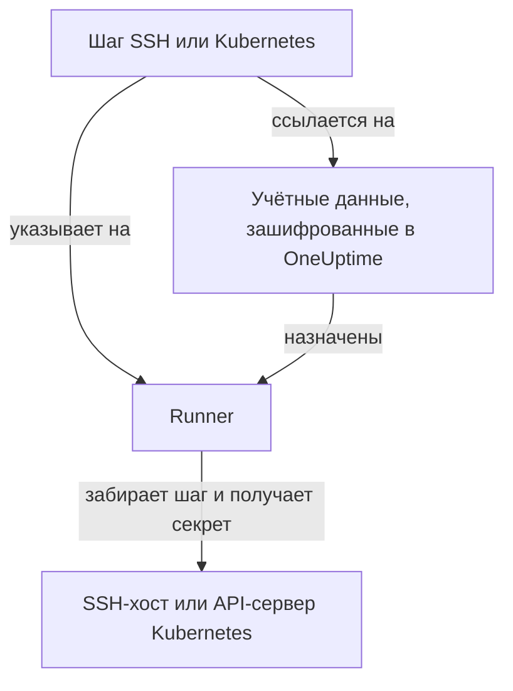

# Учётные данные runbook-ов

Учётные данные — это способ, которым runbook добирается до того, что **не** является собственным хостом Runner-а: до сервера по SSH или до кластера Kubernetes. Без них «перезапустить сервис» означает написать shell-скрипт и вручную положить ключ или kubeconfig на хост Runner-а, где он лежит на диске вне контроля OneUptime. Учётные данные дают тот же доступ в виде управляемого объекта: зашифрованного при хранении, назначенного определённым Runner-ам и указываемого в шаге по имени.

Управляйте ими в **Сборники инструкций → Агенты runbook-ов → Учётные данные**.

:::cards
- [Создание учётных данных](#создание-учётных-данных): Их доступ и Runner-ы, которым разрешено их использовать.
- [Минимальные привилегии на другой стороне](#минимальные-привилегии-на-другой-стороне): Ограничьте, что может делать ключ или токен.
- [Секреты для скриптов](#секреты-для-скриптов): Передайте скрипту Bash или JavaScript пароль или токен.
:::

## Как используются учётные данные



Шаг SSH или Kubernetes ссылается на учётные данные и на Runner. Когда этот Runner забирает шаг, OneUptime проверяет, что учётные данные ему назначены, расшифровывает секрет и передаёт его только в ответе на это забирание. Секрет никогда не сохраняется в задании и никогда не читается через API.

## Прежде чем начать

- **Роль, которая управляет учётными данными.** Project Owner и Project Admin или любой, у кого есть разрешение **Create Runbook Credential**. Роль Runbook Admin его не включает. Чтобы назначить учётные данные SSH Runner-у, который выполняет команды OneUptime AI, нужно ещё и **Read Runbook Credential**; см. [Runner-ы, выполняющие команды OneUptime AI](#runner-ы-выполняющие-команды-oneuptime-ai).
- **Тариф, который их включает.** В OneUptime Cloud учётные данные runbook-ов требуют тарифа **Growth** или выше.
- **[Runner](/docs/runbooks/agents)**, который имеет сетевой доступ к хосту или к API-серверу кластера.

## Создание учётных данных

:::steps
### Откройте учётные данные

Откройте **Сборники инструкций → Агенты runbook-ов → Учётные данные** и нажмите **Создать: Runbook Credential**.

### Назовите их и выберите тип

На шаге **Credential** введите **Имя**, например `prod-cluster`, необязательное **Описание** и **Тип**: **SSH** или **Kubernetes**. Тип нельзя изменить позже; вместо этого создайте новые учётные данные.

### Введите доступ

:::tabs
@tab SSH
В **SSH-хост** введите **Имя хоста**, **Порт** (22, если поле пустое) и **Имя пользователя**. В **Аутентификация SSH** вставьте **Private Key (PEM)** с его **Private Key Passphrase**, если она есть, или введите **Пароль** для хоста без доступа по ключу. Ключ — лучший выбор, когда он возможен.
@tab Kubernetes
В **Kubernetes** введите **API Server URL**, например `https://10.0.0.1:6443`, **Service Account Token** и **CA Certificate (PEM)**, чтобы Runner мог проверить API-сервер. Оставляйте CA пустым, только если API-сервер предъявляет сертификат, которому Runner уже доверяет.
:::

### Назначьте их Runner-ам

На шаге **Агенты runbook-ов** выберите Runner-ы, которым разрешено использовать эти учётные данные, затем нажмите **Создать: Runbook Credential**. Учётные данные, не назначенные ни одному Runner-у, не может использовать ни один шаг.

### Используйте их в шаге

В [шаге SSH или Kubernetes](/docs/runbooks/authoring#типы-шагов) выберите один из этих Runner-ов, затем учётные данные в **Credential**. Шаг предлагает только учётные данные своего типа, а чтобы сохранить шаг, ссылающийся на учётные данные, нужно разрешение на чтение учётных данных runbook-ов.
:::

## Что хранится

| Тип | Поля |
| --- | --- |
| SSH | Имя хоста, порт (по умолчанию 22), имя пользователя и либо закрытый ключ PEM (с необязательной парольной фразой), либо пароль. |
| Kubernetes | URL API-сервера, токен сервисного аккаунта и сертификат CA кластера. |

## Секретные значения только для записи

Закрытые ключи, парольные фразы, пароли и токены сервисных аккаунтов зашифрованы при хранении, и API **никогда их не возвращает**: ни панели, ни рабочему процессу, ни экспорту. Таблица может показать, *что представляют собой* учётные данные, никогда не показывая, что в них содержится.

Поэтому у секретного значения нет «показать», есть только «заменить»: повторный ввод значения — это и есть способ его сменить. Если вы потеряли оригинал, выпустите новый ключ в целевой системе и обновите учётные данные.

## Назначение учётных данных Runner-ам

Учётные данные могут использовать только те Runner-ы, которым вы их назначили, и шаг должен указывать на один из них. Если шаг ссылается на учётные данные, не назначенные его Runner-у, **шаг завершается сбоем, а не выполняется**: Runner, который молча ничего не делает, выглядит точно так же, как сработавший.

Назначение — это граница доступа, поэтому держите его узким: Runner, который только перезапускает один кластер, не нуждается в SSH-ключе от ваших хостов баз данных.

### Runner-ы, выполняющие команды OneUptime AI

На Runner-е с включённым **Выполняет ИИ-команды устранения** OneUptime AI выбирает среди назначенных Runner-у учётных данных SSH для команд, которые он там выполняет. Поэтому учётные данные SSH попадают на такой Runner только через человека, которому разрешено читать учётные данные runbook-ов (**Read Runbook Credential** либо Project Owner или Project Admin), независимо от того, что сохраняется первым:

- **Назначение учётных данных.** Чтобы создать учётные данные SSH с таким Runner-ом или добавить такой Runner к ним, нужно это разрешение. Без него сохранение отклоняется с указанием Runner-а: назначьте учётные данные Runner-ам, которые не выполняют ИИ-команды устранения, или попросите назначить их того, у кого есть это разрешение.
- **Включение переключателя.** Чтобы включить **Выполняет ИИ-команды устранения** для Runner-а с учётными данными SSH, нужно то же разрешение.

Удаление Runner-ов из учётных данных, сохранение учётных данных с уже назначенными им Runner-ами и учётные данные Kubernetes ничего больше не требуют: команды kubectl от OneUptime AI выполняются с учётными данными, привязанными к их кластеру. Назначения учётных данных и включения переключателя, сделанные без этого разрешения, сохраняются в проекте по одному, чтобы два таких сохранения не могли пройти проверки вместе; сохранение, пришедшее во время другого, ждёт его, а если это занимает слишком долго, отклоняется с *Try again in a moment*. Сохраните снова.

Шаг рабочего процесса действует как Project Admin, но не заимствует у Project Admin право чтения учётных данных runbook-ов: у шага оно есть, только если оно есть у человека, который последним сохранил шаги рабочего процесса. См. [Что могут делать шаги рабочего процесса](/docs/workflows/configuration#что-могут-делать-шаги-рабочего-процесса).

## Минимальные привилегии на другой стороне

OneUptime не может ограничить, что ваши учётные данные могут делать в целевой системе: это задача самой целевой системы, и её стоит решить:

- **SSH** — предпочитайте ключ паролю, давайте пользователю только нужные ему команды (принудительную команду или ограниченную оболочку, где это практично) и не используйте повторно личный ключ администратора.
- **Kubernetes** — привяжите сервисный аккаунт к Role, которая разрешает `patch` ровно для тех рабочих нагрузок, которые затрагивают ваши runbook-и, ровно в тех пространствах имён, где они работают. **Restart workload** изменяет саму рабочую нагрузку, а **Scale workload** — её подресурс `scale`: больше ничего не нужно.

Например, сервисный аккаунт, который может перезапускать и масштабировать один Deployment и ничего больше:

```yaml title="oneuptime-runbooks-rbac.yaml"
apiVersion: v1
kind: ServiceAccount
metadata:
  name: oneuptime-runbooks
  namespace: checkout
---
apiVersion: rbac.authorization.k8s.io/v1
kind: Role
metadata:
  name: oneuptime-runbooks
  namespace: checkout
rules:
  # Restart workload: patches the Deployment's pod template.
  - apiGroups: ["apps"]
    resources: ["deployments"]
    resourceNames: ["checkout-api"]
    verbs: ["patch"]
  # Scale workload: patches the Deployment's scale subresource.
  - apiGroups: ["apps"]
    resources: ["deployments/scale"]
    resourceNames: ["checkout-api"]
    verbs: ["patch"]
---
apiVersion: rbac.authorization.k8s.io/v1
kind: RoleBinding
metadata:
  name: oneuptime-runbooks
  namespace: checkout
subjects:
  - kind: ServiceAccount
    name: oneuptime-runbooks
    namespace: checkout
roleRef:
  apiGroup: rbac.authorization.k8s.io
  kind: Role
  name: oneuptime-runbooks
```

Для StatefulSet или DaemonSet используйте вместо этого `statefulsets` или `daemonsets`. DaemonSet нельзя масштабировать, поэтому ему не нужно правило `scale`.

## Секреты для скриптов

У шагов Bash и JavaScript нет поля **Credential**. Чтобы передать скрипту пароль, токен или ключ API, не вписывая его в runbook, сохраните его как **секрет runbook-а**. Секретами управляют в **Сборники инструкций → Настройки → Секреты** Project Owner и Project Admin либо обладатели разрешения **Create Runbook Secret**.

:::steps
### Создайте секрет

Нажмите **Создать: Runbook Secret**. На шаге **Секрет** введите **Имя** (буквы, цифры, дефисы и подчёркивания), необязательное **Описание** и **Значение секрета**. На шаге **Доступ** выберите Runner-ы в **Агенты сценария, имеющие доступ к этому секрету**.

### Используйте его в скрипте

Напишите `{{runbookSecrets.NAME}}` там, где должно стоять значение:

```bash
curl -s -X POST \
  -H "Authorization: Bearer {{runbookSecrets.CDN_API_TOKEN}}" \
  "https://api.cdn.example.com/v1/purge"
```

Когда шаг забирает Runner, которому назначен секрет, он получает скрипт с подставленным значением.
:::

Как и секретные поля учётных данных, значение секрета зашифровано при хранении и никогда не возвращается API: **Обновить значение секрета** заменяет его. В OneUptime Cloud секреты runbook-ов тоже требуют тарифа **Growth** или выше.

| | Учётные данные | Секрет runbook-а |
| --- | --- | --- |
| Используются | Шагами SSH и Kubernetes | Скриптами Bash и JavaScript |
| Содержат | Хост и его ключ или URL и токен кластера | Любое одно значение |
| Управляются в | **Сборники инструкций → Агенты runbook-ов → Учётные данные** | **Сборники инструкций → Настройки → Секреты** |
| Попадают на Runner | В ответе на забирание шага, который на них ссылается | Подставленными в скрипт шага, который он забирает |
| Можно снова прочитать через API | Только их несекретные поля | Значение — никогда |

## Кто их видит

Создание, изменение и удаление учётных данных требуют разрешений на учётные данные runbook-ов (или Project Owner/Admin). Чтение учётных данных показывает только их несекретные поля.

Обратите внимание, что **ключ агента** Runner-а равноценен назначенным этому Runner-у учётным данным: всё, у чего есть ключ, может забирать работу как этот Runner и получать учётные данные. Поэтому ключи агентов могут читать только Project Owner, Project Admin и Runbook Admin: обращайтесь с ними так же, как с самими учётными данными.

## Дальнейшие шаги

:::cards
- [Написание runbook-а](/docs/runbooks/authoring): Напишите шаги SSH и Kubernetes, которые используют учётные данные.
- [Агенты runbook-ов](/docs/runbooks/agents): Установите Runner, которому назначаются учётные данные.
- [Конфигурация и безопасность runbook-ов](/docs/runbooks/configuration): Разрешения и защита всего стека runbook-ов.
:::
