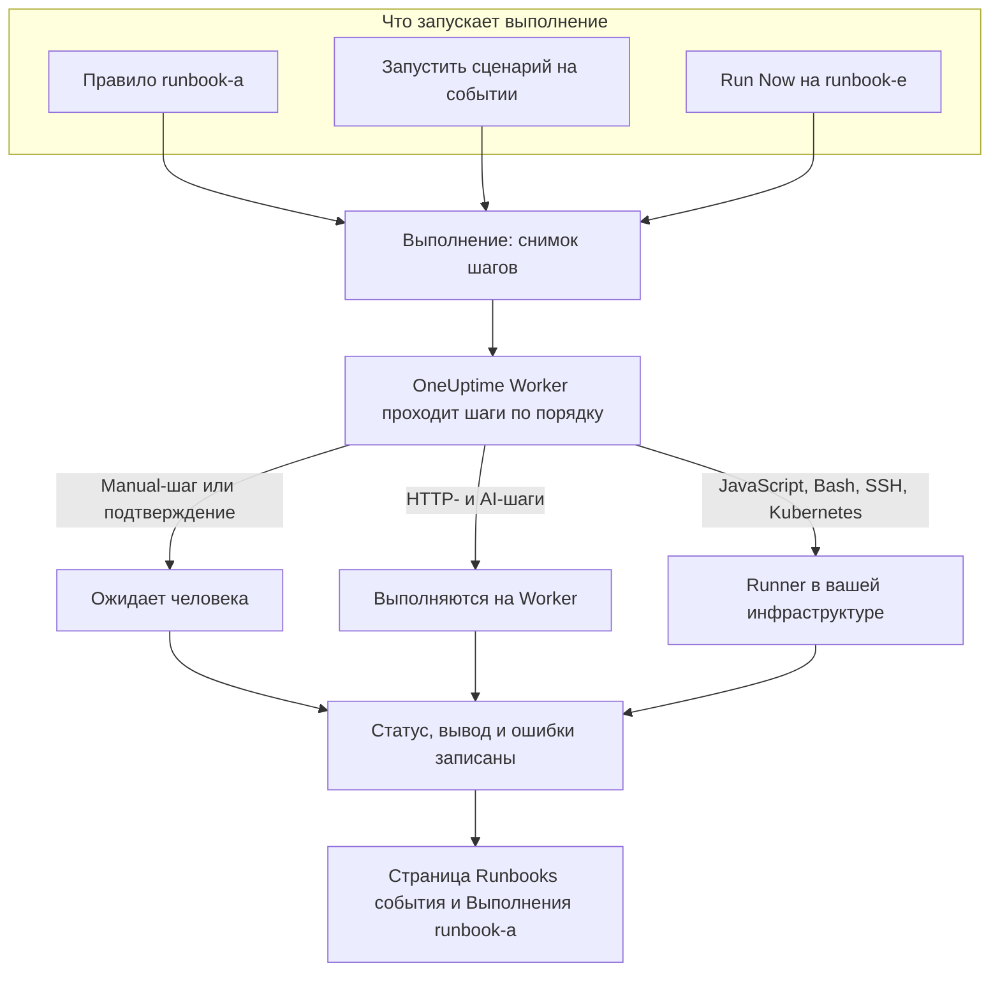

# Обзор Runbook-ов

Runbook — это многоразовая процедура реагирования: упорядоченный список ручных и автоматизированных шагов, который вы запускаете на инциденте, оповещении или событии планового обслуживания. Он превращает обсуждение «что нам теперь делать?» в чек-лист, по которому любой дежурный может пройти в три часа ночи, причём скрипты, вызовы API и согласования уже написаны. Runbook-и предназначены для дежурных инженеров, которые реагируют на инциденты, и для платформенных команд, которые автоматизируют это реагирование.

:::cards
- [Написание runbook-а](/docs/runbooks/authoring): Создайте runbook и напишите его шаги.
- [Правила runbook-ов](/docs/runbooks/rules): Запускайте runbook-и при новых инцидентах, оповещениях и событиях обслуживания.
- [Выполнение runbook-а](/docs/runbooks/running): Запустите выполнение, завершите и подтвердите его шаги, отмените его.
- [Агенты runbook-ов](/docs/runbooks/agents): Установите Runner, который выполняет ваши скрипты в вашей собственной инфраструктуре.
:::

## Как выполняется runbook



Каждый запуск runbook-а — это **выполнение**. Когда оно начинается, шаги runbook-а копируются в него, и OneUptime проходит их по порядку. Manual-шаг или шаг, требующий подтверждения, приостанавливает выполнение, пока кто-нибудь не отреагирует.

HTTP- и AI-шаги выполняются на OneUptime Worker. Шаги JavaScript, Bash, SSH и Kubernetes выполняются на [Runner-е](/docs/runbooks/agents), который вы устанавливаете в своей инфраструктуре, поэтому ваши скрипты никогда не выполняются на серверах OneUptime. Статус, вывод и сообщение об ошибке каждого шага записываются в выполнение, которое остаётся привязанным к инциденту, оповещению или событию, для которого оно запускалось.

## Ключевые понятия

| Понятие | Значение |
| --- | --- |
| **Runbook** | Шаблон. Именованная многоразовая процедура с упорядоченным списком шагов и переключателем **Запускать этот сценарий**. |
| **Шаг** | Один пункт runbook-а. У него есть тип (Manual, JavaScript, HTTP request, Bash, SSH, Kubernetes или AI), заголовок, описание и настройки, зависящие от типа. |
| **Правило runbook-а** | Правило, которое автоматически связывает один или несколько runbook-ов с инцидентами, оповещениями или событиями планового обслуживания, отвечающими его условиям: их мониторам, серьёзности, меткам, меткам мониторов, заголовку или описанию. |
| **Выполнение** | Один запуск runbook-а. Создаётся, когда срабатывает правило, когда кто-то нажимает **Запустить сценарий** на событии или **Run Now** на самом runbook-е. Содержит снимок шагов, а также статус и вывод каждого шага. |
| **Снимок** | Замороженная копия шагов runbook-а, хранящаяся в каждом выполнении. Вы можете позже изменить runbook, не переписывая историю прошлых запусков. |
| **Runner** | Небольшой агент, который вы запускаете на хосте в своей инфраструктуре. Он выполняет шаги JavaScript, Bash, SSH и Kubernetes, которые на него указывают. Его также называют агентом runbook-ов. |
| **Учётные данные** | Управляемый доступ по SSH или к Kubernetes, которым пользуются шаги SSH и Kubernetes. Зашифрованы при хранении и передаются только тем Runner-ам, которым вы их назначили. |
| **Секрет** | Одно значение, например токен API, которое скрипт Bash или JavaScript использует как `{{runbookSecrets.NAME}}`. Зашифрован при хранении и передаётся только тем Runner-ам, которым вы его назначили. |

## Типы шагов

Выберите тип, подходящий для каждого шага. На странице [Написание runbook-а](/docs/runbooks/authoring) описаны настройки каждого типа.

| Тип шага | Где выполняется | Используйте, когда… | Пример |
| --- | --- | --- | --- |
| **Manual** | Человек | Человек должен что-то проверить, принять решение или действовать там, где OneUptime не может. | «Убедитесь, что трафик переключился на резервный регион.» |
| **JavaScript** | Runner | Нужно небольшое ограниченное вычисление в песочнице. | Вычислить задержку реплики и решить, продолжать ли. |
| **HTTP request** | OneUptime Worker | Вы вызываете существующий API: облачного провайдера, PagerDuty, вебхук Slack, свой сервис. | `POST` в ваш оркестратор переключения. |
| **Bash** | Runner | Нужны команды оболочки в вашей собственной инфраструктуре. | Запустить `kubectl rollout restart` или скрипт восстановления. |
| **SSH** | Runner | Нужна одна команда на удалённом хосте с управляемыми учётными данными SSH. | Перезапустить сервис на веб-сервере. |
| **Kubernetes** | Runner | Нужно перезапустить или масштабировать Deployment, StatefulSet или DaemonSet. | Перезапустить `checkout-api` в `production`. |
| **AI** | OneUptime Worker | Вам нужен анализ, сводка или оценка посреди выполнения от LLM-провайдера проекта. | «Изучи диагностику выше. Безопасно ли переключаться?» |

Runbook может сочетать их все. Сила runbook-ов в том, что они переплетают проверки человеком с автоматизацией и анализом ИИ.

## Что запускает выполнение

| Как | Где | К чему привязывается выполнение |
| --- | --- | --- |
| Правило runbook-а | **Инциденты**, **Оповещения** или **Плановое обслуживание** → **Правила** → **Правила runbook-ов** | К новому инциденту, оповещению или событию |
| **Запустить сценарий** | Страница **Сборники инструкций** инцидента, оповещения или события планового обслуживания | К этому событию |
| **Run Now** | Страница **Обзор** runbook-а | Ни к чему: разовый запуск |
| Правило автоматического устранения | См. [AI SRE](/docs/ai/ai-sre) | К инциденту или оповещению |

Runbook, у которого переключатель **Запускать этот сценарий** выключен на странице **Настройки**, не запускается ни одним из этих способов. Уже начатые выполнения продолжаются.

## Где runbook-и находятся в панели

Runbook-и находятся в разделе **Продукты**, в группе **Дашборды и автоматизация**.

| Страница | Что там делать |
| --- | --- |
| **Продукты → Сборники инструкций** | Просматривать, создавать и открывать runbook-и. |
| **Шаги** runbook-а | Писать и переупорядочивать его шаги, затем нажать **Save Steps**. |
| **Обзор** runbook-а | Смотреть последнее выполнение и результаты и нажимать **Run Now**. |
| **Выполнения** runbook-а | Все запуски этого runbook-а с фильтрами по статусу и дате начала. |
| **Владельцы** runbook-а | Добавлять людей и команды, отвечающие за него. |
| **Настройки** runbook-а | Выключать **Запускать этот сценарий**, не удаляя runbook. |
| **Сборники инструкций → Выполнения** | Все запуски всех runbook-ов проекта. |
| **Сборники инструкций → Агенты runbook-ов** и **Сборники инструкций → Агенты runbook-ов → Учётные данные** | Устанавливать [Runner-ы](/docs/runbooks/agents) и управлять [учётными данными](/docs/runbooks/credentials). |
| **Сборники инструкций → Настройки** | Управлять [секретами](/docs/runbooks/credentials#секреты-для-скриптов) для скриптов, а также **Правила владельца** и **Правила меток**, которые добавляют владельцев и метки новым runbook-ам. |
| **Инциденты / Оповещения / Плановое обслуживание → Правила → Правила runbook-ов** | Создавать правила, которые запускают runbook-и автоматически. |
| Инцидент, оповещение или событие обслуживания → **Сборники инструкций** | Смотреть привязанные к нему выполнения и нажимать **Запустить сценарий**, чтобы начать новое. |

## Разбор примера

Допустим, каждый инцидент с «db-primary» в заголовке должен запускать runbook переключения базы данных из пяти шагов.

:::steps
### Создайте runbook

В **Сборники инструкций** нажмите **Создать: Сценарий** и назовите его «DB primary failover». Откройте его, перейдите в **Шаги**, добавьте эти шаги и нажмите **Save Steps**:

| # | Тип | Заголовок |
| --- | --- | --- |
| 1 | JavaScript | Записать задержку реплики до переключения |
| 2 | Manual | Подтвердить в панели DBA, что реплика исправна |
| 3 | HTTP request | `POST` в оркестратор переключения |
| 4 | Manual | Проверить, что запись идёт в новый primary |
| 5 | HTTP request | Отправить отбой тревоги в `#db-incidents` в Slack |

### Добавьте правило

В **Инциденты → Правила → Правила runbook-ов** создайте правило с одним условием и runbook-ом для запуска:

```text
Conditions:  Incident Title starts with db-primary
Runbooks:    [DB primary failover]
```

### Дайте ему выполниться

Монитор открывает инцидент `INC-4821 · db-primary connection timeout`. Правило срабатывает, и начинается выполнение:

- Шаг 1 (JavaScript) выполняется на Runner-е, который вы для него выбрали. Возвращённое значение, например `{ lagMs: 412 }`, записывается.
- Шаг 2 (Manual) приостанавливает выполнение, которое показывает **Ожидает вас**. Дежурный проверяет панель и нажимает **Mark complete**.
- Шаг 3 (HTTP request) выполняется, и ответ на `POST` записывается.
- Шаг 4 (Manual) снова приостанавливает выполнение, пока кто-нибудь его не завершит.
- Шаг 5 (HTTP request) выполняется, и выполнение получает статус **Завершено**.

### Разберите его

Выполнение остаётся на странице **Сборники инструкций** инцидента. Когда вы пишете постмортем, вывод, ошибки и время каждого шага — в одном клике.
:::

## Типичные сценарии

- **Переключение базы данных**: записать состояние с помощью JavaScript, попросить дежурного DBA подтвердить исправность реплики (Manual), вызвать оркестратор (HTTP request), подтвердить DNS (Manual), отправить отбой тревоги (HTTP request).
- **Очистка кеша**: один HTTP-запрос, затем Manual-шаг «убедитесь, что доля попаданий в кеш восстанавливается».
- **Инцидент, затрагивающий клиентов**: Manual «опубликуйте обновление на странице статуса», HTTP-запрос для уведомления службы поддержки, JavaScript для получения списка затронутых аккаунтов.
- **Проверка перед плановым обслуживанием**: сделать снимок метрик, подтвердить окно изменений с заинтересованными лицами (Manual), включить режим обслуживания на балансировщике нагрузки (HTTP request).
- **Диагностировать, затем исправить**: Bash-шаг собирает диагностику, AI-шаг с **Требовать подтверждение** читает её и рекомендует исправление, а Kubernetes-шаг перезапускает рабочую нагрузку только после того, как человек подтвердит.
- **Гигиена, которая выполняется всегда**: правило без условий, которое записывает состояние системы при каждом инциденте для постмортема.

## Как runbook-и связаны с остальным OneUptime

- **Мониторы** открывают инциденты и оповещения, а **правила runbook-ов** превращают их в выполнения runbook-ов: обнаружить, запустить, отреагировать, записать.
- **[Политики дежурств](/docs/on-call/schedules)** решают, кого вызывать. Runbook-и решают, что этот человек делает, когда проснётся.
- **[Подключения рабочих пространств](/docs/workspace-connections/slack)**, такие как Slack и Microsoft Teams, — естественные цели для шагов HTTP-запросов, отправляющих обновления.
- **[Страницы статуса](/docs/status-pages/index)** часто обновляются Manual-шагом в runbook-е, обращённом к клиентам.

## Дальнейшие шаги

:::cards
- [Написание runbook-а](/docs/runbooks/authoring): Создайте свой первый runbook и его шаги.
- [Агенты runbook-ов](/docs/runbooks/agents): Установите Runner, прежде чем писать шаг JavaScript, Bash, SSH или Kubernetes.
- [Правила runbook-ов](/docs/runbooks/rules): Запускайте runbook-и автоматически при создании инцидентов.
- [Конфигурация и безопасность runbook-ов](/docs/runbooks/configuration): Ограничения, тайм-ауты, разрешения и защита.
:::
