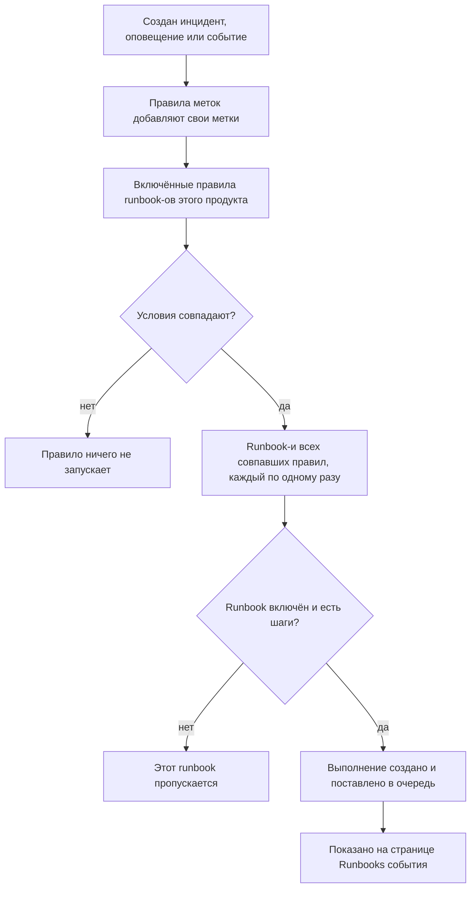

# Правила runbook-ов

Правила runbook-ов автоматически запускают runbook-и, когда создаётся **инцидент**, **оповещение** или **событие планового обслуживания**, чтобы никому не приходилось вспоминать о них посреди сбоя. У каждого продукта своя страница правил в его меню **Правила**:

- Инциденты → Правила → **Правила runbook-ов**
- Оповещения → Правила → **Правила runbook-ов**
- Плановое обслуживание → Правила → **Правила runbook-ов**

Все три страницы редактируют один и тот же вид правила, отфильтрованный по правилам этого продукта.

:::cards
- [Создание правила runbook-а](#создание-правила-runbook-а): Четыре шага: имя, условия и runbook-и для запуска.
- [Условия](#условия): Каждый критерий и оператор, которые может использовать правило.
- [Логика совпадения](#логика-совпадения): Несколько правил, условия по мониторам и правила меток.
- [Примеры](#примеры): Три правила для копирования.
:::

## Как правило запускает runbook



Когда правило срабатывает, для каждого указанного в нём runbook-а происходит следующее:

1. Runbook загружается.
2. Его шаги копируются **снимком** в новое выполнение runbook-а.
3. Выполнение ставится в очередь runbook-воркера.
4. Выполнение привязывается к исходной сущности: оно появляется на странице **Сборники инструкций** инцидента, оповещения или события планового обслуживания и в списке **Выполнения** runbook-а.

Все запуски, начатые правилом или нет, видны в **Сборники инструкций → Выполнения** с фильтрами по статусу, runbook-у и дате начала.

## Прежде чем начать

- **Runbook, который может выполняться.** У него должен быть хотя бы один шаг и включённый **Запускать этот сценарий** на его странице **Настройки**. См. [Написание runbook-а](/docs/runbooks/authoring).
- **Разрешение управлять правилами.** Project Owner, Project Admin и Runbook Admin создают правила runbook-ов, как и любой, у кого есть разрешение **Create Runbook Rule**.

## Создание правила runbook-а

:::steps
### Откройте правила runbook-ов

В **Инциденты**, **Оповещения** или **Плановое обслуживание** откройте **Правила → Правила runbook-ов** и нажмите **Создать: Runbook Rule**.

### Назовите правило

В **Основная информация** введите **Имя**, например «Запуск переключения БД при инцидентах базы данных», и при желании **Описание**.

### Добавьте условия

В **Критерии совпадения** нажмите **Добавить условие**, выберите критерий и оператор и введите или выберите значение. При необходимости добавьте ещё условия и выберите **Соответствие всем** или **Соответствие любому**. Не добавляйте ни одного, чтобы запускать runbook-и при каждом новом событии этого вида.

### Выберите runbook-и

В **Сборники инструкций** выберите один или несколько **Сценарии для запуска** и нажмите **Создать: Runbook Rule**. Правило активно сразу после создания и отображается в списке со статусом **Включено**.
:::

## Устройство правила

| Поле | Назначение |
| --- | --- |
| **Имя** | Короткая понятная подпись правила. |
| **Описание** | Необязательный контекст для коллег. |
| **Включено** | Включено для нового правила. Выключите его в форме редактирования правила, чтобы приостановить правило, не удаляя его. |
| **Условия** | С чем совпадает правило, на шаге **Критерии совпадения**. Оставьте пустым, чтобы совпадать с каждым событием своего типа. |
| **Сценарии для запуска** | Один или несколько runbook-ов, запускаемых при срабатывании правила. |

## Условия

Каждое условие сравнивает одно свойство инцидента, оповещения или события планового обслуживания со значением, которое вы задаёте. Правило runbook-а предлагает те же критерии, что и другие правила продукта: правило runbook-а для инцидентов совпадает по тем же признакам, что и правило приватности или дежурства для инцидентов.

| Критерий | Что проверяет |
| --- | --- |
| **Мониторы** | Мониторы, которые затрагивает инцидент или событие планового обслуживания, или монитор, вызвавший оповещение. |
| **Инцидент Серьёзности** / **Оповещение Серьёзности** | Серьёзность инцидента или оповещения. У событий планового обслуживания нет серьёзности, поэтому их правила этот критерий не предлагают. |
| **Метки инцидента** / **Метки оповещений** / **Метки события** | Метки самого инцидента, оповещения или события, включая добавленные правилами меток при создании. |
| **Метки монитора** | Метки его мониторов. Пометьте мониторы как `production` или `staging`, чтобы запускать runbook только в одной среде. |
| **Заголовок инцидента** / **Заголовок оповещения** / **Заголовок события** | Его заголовок. |
| **Описание инцидента** / **Описание оповещения** | Его описание (для событий критерий называется **Описание события**). |
| **Имя монитора** / **Описание монитора** | Имя или описание его мониторов. |

Выберите оператор для каждого условия:

- Списочный критерий — **Мониторы**, серьёзности и метки — использует **Содержит любое из**, **Содержит все из** или **Не содержит ни одного из** выбранных значений.
- Текстовый критерий использует **Содержит** (с него начинается новое условие), **Не содержит**, **Равно**, **Не равно**, **Начинается с**, **Заканчивается на** или **Соответствует шаблону** / **Не соответствует шаблону** для регулярного выражения без учёта регистра или подстановочного знака `*`. Текстовые сравнения не учитывают регистр.

При двух и более условиях выберите **Соответствие всем** (каждое условие должно быть истинным) или **Соответствие любому** (истинным должно быть хотя бы одно).

## Логика совпадения

- Правило без условий применяется к каждому событию своего типа (глобальное правило «запускать всегда»).
- Одному событию могут соответствовать несколько правил. Срабатывает каждое совпадение, и выполняется объединение их runbook-ов: каждый runbook получает своё выполнение, а runbook, указанный в двух совпавших правилах, выполняется один раз.
- Условия по мониторам проверяются по одному монитору за раз. При **Соответствие всем** условия «**Имя монитора** содержит `api`» и «**Метки монитора** содержат любое из _Production_» требуют одного монитора, удовлетворяющего обоим, а не по монитору на каждое.
- Правила runbook-ов выполняются после правил меток, поэтому метка, которую правило меток ставит на новый инцидент, оповещение или событие, может запустить runbook.
- Инцидент или оповещение, созданные уже устранёнными, не запускают runbook: всё закончилось ещё до того, как это было записано. См. [Объявлен уже подтверждённым или устранённым](/docs/incidents/declaring-incidents#объявлен-уже-подтверждённым-или-устранённым).
- Условие по серьёзности другого продукта — например, **Оповещение Серьёзности** в правиле для инцидентов — никогда не может стать истинным, поэтому API отказывается его сохранять.
- Правила оцениваются один раз, при создании события. Последующее изменение заголовка, серьёзности или меток инцидента не запускает правила повторно.

## Примеры

### Переключение БД при инцидентах базы данных

```text
Name:        Start DB failover for DB incidents
Trigger:     Incident
Conditions:  Incident Title matches pattern (?:^|\b)(db|database|postgres|mysql|mongo)
Runbooks:    [DB failover playbook, Notify DBA team]
```

Это создаёт два выполнения runbook-ов каждый раз, когда создаётся инцидент с «db», «database», «postgres» и т. п. в заголовке.

### Только для критичных инцидентов в продакшене

```text
Name:        Flush the CDN cache for critical production incidents
Trigger:     Incident
Conditions:  Match all
             Monitor Labels has any of Production
             Incident Severities has any of Critical
Runbooks:    [Flush CDN cache]
```

Срабатывает на критичный инцидент монитора с меткой _Production_ и ни на что в staging.

### Правило гигиены, которое выполняется всегда

```text
Name:        Always-run pre-flight check
Trigger:     Incident
Conditions:  (none)
Runbooks:    [Capture pre-incident state]
```

Срабатывает на каждый инцидент: полезно, чтобы записывать снимки состояния системы, метрики и тому подобное для постмортема.

## Выключенные runbook-и

Если правило указывает на выключенный runbook (**Запускать этот сценарий** выключен на странице **Настройки** runbook-а, `isEnabled = false`), правило всё равно совпадает, но выполнение runbook-а пропускается. Включите переключатель снова, чтобы возобновить. Runbook без шагов пропускается так же.

## Проверка правила

Прежде чем доверять правилу в продакшене, создайте тестовый инцидент (или тестовое оповещение), отвечающий условиям правила, и проверьте, что на его странице **Сборники инструкций** появились ожидаемые runbook-и.

> [!NOTE]
> Правила runbook-ов действуют только на новые события. В отличие от правил меток и владельцев, их нельзя [применить к существующим записям](/docs/configuration/run-rules-now): это запустило бы runbook-и для уже закончившихся инцидентов.

## Устранение неполадок

:::details Правило совпало, но ни один runbook не выполнился
Проверьте по порядку:

- Правило **Включено**.
- У каждого runbook-а включён **Запускать этот сценарий** на странице **Настройки** и есть хотя бы один сохранённый шаг.
- Инцидент или оповещение не были созданы уже устранёнными.
- Выполнение runbook-а не просто ждёт: откройте его со страницы **Сборники инструкций** события. Manual-шаг или подтверждение показывают **Ожидает вас**.
:::

:::details Правило никогда не совпадает
Правила видят событие таким, каким оно было создано, с метками, которые правила меток добавили в тот момент. Метка, серьёзность или заголовок, изменённые позже, не учитываются. При нескольких условиях проверьте **Соответствие всем** против **Соответствие любому** и помните, что все условия по мониторам должны выполняться для одного монитора.
:::

:::details API отклоняет правило с «can only be used by»
Критерий серьёзности относится к одному продукту. **Оповещение Серьёзности** в правиле для инцидентов или **Инцидент Серьёзности** в правиле для оповещений никогда не смогли бы совпасть, поэтому правило отклоняется с сообщением вроде «Alert Severities can only be used by alert runbook rules.» Удалите это условие. Панель предлагает только собственные критерии каждого продукта.
:::

## Дальнейшие шаги

:::cards
- [Выполнение runbook-а](/docs/runbooks/running): Что видят реагирующие, когда правило запускает выполнение.
- [Написание runbook-а](/docs/runbooks/authoring): Напишите runbook-и, которые запускают ваши правила.
- [Объявление инцидента](/docs/incidents/declaring-incidents): Как создаются инциденты и когда их видят правила.
:::
