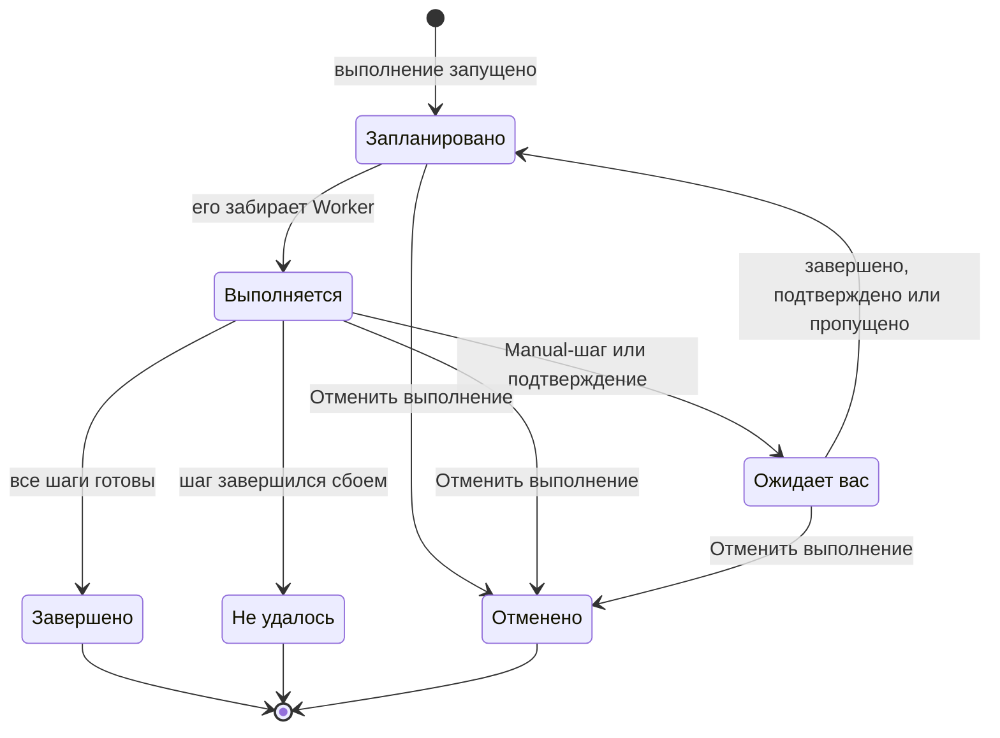

# Выполнение runbook-а

Каждый запуск runbook-а — это **выполнение**: снимок шагов runbook-а, которые проходятся по порядку, с записанными статусом и выводом каждого шага. Эта страница для тех, кто реагирует на инциденты, запускает выполнения и ведёт их дальше: как начинается выполнение, что показывает его страница и как завершать, подтверждать, пропускать и отменять шаги.

:::cards
- [Запуск выполнения](#запуск-выполнения): С инцидента, оповещения или события либо с самого runbook-а.
- [Страница выполнения](#страница-выполнения): Что показывает каждый шаг, пока выполнение идёт.
- [Завершение, подтверждение и пропуск шагов](#завершение-подтверждение-и-пропуск-шагов): Какой шаг принимает решение и когда.
- [Устранение неполадок](#устранение-неполадок): Выполнения, которые не начинаются или не заканчиваются.
:::

## Как движется выполнение

Новое выполнение находится в состоянии **Запланировано**, пока его не заберёт Worker и не отметит как **Выполняется**. Оно приостанавливается в состоянии **Ожидает вас** на Manual-шаге или после шага, требующего подтверждения, и возвращается в очередь, как только кто-нибудь отреагирует. Выполнение, ожидающее человека, никогда не истекает по времени. Оно заканчивается в состоянии **Завершено**, **Не удалось** или **Отменено**.

## Запуск выполнения

Выполнение runbook-а создаётся тремя способами:

1. **Автоматически по правилу**: [правило runbook-а](/docs/runbooks/rules) запускает его, когда создаётся подходящий инцидент, оповещение или событие планового обслуживания. Его также может запустить правило автоматического устранения; см. [AI SRE](/docs/ai/ai-sre).
2. **Вручную с события**: нажмите **Запустить сценарий** на инциденте, оповещении или событии планового обслуживания. Выполнение привязывается к этому событию.
3. **Вручную со страницы runbook-а**: нажмите **Run Now** на странице **Обзор** runbook-а. Запуск не привязывается ни к инциденту, ни к оповещению, ни к событию планового обслуживания.

Чтобы запустить его вручную:

:::tabs
@tab С события
1. Откройте инцидент, оповещение или событие планового обслуживания и перейдите на его страницу **Сборники инструкций**.
2. Нажмите **Запустить сценарий**. Диалог **Запустить сценарий** показывает включённые runbook-и проекта.
3. Нажмите **Run** рядом с runbook-ом. Запуск появится в списке события: нажмите **Просмотр**, чтобы открыть его.
@tab С runbook-а
1. Откройте runbook из раздела **Сборники инструкций**.
2. Нажмите **Run Now** на его странице **Обзор**.
3. Откроется страница выполнения.
:::

Чтобы запустить выполнение, нужна роль Project Owner, Project Admin, Project Member, Runbook Admin или Runbook Member либо разрешение **Create Runbook Execution**. Runbook Viewer и Viewer видят **Run Now** заблокированной, с указанием причины. См. [Разрешения](/docs/runbooks/configuration#разрешения).

## Страница выполнения

Откройте выполнение, чтобы увидеть его чек-лист. Вверху страницы показаны **Статус** выполнения, его **Progress** (готовые шаги из всех), **Началось** (когда оно началось) и **Запущено** (что его запустило). Каждый шаг показывает:

- **Значок статуса** — Ожидание, Выполняется, Ожидает вас, Готово, Пропущено, Не удалось или Отменено.
- **Заголовок и описание** — скопированы из runbook-а при запуске выполнения.
- **Output** (сворачивается) — stdout, возвращённые значения, HTTP-ответы или ответ ИИ.
- **Сообщение об ошибке**, если шаг завершился сбоем.
- На шаге, которого ждёт выполнение: **Mark complete** (Manual-шаг) или **Approve & continue** (шаг с **Требовать подтверждение**) и **Пропустить**.
- Пока выполнение приостановлено, **Пропустить** на последующих автоматизированных шагах, не требующих подтверждения.

Пока выполнение идёт, страница обновляется сама каждые 30 секунд. Нажмите **Обновить**, чтобы сразу увидеть последнее состояние.

## Завершение, подтверждение и пропуск шагов

Только шаг, которого ждёт выполнение, можно завершить, подтвердить или пропустить, чтобы выполнение продолжилось. Manual-шаг или шаг с **Требовать подтверждение** нельзя отметить или пропустить, пока выполнение до него не дошло: их задача — остановить выполнение, поэтому решение они принимают только тогда, когда выполнение находится на них (для подтверждения — когда шаг выполнился и вы видите его вывод).

Пока выполнение приостановлено, можно также пропустить последующий автоматизированный шаг, не требующий подтверждения, чтобы он не выполнился, когда выполнение продолжится. Выполнение остаётся приостановленным на шаге, который ждёт вас. Пропускать нельзя, пока шаги выполняются: дождитесь паузы или отмените выполнение. Каждый шаг записывает, кто его завершил или пропустил.

| Шаг | Завершить или подтвердить | Пропустить |
| --- | --- | --- |
| Тот, которого ждёт выполнение | Да | Да |
| Последующий автоматизированный шаг без **Требовать подтверждение** | Нет | Да, пока выполнение приостановлено |
| Последующий Manual-шаг или шаг с **Требовать подтверждение** | Нет | Нет |
| Любой шаг, пока шаги выполняются | Нет | Нет |

Завершение, подтверждение, пропуск и отмена требуют тех же ролей, что и запуск выполнения, либо разрешения **Edit Runbook Execution**.

## Чередование ручных и автоматизированных шагов

Классическая последовательность:

| # | Шаг | Что происходит |
| --- | --- | --- |
| 1 | Bash: записать состояние системы | Выполняется на своём Runner-е, как только начинается выполнение. |
| 2 | Manual: «Сообщите клиентам баннером на странице статуса.» | Выполнение приостанавливается, пока кто-нибудь не нажмёт **Mark complete**. |
| 3 | HTTP request: вызвать DBA через PagerDuty | Выполняется на Worker. |
| 4 | Manual: «Подтвердите, что резервная база данных теперь основная.» | Выполнение снова приостанавливается. |
| 5 | HTTP request: отправить отбой тревоги в вебхук Slack | Выполняется, и выполнение получает статус **Завершено**. |

Шаги 2 и 4 приостанавливают выполнение, пока их кто-нибудь не отметит. Шаги 1, 3 и 5 выполняются автоматически. Весь запуск — это одно выполнение, одна хронология и один источник истины.

## Отмена выполнения

Нажмите **Отменить выполнение** на странице выполнения. Статус становится `Cancelled`, и ни один последующий шаг не начинается. Уже выполняющийся шаг не прерывается, но его результат не записывается: шаг остаётся `Cancelled`. Задания, которые ещё ждут Runner, отменяются; Runner, который уже выполняет скрипт, доводит его до конца, но результат не принимается.

## Ограничения вывода

Вывод каждого шага ограничен **50 КБ**, чтобы вышедший из-под контроля скрипт не раздул базу данных. Более длинный вывод обрезается с пометкой. Если нужны артефакты побольше, запишите их из скрипта в объектное хранилище или систему логов и выведите URL.

## Повторный запуск runbook-а

Выполнение — это разовая неизменяемая запись. Нажмите **Запустить снова** на завершённом выполнении или **Run Now** на runbook-е, чтобы запустить его снова. Оба способа создают новое выполнение из текущих шагов runbook-а, не привязанное ни к какому событию. Чтобы повторить его на инциденте, используйте **Запустить сценарий** на странице **Сборники инструкций** инцидента. Исходное выполнение остаётся неизменным для журнала аудита.

## Поиск прошлых выполнений

| Где | Что показывает |
| --- | --- |
| **Выполнения** runbook-а | Все запуски этого runbook-а с фильтрами по статусу и дате начала и столбцом **Запущено**. |
| **Сборники инструкций → Выполнения** | Все запуски всех runbook-ов проекта. |
| Страница **Сборники инструкций** инцидента, оповещения или события | Привязанные к нему запуски. Обзор события тоже показывает их, как только они появляются. |

## Устранение неполадок

:::details Run Now заблокирована
Ваша роль читает runbook-и, но не запускает их: кнопка сообщает «У вас нет разрешения на запуск сценариев в этом проекте.» Попросите роль Runbook Member или разрешение **Create Runbook Execution**.
:::

:::details Запуск завершается ошибкой «Runbook is disabled» или «Runbook has no steps to run»
Переключатель **Запускать этот сценарий** выключен на странице **Настройки** runbook-а, или у него нет сохранённых шагов. Включите переключатель или добавьте шаги и нажмите **Save Steps**.
:::

:::details Шаг завершился сбоем, потому что у него нет Runner-а или учётных данных
Сообщение, например, такое: «Bash step is missing a Runner. Pick one under Runbooks → Runners.» Шаг был сохранён без **Runner**, или шаг SSH либо Kubernetes — без **Credential**. Откройте **Шаги** runbook-а, выберите недостающее, нажмите **Save Steps** и запустите runbook снова.
:::

:::details Шаг завершился сбоем, потому что его не забрал ни один агент runbook-ов
Сообщение: «No runbook agent picked up this step before the wait window expired.» Runner шага не забрал задание в пределах своего claim timeout. Проверьте в **Сборники инструкций → Агенты runbook-ов**, что Runner в состоянии **Подключено** и что **Выполняет сценарии** включено. См. [Агенты runbook-ов](/docs/runbooks/agents#устранение-неполадок).
:::

:::details Выполнение ждёт уже несколько часов
Выполнение, ожидающее человека, никогда не истекает по времени. Откройте его и выполните действие на шаге, который показывает **Ожидает вас**, или нажмите **Отменить выполнение**.
:::

:::details Шаг сообщает, что мог выполниться частично
OneUptime Worker, выполнявший шаг, перезапустился или перестал отвечать, и выполнение было помечено как неудавшееся, а не оставлено зависшим. Проверьте целевую систему, прежде чем запускать runbook снова.
:::

## Дальнейшие шаги

:::cards
- [Написание runbook-а](/docs/runbooks/authoring): Добавьте Manual-шаги и подтверждения там, где решать должен человек.
- [Правила runbook-ов](/docs/runbooks/rules): Запускайте выполнения автоматически при новых инцидентах.
- [Агенты runbook-ов](/docs/runbooks/agents): Держите Runner-ы, нужные вашим шагам, в сети.
:::
