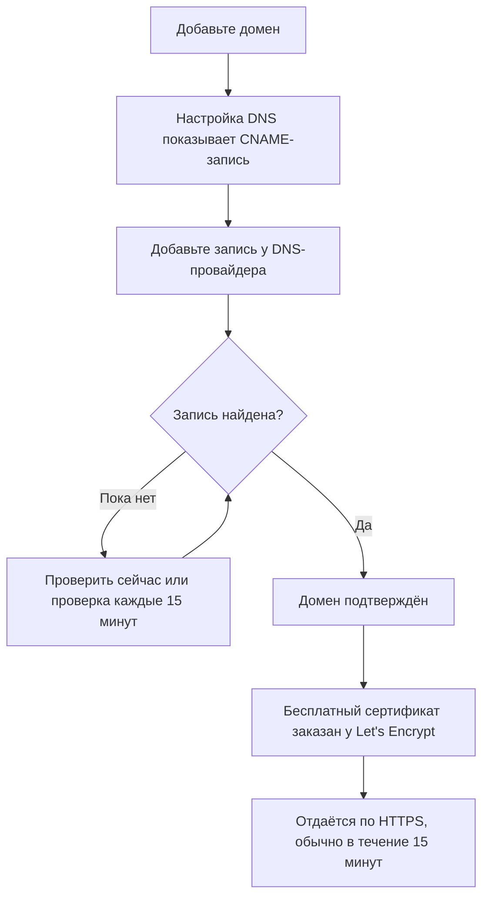

# Оформление и домены страницы статуса

Ваша страница статуса — единственный экран OneUptime, который видят ваши клиенты, поэтому она должна выглядеть как ваша и жить на вашем собственном домене, например `status.yourcompany.com`. Эта страница проходит по странице **Брендинг** карточка за карточкой, а затем переносит страницу статуса на ваш домен: добавьте домен, добавьте одну DNS-запись, и бесплатный SSL-сертификат появится сам.

:::cards
- [Страница «Брендинг»](#страница-брендинг): Логотип, заголовок, favicon, ссылки, нижний колонтитул, цвета и языки.
- [Пользовательские HTML, CSS и JavaScript](#пользовательские-html-css-и-javascript): Всё, что не покрывают встроенные настройки.
- [Пользовательские домены](#пользовательские-домены): Ваше собственное имя хоста с бесплатным сертификатом.
- [Столбец «Статус»](#как-читать-столбец-статус-домена): Где каждый домен находится на пути к HTTPS.
:::

## Где находится каждая настройка оформления

Откройте страницу статуса: в разделе **Брендинг** её бокового меню три пункта:

| Страница | Что вы там задаёте |
| ---- | ------------------ |
| **Брендинг** | Логотип и изображение обложки, заголовок и описание страницы, favicon, ссылки заголовка, описание страницы обзора, строку об авторских правах и ссылки нижнего колонтитула. Свёрнуто в **Дополнительные настройки**: цвета графика истории, языки и индексация поисковыми системами. |
| **Пользовательские домены** | Ваш собственный домен, его DNS-запись и его бесплатный SSL-сертификат. |
| **HTML, CSS и JavaScript** | HTML заголовка, HTML нижнего колонтитула, пользовательский CSS, пользовательский JavaScript. |

Три вещи, похожие на оформление, находятся вместо этого в **Страницы состояния → ваша страница → Расширенный → Расширенные настройки** (`{id}/settings`), потому что они определяют, что страница показывает, а не как она выглядит: общий процент аптайма, какие статусы мониторов засчитываются против аптайма, и строку «Powered by OneUptime». Все три — строки карточки **Что показывает ваша страница статуса** на этом экране.

Раньше оформление было разделено на отдельные экраны **Основное оформление**, **Заголовок**, **Нижний колонтитул**, **Страница обзора** и **Языки**. Их старые адреса (`{id}/header-style`, `{id}/footer-style`, `{id}/overview-page-branding` и `{id}/languages`) теперь открывают страницу **Брендинг**, так что старые закладки и ссылки продолжают работать.

## Страница «Брендинг»

**Страницы состояния → ваша страница → Брендинг → Брендинг** (`{id}/branding`). Каждая карточка сохраняется отдельно. После логотипа, заголовка и favicon карточки идут по вашей странице статуса сверху вниз: ссылки заголовка, текст в начале обзора, затем нижний колонтитул. То, что мало кто меняет, свёрнуто в **Дополнительные настройки** внизу.

### Логотип и изображение обложки

У первой карточки, **Логотип и изображение обложки**, есть кнопка **Edit Images**, которая открывает два шага:

| Шаг | Поля |
| ---- | ------ |
| **Логотип** | Загрузка логотипа (подсказка `Upload logo`) и **Logo Alt Text** (подсказка `Logo of My Company`). Оставьте альтернативный текст пустым, и вместо него будет использован заголовок страницы статуса. |
| **Изображение обложки** | **Обложка**, загрузка (подсказка `Upload cover image`) широкого баннера за заголовком, и **Cover Image Alt Text**. Оставьте альтернативный текст пустым, если обложка чисто декоративная. |

Логотип, изображение обложки и favicon — это файлы, загруженные в собственный проект страницы статуса, и это проверяется при каждом их сохранении — из панели управления, через API, Terraform или рабочий процесс. Файл, загруженный в другом проекте, отклоняется теми же словами, что и файл, которого больше нет: "The logo's file could not be found. Upload the logo again.", "The cover image's file could not be found. Upload the cover image again." или "The favicon's file could not be found. Upload the favicon again." Повторная загрузка изображения со страницы решает проблему.

Ваша страница статуса показывает только изображения своего проекта; изображение, которое она не может показать, пропускается, как будто его нет. Панель управления, API и Terraform читают изображения страницы так же: изображение из другого проекта возвращается как отсутствующее. Письма, которые отправляет страница (подписчикам, а также приватным пользователям об их входе), показывают её логотип так же: логотип, который страница не может показать, пропускается и в них, а не отображается как битое изображение.

### Заголовок, описание и favicon

- **Заголовок и описание**: карточка отмечает, что это также используется для SEO. **Редактировать** открывает **Заголовок страницы** (подсказка `Please enter page title here.`) и **Описание страницы**. Их показывают поисковые системы и превью ссылок, поэтому пишите их для клиента, а не для своей команды.
- **Favicon**: **Edit Favicon** открывает загрузку **Favicon**: маленького значка на вкладке браузера.

### Ссылки заголовка

Таблица **Ссылки заголовка** содержит ссылки в заголовке страницы статуса, например на ваш сайт, документацию или портал поддержки. У каждой ссылки есть **Заголовок** и **Ссылка** (URL, подсказка `https://link.com`), а порядок меняется перетаскиванием. Если ссылок нет, таблица пишет **Для этой страницы статуса нет ссылки в верхнем колонтитуле**, а под ней — **Создать: Страница статуса Заголовок Ссылка**.

### Описание страницы обзора

**Описание страницы обзора** — первое, что есть в обзоре страницы статуса, над объявлениями, общим статусом и вашими ресурсами. **Изменить описание** открывает поле markdown. Используйте его для фразы с контекстом: что охватывает эта страница и куда обращаться за поддержкой. Изображение, которое вы туда вставите, видно каждому посетителю страницы.

### Нижний колонтитул

- **Информация об авторских правах**: **Edit Copyright** открывает одно поле, **Информация об авторских правах**, с подсказкой `Acme, Inc.`.
- **Ссылки нижнего колонтитула**: та же пара **Заголовок** и **Ссылка**, что и у ссылок заголовка, порядок меняется перетаскиванием. Если ссылок нет, написано «Для этой страницы статуса нет ссылки в нижнем колонтитуле.»

Ссылки заголовка нужны для навигации; ссылки нижнего колонтитула — для мелкого шрифта, например юридической информации, конфиденциальности и условий.

### Дополнительные настройки

Последний раздел страницы свёрнут в **Дополнительные настройки**, потому что мало кто когда-либо меняет его содержимое. В свёрнутом виде его заголовок называет четыре раздела (**Цвет полосы по умолчанию**, **Правила цвета полос**, **Языки** и **Индексация поисковыми системами**) и показывает каждый, который отличается от того, с чем начинается новая страница статуса: цвет полосы по умолчанию, отличный от зелёного, с которого начинается каждая страница, любое правило цвета полос, язык по умолчанию, отличный от английского, более короткий список языков или отключённая индексация поисковыми системами. Нажмите на него, чтобы открыть: это одна карточка с четырьмя разделами друг под другом, у каждого свой заголовок и своя кнопка, разделённые разделителями.

**Цвета графика истории.** Это единственные встроенные настройки цвета на странице статуса.

- **Цвет полосы по умолчанию для графика истории**: **Edit Default Bar Color** открывает выбор **Цвет полосы по умолчанию**. Каждая новая страница статуса начинается с зелёного. При наличии правил цвета полос это также цвет дня, которому не соответствует ни одно правило. День, по которому у страницы нет данных, всегда рисуется серым.
- **Rules for Bar Colors of History Chart**: упорядоченная таблица правил, которые сортируются перетаскиванием. У каждого правила есть **Когда % времени безотказной работы больше или равен** и **Тогда используйте этот цвет столбца**; столбцы таблицы называются `When Uptime Percent >=` и `Then, Bar Color is`. Цвет нового правила уже выбран — такой, который другие правила пока не используют; выберите вместо него нужный. Порядок важен, поэтому расположите правила так, как хотите, чтобы они оценивались. Без правил полоса каждого дня получает цвет самого низкого статуса монитора за этот день.

Сколько дней охватывает график, задаётся не здесь. Это **История безотказной работы** на карточке **Что показывает ваша страница статуса** в **Расширенный → Расширенные настройки**, от 1 до 90 дней. Какие статусы мониторов считаются недоступностью — это **Считается простоем** в той же строке этой карточки.

**Языки.** Раздел **Языки** задаёт переключатель языка, который посетители видят в нижнем колонтитуле страницы. **Изменить языки** открывает два поля:

| Поле | Что делает |
| ----- | ------------ |
| **Язык по умолчанию** | Язык, который видят посетители при первом визите, выбирается из списка, где каждый язык назван на нём самом и по-английски (`Deutsch (German)`). По умолчанию это английский, и посетители всегда могут переключиться в нижнем колонтитуле. |
| **Включённые языки** | Множественный выбор, подсказка `All languages`. Оставьте его пустым, и будут предложены все поддерживаемые языки; выберите несколько, и нижний колонтитул покажет только их. |

OneUptime поставляется с семнадцатью языками: английский, немецкий, французский, испанский, итальянский, португальский, нидерландский, датский, норвежский, шведский, русский, японский, корейский, китайский (упрощённый), китайский (традиционный), хинди и персидский.

**Индексация поисковыми системами.** Один переключатель, **Разрешить поисковым системам индексировать эту страницу статуса**, решает, могут ли Google, Bing и другие поисковые системы показывать страницу. По умолчанию он включён. Кнопки **Редактировать** нет: переключатель сохраняется в момент переключения. Выключите его, и страница будет отдаваться с `noindex, nofollow` (метатег robots и заголовок `X-Robots-Tag`); любой, у кого есть ссылка, по-прежнему сможет её открыть. Поисковым системам может понадобиться несколько недель, чтобы убрать уже проиндексированную страницу.

> [!TIP]
> Выключайте **Разрешить поисковым системам индексировать эту страницу статуса**, пока страница только внутренняя или ещё настраивается, чтобы недоделанная страница не начала ранжироваться по названию вашего бренда.

## Процент аптайма и статусы простоя

Оба находятся в строке **История безотказной работы** карточки **Что показывает ваша страница статуса** в **Страницы состояния → ваша страница → Расширенный → Расширенные настройки** (`{id}/settings`). Кнопки **Редактировать** нет: каждый параметр сохраняется в момент изменения.

- **Показывать общий процент безотказной работы**: переключатель, по умолчанию выключен. Пока он включён, **Точность** рядом с ним выбирает, сколько знаков после запятой показывает процент: `99%`, `99.9%`, `99.99%` (по умолчанию) или `99.999%`. В OneUptime Cloud для включения процента нужен план **Scale**; его точность можно менять на любом плане.
- **Считается простоем**: статусы мониторов в виде цветных меток, время в которых засчитывается против аптайма на этой странице. Здесь вы решаете, например, засчитывается ли статус ухудшения против аптайма. Хотя бы один статус всегда остаётся выбранным.

Раньше это были две отдельные карточки, **Общий процент аптайма** и **Статусы мониторов при простое**, каждая за кнопкой **Редактировать**. Остальная часть карточки описана в разделе [Выбор того, что показывается на странице](/docs/status-pages/index#выбор-того-что-показывается-на-странице).

## Пользовательские HTML, CSS и JavaScript

**Страницы состояния → ваша страница → Брендинг → HTML, CSS и JavaScript** (`{id}/custom-code`) содержит четыре карточки, каждая редактируется отдельно и хранится в своём столбце страницы статуса:

| Карточка | Столбец | Что содержит |
| ---- | ------ | ------------- |
| **HTML заголовка** | `headerHTML` | HTML, добавляемый в заголовок страницы (подсказка `Insert Custom HTML here.`). |
| **HTML нижнего колонтитула** | `footerHTML` | HTML, добавляемый в нижний колонтитул страницы. |
| **Пользовательский CSS** | `customCSS` | Стили для всей страницы (подсказка `Insert Custom CSS here.`). |
| **Пользовательский JavaScript** | `customJavaScript` | Скрипт, который выполняет страница (подсказка `Insert Custom JavaScript here.`). |

> [!IMPORTANT]
> Пользовательские HTML, CSS и JavaScript отдаются только на подтверждённом пользовательском домене. На адресе по умолчанию `/status-page/:id` они отключены, потому что этот адрес использует тот же origin, на котором выполнен вход в OneUptime.

В OneUptime Cloud для добавления или изменения любого из них нужен план **Growth**. Очистка работает на любом плане, так что пользовательский код, добавленный во время пробного периода, всегда можно убрать.

**Выбора темы нет.** У страниц статуса OneUptime нет настройки темы или фирменного цвета: единственные встроенные настройки цвета где-либо — это **Цвет полосы по умолчанию** и правила цвета полос графика истории в **Дополнительные настройки** на странице **Брендинг**. Шрифты, цвета фона, акцентные цвета и правки макета — всё делается через **Пользовательский CSS**. Если вы искали поле «фирменный цвет», вот ответ: его нет, и это поле — способ сделать это.

> [!WARNING]
> Пользовательский JavaScript выполняется в браузерах ваших посетителей, на странице, которую открывают как раз тогда, когда думают, что что-то сломалось. Держите его небольшим, по возможности размещайте у себя то, что он загружает, и протестируйте, прежде чем на него полагаться.

## Пользовательские домены

По умолчанию страница статуса доступна по URL предпросмотра на её экране **Обзор**. Чтобы перенести её на собственное имя хоста, перейдите в **Страницы состояния → ваша страница → Брендинг → Пользовательские домены** (`{id}/domains`).

Карточка **Пользовательские домены** говорит, что делать: направьте CNAME-запись каждого домена на CNAME-запись страниц статуса вашей установки, и OneUptime выпустит SSL-сертификат домена и будет продлевать его за вас. Если ничего не настроено, таблица пишет **Пользовательские домены не найдены**, а под ней — **Создать: Страница статуса Домен**. У таблицы два столбца, **Домен** и **Статус**, и фильтры **Домен**, **CNAME действителен** и **SSL подготовлен**.

Перенос страницы на ваш домен занимает три шага, и только первые два — ваши:

1. **Добавьте домен**: поддомен и один из ваших подтверждённых доменов.
2. **Добавьте его CNAME-запись** у своего DNS-провайдера. Диалог **Настройка DNS** показывает запись сразу после добавления домена.
3. **Бесплатный SSL-сертификат выпускается автоматически**, как только запись найдена. Нажимать никакую кнопку не нужно.



### Перед началом

- **Родительский домен должен быть подтверждён.** Выпадающий список **Домен** показывает только домены, подтверждённые в **Настройки проекта → Домены**, где вы доказываете владение доменом с помощью TXT-записи. Ссылка **Добавить домен** рядом с полем открывает эту страницу в новой вкладке.
- **Вашей установке нужна CNAME-запись для страниц статуса.** У OneUptime Cloud она есть. В самостоятельно размещённой установке задайте её как имя хоста, указывающее на ваш сервер OneUptime (A-запись), и убедитесь, что сервер отвечает на порту 80, где его проверяет Let's Encrypt. Без неё карточка и диалог **Настройка DNS** пишут "Custom Domains not enabled for this OneUptime installation" вместо того, чтобы показать запись.

:::tabs
@tab Docker Compose
```ini title="config.env"
STATUS_PAGE_CNAME_RECORD=oneuptime.yourcompany.com
```
@tab Kubernetes
```yaml title="values.yaml"
statusPage:
  cnameRecord: oneuptime.yourcompany.com
```
:::

### Добавление домена

:::steps
#### Откройте «Создать: Страница статуса Домен»

На странице **Пользовательские домены** нажмите **Создать: Страница статуса Домен**. Диалог состоит из одной страницы.

#### Введите поддомен

В **Поддомен** (подсказка `status (leave blank for root)`) введите только метку, например `status`, а не полное имя хоста. Оставьте поле пустым или введите `@`, чтобы использовать корневой домен (apex).

#### Выберите домен

В **Домен** (подсказка `Select domain`) выберите один из ваших подтверждённых доменов. Неподтверждённый домен в списке не показывается, потому что он был бы отклонён.

#### Оставьте бесплатный сертификат или загрузите свой

**Дополнительные поля** свёрнуты, и их заголовок говорит, какой сертификат будет использовать домен: «Мы выпускаем бесплатный SSL-сертификат для этого домена и продлеваем его автоматически.» Открывайте их, только чтобы использовать собственный сертификат: включите **Загрузить пользовательский сертификат**, затем вставьте **Сертификат** и **Закрытый ключ сертификата** в формате PEM. Тогда оба становятся обязательными.

#### Создайте домен

Нажмите **Создать: Страница статуса Домен**. Диалог закроется, и откроется **Настройка DNS** нового домена с записью, которую нужно добавить.
:::

Полное имя домена фиксируется при добавлении, поэтому **Редактировать** меняет только его сертификат. Чтобы использовать другой поддомен, добавьте этот домен и удалите старый.

### Настройка DNS и подтверждение

Диалог **Настройка DNS** показывает запись, которую нужно добавить у вашего DNS-провайдера, по одному полю в строке, у каждого кнопка копирования:

| Поле | Что ввести |
| ----- | ------------- |
| **Тип** | `CNAME` |
| **Имя** | Полный добавленный вами домен, например `status.yourcompany.com` |
| **Значение** | CNAME-запись страниц статуса вашей установки |

> [!NOTE]
> Для корневого домена, без поддомена, диалог добавляет примечание: многие DNS-провайдеры не допускают там CNAME-запись. Используйте вместо неё запись ALIAS, ANAME или CNAME flattening вашего провайдера с тем же значением.

OneUptime проверяет каждый неподтверждённый домен каждые 15 минут и подтверждает ваш, как только его запись начинает работать, вернётесь вы или нет. Чтобы проверить сразу, нажмите **Проверить сейчас**:

- **Запись пока не найдена.** Диалог остаётся открытым и сообщает, какую запись он искал. Новой DNS-записи может понадобиться время, чтобы появиться: нажмите **Проверить сейчас** позже или предоставьте это проверке каждые 15 минут.
- **Запись найдена.** Диалог пишет «Ваша CNAME-запись подтверждена.» и что будет дальше с сертификатом. Бесплатный сертификат заказывается в этот момент.

Пока домен не подтверждён и его сертификат не готов, у его строки есть действие **Настройка DNS**, открывающее тот же диалог. Для подтверждённого домена, заказ сертификата которого продолжает завершаться неудачей или сертификат которого истёк, **Проверить сейчас** там заказывает снова и показывает, почему не удался последний заказ. Он заказывает не чаще одного раза на домен каждые 15 минут; в промежутках OneUptime продолжает повторять попытки сам.

### SSL-сертификаты

Каждый пользовательский домен получает бесплатный сертификат от Let's Encrypt, который выпускается и продлевается автоматически. Нажимать ничего не нужно:

- **Проверить сейчас** заказывает сертификат в тот момент, когда запись найдена. Затем диалог сообщает, что сертификат обычно начинает работать в течение 15 минут.
- Когда проверка каждые 15 минут подтверждает домен, она заказывает его сертификат в той же проверке.
- Продление происходит автоматически, задолго до истечения сертификата. Если ваш DNS на мгновение не отвечает во время продления сертификата, сертификат продолжает отдаваться и продлевается при следующей попытке. Неудачная проверка DNS никогда не удаляет ещё действующий сертификат.

Новый сертификат начинает отдаваться в течение 15 минут после выпуска, потому что с такой частотой сертификаты записываются на серверы, отвечающие за ваш домен. Столбец «Статус» говорит _обычно_ в течение 15 минут: когда ждут сразу много доменов, они обрабатываются по несколько за раз.

Каждый сертификат OneUptime заказывается с одной общей учётной записи Let's Encrypt, а Let's Encrypt ограничивает, сколько новых заказов одна учётная запись может сделать за короткое время и как часто может не удаваться заказ для одного и того же домена. OneUptime держит все свои заказы (новые домены, **Проверить сейчас**, перевыпуски и продления) в этих пределах вместе, и продления всегда идут первыми, так что волна новых доменов никогда не задерживает продления, которые поддерживают работу существующих доменов.

Если заказ не удался, столбец «Статус» домена сообщает об этом, с причиной в строке ниже, и **Проверить сейчас** в **Настройка DNS** тоже это показывает. OneUptime сам продолжает попытки, ожидая чуть дольше после каждой неудачи подряд, чтобы домен, заказ которого всё время не удаётся, не расходовал заказы, нужные всем остальным доменам. Обычные причины — CAA-запись на вашем домене, которая не разрешает `letsencrypt.org`, и, в самостоятельно размещённой установке, сервер, до которого Let's Encrypt не может достучаться на порту 80; в самостоятельно размещённой установке подробности есть в логах воркера. Устранив причину, нажмите **Проверить сейчас**, чтобы сразу заказать снова. Он делает не больше одного заказа на домен каждые 15 минут; нажатие в промежутке показывает, чем закончился последний заказ.

Если вы загрузили собственный сертификат в **Дополнительные поля**, OneUptime отдаёт его, в течение 15 минут после сохранения. Загрузите ему замену до истечения срока, отредактировав домен.

### Перевыпуск сертификата

Автоматическое продление покрывает обычный случай, но иногда нужен совершенно новый сертификат прямо сейчас: закрытый ключ, который вы предпочли бы не хранить, сертификат, который не нравится вашему собственному сканеру, или домен, изменившийся на стороне источника. Как только для домена заказан бесплатный сертификат, в его строке появляется действие **Reissue SSL**.

Его диалог, **Reissue SSL Certificate for this Status Page**, запрашивает у Let's Encrypt новый сертификат для домена и заменяет им отдаваемый. Тем временем ваша страница статуса остаётся доступной на существующем сертификате, а новый сертификат начинает отдаваться в течение 15 минут. Нажмите **Reissue SSL Certificate**, чтобы заказать его.

> [!NOTE]
> Домен можно перевыпустить только раз в 24 часа. Let's Encrypt ограничивает, как часто можно выпускать сертификат для одного домена, а каждый сертификат OneUptime заказывается с одной общей учётной записи, в том числе автоматические продления, поддерживающие работу страниц всех остальных. Внутри этого окна диалог сообщает, сколько осталось, вместо заказа. Если в этот момент для домена уже заказывается сертификат или заказы Let's Encrypt установки временно исчерпаны, диалог сообщает об этом, ничего не заказывается, и нажатие не засчитывается как ваш перевыпуск.

Действие не появляется у домена, который использует загруженный вами сертификат: перевыпускать сертификат Let's Encrypt нечего, поэтому загрузите новый, отредактировав домен. Оно также не появляется, пока не заказан первый сертификат домена, а это происходит само, как только его CNAME-запись подтверждена.

Та же кнопка, с тем же ограничением в 24 часа, есть у пользовательских доменов дашбордов в **Панели → ваш дашборд → Брендинг → Пользовательские домены**, которые работают так же, как пользовательские домены страниц статуса: см. [Совместный доступ и публичные дашборды](/docs/dashboards/sharing#кастомные-домены).

### Как читать столбец «Статус» домена

Столбец **Статус** говорит, где каждый домен находится на пути к HTTPS, в одном из семи состояний. Когда заказ не удался, причина указана в строке ниже.

| Что пишет столбец «Статус» | Что это значит |
| --------------------------- | ------------- |
| Ожидание DNS: добавьте CNAME-запись. | CNAME-запись пока не найдена. Откройте **Настройка DNS**, чтобы увидеть запись, добавьте её у своего DNS-провайдера, затем нажмите **Проверить сейчас** или дождитесь проверки каждые 15 минут. |
| Выпускается бесплатный сертификат, обычно в течение 15 минут. | Запись подтверждена, и сертификат заказывается или записывается. Ничего делать не нужно. |
| Пока не удалось выпустить бесплатный сертификат. Мы продолжаем попытки. | Запись подтверждена, но заказ её сертификата не удался по причине, указанной в строке ниже. Устраните причину, затем откройте **Настройка DNS** и нажмите **Проверить сейчас**, чтобы сразу заказать снова. |
| Срок действия сертификата истёк. Мы продолжаем попытки его обновить. | Сертификат домена истёк, потому что его продления не удались. Откройте **Настройка DNS** и нажмите **Проверить сейчас**, чтобы сразу продлить его и увидеть причину. |
| Сертификат выпущен, обновляется автоматически. | Готово. Домен отдаёт свой сертификат по HTTPS, а OneUptime его продлевает. |
| Сертификат выпущен, но обновить его не удалось. Мы продолжаем попытки. | Домен всё ещё отдаёт действующий сертификат, но его последнее продление не удалось по причине, указанной в строке ниже. OneUptime повторяет попытку задолго до истечения сертификата. |
| Используется ваш загруженный сертификат. | Запись подтверждена, и домен отдаётся с загруженным вами сертификатом. |

:::details Домен долго остаётся в состоянии «Ожидание DNS» после добавления записи
Проверьте, что имя записи — это полный домен, например `status.yourcompany.com`, и что её значение точно совпадает с CNAME-записью вашей установки. Для корневого домена используйте запись ALIAS, ANAME или flattened CNAME. Затем нажмите **Проверить сейчас** в **Настройка DNS**.
:::

:::details Столбец «Статус» пишет, что бесплатный сертификат выпустить не удалось
Поищите на своём домене CAA-запись, которая не включает `letsencrypt.org`, а в самостоятельно размещённой установке проверьте, что ваш сервер отвечает на порту 80. Устраните причину, затем нажмите **Проверить сейчас** в **Настройка DNS**, чтобы заказать снова.
:::

### Кто может проверять и перевыпускать

**Проверить сейчас**, заказ сертификата домена и **Reissue SSL** изменяют домен, поэтому для них нужно право на его редактирование: **Edit Status Page Domain** или роль, которая его включает (Project Owner, Project Admin, Project Member, Status Page Admin или Status Page Member).

Тот, кто может только читать домен, например Viewer или Status Page Viewer, всё равно видит столбец **Статус** и запись для добавления в **Настройка DNS**. Для них **Проверить сейчас** и **Reissue SSL** заблокированы и сообщают, какое право нужно. OneUptime в любом случае сам продолжает проверять каждый домен и заказывать его сертификат.

То же относится к ключам API. Ключ, который может только читать домены страниц статуса, не может вызывать `verify-cname`, `order-ssl` или `reissue-ssl` на `/status-page-domain`. Дайте ему **Read Status Page Domain** и **Edit Status Page Domain**, если это нужно.

## Powered by OneUptime

Строка «Powered by OneUptime» — это не настройка оформления. Это последний переключатель карточки **Что показывает ваша страница статуса** в **Страницы состояния → ваша страница → Расширенный → Расширенные настройки** (`{id}/settings`): **Показывать брендинг «Powered By OneUptime»**, по умолчанию включён. Выключите его, чтобы скрыть строку; изменение сохраняется сразу. В OneUptime Cloud для скрытия нужен план **Scale**.

## Что дальше

:::cards
- [Обзор страниц статуса](/docs/status-pages/index): Что показывает страница и кто может её видеть.
- [Ресурсы и группы страницы статуса](/docs/status-pages/resources-and-groups): Выберите, что посетители на самом деле видят на странице.
- [Подписчики и объявления](/docs/status-pages/subscribers): Письма с вашим логотипом и ссылками на ваш домен.
- [Публичный API](/docs/status-pages/public-api): Читайте страницу в формате JSON, в том числе на вашем собственном домене.
:::
