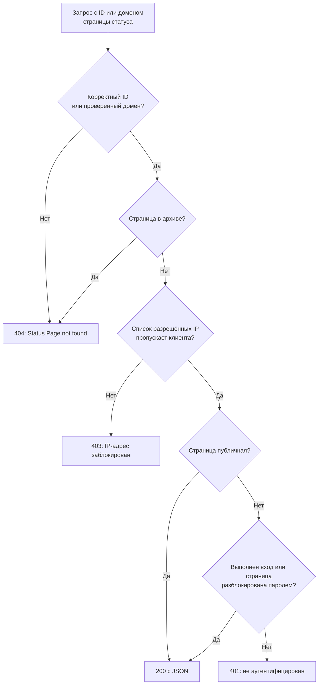

# Публичный API

Каждая страница статуса отвечает на небольшой набор JSON-адресов только для чтения: её обзор, время работы, инциденты, эпизоды, события плановых работ и объявления. Это те же адреса, которые загружает сама страница статуса, поэтому они возвращают ровно то, что видит посетитель, а публичной странице API-ключ не нужен. Используйте их, чтобы показывать свой статус в собственном приложении, чат-боте или на настенном экране.

:::cards
- [Адреса](#адреса): По одному адресу на всё, что показывает страница.
- [Чтение обзора](#чтение-обзора): Вся страница одним запросом — с curl, Node.js и Python.
- [Время работы за период](#время-работы-за-период): Время работы по ресурсам и группам, до 90 дней.
- [Ошибки](#ошибки): Что означает каждый код статуса.
:::

## Как обрабатывается запрос

Каждый запрос указывает страницу статуса по её ID или по одному из её собственных доменов. OneUptime находит страницу, применяет те же правила доступа, что и к посетителю, и отвечает в формате JSON.



Приватная страница отвечает только браузеру, который вошёл на неё или разблокировал её паролем: API читает ту же сессию, что и страница. Для скрипта используйте публичную страницу. См. [Ограничение доступа к странице](/docs/status-pages/index#ограничение-доступа-к-странице).

Корректный по форме ID, которому не соответствует ни одна страница статуса, проходит тот же путь, что и приватная страница, и получает ответ `401`. Если публичная страница отвечает `401`, проверьте ID.

## Перед началом

- **ID страницы статуса.** Откройте страницу в панели управления (**Страницы состояния → Все страницы состояния**, затем нужная страница). Карточка **Сведения о странице статуса** на её странице **Обзор** показывает **ID страницы статуса**.
- **Базовый URL.** Все адреса ниже находятся под `/status-page-api`:

| Где работает страница | Базовый URL |
| ------------------- | -------- |
| OneUptime Cloud | `https://oneuptime.com/status-page-api` |
| Собственная установка OneUptime | `https://<your-oneuptime-host>/status-page-api` |
| Собственный домен страницы | `https://status.example.com/status-page-api` |

Там, где в пути ниже стоит `{statusPageIdOrDomain}`, можно передать ID страницы или один из её проверенных собственных доменов, например `status.example.com`. Адрес времени работы принимает только ID, а на домен отвечает `401`.

## Адреса

| Адрес | Методы | Возвращает |
| -------- | ------- | ------- |
| `/overview/{statusPageIdOrDomain}` | `GET`, `POST` | Всё, что показывает обзор: общий статус, ресурсы и группы, активные инциденты и эпизоды, плановые работы, текущие объявления и данные для полос времени работы. |
| `/uptime/{statusPageId}` | `POST` | Процент времени работы по каждому ресурсу и группе за период. |
| `/incidents/{statusPageIdOrDomain}` | `GET`, `POST` | Инциденты, которые показывает страница, с их публичными заметками и сменами состояний. |
| `/incidents/{statusPageIdOrDomain}/{incidentId}` | `POST` | Один инцидент. |
| `/episodes/{statusPageIdOrDomain}` | `POST` | Эпизоды инцидентов, которые показывает страница. |
| `/episodes/{statusPageIdOrDomain}/{episodeId}` | `POST` | Один эпизод. |
| `/scheduled-maintenance-events/{statusPageIdOrDomain}` | `GET`, `POST` | События плановых работ, которые показывает страница, с их публичными заметками и сменами состояний. |
| `/scheduled-maintenance-events/{statusPageIdOrDomain}/{scheduledMaintenanceId}` | `POST` | Одно событие плановых работ. |
| `/announcements/{statusPageIdOrDomain}` | `GET`, `POST` | Объявления, которые показывает страница. |
| `/announcements/{statusPageIdOrDomain}/{announcementId}` | `POST` | Одно объявление. |

Адреса следуют собственным настройкам страницы в карточке **Что показывает ваша страница статуса** (см. [Выбор того, что показывается на странице](/docs/status-pages/index#выбор-того-что-показывается-на-странице)):

- Отключённый список отклоняет свой адрес, например с сообщением `Incidents are not enabled on this status page.`
- Каждый список охватывает столько дней назад, сколько указано в его настройке **Показывать за последние … дн.** (по умолчанию 14). Список инцидентов дополнительно включает все ещё не решённые инциденты, а список плановых работ — все события, которые ещё впереди или идут сейчас.
- По ID инцидент, эпизод, событие или объявление возвращается независимо от давности, поэтому ссылка на старую запись продолжает работать. Запись, которую страница не показывает вовсе, например инцидент на мониторе, которого нет на странице, возвращается пустым списком, а эпизод — ответом `404`.

**Какие инциденты возвращает страница.** Адрес инцидентов возвращает инциденты на мониторах страницы, кроме ограниченных другими страницами статуса, и кроме всех инцидентов, не ограниченных этой страницей, если страница показывает только ограниченные ею инциденты (см. [Отдельная страница статуса для каждой аудитории](/docs/status-pages/one-status-page-per-audience)). То, какими страницами ограничен инцидент, в ответ никогда не попадает.

## Чтение обзора

Обзор — это один запрос на всю страницу. Это те же данные, которые рисует страница статуса, и им не больше 15 секунд.

:::tabs
@tab curl
```bash
curl https://oneuptime.com/status-page-api/overview/YOUR_STATUS_PAGE_ID
```
@tab Node.js
```javascript title="status.mjs"
// Node.js 18 or later: fetch is built in. Run with `node status.mjs`.
const statusPageId = "YOUR_STATUS_PAGE_ID";

const response = await fetch(
  `https://oneuptime.com/status-page-api/overview/${statusPageId}`,
);
const body = await response.json();

if (!response.ok) {
  throw new Error(`${response.status}: ${body.error}`);
}

console.log(body.overallStatus?.name); // "Operational"
```
@tab Python
```python title="status.py"
# Python 3, standard library only. Run with `python3 status.py`.
import json
import urllib.request

STATUS_PAGE_ID = "YOUR_STATUS_PAGE_ID"
url = f"https://oneuptime.com/status-page-api/overview/{STATUS_PAGE_ID}"

with urllib.request.urlopen(url, timeout=10) as response:
    overview = json.load(response)

print((overview.get("overallStatus") or {}).get("name"))  # Operational
```
:::

Общий статус — это худший текущий статус среди мониторов и групп мониторов на странице, то есть статус с наивысшим приоритетом. Статус монитора выглядит так:

```json
{
  "_id": "cc80b385-4190-42a3-ae8b-9b391e90d79f",
  "name": "Operational",
  "color": { "_type": "Color", "value": "#2ab57d" },
  "isOperationalState": true,
  "priority": 1
}
```

### Что возвращает обзор

| Ключ | Что содержит |
| --- | ------------- |
| `overallStatus` | Общий статус страницы — статус монитора, как выше. Страница, на которой ничего нет, получает статус проекта с низшим приоритетом. |
| `statusPage` | Публичные настройки страницы: заголовок, описание, оформление и то, что она показывает. |
| `statusPageResources` | Каждый ресурс: отображаемое имя, описание, группа, монитор или группа мониторов и параметры отображения. |
| `resourceGroups` | Группы, с `parentStatusPageGroupId` для вложенных групп. |
| `monitorStatuses` | Все статусы мониторов проекта, от низшего приоритета к высшему. |
| `monitorGroupCurrentStatuses`, `monitorsInGroup` | Текущий статус каждой группы мониторов на странице и мониторы в ней. |
| `monitorStatusTimelines`, `uptimeDailyAggregate`, `monitorGroupMergedDowntime`, `statusPageHistoryChartBarColorRules` | Данные, по которым рисуются полосы времени работы, и правила цвета полос на странице. |
| `activeIncidents`, `incidentPublicNotes`, `incidentStateTimelines`, `incidentStates` | Нерешённые инциденты, которые показывает страница, их публичные заметки и смены состояний, а также состояния инцидентов проекта. |
| `timelineIncidents` | Инциденты в окне полос времени работы, включая решённые, — для всплывающих подсказок полос. |
| `activeEpisodes`, `episodePublicNotes`, `episodeStateTimelines` | То же для эпизодов инцидентов. |
| `scheduledMaintenanceEvents`, `scheduledMaintenanceEventsPublicNotes`, `scheduledMaintenanceStateTimelines`, `scheduledMaintenanceStates` | События плановых работ, которые ещё впереди или идут сейчас, их публичные заметки и смены состояний. |
| `activeAnnouncements` | Объявления, которые показываются сейчас: уже начались и ещё не закончились. |

## Время работы за период

`POST /uptime/{statusPageId}` возвращает время работы каждого ресурса и группы на странице между двумя датами. Обе даты необязательны:

| Поле | По умолчанию | Примечания |
| ----- | ------- | ----- |
| `startDate` | 14 дней назад | Дата и время в формате ISO 8601. |
| `endDate` | Сейчас | Не может быть раньше `startDate`. Период может охватывать не больше 90 дней. |

:::tabs
@tab curl
```bash
curl -X POST https://oneuptime.com/status-page-api/uptime/YOUR_STATUS_PAGE_ID \
  -H "Content-Type: application/json" \
  -d '{"startDate": "2026-09-01T00:00:00Z", "endDate": "2026-09-30T23:59:59Z"}'
```
@tab Node.js
```javascript title="uptime.mjs"
// Node.js 18 or later. Run with `node uptime.mjs`.
const statusPageId = "YOUR_STATUS_PAGE_ID";

const response = await fetch(
  `https://oneuptime.com/status-page-api/uptime/${statusPageId}`,
  {
    method: "POST",
    headers: { "Content-Type": "application/json" },
    body: JSON.stringify({
      startDate: "2026-09-01T00:00:00Z",
      endDate: "2026-09-30T23:59:59Z",
    }),
  },
);
const uptime = await response.json();

for (const group of uptime.groupUptimes) {
  console.log(group.statusPageGroupName, group.uptimePercent);
}
```
@tab Python
```python title="uptime.py"
# Python 3, standard library only. Run with `python3 uptime.py`.
import json
import urllib.request

STATUS_PAGE_ID = "YOUR_STATUS_PAGE_ID"

request = urllib.request.Request(
    f"https://oneuptime.com/status-page-api/uptime/{STATUS_PAGE_ID}",
    data=json.dumps(
        {"startDate": "2026-09-01T00:00:00Z", "endDate": "2026-09-30T23:59:59Z"}
    ).encode(),
    headers={"Content-Type": "application/json"},
    method="POST",
)

with urllib.request.urlopen(request, timeout=10) as response:
    uptime = json.load(response)

for group in uptime["groupUptimes"]:
    print(group["statusPageGroupName"], group["uptimePercent"])
```
:::

Ответ:

```json
{
  "statusPageResourceUptimes": [
    {
      "statusPageResourceId": {
        "_type": "ObjectID",
        "value": "cfffa3c3-fdf3-4cd7-9585-d6d408a14663"
      },
      "uptimePercent": 99.98,
      "statusPageResourceName": "Checkout API",
      "currentStatus": {
        "_id": "cc80b385-4190-42a3-ae8b-9b391e90d79f",
        "name": "Operational",
        "color": { "_type": "Color", "value": "#2ab57d" },
        "isOperationalState": true,
        "priority": 1
      }
    }
  ],
  "groupUptimes": [
    {
      "statusPageGroupId": {
        "_type": "ObjectID",
        "value": "df7632c4-c5c0-453c-88bf-9ee3d68d45f2"
      },
      "parentStatusPageGroupId": null,
      "uptimePercent": 99.98,
      "statusPageResourceUptimes": [
        {
          "statusPageResourceId": {
            "_type": "ObjectID",
            "value": "8175534f-aa77-456c-ad5b-b8e7b85876aa"
          },
          "uptimePercent": 99.98,
          "statusPageResourceName": "Web app",
          "currentStatus": {
            "_id": "cc80b385-4190-42a3-ae8b-9b391e90d79f",
            "name": "Operational",
            "color": { "_type": "Color", "value": "#2ab57d" },
            "isOperationalState": true,
            "priority": 1
          }
        }
      ],
      "statusPageGroupName": "Web",
      "currentStatus": {
        "_id": "cc80b385-4190-42a3-ae8b-9b391e90d79f",
        "name": "Operational",
        "color": { "_type": "Color", "value": "#2ab57d" },
        "isOperationalState": true,
        "priority": 1
      }
    }
  ],
  "startDate": "2026-09-01T00:00:00.000Z",
  "endDate": "2026-09-30T23:59:59.000Z"
}
```

| Ключ | Что содержит |
| --- | ------------- |
| `statusPageResourceUptimes` | Ресурсы вне групп — те, что посетители видят вверху страницы. |
| `groupUptimes` | По одной записи на группу. `uptimePercent` и `currentStatus` группы охватывают все ресурсы под ней, включая вложенные группы; её `statusPageResourceUptimes` перечисляет только ресурсы, лежащие прямо в ней. Восстановите дерево по `parentStatusPageGroupId`. |
| `uptimePercent` | Округлён до точности, заданной у ресурса или группы. `null`, если ресурс или группа не показывает процент времени работы. |
| `currentStatus` | `null`, если ресурс или группа не показывает текущий статус. |

Время считается простоем, когда статус монитора входит в статусы страницы из настройки **Считается простоем**.

## Инциденты, эпизоды, плановые работы и объявления

Адреса списков отвечают и на `GET`, и на `POST`; адреса отдельных записей и адреса эпизодов отвечают на `POST`.

:::tabs
@tab curl
```bash
# The incidents the page lists
curl https://oneuptime.com/status-page-api/incidents/YOUR_STATUS_PAGE_ID

# One scheduled maintenance event
curl -X POST https://oneuptime.com/status-page-api/scheduled-maintenance-events/YOUR_STATUS_PAGE_ID/EVENT_ID
```
@tab Node.js
```javascript title="incidents.mjs"
// Node.js 18 or later. Run with `node incidents.mjs`.
const statusPageId = "YOUR_STATUS_PAGE_ID";

const response = await fetch(
  `https://oneuptime.com/status-page-api/incidents/${statusPageId}`,
);
const { incidents } = await response.json();

for (const incident of incidents) {
  console.log(incident.title, incident.currentIncidentState?.name);
}
```
@tab Python
```python title="incidents.py"
# Python 3, standard library only. Run with `python3 incidents.py`.
import json
import urllib.request

STATUS_PAGE_ID = "YOUR_STATUS_PAGE_ID"
url = f"https://oneuptime.com/status-page-api/incidents/{STATUS_PAGE_ID}"

with urllib.request.urlopen(url, timeout=10) as response:
    incidents = json.load(response)["incidents"]

for incident in incidents:
    print(incident["title"], (incident.get("currentIncidentState") or {}).get("name"))
```
:::

| Адрес | Ключи в ответе |
| -------- | -------------------- |
| Инциденты | `incidents`, `incidentPublicNotes`, `incidentStateTimelines`, `incidentStates`, `statusPageResources`, `monitorsInGroup` |
| Эпизоды | `episodes`, `episodePublicNotes`, `episodeStateTimelines`, `incidentStates`, `statusPageResources`, `monitorsInGroup` |
| События плановых работ | `scheduledMaintenanceEvents`, `scheduledMaintenanceEventsPublicNotes`, `scheduledMaintenanceStateTimelines`, `scheduledMaintenanceStates`, `statusPageResources`, `monitorsInGroup` |
| Объявления | `announcements`, `statusPageResources`, `monitorsInGroup` |

Запрос одной записи отвечает теми же ключами, в которых лежит эта одна запись.

## Ошибки

Ошибка возвращает код статуса и JSON, в котором указана причина:

```json
{ "error": "You can only get uptime for 90 days. Please select a date range within 90 days." }
```

| Статус | Когда |
| ------ | ---- |
| `400` | Запрос просит то, чего страница не показывает, например отключённый список, или период времени работы длиннее 90 дней либо заканчивается раньше, чем начинается. |
| `401` | Страница приватная, а у запроса нет ни сессии с выполненным входом, ни пароля к ней. Корректный по форме ID, которому не соответствует ни одна страница статуса, тоже получает `401`. |
| `403` | Список разрешённых IP страницы не содержит адрес клиента. |
| `404` | ID некорректен по форме, не подошёл ни один проверенный собственный домен, или страница в архиве. Эпизод, который страница не показывает, тоже получает `404`. |

## Другие способы читать страницу статуса

- **RSS.** Каждая страница статуса отдаёт `/rss` — ленту своих инцидентов, объявлений и событий плановых работ. См. [Встраиваемый значок и RSS-лента](/docs/status-pages/index#встраиваемый-значок-и-rss-лента).
- **llms.txt.** Рядом с `/rss` каждая страница статуса отдаёт `/llms.txt`, который направляет ИИ-агентов к RSS-ленте и к JSON обзора.
- **MCP.** ИИ-агенты могут читать страницу через MCP-сервер OneUptime по адресу `https://oneuptime.com/mcp`, без API-ключа, передавая ID или домен страницы как `statusPageIdOrDomain`. По умолчанию это включено; отключите переключателем **Включить MCP-сервер** в **ИИ → MCP** бокового меню страницы. См. [Сервер MCP](/docs/ai/mcp-server).
- **REST API.** Чтобы создавать или изменять страницы статуса, ресурсы, подписчиков и объявления, используйте [API OneUptime](/docs/api-reference/api-reference) с API-ключом.

## Что дальше

:::cards
- [Обзор страниц статуса](/docs/status-pages/index): Что показывает страница статуса и кто может её видеть.
- [Ресурсы и группы страницы статуса](/docs/status-pages/resources-and-groups): Ресурсы и группы, которые возвращают эти адреса.
- [Отдельная страница статуса для каждой аудитории](/docs/status-pages/one-status-page-per-audience): Почему одна страница показывает инцидент, которого нет на другой.
- [Оформление и домены страницы статуса](/docs/status-pages/branding-and-domains): Размещайте страницу и эти адреса на своём домене.
:::
