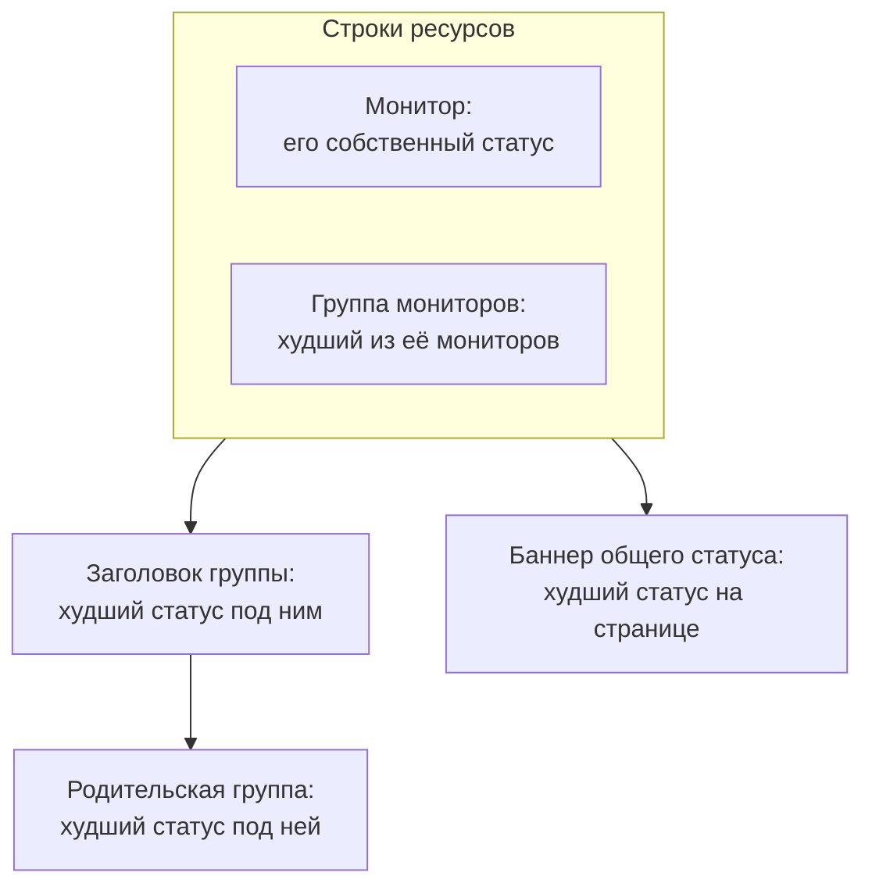

# Ресурсы и группы страницы статуса

Ресурс — это одна строка на вашей странице статуса: монитор или группа мониторов, с названием, понятным вашим клиентам, текущим статусом и, если хотите, аптаймом и историей. Группы — это разделы, содержащие ресурсы, так что страница с сорока мониторами читается как «API», «Веб-приложение» и «Конвейер данных», а не как бесконечный список. Вы создаёте и то и другое на одном экране: откройте страницу статуса и выберите **Ресурсы** в её боковом меню.

:::cards
- [Добавление монитора](#добавление-монитора): Разместите монитор на странице под названием, которое читают посетители.
- [Группы](#группы): Разделите страницу на разделы и вложите их друг в друга.
- [Правила мониторов](#автоматическое-добавление-мониторов-правилами-мониторов): Пусть правило само добавляет каждый подходящий монитор.
- [Импорт групп из CSV](#импорт-групп-из-csv): Постройте глубокую иерархию за один раз.
:::

По этим строкам посетители решают, «проблема у меня или у них», поэтому называйте их так, как клиенты говорят о вашем продукте: **Checkout API**, а не `prod-checkout-lb-healthcheck-us-east-1`.

## Как статус поднимается по странице

Каждая строка показывает текущий статус своего монитора. Каждый уровень выше показывает худший статус из всего, что под ним, где худший статус — это статус с наивысшим приоритетом среди статусов мониторов вашего проекта.

Ресурс определяет больше, чем цвет своей строки:

- **Архивированные мониторы не показываются.** Архивированный монитор больше не проверяется, поэтому его последний статус заморожен; страница скрывает его строку (и не учитывает его в статусе группы мониторов), а не показывает этот замороженный статус как актуальный. Строка сохраняется, поэтому после разархивирования монитор сразу возвращается.
- **Ресурсы определяют, какие инциденты показывает страница.** Инцидент появляется здесь, и подписчики страницы узнают о нём, когда один из мониторов инцидента является ресурсом страницы, напрямую или через группу мониторов. Разместите один и тот же монитор на нескольких страницах, и его инциденты дойдут до всех, если только инцидент не ограничен частью этих страниц. См. [Отдельная страница статуса для каждой аудитории](/docs/status-pages/one-status-page-per-audience).
- **Строка группы мониторов представляет каждый монитор в ней, в том числе для подписчиков.** На странице, которая позволяет подписчикам выбирать ресурсы, тот, кто подписался на группу мониторов, узнаёт об инцидентах, плановом обслуживании и объявлениях по любому монитору группы, как если бы выбрал этот монитор. См. [Подписчики и объявления](/docs/status-pages/subscribers#как-дать-подписчикам-выбирать-ресурсы-и-типы-событий).

## Экран «Ресурсы»

Пункт называется **Ресурсы** в проектах с включёнными группами мониторов и **Мониторы** в остальных; это один и тот же экран. Раньше у групп была отдельная страница, а старый адрес `/groups` теперь открывает этот экран.

Экран разделён на две части:

| Часть | Что в ней |
| ---- | ------------- |
| **Навигатор групп** (слева) | Все группы страницы в виде дерева, с полем **Search groups...** сверху и счётчиком снизу, например `3 groups · 12 resources`. Длинный список заканчивается кнопкой **Show N more of M**. |
| **Top of page** | Первая строка навигатора: ресурсы без группы, которые посетители видят первыми, выше всех групп. На странице без групп правая панель вместо этого называется **All resources**. |
| **Панель ресурсов** (справа) | Ресурсы выбранной группы. В её заголовке есть **Edit Group**, основная кнопка **Добавить монитор** и меню **More actions**. |
| Заголовок карточки | **New Group** и меню с тремя точками, где есть **Import groups from CSV** и **Обновить**. |

**Пустые состояния подсказывают, что делать.** Пустая группа показывает **No monitors here yet** с **Добавить монитор**, **Add Multiple** и, только пока на странице нет ни одной группы, **Create a Group**. Поиск без результатов показывает **No resources match your search**.

## Добавление монитора

:::steps
### Выберите, где будет строка

В навигаторе групп выберите группу, к которой относится ресурс, или **Top of page** для строки без группы.

### Нажмите «Добавить монитор»

Откроется диалог **Add a monitor to {group}**. Он состоит из одной страницы.

### Выберите монитор

Выберите его в поле **Монитор** (подсказка **Выберите монитор**). **Отображаемое имя**, текст, который читают посетители, заполняется именем монитора и меняется вслед за выбором другого монитора, пока вы не введёте своё название. Оно хранится отдельно от имени самого монитора, поэтому переименование здесь ничего не меняет в мониторинге.

### Задайте параметры отображения, если нужно

**Дополнительные поля** свёрнуты. Там есть **Описание** (необязательный markdown под строкой, удобный для фразы о том, что сервис на самом деле делает; изображение в нём видно каждому посетителю) и [параметры отображения](#параметры-отображения-ресурса). Оставьте раздел закрытым, и ресурс получит их значения по умолчанию.

### Сохраните ресурс

Нажмите **Добавить монитор**. Строка появится в группе и на странице статуса.
:::

В группе-сетке диалог также запрашивает строку и столбец для монитора над **Дополнительные поля**; см. [Список или сетка](#список-или-сетка).

> [!TIP]
> Чтобы показать несколько проверок одной строкой, добавьте группу мониторов. Когда переключатель **Группы мониторов** включён (**Настройки проекта** > **Расширенный** > **Флаги функций**, сохраняется сразу при переключении), под выпадающим списком появляется ссылка **Add a Monitor Group instead.** Нажмите её, и **Монитор** станет **Монитор Группа** (**Выберите группу мониторов**); **Add a Monitor instead.** переключает обратно.

### Добавление нескольких сразу

**Add Multiple** (а также **Add multiple monitors** в меню **More actions**) открывает **Add Multiple Monitors**. Это тоже одна страница: множественный выбор **Мониторы**, затем те же свёрнутые **Дополнительные поля**, параметры отображения из которых применяются к каждому выбранному монитору. Каждый ресурс берёт отображаемое имя и описание из своего монитора, а **Add Monitors** добавляет их все. Это самый быстрый способ наполнить новую страницу.

У множественного выбора есть вкладка **Метки**: нажмите на метку, и все мониторы с ней будут выбраны сразу.

### Повторное добавление по метке безопасно

Страница статуса показывает монитор один раз. Добавление идемпотентно, поэтому повторный выбор той же метки после того, как вы пометили несколько новых мониторов, добавляет только новые: мониторы, уже размещённые на странице, остаются ровно такими, как были, с отображаемым именем и параметрами, которые вы им задали.

Итоговая сводка массового добавления говорит об этом: добавленные мониторы перечислены под **Добавлено**, а уже бывшие на странице — под **Already Added**. Ничего не считается ошибкой, и для них ничего не записывается.

То же правило действует везде, где создаётся ресурс. Добавление монитора, который уже есть на странице, из формы одиночного добавления или привязка к нему существующего ресурса из формы редактирования отклоняется с сообщением *"This monitor is already added to this status page"*, даже если существующий ресурс находится в другой группе, ведь посетитель всё равно увидел бы монитор дважды. Чтобы показать монитор в другой группе, удалите его существующий ресурс и добавьте монитор туда, куда нужно.

## Параметры отображения ресурса

Раздел **Дополнительные поля** одинаков в форме одиночного добавления и в диалоге массового добавления. В обоих он изначально свёрнут, как и в **Редактировать ресурс**, где его свёрнутый заголовок показывает, что в нём отличается от значений по умолчанию. Всё здесь задаётся для каждого ресурса отдельно: две строки одной группы могут быть настроены по-разному.

| Поле | По умолчанию | Что делает |
| ----- | ------- | ------------ |
| **Подсказка** (`displayTooltip`) | Пусто | Показывается как подсказка рядом с ресурсом на вашей странице статуса. Используйте её для охвата: «Клиенты в США и ЕС». |
| **Показывать текущий статус ресурса** (`showCurrentStatus`) | Вкл. | Показывает текущий статус, например «работает», «ухудшение» или «не в сети», рядом со строкой. |
| **Показывать % безотказной работы** (`showUptimePercent`) | Выкл. | Показывает процент аптайма рядом с ресурсом. |
| **Выберите точность аптайма** (`uptimePercentPrecision`) | Один знак после запятой | Появляется, когда включено **Показывать % безотказной работы**, и тогда обязательно. |
| **Показывать график истории статуса** (`showStatusHistoryChart`) | Вкл. | Показывает ежедневные полосы истории аптайма ресурса. |

**Отображаемое имя** (`displayName`) и **Описание** (`displayDescription`) тоже служат только для отображения: они никогда не меняют сам монитор.

## Процент аптайма и графики истории

**Показывать % безотказной работы** и **Показывать график истории статуса** читают одну общую настройку всей страницы: сколько дней они охватывают. Это **История безотказной работы** на карточке **Что показывает ваша страница статуса** в **Страницы состояния → ваша страница → Расширенный → Расширенные настройки**. Она принимает от 1 до 90 дней, по умолчанию 90. Так что включайте переключатели для каждого ресурса, а окно задайте один раз для всей страницы.

**Точность — дело вкуса.** **Выберите точность аптайма** предлагает `99% (No Decimal)`, `99.9% (One Decimal)`, `99.99% (Two Decimal)` и `99.999% (Three Decimal)`. Больше знаков выглядит точнее и провоцирует споры о третьем; если вы публикуете SLA в три девятки, соответствуйте ему, и не более.

У групп есть собственные копии этих переключателей (см. ниже), поэтому группа может показывать сводный процент, пока мониторы внутри неё молчат, или наоборот.

Цвета полос графика истории задаются в **Дополнительные настройки** на странице **Брендинг**, а то, какие статусы мониторов считаются «недоступен», — в **Считается простоем** на карточке **Что показывает ваша страница статуса** в **Расширенные настройки**; и то и другое описано в [Оформление и домены страницы статуса](/docs/status-pages/branding-and-domains).

## Группы

Большинству групп нужно только название.

:::steps
### Нажмите New Group

Откроется **Create New Status Page Group**: два поля, затем два свёрнутых раздела.

### Назовите группу

Введите **Имя группы**: заголовок раздела, который видят посетители.

### Вложите её, если она относится к другой группе

Выберите **Parent Group** или оставьте **No parent group (top level)**. **Add a sub group** в меню группы заполняет это за вас.

### Создайте группу

Нажмите **Create Status Page Group**. Группа появится в навигаторе, готовая к мониторам.
:::

Два поля — это **Имя группы** (`name`) и **Parent Group** (`parentStatusPageGroupId`). Два свёрнутых раздела содержат всё остальное:

- **Макет**: его свёрнутый заголовок показывает **List** или **Grid**. В нём есть **Режим просмотра** и оси сетки (см. [Список или сетка](#список-или-сетка)), и он открывается сам у группы-сетки.
- **Дополнительные поля**: копии параметров ресурсов на уровне группы:
  - **Описание группы** (`description`): необязательный markdown под заголовком. Изображение в нём видно каждому посетителю.
  - **Развернуть на странице статуса по умолчанию** (`isExpandedByDefault`): включено по умолчанию; определяет, открыт раздел для посетителей или свёрнут.
  - **Показывать текущий статус группы** (`showCurrentStatus`): включено по умолчанию. Показывает статус рядом с заголовком группы.
  - **Показывать % безотказной работы** (`showUptimePercent`): выключено по умолчанию, с **Выберите точность аптайма**, когда включено.

Чтобы изменить группу, используйте **Edit Group** в заголовке панели или **Edit group** в меню строки навигатора: откроется **Edit Status Page Group** с кнопкой **Сохранить изменения**. Заголовок панели показывает метки включённых настроек (**Grid**, **Collapsed by default**, **Uptime %**), чтобы было видно, как настроена группа, не открывая форму.

### Управление группой

| Где | Действия |
| ----- | ------- |
| Меню строки навигатора | **Edit group**, **Move up**, **Move down**, **Показать ID**, **Delete group** |
| Меню **More actions** панели | **Edit this group**, **Add a sub group**, **Move group up**, **Move group down**, **Show group ID**, **Обновить**, **Delete this group** |

Группа, сохранённая без названия, отображается как **Untitled group** — верный признак того, что вы собирались что-то ввести.

## Вложенные группы

Группы можно вкладывать: задайте **Parent Group** у дочерней группы или используйте **Add a sub group inside this group** в навигаторе. Подсказка формы описывает структуру, для которой она задумана (что-то вроде Подразделения › Регион › Рынок), и каждый уровень показывает сводный статус и аптайм всего, что под ним.

Когда у группы есть дочерние группы, панель ресурсов показывает строку меток **Sub groups**, ведущих прямо к каждой из них, так что по иерархии можно переходить, не возвращаясь в навигатор.

Вложенность окупается на больших страницах: хостинг-провайдер с регионами внутри продуктов или ритейлер с рынками внутри бизнес-подразделений. На странице с двенадцатью мониторами один плоский уровень удобнее.

## Список или сетка

Раздел **Макет** формы группы задаёт **Режим просмотра** (`viewMode`) группы, который меняет то, как группа выглядит на странице статуса.

| Если вы хотите… | Выберите |
| --------------- | ---- |
| Показать простой вертикальный список сервисов, по одному в строке | **List** (по умолчанию) |
| Показать один и тот же сервис в нескольких регионах или у нескольких арендаторов в виде матрицы | **Grid** |

Выберите **Grid**, и появятся ещё четыре поля:

| Поле | Что ввести |
| ----- | ------------- |
| **Подпись оси строк** | Название измерения строк, подсказка `Service`. |
| **Значения оси строк** | Строки, добавляемые по одной кнопкой **Add Row** (подсказка `e.g. Auth`). |
| **Подпись оси столбцов** | Измерение столбцов, подсказка `Region`. |
| **Значения оси столбцов** | Столбцы, добавляемые кнопкой **Add Column** (подсказка `e.g. US-East`). |

Каждый монитор в группе-сетке занимает ячейку, поэтому **Добавить монитор** и диалог массового добавления запрашивают строку и столбец вместе с монитором, используя ваши собственные подписи осей.

> [!IMPORTANT]
> Настройте оси до того, как добавлять мониторы. Группа-сетка без строк и столбцов показывает сообщение, что монитор пока некуда поместить, с кнопкой **Set up the grid**, которая открывает форму группы на разделе **Макет**, а её кнопка **Добавить монитор** скрыта, пока вы этого не сделаете.

## Порядок того, что видят посетители

Порядок задаёте вы, а не алфавит:

| Что | Как изменить порядок |
| ---- | ----------------- |
| Ресурсы внутри группы | Перетащите строку. Панель сообщает об этом: **Drag a row to change the order visitors see**. |
| Группы относительно друг друга | **Move up** / **Move down** в меню строки навигатора или **Move group up** / **Move group down** в **More actions**. |
| Ресурсы без группы | Они находятся в **Top of page** и всегда показываются выше всех групп, так что поместите туда то, что все проверяют первым. |

**Два случая, когда перетаскивание отключено.** Поиск в поле **Search in {group}...** отключает изменение порядка (панель пишет `N of M shown · drag to reorder is off while filtering`), поэтому сначала очистите поиск. А группы-сетки никогда не упорядочиваются перетаскиванием, потому что место монитора определяется его строкой и столбцом.

Поставьте наверх сервис, о котором спрашивают чаще всего. Посетители, приходящие на страницу во время сбоя, обычно перестают читать после первого экрана.

## Автоматическое добавление мониторов правилами мониторов

Правило мониторов добавляет мониторы на страницу за вас: опишите мониторы один раз, и каждый подходящий монитор попадёт в выбранную вами группу. Правила находятся в **Ресурсы → Monitor Rules**, рядом с экраном «Ресурсы».

:::steps
### Откройте Monitor Rules

Откройте страницу статуса, выберите **Monitor Rules** в разделе **Ресурсы** её бокового меню и нажмите **Создать: Status Page Monitor Rule**.

### Назовите правило

На шаге **Основная информация** введите **Имя**. **Включено** включено по умолчанию.

### Укажите, каким мониторам оно соответствует

На шаге **Критерии совпадения** заполните хотя бы одно из полей **Метки монитора** (подходит монитор с любой из них), **Имя монитора** и **Описание монитора**. Монитор должен удовлетворять каждому заполненному критерию. Два шаблона принимают регулярное выражение без учёта регистра (`^api-.*`) или подстановочный знак `*` (`*checkout*`); `.*` соответствует всем мониторам.

### Выберите группу

На шаге **Группа** выберите **Add Monitors To Group** или оставьте поле пустым, чтобы добавлять мониторы без группы. Далее идут те же параметры отображения, что и у ресурса; в правиле **Показывать % безотказной работы** изначально включено.

### Сохраните правило

Правило сразу применяется ко всем уже существующим мониторам, а список показывает в **Adds Monitors To** группу, в которую оно добавляет мониторы.
:::

После этого правило снова применяется к монитору при каждом создании монитора или изменении его меток, имени или описания. Правило удаляет только те ресурсы, которые добавило само: его отключение или удаление убирает их со страницы, а монитор, добавленный вручную, никогда не затрагивается. Монитор, уже находящийся на странице, никогда не добавляется дважды.

## Импорт групп из CSV

Строить глубокую иерархию вручную утомительно. **Import groups from CSV** в меню с тремя точками в заголовке карточки открывает диалог **Import Groups from CSV**.

:::steps
### Скачайте шаблон

Нажмите **Download CSV Template**, чтобы получить `status-page-groups-template.csv`.

### Заполните его

Одна строка на группу. Обязательно только `name`; столбцы перечислены ниже.

### Загрузите и просмотрите

Нажмите **Choose CSV File**, выберите свой файл, затем **Preview Import**, чтобы проверить, что будет создано, прежде чем что-либо будет записано.

### Импортируйте

Запустите импорт. Таблица **Import results** показывает каждую строку как **Создано**, **Не удалось** или **Пропущено**, с причиной, так что неверная строка никогда не пропадает молча.
:::

| Столбец | Что задаёт |
| ------ | ------------ |
| `name` | Название группы. Обязательно. |
| `parentName` | Название группы, в которую вложена эта. |
| `description` | Описание группы. |
| `isExpandedByDefault` | Открыт ли раздел для посетителей изначально. |
| `showCurrentStatus` | Показывается ли статус рядом с заголовком группы. |
| `showUptimePercent` | Показывается ли процент аптайма рядом с группой. |
| `uptimePercentPrecision` | Сколько знаков после запятой использует этот процент. |
| `viewMode` | `List` или `Grid`. |
| `rowAxisLabel` | Название измерения строк для группы-сетки. |
| `rowAxisValues` | Значения строк для группы-сетки. |
| `columnAxisLabel` | Название измерения столбцов для группы-сетки. |
| `columnAxisValues` | Значения столбцов для группы-сетки. |

Импорт создаёт группы, а не ресурсы: добавьте мониторы потом с помощью **Добавить монитор**, **Add Multiple** или правила мониторов.

## Устранение неполадок

:::details "This monitor is already added to this status page"
Страница показывает каждый монитор один раз, даже в разных группах. У монитора уже есть ресурс, возможно, в другой группе или добавленный правилом мониторов. Найдите его в навигаторе, удалите этот ресурс и добавьте монитор туда, куда нужно.
:::

:::details Добавленный мной монитор не показывается на странице статуса
Проверьте, не архивирован ли монитор: строка архивированного монитора скрыта, пока вы его не разархивируете. Проверьте также группу: группа, настроенная на свёрнутое начальное состояние (**Развернуть на странице статуса по умолчанию** выключено), скрывает свои строки, пока посетитель её не откроет.
:::

:::details В группе-сетке нет кнопки «Добавить монитор»
У сетки пока нет строк или столбцов. Нажмите **Set up the grid**, добавьте значения осей в разделе **Макет**, и **Добавить монитор** вернётся.
:::

:::details Я не могу перетаскивать строки
Очистите поле **Search in {group}...**: изменение порядка отключено, пока панель отфильтрована. Группы-сетки никогда не упорядочиваются перетаскиванием.
:::

## Что дальше

:::cards
- [Оформление и домены страницы статуса](/docs/status-pages/branding-and-domains): Логотип, favicon, цвета графика истории и ваш собственный домен.
- [Подписчики и объявления](/docs/status-pages/subscribers): Кто узнаёт, когда эти ресурсы меняются.
- [Отдельная страница статуса для каждой аудитории](/docs/status-pages/one-status-page-per-audience): Один монитор на многих страницах и инцидент, который доходит только до некоторых из них.
- [Публичный API](/docs/status-pages/public-api): Читайте ресурсы, группы и аптайм в формате JSON.
:::
