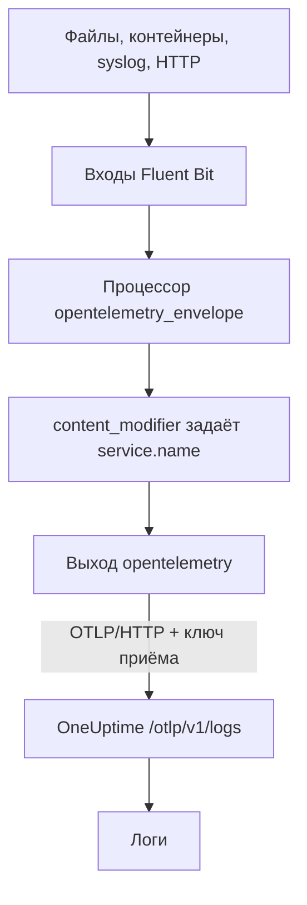

# Fluent Bit

[Fluent Bit](https://docs.fluentbit.io/manual) — лёгкий агент, который собирает логи из файлов, systemd, контейнеров, syslog, HTTP и многих других источников. Его [выход OpenTelemetry](https://docs.fluentbit.io/manual/pipeline/outputs/opentelemetry) отправляет собранное на OpenTelemetry-адрес (OTLP) OneUptime, где логи становятся доступными для поиска в **Продукты → Журналы**.

:::cards
- [Настройка Fluent Bit](#настройка-fluent-bit): Добавьте выход OpenTelemetry и задайте имя службы.
- [Полный пример](#полный-пример): Целый файл конфигурации, с которого можно начать.
- [Собственная установка OneUptime](#собственная-установка-oneuptime): Направьте Fluent Bit на свой экземпляр.
:::

## Как это работает



Fluent Bit упаковывает каждую запись в конверт OpenTelemetry, чтобы она могла нести атрибуты ресурса, такие как `service.name`. Затем выход OpenTelemetry отправляет записи в OneUptime с вашим ключом приёма в заголовке `x-oneuptime-token`. OneUptime сохраняет их под службой, указанной в `service.name`, и создаёт эту службу при первой отправке.

## Перед началом

- **Установите Fluent Bit** — см. [руководство по установке](https://docs.fluentbit.io/manual/installation/getting-started-with-fluent-bit). Конфигурация на этой странице использует формат YAML Fluent Bit и процессор `opentelemetry_envelope`, поэтому нужна актуальная версия.
- **Проект OneUptime.** В OneUptime Cloud телеметрия оплачивается за каждый принятый ГБ — см. [цены](https://oneuptime.com/pricing), — а проекту на плане Free нужен способ оплаты, прежде чем он сможет отправлять телеметрию.
- **Ключ приёма телеметрии.** Если его ещё нет:

:::steps
### Откройте ключи приёма

Перейдите в **Продукты → Настройки проекта**, откройте в боковом меню **Телеметрия и APM** и выберите **Ключи приема**.


### Создайте ключ

Нажмите **Создать ключ приёма**. В окне уже заполнено имя ключа и выбран тип **Сервер** — именно с таким ключом отправляют данные приложение или коллектор, — так что нажмите **Создать ключ приёма**, чтобы создать его, или сначала переименуйте.

### Скопируйте секрет

Новый ключ открывается на отдельной странице. Скопируйте его **Секретный ключ**: это `YOUR_TELEMETRY_INGESTION_TOKEN` в конфигурации ниже.


:::

## Настройка Fluent Bit

Fluent Bit читает свою конфигурацию YAML из файла, например `/etc/fluent-bit/fluent-bit.yaml`.

:::steps
### Добавьте выход OpenTelemetry

Добавьте выход `opentelemetry`, который отправляет данные в OneUptime. Оставьте выход `stdout` на время проверки, если хотите видеть записи локально:

```yaml title="fluent-bit.yaml"
pipeline:
  outputs:
    - name: stdout
      match: "*"
    - name: opentelemetry
      match: "*"
      host: "oneuptime.com"
      port: 443
      metrics_uri: "/otlp/v1/metrics"
      logs_uri: "/otlp/v1/logs"
      traces_uri: "/otlp/v1/traces"
      tls: On
      header:
        - x-oneuptime-token YOUR_TELEMETRY_INGESTION_TOKEN
```

### Упакуйте логи в конверт OpenTelemetry и задайте имя службы

Добавьте к каждому входу процессор `opentelemetry_envelope`, а за ним — `content_modifier`, который задаёт `service.name`. Замените `YOUR_SERVICE_NAME` именем, под которым логи должны появляться в OneUptime:

```yaml title="fluent-bit.yaml"
pipeline:
  inputs:
    - name: tail # or any other input
      path: /var/log/my-app/*.log

      processors:
        logs:
          - name: opentelemetry_envelope

          - name: content_modifier
            context: otel_resource_attributes
            action: upsert
            key: service.name
            value: YOUR_SERVICE_NAME
```

### Перезапустите Fluent Bit

Перезапустите службу Fluent Bit или запустите его командой `fluent-bit -c /etc/fluent-bit/fluent-bit.yaml`. Через несколько секунд логи появятся в **Продукты → Журналы**, а служба — в **Продукты → Службы**.
:::

## Полный пример

Эта конфигурация принимает логи по HTTP на порту `8888` и пересылает их в OneUptime:

```yaml title="fluent-bit.yaml"
service:
  flush: 1
  log_level: info

pipeline:
  inputs:
    - name: http
      listen: 0.0.0.0
      port: 8888

      processors:
        logs:
          - name: opentelemetry_envelope

          - name: content_modifier
            context: otel_resource_attributes
            action: upsert
            key: service.name
            value: YOUR_SERVICE_NAME

  outputs:
    - name: stdout
      match: "*"
    - name: opentelemetry
      match: "*"
      host: "oneuptime.com"
      port: 443
      metrics_uri: "/otlp/v1/metrics"
      logs_uri: "/otlp/v1/logs"
      traces_uri: "/otlp/v1/traces"
      tls: On
      header:
        - x-oneuptime-token YOUR_TELEMETRY_INGESTION_TOKEN
```

Замените вход `http` нужными вам входами — например, `tail` для файлов логов или `systemd` для журнала — и оставьте оба процессора на каждом из них.

## Собственная установка OneUptime

Задайте в `host` хост вашего экземпляра OneUptime. Если он работает по обычному HTTP, а не по HTTPS, задайте также в `port` порт, на котором он слушает (обычно `80`), и уберите `tls`:

```yaml title="fluent-bit.yaml"
pipeline:
  outputs:
    - name: stdout
      match: "*"
    - name: opentelemetry
      match: "*"
      host: "your-oneuptime-instance.com"
      port: 80
      metrics_uri: "/otlp/v1/metrics"
      logs_uri: "/otlp/v1/logs"
      traces_uri: "/otlp/v1/traces"
      header:
        - x-oneuptime-token YOUR_TELEMETRY_INGESTION_TOKEN
```

## Устранение неполадок

:::details Fluent Bit пишет `401` от выхода OpenTelemetry
Ключ приёма отсутствует, неизвестен или истёк. Проверьте строку `header`: это `x-oneuptime-token`, пробел и затем **Секретный ключ** ключа.
:::

:::details Fluent Bit пишет `402` или `422`
`402`: в OneUptime Cloud проект на плане Free и без способа оплаты. Добавьте его в **Настройки проекта → Биллинг и счета → Биллинг**. `422`: ключ отключён, или это ключ браузера. Снова включите **Включено** в настройках ключа или создайте ключ типа **Сервер**.
:::

:::details Логи приходят под неожиданной службой
Служба берётся из `service.name`. Проверьте, что у каждого входа есть процессор `opentelemetry_envelope`, а за ним `content_modifier`, который её задаёт.
:::

:::details Ничего не приходит, а Fluent Bit пишет ошибки подключения
Проверьте, что для HTTPS-адреса заданы `tls: On` и `port: 443`, и что хост, на котором работает Fluent Bit, может связаться с хостом OneUptime по этому порту.
:::

Если у вас есть вопросы или нужна помощь с конфигурацией, напишите нам на support@oneuptime.com.

## Что дальше

:::cards
- [Конвейеры логов](/docs/telemetry/log-pipelines): Разбирайте и обогащайте логи, которые отправляет Fluent Bit.
- [Синтаксис поиска](/docs/telemetry/search-syntax): Находите логи в обозревателе журналов.
- [OpenTelemetry](/docs/telemetry/open-telemetry): Адреса, ключи и ограничения для всей телеметрии.
- [Fluentd](/docs/telemetry/fluentd): Используйте вместо этого Fluentd.
:::
