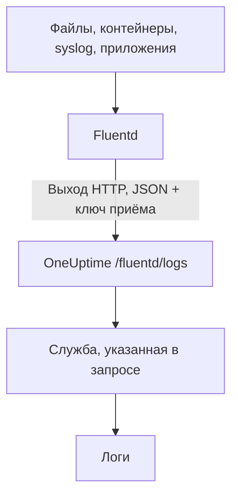

# Fluentd

[Fluentd](https://www.fluentd.org/) собирает логи из файлов, контейнеров, syslog, приложений и [многих других источников](https://www.fluentd.org/datasources). Его встроенный [выход HTTP](https://docs.fluentd.org/output/http) отправляет их на адрес Fluentd в OneUptime, где они становятся доступными для поиска в **Продукты → Журналы**.

:::cards
- [Настройка Fluentd](#настройка-fluentd): Добавьте выход HTTP, направленный на OneUptime.
- [Как читаются записи](#как-читаются-записи): Какие поля становятся сообщением, уровнем важности и атрибутами.
- [Собственная установка OneUptime](#собственная-установка-oneuptime): Направьте Fluentd на свой экземпляр.
:::

## Как это работает



Fluentd отправляет записи пакетами в формате JSON, с вашим ключом приёма в заголовке `x-oneuptime-token` и именем службы в `x-oneuptime-service-name`. OneUptime превращает каждую запись в лог этой службы и создаёт службу при первой отправке.

## Перед началом

- **Установите Fluentd** — см. [руководство по установке](https://docs.fluentd.org/installation).
- **Проект OneUptime.** В OneUptime Cloud телеметрия оплачивается за каждый принятый ГБ — см. [цены](https://oneuptime.com/pricing), — а проекту на плане Free нужен способ оплаты, прежде чем он сможет отправлять телеметрию.
- **Ключ приёма телеметрии.** Если его ещё нет:

:::steps
### Откройте ключи приёма

Перейдите в **Продукты → Настройки проекта**, откройте в боковом меню **Телеметрия и APM** и выберите **Ключи приема**.


### Создайте ключ

Нажмите **Создать ключ приёма**. В окне уже заполнено имя ключа и выбран тип **Сервер** — именно с таким ключом отправляют данные приложение или коллектор, — так что нажмите **Создать ключ приёма**, чтобы создать его, или сначала переименуйте.

### Скопируйте секрет

Новый ключ открывается на отдельной странице. Скопируйте его **Секретный ключ**: это `YOUR_SERVICE_TOKEN` в конфигурации ниже.


:::

## Настройка Fluentd

Файл конфигурации Fluentd обычно находится в `/etc/fluent/fluentd.conf`, а для старого пакета td-agent — в `/etc/td-agent/td-agent.conf`.

:::steps
### Добавьте выход HTTP

Добавьте секцию `<match>`, которая отправляет записи в OneUptime. Замените `YOUR_SERVICE_TOKEN` вашим ключом приёма, а `YOUR_SERVICE_NAME` — именем, под которым должны появляться логи (любым на ваш выбор):

```text title="fluentd.conf"
# Match all patterns
<match **>
  @type http

  endpoint https://oneuptime.com/fluentd/logs
  open_timeout 2

  headers {"x-oneuptime-token":"YOUR_SERVICE_TOKEN", "x-oneuptime-service-name":"YOUR_SERVICE_NAME"}

  content_type application/json
  json_array true

  <format>
    @type json
  </format>
  <buffer>
    flush_interval 10s
    chunk_limit_size 900k
  </buffer>
</match>
```

`json_array true` отправляет каждый блок буфера одним массивом JSON, а `flush_interval 10s` отправляет буфер каждые 10 секунд. `chunk_limit_size 900k` держит каждый запрос меньше 1 МБ: больше OneUptime на этом адресе не принимает.

### Перезапустите Fluentd

Перезапустите службу Fluentd, чтобы она загрузила новый выход.

### Проверьте, что логи приходят

Через несколько секунд после следующего сброса логи появятся в **Продукты → Журналы**. Служба появится в **Продукты → Службы**; если её ещё не было, OneUptime создаст её.
:::

## Полный пример

Эта конфигурация принимает записи по протоколу forward Fluentd на порту `24224` и отправляет их все в OneUptime:

```text title="fluentd.conf"
####
## Source descriptions:
##

## built-in TCP input
## @see https://docs.fluentd.org/input/forward
<source>
  @type forward
  port 24224
  bind 0.0.0.0
</source>

<match **>
  @type http

  endpoint https://oneuptime.com/fluentd/logs
  open_timeout 2

  headers {"x-oneuptime-token":"YOUR_SERVICE_TOKEN", "x-oneuptime-service-name":"YOUR_SERVICE_NAME"}

  content_type application/json
  json_array true

  <format>
    @type json
  </format>
  <buffer>
    flush_interval 10s
    chunk_limit_size 900k
  </buffer>
</match>
```

Чтобы отправлять разные источники как разные службы, используйте по одной секции `<match>` на тег, каждую со своим `x-oneuptime-service-name`.

## Как читаются записи

OneUptime читает из каждой записи такие поля:

| Поле лога | Берётся из первого присутствующего поля среди | Примечания |
| --- | --- | --- |
| Тело | `message`, `log`, `msg`, `body`, `text` | Строка лога. Запись без этих полей сохраняется целиком, в виде JSON. |
| Уровень важности | `level`, `severity`, `loglevel`, `log_level`, `priority`, `severityText`, `severity_text` | Названия вроде `trace`, `debug`, `info`, `notice`, `warn`, `error`, `critical` и `fatal`, в любом регистре. Любое другое значение сохраняется как `Unspecified`. |
| ID трассировки | `trace_id`, `traceId`, `traceid` | Связывает лог с его трассировкой. |
| ID спана | `span_id`, `spanId`, `spanid` | Связывает лог с его спаном. |
| Служба | заголовок `x-oneuptime-service-name` | `Fluentd`, если заголовок не задан. |
| Время | — | Момент, когда OneUptime получает запись. |

Все остальные поля становятся атрибутами с именем `fluentd.` и названием поля, по которым можно искать и фильтровать: поле `container_name` — это `@fluentd.container_name` в обозревателе журналов. Вложенный объект разворачивается через точки, например в `fluentd.kubernetes.pod_name`, а список сохраняется в виде JSON.

Логи Fluentd проходят через ваши [конвейеры логов](/docs/telemetry/log-pipelines), фильтры отбрасывания и правила маскирования, как и любые другие логи.

## Собственная установка OneUptime

Замените `https://oneuptime.com` в `endpoint` на URL вашего экземпляра OneUptime: `http(s)://YOUR_ONEUPTIME_HOST/fluentd/logs`.

## Устранение неполадок

:::details Fluentd пишет `401` от выхода HTTP
Ключ приёма отсутствует, неизвестен или истёк. Проверьте значение `x-oneuptime-token` в `headers`.
:::

:::details Fluentd пишет `402` или `422`
`402`: в OneUptime Cloud проект на плане Free и без способа оплаты. Добавьте его в **Настройки проекта → Биллинг и счета → Биллинг**. `422`: ключ отключён, или это ключ браузера. Снова включите **Включено** в настройках ключа или создайте ключ типа **Сервер**.
:::

:::details Fluentd пишет `413`
Запрос больше 1 МБ, а больше OneUptime на этом адресе не принимает. Задайте `chunk_limit_size 900k` в секции `<buffer>`, как в конфигурации выше.
:::

:::details Логи приходят под службой `Fluentd`
Нет заголовка `x-oneuptime-service-name`. Добавьте его в `headers` в каждой секции `<match>`.
:::

:::details Тело лога показывает всю запись в виде JSON
OneUptime берёт тело из первого присутствующего поля среди `message`, `log`, `msg`, `body` и `text`, а если ни одного из них нет, сохраняет запись целиком. Переименуйте поле со строкой лога в одно из этих, например фильтром `record_transformer` в Fluentd.
:::

Если у вас есть вопросы или нужна помощь с конфигурацией, напишите нам на support@oneuptime.com.

## Что дальше

:::cards
- [Конвейеры логов](/docs/telemetry/log-pipelines): Разбирайте и обогащайте логи, которые отправляет Fluentd.
- [Синтаксис поиска](/docs/telemetry/search-syntax): Находите логи в обозревателе журналов.
- [Fluent Bit](/docs/telemetry/fluentbit): Более лёгкий агент, который отправляет данные по OpenTelemetry.
- [Мониторинг журналов](/docs/monitor/logs-monitor): Получайте оповещения, когда появляются подходящие логи.
:::
