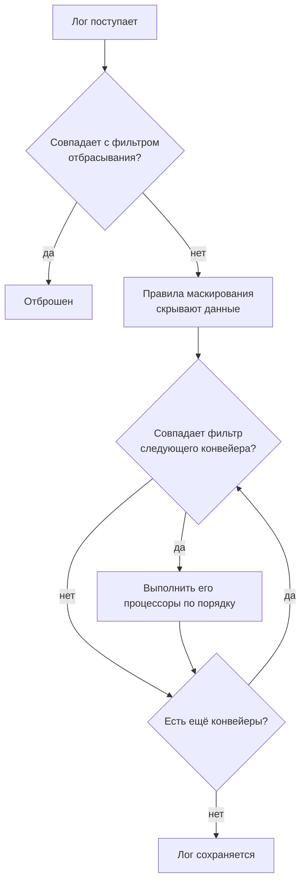

# Конвейеры логов

Конвейеры логов преобразуют логи в момент приёма в OneUptime, до их сохранения. У конвейера есть **фильтр**, который решает, к каким логам он применяется, и упорядоченный список **процессоров**, каждый из которых меняет эти логи: извлекает поля из сообщения, исправляет серьёзность, переименовывает атрибут или помечает лог категорией.

Конвейеры находятся в разделе **Журналы → Настройки → Пайплайны**.

:::cards
- [Как выполняется конвейер](#как-выполняется-конвейер): Где конвейеры стоят в приёме и в каком порядке выполняются.
- [Создание конвейера](#создание-конвейера): Выбрать нужные логи и добавить к ним процессоры.
- [Key=Value Parser](#keyvalue-parser): Превратить строки межсетевых экранов и logfmt в атрибуты.
- [Пример: межсетевой экран Sophos XGS](#пример-межсетевой-экран-sophos-xgs): Разобрать syslog межсетевого экрана от начала до конца.
:::

## Как выполняется конвейер

Конвейеры выполняются для каждого лога, который принимает OneUptime, будь то логи OpenTelemetry, syslog или Fluentd, после фильтров отбрасывания и правил маскирования и до сохранения лога:



- **Конвейеры выполняются по порядку**: в порядке списка, который меняется перетаскиванием строк. Конвейер затрагивает только логи, с которыми совпадает его фильтр, и выполняется каждый конвейер с совпавшим фильтром, а не только первый.
- **Процессоры тоже выполняются по порядку**, и каждый видит результат предыдущего, поэтому парсер должен стоять перед процессором, который читает извлечённые им поля. Фильтр более позднего конвейера тоже видит изменения, сделанные предыдущими.
- **Обработка происходит при приёме.** Изменение конвейера влияет на логи, поступившие после него, примерно в течение минуты; уже сохранённые логи повторно не обрабатываются.
- **Процессор никогда не отбрасывает и не очищает лог.** Строка, которую парсер не может прочитать, проходит без изменений. Чтобы отбрасывать логи, используйте **Журналы → Настройки → Фильтры отбрасывания**.
- **Выполняются только включённые конвейеры и процессоры.** Отключите любой из них на его странице, чтобы приостановить его, не теряя настроек.

## Типы процессоров

| Процессор | Что делает |
| --- | --- |
| Grok Parser | Извлекает поля из строки фиксированного вида (строки доступа nginx) по именованному шаблону. |
| Key=Value Parser | Разбивает строку из пар `key=value` (Sophos XGS, Fortinet, logfmt) на атрибуты, в любом порядке. |
| Преобразователь серьёзности | Сопоставляет исходный уровень вроде `warn` из атрибута со стандартной серьёзностью лога. |
| Перенаправитель атрибутов | Переименовывает или копирует атрибут, например `src_ip` в `source_ip`. |
| Обработчик категорий | Помечает лог названием категории, если он совпадает с фильтром, например «Payment Error». |

## Перед началом работы

- Логи, поступающие в OneUptime: через [OpenTelemetry](/docs/telemetry/open-telemetry), [syslog](/docs/telemetry/syslog), [Fluentd](/docs/telemetry/fluentd) или проб.
- Право изменять конвейеры. Оно есть у владельцев и администраторов проекта; остальным нужны разрешения **Create Log Pipeline** и **Create Log Pipeline Processor**.

## Создание конвейера

:::steps
### Создайте конвейер

Перейдите в **Журналы → Настройки → Пайплайны** и нажмите **Создать: Журнал Конвейер**. Задайте **Имя**, например *Разбор логов межсетевого экрана*, и создайте конвейер. Откроется его страница.

### Выберите, к каким логам он применяется

В разделе **Условия фильтра** нажмите **Редактировать** и добавьте условия по **Серьёзность**, **Тело лога**, **ID сервиса** или пользовательскому атрибуту. Объедините их через **Все условия** или **Любое условие** и нажмите **Сохранить изменения**. Конвейер без условий применяется ко всем логам.

### Добавьте процессоры

В разделе **Процессоры** нажмите **Добавить обработчик**, введите **Имя процессора**, выберите **Тип процессора** и заполните его настройки. У парсеров Grok и Key=Value есть тестер: вставьте пример строки, чтобы увидеть, что они извлекут. Нажмите **Создать обработчик**.

### Расставьте их по порядку

Перетаскивайте процессоры, чтобы изменить порядок их выполнения, и так же перетаскивайте конвейеры в списке **Пайплайны**. Новые логи обрабатываются примерно в течение минуты.
:::

### Условия фильтра

Каждое условие сравнивает поле со значением. За конструктором фильтр — это запрос вида `severityText = 'Error' AND body LIKE 'timeout'`, который показывает **Preview query**.

| Оператор | В запросе | Примечания |
| --- | --- | --- |
| равно | `=` | Точное совпадение с учётом регистра. |
| не равно | `!=` | Точное совпадение с учётом регистра. |
| содержит | `LIKE` | Без учёта регистра. `%` в значении — подстановочный знак. |
| является одним из | `IN` | Список точных значений через запятую. |

Значения серьёзности: `Fatal`, `Error`, `Warning`, `Information`, `Debug`, `Trace` и `Unspecified`, поэтому `severityText = 'Error'` совпадает, а `'ERROR'` — никогда. Пользовательский атрибут записывается как `attributes.<key>`, например `attributes.networkDevice.name = 'hq-firewall'`.

## Key=Value Parser

Межсетевые экраны и другие сетевые устройства записывают каждое событие одной строкой из пар `key=value`. Какие поля есть в строке и в каком порядке, зависит от события, поэтому описать их одним шаблоном grok нельзя. Key=Value Parser шаблон не нужен: он проходит по строке и превращает каждую найденную пару в атрибут лога, в любом порядке. Став атрибутами, они доступны для поиска и фильтрации, их можно использовать в [мониторинге журналов](/docs/monitor/logs-monitor) и получать по одному оповещению на туннель, интерфейс или пользователя с помощью [Группировать по](/docs/monitor/logs-monitor#оповещения-по-группам-group-by).

### Конфигурация

| Параметр | По умолчанию | Описание |
| --- | --- | --- |
| Source Field | `body` | Поле для разбора: `body` для сообщения лога или атрибут вроде `attributes.raw_line`. |
| Target Prefix | нет | Пространство имён для извлечённых ключей. С `sophos` ключ `con_name` сохраняется как `sophos.con_name`. Разделитель добавляется, если префикс ещё не заканчивается на `.`, `_`, `-` или `:`. |
| Pair Delimiter | любой пробельный символ | Что отделяет одну пару от следующей. Оставьте пустым для Sophos, Fortinet и logfmt; укажите `,`, `;` или `\|` для других форматов. |
| Key-Value Delimiter | `=` | Что отделяет ключ от значения, например `:` для `status:up`. |
| Переопределять при конфликте | выкл. | Может ли ключ заменить атрибут, который у лога уже есть. По умолчанию выключено: ключи берутся из самой строки, иначе строка могла бы переписать атрибуты, заданные при приёме, например устройство, от которого она пришла. |

Два разделителя должны различаться, не должны содержать друг друга и не могут содержать кавычки или обратные косые черты; длина каждого не больше 8 символов. Форма процессора проверяет это перед сохранением, а её тестер, **Test With a Sample Line**, показывает точный набор атрибутов, который даст пример строки.

### Правила разбора

- **Значения в кавычках** сохраняют пробелы и разделители: `message="IPSec Connection HQ-Branch1 terminated"` — одно значение. Работают и двойные, и одинарные кавычки, а `\"` внутри значения — буквальная кавычка. Незакрытая кавычка (строка, обрезанная ограничением размера syslog) продолжается до конца строки.
- **Значения без кавычек** продолжаются до следующего разделителя пар, поэтому `url=https://example.com/?a=b` сохраняет свой `=`.
- **Пустые значения** (`key=` и `key=""`) сохраняются как пустые строки.
- **Значения всегда текст.** `latency=11` сохраняется как `"11"`, так же как захват grok без типа.
- **Ключи** начинаются с буквы или подчёркивания и содержат буквы, цифры и `. _ - @`. Текст перед первой парой, например заголовок syslog по RFC 3164, и отдельные слова без разделителя пропускаются. Приоритет syslog, приклеенный к первому ключу (`<30>device_name="SFW"`), отбрасывается, а ключ сохраняется.
- **Повторяющийся ключ сохраняет первое значение**; последующие игнорируются.
- **Ограничения:** строка длиннее 32 KiB не разбирается, из одной строки берётся не больше 100 пар, ключи длиннее 256 символов пропускаются, а значения длиннее 4096 символов обрезаются.

### Пример: межсетевой экран Sophos XGS

Когда межсетевой экран Sophos XGS отправляет syslog на [проб](/docs/monitor/network-device-monitor), каждое сообщение сохраняется как лог сетевого устройства, а сообщение syslog становится его телом. Чтобы разобрать его:

:::steps
#### Создайте конвейер для межсетевого экрана

Перейдите в **Журналы → Настройки → Пайплайны** и создайте конвейер. Задайте фильтр, совпадающий с логами межсетевого экрана, например пользовательский атрибут `networkDevice.name` равно `hq-firewall` (`attributes.networkDevice.name = 'hq-firewall'`) или **Тело лога** содержит `log_component=`, чтобы охватить все строки Sophos.

#### Добавьте парсер

Откройте конвейер и нажмите **Добавить обработчик**. Выберите **Key=Value Parser**, оставьте **Source Field** равным `body` и задайте **Target Prefix** значение `sophos` (необязательно, но так поля межсетевого экрана будут вместе).

#### Проверьте и сохраните

Вставьте строку от межсетевого экрана в **Test With a Sample Line**, чтобы проверить результат, затем нажмите **Создать обработчик**.
:::

Событие IPsec от Sophos:

```text
device_name="SFW" timestamp="2024-05-02T11:03:12+0200" device_model="XGS2100" device_serial_id="X1234" log_id="010101600001" log_type="Event" log_component="IPSec" log_subtype="System" severity="Information" con_name="HQ-Branch1" src_ip="10.171.4.117" dst_ip="10.171.4.118" status="Terminated" message="IPSec Connection HQ-Branch1 between 10.171.4.117 and 10.171.4.118 for Child HQ-Branch1 terminated."
```

превращается в такие атрибуты (среди прочих):

| Атрибут | Значение |
| --- | --- |
| `sophos.log_component` | `IPSec` |
| `sophos.con_name` | `HQ-Branch1` |
| `sophos.status` | `Terminated` |
| `sophos.src_ip` | `10.171.4.117` |
| `sophos.message` | `IPSec Connection HQ-Branch1 between 10.171.4.117 and 10.171.4.118 for Child HQ-Branch1 terminated.` |

В строке SLA для SD-WAN другие поля в другом порядке, и тот же процессор с ней справляется:

```text
log_id=158825619025 log_type="SD-WAN" log_component="SLA" profile_name="Branch-Internet" gw_name="WAN2" latency=11 jitter=2 packet_loss=0 gw_status="up" sla_status="SLA met"
```

даёт `sophos.gw_name = WAN2`, `sophos.latency = 11`, `sophos.packet_loss = 0`, `sophos.gw_status = up` и `sophos.sla_status = SLA met`. Старые выпуски SFOS пишут устаревший формат (`device="SFW" date=2017-01-31 time=18:02:03 timezone="IST" ... connectionname="Tunnel A"`); он разбирается так же, только имя туннеля находится в `connectionname`, а не в `con_name`.

Как превратить эти строки SLA в метрики задержки, джиттера и потери пакетов по шлюзам, показано в примере на странице [Правила записи для логов](/docs/telemetry/log-recording-rules).

### Пример: Fortinet FortiGate

Логи FortiGate устроены так же:

```text
date=2024-01-01 time=10:00:00 devname="FG100" logid="0100032001" type="event" subtype="vpn" level="notice" action="tunnel-down" vpntunnel="HQ-to-Branch2" msg="IPsec tunnel down"
```

С настройками по умолчанию и префиксом `fortigate` это даёт `fortigate.devname = FG100`, `fortigate.subtype = vpn`, `fortigate.action = tunnel-down`, `fortigate.vpntunnel = HQ-to-Branch2` и `fortigate.time = 10:00:00`: двоеточия во времени — часть значения, а не разделитель.

### Одно оповещение на туннель

Когда поля разобраны, [мониторинг журналов](/docs/monitor/logs-monitor) может считать сбои и открывать отдельное оповещение для каждого туннеля: фильтруйте по `sophos.log_component` = `IPSec` с телом, содержащим `terminated`, и группируйте по `sophos.con_name`. См. [Оповещения по группам](/docs/monitor/logs-monitor#оповещения-по-группам-group-by).

## Grok Parser

Извлекает структурированные поля из строки фиксированного вида. Шаблон grok — это регулярное выражение с именованными ссылками: `%{IPV4:client_ip}` означает «найти адрес IPv4 и сохранить его как `client_ip`». Шаблон не обязан охватывать всю строку, а строка, которая не совпала, остаётся без изменений.

| Параметр | По умолчанию | Описание |
| --- | --- | --- |
| **Source Field** | `body` | Поле для разбора, как у Key=Value Parser. |
| **Target Prefix** | нет | Пространство имён для извлечённых полей, добавляется так же. |
| **Grok Pattern** | — | Шаблон. Форма показывает доступные именованные шаблоны. |

Захват сохраняется как текст, если не задать ему тип: `%{NUMBER:status:int}` сохраняет его как число. Типы: `int`, `long`, `float`, `double`, `boolean` и `string`. Перед сохранением проверьте шаблон на примере строки в **Test Your Pattern**.

| Тело лога | Шаблон | Добавленные атрибуты |
| --- | --- | --- |
| `10.0.1.5 - GET /health 200` | `%{IPV4:client_ip} - %{WORD:method} %{NOTSPACE:path} %{NUMBER:status:int}` | client_ip, method, path, status |

Если строка состоит из пар `key=value`, порядок которых меняется, используйте вместо этого Key=Value Parser.

## Преобразователь серьёзности

Читает исходное значение из атрибута и сопоставляет его со стандартной серьёзностью. Укажите в **Атрибут источника** атрибут с уровнем (по умолчанию `level`), затем добавьте **Сопоставления**: каждое связывает значение, которое выдаёт ваше приложение, например `warn`, с серьёзностью, например Warning. Сравнение не учитывает регистр. Значение без сопоставления оставляет серьёзность лога прежней.

## Перенаправитель атрибутов

Переносит значение одного атрибута (**Ключ источника**) в другой (**Целевой ключ**), например `src_ip` в `source_ip`.

| Параметр | По умолчанию | Действие |
| --- | --- | --- |
| **Сохранить источник** | выкл. | Выключено — атрибут переименовывается: ключ источника удаляется. Включено — атрибут копируется, а ключ источника остаётся. |
| **Переопределять при конфликте** | вкл. | Включено — цель заменяется, если она уже существует. Выключено — цель не трогается, а перенаправление пропускается. |

## Обработчик категорий

По порядку проверяет список правил и сохраняет в целевой атрибут название первого правила, фильтр которого совпал, чтобы можно было сразу найти все логи «Payment Error». Задайте **Целевой атрибут** (по умолчанию `category`), затем добавьте **Правила категорий**: **Category name** и условия в **When logs match**. Побеждает первое совпавшее правило; лог, который не совпал ни с одним, остаётся без изменений.

## Дальнейшие шаги

:::cards
- [Мониторинг журналов](/docs/monitor/logs-monitor): Получать оповещения по атрибутам, которые извлекают ваши конвейеры.
- [Правила записи для логов](/docs/telemetry/log-recording-rules): Превратить разобранные поля логов в метрики.
- [Syslog](/docs/telemetry/syslog): Отправлять в OneUptime syslog межсетевых экранов и серверов.
- [Синтаксис поиска](/docs/telemetry/search-syntax): Искать по новым атрибутам в обозревателе логов.
:::
