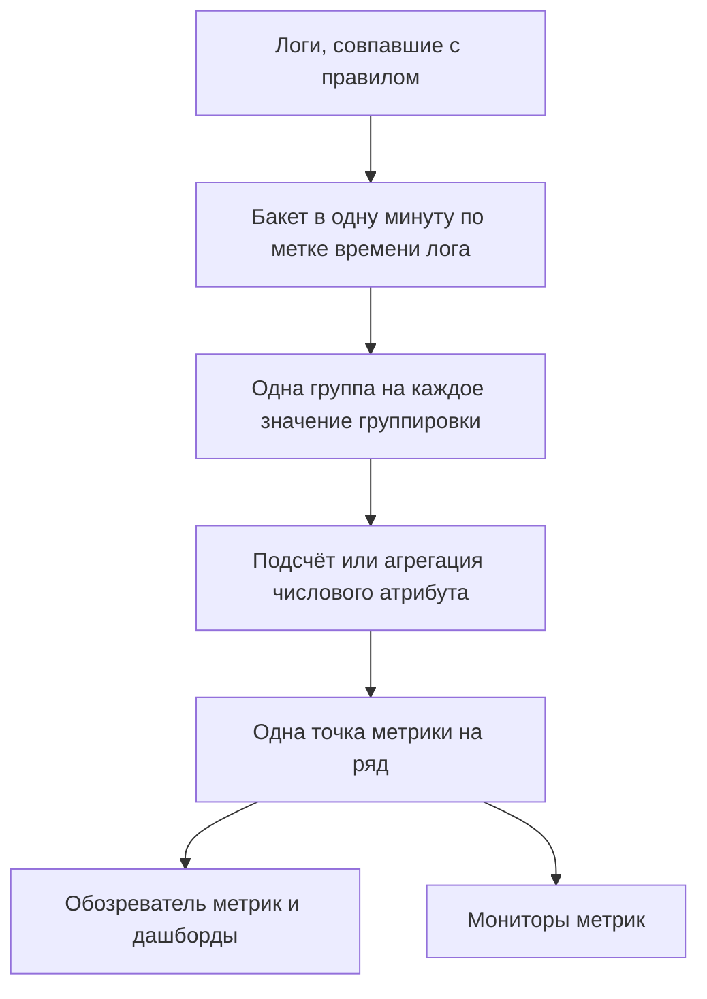

# Правила записи для логов

**Log Recording Rule** превращает логи в метрику. Каждую минуту правило берёт логи, совпавшие с его фильтром, и записывает в хранилище метрик одно число за минуту: сколько логов совпало либо сумму, среднее, минимум, максимум или перцентиль числового атрибута этих логов. Разбейте результат по пяти атрибутам логов или меньше, и вы получите отдельный ряд для каждого значения: по шлюзу, по хосту, по клиенту.

:::cards
- [Как работает правило](#как-работает-правило): Бакеты, время расчёта, догоняющий расчёт и пропуски.
- [Создание правила](#создание-правила): Поля редактора правил.
- [Пример: задержка шлюзов SD-WAN](#пример-задержка-шлюзов-sd-wan-от-межсетевого-экрана-sophos): От syslog межсетевого экрана до оповещения по каждому шлюзу.
- [Разрешения](#разрешения): Кто может создавать, изменять и просматривать правила.
:::

## Обзор

Результат — обычная метрика. Стройте её графики в **Обозреватель метрик** и на дашбордах и получайте по ней оповещения с помощью монитора **Метрики**, в том числе по каждому ряду с **Группировать по**.

Используйте правило записи для логов, когда нужное вам число есть только в логах: сводки SLA межсетевого экрана, пакетное задание, которое пишет в лог время выполнения, размеры ответов в журнале доступа или просто число логов ошибок, которые сервис пишет каждую минуту.

Правила записи для логов находятся в разделе **Журналы → Настройки → Правила записи**. Их аналоги для метрик и спанов находятся в **Метрики → Настройки → Правила записи** и **Трассировки → Настройки → Правила записи**.

## Как работает правило



- **Одна точка в минуту на ряд.** Логи группируются в бакеты по 1 минуте по своей метке времени. Каждый бакет даёт одну точку для каждой отдельной комбинации значений атрибутов группировки.
- **Рассчитывается через 30 секунд после окончания минуты.** Короткое ожидание позволяет логам, пришедшим с небольшой задержкой, всё же попасть в свою минуту. Лог, пришедший позже, не учитывается.
- **Без пропусков и двойного счёта.** Каждое правило помнит последнюю записанную минуту (в списке правил она показана как **Computed Until**). После перезапуска воркера или другого простоя оно догоняет пропущенные минуты, вплоть до 60 минут назад, и никогда не записывает одну минуту дважды.
- **У подсчёта без группировки нет пропусков.** Минута без совпавших логов записывается как `0`. Любое другое правило ничего не записывает за минуту, в которой нечего агрегировать, поэтому графики и мониторы видят отсутствие данных, а не выдуманный ноль.
- **Записывается как любая другая производная метрика.** Точки — это точки данных Gauge с именем из **Название выходной метрики** правила, они несут атрибуты группировки и `oneuptime.derived.log_rule_id` (ID правила) и хранятся столько же, сколько точки правил записи для метрик и трассировок: 15 дней.

Изменение определения правила действует со следующей записываемой минуты; уже записанные точки не перезаписываются. Отключение правила останавливает его; после повторного включения оно догоняет минуты, пропущенные за время отключения, в пределах тех же 60 минут.

## Создание правила

:::steps
### Откройте правила записи

Перейдите в **Журналы → Настройки → Правила записи** и выберите **Создать: Log Recording Rule**.

### Назовите правило

Введите **Имя**. **Название выходной метрики** под ним формируется из имени по мере ввода; нажмите **Редактировать** рядом, чтобы ввести своё.

### Выберите логи и что рассчитывать

В разделе **Which Logs** сузьте правило по сервисам телеметрии, уровням серьёзности, тексту тела и фильтрам атрибутов. Выберите **Агрегация** и, для всего, кроме подсчёта, **Numeric Attribute**, который нужно агрегировать.

### Разбейте результат и сохраните

При желании добавьте атрибуты в **Группировать по** и **Unit**. Проверьте строку внизу редактора и сохраните. Через несколько минут в списке правил появится время в столбце **Computed Until**.
:::

| Поле | Что делает |
| --- | --- |
| Имя | Что рассчитывает правило, например *SD-WAN gateway latency*. |
| Название выходной метрики | Метрика, которую записывает правило. Формируется из имени (*SD-WAN gateway latency* записывает `sd_wan_gateway_latency`), если вы не нажмёте **Редактировать** и не введёте своё. Должно быть уникальным среди правил записи проекта. |
| Which Logs | Необязательные фильтры, все объединяются через AND: сервисы телеметрии, уровни серьёзности, текст, который содержит тело, и фильтры атрибутов (атрибут равен значению). |
| Агрегация | `Count of logs` или агрегация числового атрибута (см. ниже). |
| Numeric Attribute | Для любой агрегации, кроме подсчёта: атрибут, значения которого агрегируются, например `latency`. |
| Группировать по | Необязательно: до 5 ключей атрибутов. Один ряд на каждую отдельную комбинацию их значений. |
| Unit | Необязательно: единица выходной метрики, например `ms`. Показывается везде, где строится график метрики. |
| Описание | В разделе **Дополнительные поля**: для чего нужно правило. |
| Включено | В разделе **Дополнительные поля**: по умолчанию включено. Рассчитываются только включённые правила. |

Строка внизу редактора показывает, что будет записывать правило, например `avg(latency) by gw_name, profile_name`.

Правило может фильтровать не больше чем по 10 атрибутам и 100 сервисам телеметрии.

### Агрегации

| Агрегация | Точка за каждую минуту |
| --- | --- |
| Count of logs | Сколько логов совпало с фильтром. |
| Среднее | Среднее значений числового атрибута. |
| Сумма | Сумма значений атрибута. |
| Минимум | Наименьшее значение. |
| Максимум | Наибольшее значение. |
| p50 (median) | Медианное значение. |
| p75 | 75-й перцентиль. |
| p90 | 90-й перцентиль. |
| p95 | 95-й перцентиль. |
| p99 | 99-й перцентиль. |

### Числовые атрибуты

Значение числового атрибута должно быть обычным числом. Оно может прийти как число (`latency=11`, разобранное как число) или как текст (`"11"`, `"11.5"`, `"1e3"`). Лог, у которого значения нет или оно не является числом (`"11ms"`, `"n/a"`, пустая строка), **пропускается**. Он никогда не считается равным `0`, поэтому некорректный лог не может занизить среднее.

### Ключи атрибутов

Ключи фильтров атрибутов совпадают независимо от регистра, как фильтры обозревателя логов. Числовой атрибут и ключи группировки нужно писать точно так, как их несут ваши логи, включая префикс, который добавляет конвейер логов. Поля ключей подсказывают ключи, которые есть в логах вашего проекта, поэтому выбирайте из списка, а не вводите ключ вручную.

Ключи могут содержать буквы, цифры и `. _ : / -`.

### Группировка и предел числа рядов

Каждый ключ группировки умножает число рядов, которые пишет правило, поэтому группируйте по атрибутам, которые обозначают то, что вы хотите видеть или отслеживать отдельно (шлюз, хост, клиента), а не по тем, что различаются в каждом логе, например ID запроса или IP-адрес клиента.

Правило записывает не больше 1000 рядов в минуту. Сверх этого сохраняются ряды с наибольшим числом совпавших логов, а остаток этой минуты отбрасывается. Лог, у которого нет одного из атрибутов группировки, всё равно учитывается; его ряд записывается без этого атрибута.

## Пример: задержка шлюзов SD-WAN от межсетевого экрана Sophos

Межсетевой экран Sophos XGS с включённым журналированием SD-WAN каждые несколько минут отправляет сводку SLA по каждому профилю SD-WAN и шлюзу:

```text
log_type="SD-WAN" log_component="SLA" profile_name="Branch-Internet" gw_name="WAN2" latency=11 jitter=2 packet_loss=0 gw_status="up" sla_status="SLA met"
```

В этом примере сводки превращаются в метрику задержки по каждому шлюзу, а оповещение приходит, когда задержка одного шлюза остаётся высокой.

```mermaid title="От syslog межсетевого экрана до оповещения по каждому шлюзу"
flowchart TB
    firewall["Межсетевой экран Sophos"] -->|"syslog"| logs["Логи"]
    logs --> pipeline["Конвейер логов разбирает пары key=value"]
    pipeline --> rule["Правило записи: средняя задержка по шлюзам"]
    rule --> metric["sdwan.gateway.latency.ms"]
    metric --> monitor["Монитор метрик, одно оповещение на шлюз"]
```

:::steps
### Получите логи с полями в виде атрибутов

1. Отправьте syslog межсетевого экрана в OneUptime: см. [Syslog](/docs/telemetry/syslog).
2. В разделе **Журналы → Настройки → Пайплайны** добавьте конвейер с процессором, который разбивает пары `key=value` из тела на атрибуты лога, чтобы каждая сводка несла `log_type`, `log_component`, `profile_name`, `gw_name`, `latency`, `jitter` и `packet_loss` как атрибуты. Это делает [Key=Value Parser](/docs/telemetry/log-pipelines#keyvalue-parser).
3. Откройте обозреватель **Журналы** и проверьте имена атрибутов у лога SLA. Если ваш конвейер добавляет префикс, используйте ниже имена с префиксом.

### Создайте правило записи

В разделе **Журналы → Настройки → Правила записи** создайте правило:

- **Имя:** SD-WAN gateway latency
- **Название выходной метрики:** нажмите **Редактировать** и введите `sdwan.gateway.latency.ms`
- **Which Logs:** фильтры атрибутов `log_type` = `SD-WAN` и `log_component` = `SLA`
- **Агрегация:** Среднее, **Numeric Attribute:** `latency`
- **Группировать по:** `gw_name` и `profile_name`
- **Unit:** `ms`

Через API, MCP или Terraform **определение** того же правила выглядит так:

```json
{
  "filter": {
    "attributeFilters": [
      { "key": "log_type", "value": "SD-WAN" },
      { "key": "log_component", "value": "SLA" }
    ]
  },
  "aggregationType": "Avg",
  "valueAttribute": "latency",
  "groupByAttributes": ["gw_name", "profile_name"],
  "unit": "ms"
}
```

Повторите для `jitter` (`sdwan.gateway.jitter.ms`, единица `ms`) и `packet_loss` (`sdwan.gateway.packet_loss.percent`, единица `%`) — двух других измерений SLA. Правило **Count of logs** с фильтром `gw_status` = `down` и группировкой по `gw_name` считает сообщения о недоступности по каждому шлюзу.

Через несколько минут в списке правил появится время в **Computed Until**, а `sdwan.gateway.latency.ms` появится в обозревателе метрик: выберите её, сгруппируйте по `gw_name`, и вы получите по одной линии задержки на шлюз.

### Получайте оповещение, когда задержка одного шлюза остаётся высокой

Создайте монитор **Метрики** (см. [Мониторинг метрик](/docs/monitor/metrics-monitor)):

1. **Запрос метрики:** `sdwan.gateway.latency.ms`, агрегация **Среднее**, **Группировать по** `gw_name` и `profile_name`.
2. **Скользящее окно времени:** Past 15 Minutes. Межсетевой экран отчитывается каждые несколько минут, поэтому в окне несколько точек на каждый шлюз.
3. **Стратегия агрегации:** **All Values**: порог должна превысить каждая точка окна, чтобы одна медленная сводка никого не подняла. Чтобы получать оповещение о высоком среднем, используйте **Среднее**.
4. **Критерии:** Metric value **Greater Than** `150` открывает оповещение.
5. При желании используйте значения группировки в заголовке оповещения, например `SD-WAN latency high on {{gw_name}} ({{profile_name}})`.

С заданной группировкой каждый шлюз — отдельный ряд: если WAN2 замедлится, оповещение откроется только для WAN2 и закроется само, когда WAN2 восстановится. См. [Оповещения по рядам](/docs/monitor/metrics-monitor#оповещения-по-сериям-group-by).
:::

## Полезно знать

- **Метки времени берутся из логов.** Лог попадает в минуту своей метки времени. Устройство, часы которого заметно сбиты, кладёт свои логи не в ту минуту или вовсе за пределы окна.
- **Без расчёта задним числом.** Новое правило начинает с минуты перед своим первым запуском; более старые логи не рассчитываются.
- **Удаление правила** останавливает его. Уже записанные точки остаются до истечения срока хранения.
- **Правила записи видят все логи проекта.** Любой, кто может читать выходную метрику, видит числа, рассчитанные по каждому логу, совпавшему с фильтром правила, поэтому создавать и редактировать правила записи для логов могут только владельцы и администраторы проекта и обладатели разрешений **Create / Edit Log Recording Rule**.

## Разрешения

| Разрешение | Позволяет |
| --- | --- |
| Create Log Recording Rule | Создавать правила. |
| Edit Log Recording Rule | Изменять правила и отключать их. |
| Delete Log Recording Rule | Удалять правила. |
| Read Log Recording Rule | Видеть правила и то, что они рассчитывают. |

Владельцы и администраторы проекта могут всё перечисленное. Участники проекта, наблюдатели и роли телеметрии могут просматривать правила.

## Дальнейшие шаги

:::cards
- [Мониторинг метрик](/docs/monitor/metrics-monitor): Получать оповещения по метрикам, которые записывают ваши правила.
- [Конвейеры логов](/docs/telemetry/log-pipelines): Извлекать атрибуты, которые агрегирует правило.
- [Syslog](/docs/telemetry/syslog): Отправлять в OneUptime логи межсетевых экранов и серверов.
:::
