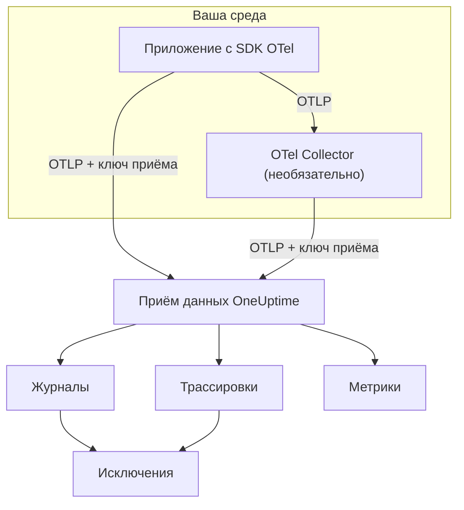

# OpenTelemetry

OneUptime принимает логи, метрики и трассировки по протоколу OpenTelemetry (OTLP). Направьте любой SDK OpenTelemetry или OpenTelemetry Collector на OneUptime с ключом приёма — и ваши данные появятся в разделах **Журналы**, **Трассировки**, **Метрики** и **Исключения**. Эта страница помогает за несколько минут настроить отправку данных из сервиса, а затем описывает адреса, ограничения и ошибки, которые нужно знать в рабочей среде.

:::cards
- [Быстрый старт](#быстрый-старт): Создать ключ, задать четыре переменные окружения и добавить SDK.
- [Использовать Collector](#отправка-через-opentelemetry-collector): Добавить OneUptime как экспортёр в уже работающий коллектор.
- [Адреса и ограничения](#адреса-и-ограничения): URL, порты, кодировки, ограничения размера и коды состояния.
- [Устранение неполадок](#устранение-неполадок): Что проверить, если данные не приходят.
:::

## Как это работает

Ваше приложение экспортирует OTLP напрямую в OneUptime или в OpenTelemetry Collector, который пересылает данные дальше. Каждый запрос содержит ваш ключ приёма в заголовке `x-oneuptime-token`, и по этому ключу OneUptime находит ваш проект.



- **Сервисы создаются автоматически.** Атрибут ресурса `service.name` (задаётся через `OTEL_SERVICE_NAME`) определяет сервис, к которому относятся ваши данные. OneUptime создаёт сервис при первой отправке и показывает его в разделе **Продукты → Службы**.
- **Ошибки становятся исключениями.** События исключений в спанах и исключения, записанные в логах, группируются в задачи в разделе **Исключения** — см. [Исключения из логов](#исключения-из-логов).

## Перед началом

- Проект OneUptime, в котором вы можете создавать ключи приёма: это могут владельцы и администраторы проекта, а также все, у кого есть разрешение **Create Telemetry Ingestion Key**.
- Приложение, в которое можно добавить SDK OpenTelemetry, или OpenTelemetry Collector.
- Исходящий HTTPS (порт 443) из вашего приложения или коллектора к `oneuptime.com` или к вашему собственному хосту OneUptime.

> [!NOTE]
> В OneUptime Cloud телеметрия оплачивается за каждый принятый ГБ. Проекту на тарифе Free нужен способ оплаты, прежде чем он сможет отправлять телеметрию, — окно создания ключа показывает цены.

## Быстрый старт

:::steps
### Создайте ключ приёма

1. Перейдите в **Продукты → Настройки проекта**.
2. В боковом меню откройте **Телеметрия и APM** и выберите **Ключи приема**.
3. Нажмите **Создать ключ приёма**. Окно заполняет имя и выбирает тип ключа **Сервер** — именно с ним отправляют данные приложение или коллектор. При желании переименуйте ключ, затем нажмите **Создать ключ приёма**.


Новый ключ открывается на отдельной странице. Скопируйте его **Секретный ключ** — это токен, который вы отправляете в `x-oneuptime-token`.


### Задайте переменные окружения OpenTelemetry

Все SDK OpenTelemetry читают одни и те же стандартные переменные окружения, поэтому этот шаг одинаков для любого языка.

| Переменная окружения | Значение | Назначение |
| --- | --- | --- |
| `OTEL_EXPORTER_OTLP_ENDPOINT` | `https://oneuptime.com/otlp` | Куда отправлять. SDK сам добавляет `/v1/traces`, `/v1/metrics` и `/v1/logs`. |
| `OTEL_EXPORTER_OTLP_HEADERS` | `x-oneuptime-token=YOUR_ONEUPTIME_INGESTION_KEY` | Отправляет ваш ключ приёма с каждым запросом. |
| `OTEL_EXPORTER_OTLP_PROTOCOL` | `http/protobuf` | OTLP поверх HTTP. Некоторые SDK по умолчанию используют gRPC, у которого другой адрес. |
| `OTEL_SERVICE_NAME` | `my-service` | Сервис, под которым ваши данные появятся в OneUptime. |

```bash
export OTEL_EXPORTER_OTLP_ENDPOINT="https://oneuptime.com/otlp"
export OTEL_EXPORTER_OTLP_HEADERS="x-oneuptime-token=YOUR_ONEUPTIME_INGESTION_KEY"
export OTEL_EXPORTER_OTLP_PROTOCOL="http/protobuf"
export OTEL_SERVICE_NAME="my-service"
```

Используете собственную установку? Замените `https://oneuptime.com` на URL вашего экземпляра OneUptime, например `https://oneuptime.example.com/otlp`. Чтобы помечать исключения окружением, также задайте `OTEL_RESOURCE_ATTRIBUTES` равным `deployment.environment=production`.

### Добавьте OpenTelemetry в приложение

Выберите язык. Каждая настройка читает переменные окружения, указанные выше, поэтому в коде нет ни адреса, ни ключа.

:::tabs
@tab Node.js
Установите SDK, автоматические инструментации и экспортёры OTLP/HTTP:

```bash
npm install @opentelemetry/sdk-node @opentelemetry/auto-instrumentations-node \
  @opentelemetry/exporter-trace-otlp-proto @opentelemetry/exporter-metrics-otlp-proto \
  @opentelemetry/exporter-logs-otlp-proto @opentelemetry/sdk-metrics @opentelemetry/sdk-logs
```

Создайте SDK в отдельном файле:

```javascript title="instrumentation.js"
const { NodeSDK } = require("@opentelemetry/sdk-node");
const { getNodeAutoInstrumentations } = require("@opentelemetry/auto-instrumentations-node");
const { OTLPTraceExporter } = require("@opentelemetry/exporter-trace-otlp-proto");
const { OTLPMetricExporter } = require("@opentelemetry/exporter-metrics-otlp-proto");
const { OTLPLogExporter } = require("@opentelemetry/exporter-logs-otlp-proto");
const { PeriodicExportingMetricReader } = require("@opentelemetry/sdk-metrics");
const { BatchLogRecordProcessor } = require("@opentelemetry/sdk-logs");

// The exporters read OTEL_EXPORTER_OTLP_ENDPOINT and OTEL_EXPORTER_OTLP_HEADERS.
const sdk = new NodeSDK({
  traceExporter: new OTLPTraceExporter(),
  metricReader: new PeriodicExportingMetricReader({
    exporter: new OTLPMetricExporter(),
  }),
  logRecordProcessors: [new BatchLogRecordProcessor(new OTLPLogExporter())],
  instrumentations: [getNodeAutoInstrumentations()],
});

sdk.start();
```

Загрузите его до кода приложения:

```bash
node --require ./instrumentation.js app.js
```
@tab Python
Установите дистрибутив OpenTelemetry и экспортёр, затем инструментации для библиотек, которые использует ваше приложение:

```bash
pip install opentelemetry-distro opentelemetry-exporter-otlp
opentelemetry-bootstrap -a install
```

Запускайте приложение через `opentelemetry-instrument`. Он экспортирует трассировки, метрики и логи; переменная логирования также отправляет записи, сделанные модулем `logging` из Python:

```bash
OTEL_PYTHON_LOGGING_AUTO_INSTRUMENTATION_ENABLED=true opentelemetry-instrument python app.py
```
@tab Go
Добавьте SDK и экспортёры OTLP/HTTP:

```bash
go get go.opentelemetry.io/otel go.opentelemetry.io/otel/sdk go.opentelemetry.io/otel/sdk/metric \
  go.opentelemetry.io/otel/exporters/otlp/otlptrace/otlptracehttp \
  go.opentelemetry.io/otel/exporters/otlp/otlpmetric/otlpmetrichttp
```

Создайте провайдеры трассировщика и метрик при запуске программы:

```go title="main.go"
package main

import (
	"context"
	"log"

	"go.opentelemetry.io/otel"
	"go.opentelemetry.io/otel/exporters/otlp/otlpmetric/otlpmetrichttp"
	"go.opentelemetry.io/otel/exporters/otlp/otlptrace/otlptracehttp"
	sdkmetric "go.opentelemetry.io/otel/sdk/metric"
	sdktrace "go.opentelemetry.io/otel/sdk/trace"
)

func main() {
	ctx := context.Background()

	// Both exporters read OTEL_EXPORTER_OTLP_ENDPOINT and OTEL_EXPORTER_OTLP_HEADERS.
	traceExporter, err := otlptracehttp.New(ctx)
	if err != nil {
		log.Fatal(err)
	}
	tracerProvider := sdktrace.NewTracerProvider(sdktrace.WithBatcher(traceExporter))
	defer tracerProvider.Shutdown(ctx)
	otel.SetTracerProvider(tracerProvider)

	metricExporter, err := otlpmetrichttp.New(ctx)
	if err != nil {
		log.Fatal(err)
	}
	meterProvider := sdkmetric.NewMeterProvider(
		sdkmetric.WithReader(sdkmetric.NewPeriodicReader(metricExporter)),
	)
	defer meterProvider.Shutdown(ctx)
	otel.SetMeterProvider(meterProvider)

	// Your application code.
}
```

Провайдеры берут `OTEL_SERVICE_NAME` из окружения. Для логов добавьте `otlploghttp` с мостом логирования, например `otelslog`; он читает те же переменные.
@tab Java
Скачайте Java-агент OpenTelemetry и подключите его к приложению. Изменять код не нужно:

```bash
curl -L -O https://github.com/open-telemetry/opentelemetry-java-instrumentation/releases/latest/download/opentelemetry-javaagent.jar
java -javaagent:opentelemetry-javaagent.jar -jar my-app.jar
```

Агент инструментирует распространённые фреймворки и библиотеки и экспортирует трассировки, метрики и логи, записанные через Logback или Log4j.
@tab .NET
Добавьте пакеты OpenTelemetry для ASP.NET Core:

```bash
dotnet add package OpenTelemetry.Extensions.Hosting
dotnet add package OpenTelemetry.Exporter.OpenTelemetryProtocol
dotnet add package OpenTelemetry.Instrumentation.AspNetCore
dotnet add package OpenTelemetry.Instrumentation.Http
```

Зарегистрируйте OpenTelemetry при запуске. `UseOtlpExporter()` отправляет трассировки, метрики и логи и читает переменные `OTEL_EXPORTER_OTLP_*`:

```csharp title="Program.cs"
using OpenTelemetry;
using OpenTelemetry.Metrics;
using OpenTelemetry.Trace;

var builder = WebApplication.CreateBuilder(args);

builder.Services.AddOpenTelemetry()
    .WithTracing(tracing => tracing
        .AddAspNetCoreInstrumentation()
        .AddHttpClientInstrumentation())
    .WithMetrics(metrics => metrics
        .AddAspNetCoreInstrumentation()
        .AddHttpClientInstrumentation())
    .WithLogging()
    .UseOtlpExporter();

var app = builder.Build();
app.Run();
```

Используете Serilog? Чтобы отправлять его логи в OneUptime, см. [Serilog](/docs/telemetry/serilog).
:::

### Проверьте, что данные приходят

Спросите OneUptime, принимает ли он ваш ключ:

```bash
curl -i -H "x-oneuptime-token: YOUR_ONEUPTIME_INGESTION_KEY" \
  https://oneuptime.com/otlp/v1/validate
```

Рабочий ключ возвращает `200` с `"valid": true`. Всё остальное возвращает `401` с сообщением о том, что не так: ключ неизвестен, отключён или истёк.

Затем запустите приложение и поработайте с ним минуту. Откройте **Продукты → Службы**: ваш сервис будет в списке под именем, заданным в `OTEL_SERVICE_NAME`, вместе со своими логами, трассировками, метриками и исключениями. **Продукты → Журналы**, **Продукты → Трассировки** и **Продукты → Метрики** показывают те же данные по всем сервисам.
:::

:::details Отправить тестовый лог без SDK
OTLP/HTTP принимает и JSON, поэтому лог можно отправить с помощью `curl`. Значение `9` поля `severityNumber` делает его информационным:

```bash
curl -i https://oneuptime.com/otlp/v1/logs \
  -H "Content-Type: application/json" \
  -H "x-oneuptime-token: YOUR_ONEUPTIME_INGESTION_KEY" \
  -d '{
    "resourceLogs": [{
      "resource": {
        "attributes": [
          { "key": "service.name", "value": { "stringValue": "my-service" } }
        ]
      },
      "scopeLogs": [{
        "logRecords": [{
          "severityNumber": 9,
          "body": { "stringValue": "Hello from curl" }
        }]
      }]
    }]
  }'
```

Ответ `200` означает, что лог принят. Он появится в разделе **Продукты → Журналы** в течение нескольких секунд, в сервисе `my-service`.
:::

## Отправка через OpenTelemetry Collector

Используйте коллектор, если он у вас уже есть, если нужно группировать, фильтровать или обогащать данные в одном месте или чтобы не хранить ключ приёма в приложениях. Приложения экспортируют данные в коллектор, и только коллектор обращается к OneUptime.

:::steps
### Добавьте OneUptime как экспортёр

Добавьте экспортёр `otlphttp`, указывающий на OneUptime, и проведите через него каждый конвейер:

```yaml title="otel-collector-config.yaml"
receivers:
  otlp:
    protocols:
      grpc:
        endpoint: 0.0.0.0:4317
      http:
        endpoint: 0.0.0.0:4318

processors:
  batch: {}

exporters:
  otlphttp:
    endpoint: https://oneuptime.com/otlp
    headers:
      x-oneuptime-token: YOUR_ONEUPTIME_INGESTION_KEY

service:
  pipelines:
    traces:
      receivers: [otlp]
      processors: [batch]
      exporters: [otlphttp]
    metrics:
      receivers: [otlp]
      processors: [batch]
      exporters: [otlphttp]
    logs:
      receivers: [otlp]
      processors: [batch]
      exporters: [otlphttp]
```

Оставьте настройки экспортёра по умолчанию: он отправляет protobuf, сжатый gzip, и OneUptime принимает и то и другое. Не задавайте заголовок `Content-Type` в экспортёре — OneUptime выбирает декодер по этому заголовку, поэтому тип содержимого JSON перед байтами protobuf ломает приём.

### Запустите коллектор

:::tabs
@tab Docker
```bash
docker run -d --name otel-collector \
  -p 4317:4317 -p 4318:4318 \
  -v "$(pwd)/otel-collector-config.yaml:/etc/otelcol-contrib/config.yaml" \
  otel/opentelemetry-collector-contrib:latest
```
@tab Linux
```bash
otelcol-contrib --config otel-collector-config.yaml
```
:::

Коллектор принимает OTLP на порту `4317` (gRPC) и `4318` (HTTP) — на эти порты SDK отправляют данные по умолчанию.

### Направьте приложения на коллектор

В приложениях задайте `OTEL_EXPORTER_OTLP_ENDPOINT` равным адресу коллектора, например `http://localhost:4318`, и уберите `OTEL_EXPORTER_OTLP_HEADERS` — ключ добавляет коллектор. Оставьте `OTEL_SERVICE_NAME` в каждом приложении.

Данные приходят в OneUptime точно так же, как в быстром старте. Если нет, причина будет в собственном журнале коллектора — см. [Устранение неполадок](#устранение-неполадок).
:::

Уже экспортируете данные другому поставщику? Добавьте экспортёр `otlphttp` рядом с существующим и перечислите оба в `exporters` каждого конвейера, чтобы отправлять данные в оба места на время сравнения. Чтобы собирать также метрики хоста и файлы логов, см. руководство [Host OpenTelemetry Collector](/docs/telemetry/host-otel-collector).

## Адреса и ограничения

| Параметр | OTLP/HTTP (рекомендуется) | OTLP/gRPC |
| --- | --- | --- |
| Адрес | `https://oneuptime.com/otlp` | `https://oneuptime.com:443` |
| Аутентификация | Заголовок `x-oneuptime-token` | Метаданные `x-oneuptime-token` |
| Кодировка | Protobuf (`application/x-protobuf`) или JSON (`application/json`) | Protobuf |
| Сжатие | Нет, `gzip`, `deflate` или `zstd` | Нет или `gzip` |
| Размер запроса | До 4 МБ на запрос к `/otlp` | До 4 МБ на сообщение |

Через HTTP у каждого сигнала свой путь под основным адресом. SDK и коллектор добавляют его сами; задавайте его вручную, только если инструмент требует полный URL.

| Сигнал | URL OTLP/HTTP |
| --- | --- |
| Трассировки | `https://oneuptime.com/otlp/v1/traces` |
| Метрики | `https://oneuptime.com/otlp/v1/metrics` |
| Логи | `https://oneuptime.com/otlp/v1/logs` |
| Профили | `https://oneuptime.com/otlp/v1/profiles` |

Для непрерывного профилирования большинство профилировщиков отправляют данные на совместимый с Pyroscope адрес — см. [Непрерывное профилирование](/docs/telemetry/profiles). Коллектор, экспортирующий профили OTLP, должен задать `profiles_endpoint` экспортёра равным `https://oneuptime.com/otlp/v1/profiles`, потому что по умолчанию он отправляет профили по пути разработки, который OneUptime не обслуживает.

### OTLP поверх gRPC

OneUptime обслуживает OTLP/gRPC на том же хосте, что и веб-приложение, на порту 443 по TLS. Задайте `OTEL_EXPORTER_OTLP_PROTOCOL` равным `grpc` и `OTEL_EXPORTER_OTLP_ENDPOINT` равным `https://oneuptime.com:443` и отправляйте тот же заголовок `x-oneuptime-token`. В коллекторе используйте экспортёр `otlp` с `endpoint: oneuptime.com:443` и теми же `headers`.

В собственной установке gRPC доходит до OneUptime только по HTTPS: незашифрованное HTTP-соединение (h2c) отклоняется. Если ваш экземпляр работает по обычному HTTP, используйте OTLP/HTTP.

Две настройки ключа действуют только для OTLP/HTTP: его **Requests Per Minute Limit** и **Pinned Service Name**. Данные, отправленные через gRPC, сохраняют `service.name`, с которым были отправлены, и не учитываются в ограничении.

### Ответы

OneUptime отвечает на экспорт, как только данные поставлены в очередь, а сами данные появляются через несколько секунд.

| Ответ | Статус gRPC | Значение | Что делать |
| --- | --- | --- | --- |
| `200` | `OK` | Принято. | Ничего. |
| `401` | `UNAUTHENTICATED` | Ключ отсутствует, неизвестен или истёк. | Сверьте значение `x-oneuptime-token` с полем **Секретный ключ** ключа. |
| `402` | `PERMISSION_DENIED` | Только OneUptime Cloud: проект на тарифе Free, и у него нет способа оплаты. | Добавьте его в разделе **Настройки проекта → Биллинг и счета → Биллинг**. |
| `413` | — | Запрос превышает ограничение размера. | Отправляйте пакеты меньшего размера. |
| `415` | — | Неподдерживаемый `Content-Encoding`. | Используйте `gzip`, `deflate` или `zstd` либо не сжимайте данные. |
| `422` | `PERMISSION_DENIED` | Ключ отключён, или это ключ браузера, используемый вне разрешённых источников. | Снова включите ключ или отправляйте данные с ключом сервера. |
| `429` | — | Достигнут **Requests Per Minute Limit** ключа. | Сначала ничего: экспортёры повторят попытку через время из `Retry-After`. Если это повторяется, увеличьте ограничение. |
| `503` | `UNAVAILABLE` | OneUptime запускается или очередь приёма недоступна. | Ничего: экспортёры OTLP сами повторяют запрос после `503`. |

`401`, `402`, `413`, `415` и `422` — постоянные ошибки для экспортёров OTLP: экспортёр отбрасывает пакет и записывает ошибку в журнал, а не повторяет попытку.

### Перезапуски и обновления

Пока OneUptime перезапускается или обновляется, он отвечает на экспорт кодом `503` с `Retry-After: 5`, пока не будет готов, а экспортёры отправляют данные повторно. Экспортёр коллектора по умолчанию повторяет попытки пять минут (`retry_on_failure`) и держит то, что не удалось отправить, в своей `sending_queue`, поэтому оставьте оба механизма включёнными. Время, когда OneUptime не принимал данные, никогда не засчитывается против ваших серверов, хостов и других ресурсов: см. [Когда OneUptime не получает данные](/docs/monitor/when-oneuptime-is-not-receiving#при-запуске).

### Ключи приёма

На странице каждого ключа в разделе **Настройки проекта → Телеметрия и APM → Ключи приема** есть такие настройки:

| Настройка | Назначение |
| --- | --- |
| **Тип ключа** | **Сервер** (по умолчанию) — для приложений, коллекторов и агентов. **Browser** — для ключей, которые встраиваются в веб-страницу: только запись, и приём только из его **Allowed Origins**. После создания ключа тип изменить нельзя. |
| **Allowed Origins** | Веб-источники, с которых работает ключ браузера, например `https://app.example.com`. Для ключа сервера игнорируется. |
| **Pinned Service Name** | Если задано, заменяет `service.name` во всех данных, отправленных с этим ключом через OTLP/HTTP. |
| **Включено** | Выключите, чтобы сразу перестать принимать данные, отправленные с этим ключом, не удаляя его. |
| **Истекает в** | После этой даты ключ отклоняется. Пустое значение означает, что срок не истекает. |
| **Requests Per Minute Limit** | Максимальное число запросов OTLP/HTTP в минуту, принимаемых с этим ключом, суммарно по всем клиентам, которые его используют. Пустое значение означает отсутствие ограничения для ключа сервера и 6000 для ключа браузера. |
| **Last Used At** | Когда с этим ключом в последний раз принимались данные. По этому полю можно найти ключи, которые безопасно заменить или удалить. |

**Сбросить секретный ключ** на странице ключа заменяет секрет. Все приложения и коллекторы, отправляющие данные со старым секретом, будут отклоняться, пока вы их не обновите.

## Собственная установка OneUptime

Всё на этой странице работает так же и с вашей собственной установкой. Используйте URL вашего OneUptime везде, где на этой странице указан `https://oneuptime.com`:

- `OTEL_EXPORTER_OTLP_ENDPOINT` — это `https://YOUR-ONEUPTIME-HOST/otlp` или `http://YOUR-ONEUPTIME-HOST/otlp`, если OneUptime работает по обычному HTTP.
- Встроенный ingress принимает запросы до 4 МБ к `/otlp`. У прокси, который вы ставите перед OneUptime, ограничение может быть ниже — ingress-nginx по умолчанию задаёт `proxy-body-size` равным 1 МБ, — поэтому увеличьте его и для `/otlp`, иначе экспортёры получат `413`.
- Если задано `DISABLE_TELEMETRY_INGESTION=true`, OneUptime принимает любой экспорт и ничего не сохраняет. Проверьте это в первую очередь, если собственная установка вообще не показывает данные.

## Исключения из логов

OneUptime находит исключения в ваших **logs** и собирает их в том же разделе **Исключения**, куда попадают ошибки из трассировок. Каждый лог уже относится к сервису или хосту, поэтому исключение привязывается к нему. Исключения из логов и трассировок группируются по общему отпечатку, так что ошибка, о которой сообщили и трассировка, и лог, становится одной задачей.

Лог становится исключением двумя способами:

| Обнаружение | К каким логам применяется | Как работает |
| --- | --- | --- |
| **Атрибуты исключения** (рекомендуется) | К любым | Запись лога с атрибутом OpenTelemetry `exception.type`, `exception.message` или `exception.stacktrace` сразу становится исключением. Большинство интеграций логирования задают их, когда вы записываете исключение: аппендеры Logback и Log4j, Serilog, инструментация логирования Python. Это точно и работает в любом языке. |
| **Трассировка стека в теле** | К логам уровней error и fatal без идентификатора трассировки и идентификатора спана | OneUptime просматривает первые 16 КБ тела в поисках трассировки стека JavaScript, Python, Java, Go, Ruby, C#/.NET или PHP и извлекает из неё тип, сообщение и кадры. Лог, записанный внутри спана, пропускается, потому что спан сам сообщает об исключении. |

Просмотр тела подходит для логов в виде обычного текста — например, необработанного stdout, journald или syslog, которые читает коллектор. Многострочная трассировка стека должна приходить одной записью лога, поэтому включите в коллекторе объединение многострочных записей — см. руководство [Host OpenTelemetry Collector](/docs/telemetry/host-otel-collector).

Обнаружение включено по умолчанию. В собственной установке его можно выключить, задав `TELEMETRY_LOG_EXCEPTION_EXTRACTION_ENABLED=false` в сервисе `app` — а также в `worker`, если вы используете выделенный worker из Helm-чарта.

## Устранение неполадок

:::details Данные не появляются, а экспортёр пишет `401`
Ключ отсутствует, неизвестен или истёк. Убедитесь, что `OTEL_EXPORTER_OTLP_HEADERS` — это `x-oneuptime-token=`, за которым следует **Секретный ключ** ключа, без кавычек и пробелов внутри значения, и что ключ принадлежит проекту, который вы просматриваете. Запрос проверки из раздела [Проверьте, что данные приходят](#проверьте-что-данные-приходят) покажет, какой это случай.
:::

:::details Экспортёр пишет `422`
Ключ отключён, или это ключ браузера. Снова включите **Включено** в настройках ключа или создайте ключ типа **Сервер**: ключ браузера принимается только с веб-страницы на одном из разрешённых источников.
:::

:::details Экспортёр пишет `402`
Проект находится на тарифе Free в OneUptime Cloud и не имеет способа оплаты, а телеметрия оплачивается по мере использования. Добавьте способ оплаты в разделе **Настройки проекта → Биллинг и счета → Биллинг**, и экспорт снова будет приниматься.
:::

:::details Экспортёр пишет `404`
SDK отправляет данные не по тому пути. `OTEL_EXPORTER_OTLP_ENDPOINT` должен заканчиваться на `/otlp`, без завершающей косой черты и без `/v1/...` — это добавляет SDK. Если вы задаёте переменную для отдельного сигнала, например `OTEL_EXPORTER_OTLP_TRACES_ENDPOINT`, она требует полный URL, например `https://oneuptime.com/otlp/v1/traces`.
:::

:::details Ничего не происходит, а SDK пишет ошибки соединения
Скорее всего, SDK экспортирует через gRPC на HTTP-адрес или на `localhost`. Задайте `OTEL_EXPORTER_OTLP_PROTOCOL=http/protobuf` или используйте адрес gRPC из раздела [OTLP поверх gRPC](#otlp-поверх-grpc). Также проверьте, что процесс действительно видит переменные окружения: в контейнере задавайте их для контейнера, а не в своей оболочке.
:::

:::details Коллектор пишет `Exporting failed` с `413`
Пакет превышает ограничение размера. Уменьшите размер пакетов, например с помощью `send_batch_max_size: 1000` в процессоре `batch`. Если у вас собственная установка за своим прокси, проверьте и ограничение размера тела запроса в этом прокси.
:::

:::details Данные попадают не в тот сервис или в Unknown Service
Сервис берётся из атрибута ресурса `service.name`. Задайте `OTEL_SERVICE_NAME` в каждом приложении. Если у ключа задано **Pinned Service Name**, весь экспорт OTLP/HTTP с этим ключом попадает под это имя.
:::

## Что дальше

:::cards
- [Синтаксис поиска](/docs/telemetry/search-syntax): Фильтровать логи, трассировки, метрики и исключения в обозревателях.
- [Конвейеры логов](/docs/telemetry/log-pipelines): Разбирать и обогащать логи по мере поступления.
- [Монитор логов](/docs/monitor/logs-monitor): Получать оповещение, когда появляются подходящие логи.
- [Host OpenTelemetry Collector](/docs/telemetry/host-otel-collector): Собирать метрики хоста и файлы логов с помощью коллектора.
:::
