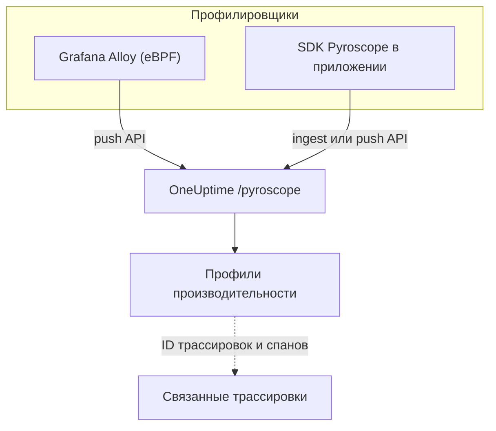

# Непрерывное профилирование

Непрерывное профилирование показывает, на что ваше приложение тратит процессорное время и память, функция за функцией. OneUptime предоставляет **API приёма, совместимый с Pyroscope**, поэтому всё, что умеет отправлять данные на сервер Pyroscope (профилировщик eBPF из Grafana Alloy или SDK Pyroscope для вашего языка), может отправлять их в OneUptime, а результат вы видите в виде flame-графов рядом с логами, метриками и трассировками.

:::cards
- [Отправка профилей](#отправка-профилей): Grafana Alloy с eBPF или SDK Pyroscope в вашем приложении.
- [Конечная точка приёма](#конечная-точка-приёма): Базовый URL и три способа передать ключ.
- [Проверка работы](#проверка-работы): Проверить ключ, страницу и статус загрузок.
- [Изучение профилей](#изучение-профилей-в-oneuptime): Flame-графы, топ функций, сравнения и ссылки на трассировки.
:::

## Как это работает

Профилировщик снимает выборки с ваших процессов и каждые несколько секунд загружает профиль на конечную точку OneUptime `/pyroscope` с вашим ключом приёма. OneUptime сохраняет каждый профиль под сервисом, который в нём указан, и рисует его в виде flame-графа в разделе **Профили производительности**.



## Перед началом работы

Вам нужен ключ приёма телеметрии типа **Сервер**. Если его ещё нет:

:::steps
### Откройте ключи приёма

Перейдите в **Продукты → Настройки проекта**, откройте **Телеметрия и APM** в боковом меню и выберите **Ключи приема**.


### Создайте ключ

Нажмите **Создать ключ приёма**. В диалоге имя ключа уже заполнено и выбран **Сервер** (тип ключа, с которым отправляют данные приложение или коллектор), поэтому нажмите **Создать ключ приёма**, чтобы создать его, или сначала переименуйте.

### Скопируйте секрет

Новый ключ откроется на своей странице. Скопируйте его **Секретный ключ**: это токен приёма, который в примерах ниже называется `YOUR_ONEUPTIME_INGESTION_TOKEN`.


:::

## Конечная точка приёма

| Параметр | Значение |
| --- | --- |
| Базовый URL (адрес сервера Pyroscope) | `https://oneuptime.com/pyroscope` |
| Заголовок аутентификации | `x-oneuptime-token: YOUR_ONEUPTIME_INGESTION_TOKEN` |

Клиенты добавляют к базовому URL свой путь (`/ingest` у большинства SDK Pyroscope, `/push.v1.PusherService/Push` у Grafana Alloy и у SDK для .NET начиная с v0.14), поэтому вы всегда указываете только базовый URL, без завершающей косой черты.

OneUptime читает токен приёма из любого из этих мест; используйте то, что поддерживает ваш клиент:

| Способ | Когда использовать |
| --- | --- |
| Заголовок `x-oneuptime-token` | Клиенты, которые позволяют добавлять свои заголовки. |
| `Authorization: Bearer <token>` | SDK с параметром `authToken` / `auth_token`: именно его они и отправляют. |
| Базовая аутентификация HTTP, токен в качестве **пароля** (любое имя пользователя) | Клиенты, которые предлагают только пользователя и пароль базовой аутентификации. |

> [!NOTE]
> Размещаете OneUptime самостоятельно? Замените `https://oneuptime.com` своим хостом, например `https://YOUR-ONEUPTIME-HOST/pyroscope`.

## Поддерживаемые форматы профилей

| Формат | Кто отправляет | Поддерживается |
| --- | --- | --- |
| pprof (двоичный protobuf, при необходимости сжатый gzip) | SDK Pyroscope для Go, Node.js и .NET; Grafana Alloy | Да |
| Текст folded / collapsed | SDK Pyroscope для Python, Ruby и Rust (их формат загрузки по умолчанию) | Да |
| JFR (Java Flight Recorder) | Java-агент Pyroscope | Пока нет: для сервисов на Java используйте Grafana Alloy |

## Отправка профилей

Grafana Alloy профилирует все процессы на хосте без изменения кода, и с него рекомендуется начинать. SDK Pyroscope, напротив, работает внутри вашего приложения.

:::tabs
@tab Grafana Alloy
[Grafana Alloy](https://grafana.com/docs/alloy/latest/) собирает с помощью eBPF профили CPU всех процессов на хосте Linux: без агента внутри приложения и без изменения кода. Работает для Go, Rust, C/C++, Java, Python, Ruby, PHP, Node.js и .NET.

Создайте конфигурацию Alloy:

```hcl title="alloy-config.alloy"
discovery.process "all" {
  refresh_interval = "60s"
}

discovery.relabel "alloy_profiles" {
  targets = discovery.process.all.targets

  rule {
    action       = "replace"
    source_labels = ["__meta_process_exe"]
    target_label  = "service_name"
  }
}

pyroscope.ebpf "default" {
  targets    = discovery.relabel.alloy_profiles.output
  forward_to = [pyroscope.write.oneuptime.receiver]

  collect_interval = "15s"
  sample_rate      = 97
}

pyroscope.write "oneuptime" {
  endpoint {
    url = "https://oneuptime.com/pyroscope"
    headers = {
      "x-oneuptime-token" = "YOUR_ONEUPTIME_INGESTION_TOKEN",
    }
  }
}
```

Запустите его в Docker. Для eBPF нужен привилегированный контейнер с пространством имён PID хоста:

```yaml title="docker-compose.yml"
services:
  alloy:
    image: grafana/alloy:latest
    privileged: true
    pid: host
    volumes:
      - ./alloy-config.alloy:/etc/alloy/config.alloy
      - /proc:/proc:ro
      - /sys:/sys:ro
    command:
      - run
      - /etc/alloy/config.alloy
```

Или запустите его прямо на хосте:

```bash
alloy run alloy-config.alloy
```

Правило перемаркировки называет сервис каждого профиля по исполняемому файлу процесса.
@tab Go
SDK для Go загружает pprof. Укажите базовый URL OneUptime в качестве адреса сервера и передайте токен приёма как токен аутентификации:

```go
import "github.com/grafana/pyroscope-go"

pyroscope.Start(pyroscope.Config{
    ApplicationName: "my-service",
    ServerAddress:   "https://oneuptime.com/pyroscope",
    AuthToken:       "YOUR_ONEUPTIME_INGESTION_TOKEN",
    ProfileTypes: []pyroscope.ProfileType{
        pyroscope.ProfileCPU,
        pyroscope.ProfileAllocObjects,
        pyroscope.ProfileAllocSpace,
        pyroscope.ProfileInuseObjects,
        pyroscope.ProfileInuseSpace,
        pyroscope.ProfileGoroutines,
    },
})
```
@tab Node.js
SDK для Node.js загружает pprof:

```javascript
const Pyroscope = require("@pyroscope/nodejs");

Pyroscope.init({
  serverAddress: "https://oneuptime.com/pyroscope",
  appName: "my-service",
  authToken: "YOUR_ONEUPTIME_INGESTION_TOKEN",
});

Pyroscope.start();
```
@tab Python
SDK для Python загружает текст folded:

```python
import pyroscope

pyroscope.configure(
    application_name="my-service",
    server_address="https://oneuptime.com/pyroscope",
    auth_token="YOUR_ONEUPTIME_INGESTION_TOKEN",
)
```
@tab .NET
Профилировщик Pyroscope для .NET — это нативный профилировщик CLR: он не требует изменения кода и полностью включается переменными окружения. Скачайте выпуск для вашего образа со страницы [pyroscope-dotnet releases](https://github.com/grafana/pyroscope-dotnet/releases) (`glibc` или `musl` для Alpine, `x86_64` или `aarch64`) и загрузите его в среду выполнения:

```dockerfile title="Dockerfile"
FROM alpine:3.20 AS pyroscope-profiler
ARG PYROSCOPE_DOTNET_VERSION=1.5.1
ADD https://github.com/grafana/pyroscope-dotnet/releases/download/pyroscope-${PYROSCOPE_DOTNET_VERSION}/pyroscope.${PYROSCOPE_DOTNET_VERSION}-glibc-x86_64.tar.gz /tmp/pyroscope.tar.gz
RUN mkdir -p /pyroscope && tar -xzf /tmp/pyroscope.tar.gz -C /pyroscope

FROM mcr.microsoft.com/dotnet/aspnet:10.0
# ... your application ...
COPY --from=pyroscope-profiler /pyroscope /pyroscope
ENV CORECLR_ENABLE_PROFILING=1
ENV CORECLR_PROFILER={BD1A650D-AC5D-4896-B64F-D6FA25D6B26A}
ENV CORECLR_PROFILER_PATH=/pyroscope/Pyroscope.Profiler.Native.so
ENV LD_PRELOAD=/pyroscope/Pyroscope.Linux.ApiWrapper.x64.so
ENV LD_LIBRARY_PATH=/pyroscope
```

Затем направьте его в OneUptime, например в окружении Kubernetes / Helm:

```bash
PYROSCOPE_APPLICATION_NAME=my-service
PYROSCOPE_PROFILING_ENABLED=1
PYROSCOPE_SERVER_ADDRESS=https://oneuptime.com/pyroscope
PYROSCOPE_BASIC_AUTH_USER=oneuptime
PYROSCOPE_BASIC_AUTH_PASSWORD=YOUR_ONEUPTIME_INGESTION_TOKEN
```

Токен приёма указывается в пароле базовой аутентификации. Имя пользователя может быть любым непустым значением, но профилировщик вообще не отправляет учётные данные, если не заданы оба параметра. Чтобы отправлять токен в заголовке, задайте `PYROSCOPE_HTTP_HEADERS={"x-oneuptime-token":"YOUR_ONEUPTIME_INGESTION_TOKEN"}`.

Способ передачи токена зависит от выпуска профилировщика. Выпуски 1.5 и новее игнорируют `PYROSCOPE_AUTH_TOKEN`, поэтому если вы обновитесь со старого выпуска и оставите эту настройку, каждая загрузка будет отклоняться с `401`:

| Выпуск pyroscope-dotnet | Загружает на | Настройка токена |
| --- | --- | --- |
| v0.13 и старше | `/pyroscope/ingest` | `PYROSCOPE_AUTH_TOKEN` |
| с v0.14 по 1.4 | `/pyroscope/push.v1.PusherService/Push` | `PYROSCOPE_AUTH_TOKEN` |
| 1.5 и новее | `/pyroscope/push.v1.PusherService/Push` | `PYROSCOPE_BASIC_AUTH_USER=oneuptime` и `PYROSCOPE_BASIC_AUTH_PASSWORD=<token>` (нужны оба), или `PYROSCOPE_HTTP_HEADERS={"x-oneuptime-token":"<token>"}` |

Выпуски до 1.0 помечены тегом `v<version>-pyroscope`, а не `pyroscope-<version>` (например `https://github.com/grafana/pyroscope-dotnet/releases/download/v0.13.0-pyroscope/pyroscope.0.13.0-glibc-x86_64.tar.gz`); GUID профилировщика и имена файлов одинаковы во всех выпусках.

Профилирование CPU включено по умолчанию. Профилирование реального времени, выделений памяти, исключений и конкуренции за блокировки включается отдельно: задайте `PYROSCOPE_PROFILING_WALLTIME_ENABLED`, `PYROSCOPE_PROFILING_ALLOCATION_ENABLED`, `PYROSCOPE_PROFILING_EXCEPTION_ENABLED` или `PYROSCOPE_PROFILING_LOCK_ENABLED` равным `true`. Статические метки указываются в `PYROSCOPE_LABELS` (`key:value,key:value`).

Профилировщик загружает данные каждые 15 секунд и **не** сжимает загрузки, поэтому нагруженный сервис может отправлять несколько МБ за раз. Собственный ingress OneUptime принимает до 16 МБ на `/pyroscope`; если перед OneUptime стоит ещё один прокси (например ingress-nginx, у которого `proxy-body-size` по умолчанию равен 1 МБ), увеличьте и его ограничение размера для `/pyroscope`, иначе большие загрузки будут отклоняться с `413`, не дойдя до OneUptime.
@tab Java
Java-агент Pyroscope загружает профили в формате JFR, который OneUptime пока не принимает. Профилируйте сервисы на Java с помощью Grafana Alloy (вкладка **Grafana Alloy**): он снимает профили CPU JVM без агента и без изменения кода.
:::

**Ruby** и **Rust** работают так же, как Go, Node.js и Python: установите [SDK Pyroscope для вашего языка](https://grafana.com/docs/pyroscope/latest/configure-client/) и задайте адрес сервера `https://oneuptime.com/pyroscope` с токеном приёма в качестве токена аутентификации (или, если ваша версия SDK предлагает только базовую аутентификацию, в качестве её пароля).

## Поддерживаемые типы профилей

pprof может объявлять несколько типов выборок; каждый загруженный профиль сохраняется под одним из них: время CPU (`cpu` в наносекундах), если оно есть, иначе реальное время, иначе используемые, а затем выделенные байты, иначе первый объявленный тип. Любой тип сохраняется и доступен для просмотра; для типов ниже в OneUptime есть отдельная группировка, единицы и подписи:

| Тип профиля | Отображается как | Единица |
| --- | --- | --- |
| `cpu`, `samples` | Время CPU | наносекунды |
| `wall` | Реальное время | наносекунды |
| `inuse_space`, `alloc_space`, `heap` | Память (байты) | байты |
| `inuse_objects`, `alloc_objects` | Память (число объектов) | количество |
| `mutex`, `contention`, `block` | Конкуренция за блокировки | наносекунды |
| `goroutine` | Goroutines (Go) | количество |

Всё остальное (например, пользовательский тип выборок) появляется в разделе «Другое» под своим исходным именем.

## Проверка работы

:::steps
### Проверьте токен

Конечные точки приёма отвечают `401` на отсутствующий или неверный токен, но большинство профилировщиков не показывают это там, где вы это увидите (профилировщик для .NET, например, пишет HTTP-ответы в журнал только на уровне debug). Спросите конечную точку проверки напрямую:

```bash
curl -i -H "x-oneuptime-token: YOUR_ONEUPTIME_INGESTION_TOKEN" \
  https://oneuptime.com/otlp/v1/validate
```

Действительный токен возвращает `200` с `{"valid": true, ...}`, и его `keyType` должен быть `Server`: ключ браузера тоже действителен, но не может отправлять профили. Неизвестный, отозванный, отключённый или просроченный токен возвращает `401`.

### Откройте страницу профилей

В дашборде OneUptime перейдите в **Продукты → Профили производительности**. При интервале сбора Alloy в 15 секунд (или интервале загрузки SDK от 10 до 15 секунд) первые профили и их flame-графы появляются через минуту-две после запуска агента.

### Проверьте сервис

Профили привязываются к сервису телеметрии, указанному в `application_name` / `appName` / `PYROSCOPE_APPLICATION_NAME` SDK (или к имени исполняемого файла процесса при правиле перемаркировки Alloy, приведённом выше).

### Всё ещё ничего? Посмотрите статус загрузок

Для профилировщика .NET задайте приложению `DD_TRACE_DEBUG=1` на минуту: тогда он будет писать строку `PyroscopePprofSink <status>` для каждой загрузки. `200` означает, что OneUptime принял загрузку; `401` — проблема с токеном; `404` обычно означает, что в `PYROSCOPE_SERVER_ADDRESS` нет суффикса `/pyroscope`; `413` означает, что прокси перед OneUptime отклонил загрузку из-за размера (см. вкладку **.NET** в разделе [Отправка профилей](#отправка-профилей)). Если вы размещаете OneUptime самостоятельно, журнал доступа ingress (nginx) записывает тот же статус для каждого запроса к `/pyroscope`.
:::

## Изучение профилей в OneUptime

**Продукты → Профили производительности** открывает обзор того, на что уходит время в ваших сервисах, а **Все профили** показывает каждую загрузку. Выберите, что анализировать: **Всё**, **Время CPU**, **Память** или **Блокировки**, или конкретный тип, например **Реальное время** или **Goroutines**.

У страницы профиля три представления:

| Представление | Что показывает |
| --- | --- |
| **Flame-граф** | Каждая полоса — функция в стеке вызовов, а её ширина пропорциональна затраченному времени или ресурсам. Щёлкните функцию, чтобы приблизить её и увидеть вызывающие и вызываемые функции. |
| **Top functions** | Функции профиля, отсортированные по собственному или общему времени. **Only my code** скрывает кадры библиотек. |
| **Diff vs. baseline** | Профиль в сравнении с более ранним периодом (**по сравнению с часом назад**, **по сравнению со вчерашним днём** или **по сравнению с прошлой неделей**) с функциями **Most regressed** и **Most improved**. |

**Download pprof** сохраняет профиль для локальных инструментов, таких как `go tool pprof`.

### Связь с трассировками

Если профиль содержит ID трассировок и спанов (например, как метки выборок `trace_id` / `span_id`), вы можете перейти прямо от медленного спана трассировки к соответствующему профилю CPU или памяти и точно понять, какой код выполнялся, а **Open linked trace** ведёт в обратную сторону.

Вкладка **Профиль** спана также включает выборки, связанные с вложенными в него спанами, потому что профилировщики часто относят время CPU запроса к дочернему спану, а не к самому спану запроса.

## Хранение данных

Профили хранятся столько же, сколько телеметрия проекта: **Настройки проекта → Телеметрия и APM → Хранение данных** задаёт **Срок хранения по умолчанию (дни)**, 15 дней, если его не менять. По окончании срока хранения данные удаляются автоматически. Тарифы с переопределением сроков хранения позволяют также хранить профили дольше или меньше остальной телеметрии или задавать срок хранения для отдельного сервиса на его странице **Настройки**.

## Дальнейшие шаги

:::cards
- [Мониторинг профилей](/docs/monitor/profiles-monitor): Получать оповещения о профилях, которые отправляют ваши сервисы, по количеству и типу.
- [OpenTelemetry](/docs/telemetry/open-telemetry): Отправлять трассировки, с которыми связаны ваши профили.
- [Агент Kubernetes](/docs/telemetry/kubernetes-agent): Профилировать весь кластер с помощью eBPF-профилировщика агента.
:::
