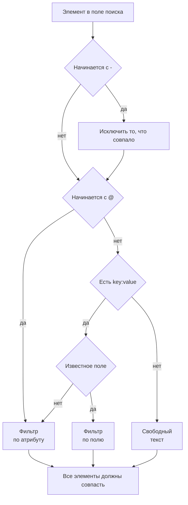

# Синтаксис поиска

Поле поиска над обозревателями логов, трассировок, метрик и исключений понимает один язык запросов. Запрос — это список фильтров, разделённых пробелами, и **каждый фильтр должен совпасть**: неявного OR между фильтрами нет. Держите эту страницу под рукой как справочник во время поиска.

:::cards
- [Два вида фильтров](#два-вида-фильтров): Встроенные поля, атрибуты и свободный текст.
- [Сопоставление значений](#сопоставление-значений): Подстановочные знаки, «содержит», сравнения и списки.
- [Исключение](#исключение): Любой фильтр можно обратить, поставив `-` в начале.
- [Поля по типам сигналов](#поля-по-типам-сигналов): По чему можно фильтровать в каждом обозревателе.
:::

## Как читается запрос

```text
severity:error @platform.team:a* -@http.method:GET timeout
```

Это читается так: логи уровня error, у которых атрибут `platform.team` начинается с `a`, атрибут `http.method` не равен `GET`, а сообщение упоминает `timeout`.

| Элемент | Вид | Совпадает, если |
| --- | --- | --- |
| `severity:error` | Поле | Серьёзность лога — Error. |
| `@platform.team:a*` | Атрибут | Атрибут `platform.team` начинается с `a`. |
| `-@http.method:GET` | Исключённый атрибут | Атрибут `http.method` — что угодно, кроме `GET`. |
| `timeout` | Свободный текст | Сообщение содержит `timeout`. |

Каждый элемент, отделённый пробелом, читается сам по себе, а затем все они объединяются через AND:



## Два вида фильтров

| Форма | Что фильтрует | Пример |
| --- | --- | --- |
| `field:value` | Встроенное поле сигнала | `severity:error` |
| `@attribute:value` | Атрибут OpenTelemetry у строки | `@http.status_code:500` |
| отдельные слова | Сообщение (логи), имя спана (трассировки), имя метрики (метрики) или сообщение исключения (исключения) | `connection refused` |

Голое `key:value`, ключ которого не является известным полем, считается атрибутом, поэтому `k8s.pod:api-0` и `@k8s.pod:api-0` означают одно и то же. Префикс `@` всегда означает «искать в атрибутах», с одним исключением: в обозревателе исключений `@type:`, `@service:`, `@env:` и `@class:` по-прежнему фильтруют эти поля.

Текст, в котором просто встречается двоеточие, остаётся текстом: `https://example.com` и `12:30` ищутся как слова, а не читаются как фильтры.

## Сопоставление значений

Всё в этой таблице работает для любого атрибута и для большинства встроенных полей; в разделе [Поля по типам сигналов](#поля-по-типам-сигналов) отмечены поля, которые читают значение проще.

| Вы вводите | Совпадает с |
| --- | --- |
| `@k:abc` | ровно `abc` |
| `@k:a*` | всё, что начинается с `a`: `abc`, `alpha` |
| `@k:*c` | всё, что заканчивается на `c` |
| `@k:a*c` | начинается с `a` и заканчивается на `c` |
| `@k:a?c` | `?` — ровно один символ: `abc`, `axc`, но не `ac` |
| `@k:*` | атрибут есть и не пуст |
| `@k:~abc` | содержит `abc` где угодно |
| `@k:!abc` | всё, кроме `abc` |
| `@k:>100` | больше 100. Также `>=`, `<`, `<=` |
| `@k:(a OR b)` | любое из двух значений. `@k:[a, b]` — то же самое |
| `@k:(a* OR b*)` | любой из двух шаблонов |

Сопоставление с подстановочными знаками и «содержит» не учитывает регистр; точное сопоставление учитывает, потому что сравнивает со значением ровно в том виде, в каком оно сохранено.

### Значения с пробелами

Заключите значение в двойные кавычки:

```text
name:"SELECT wp_options"
@k8s.container.name:"my container"
```

Кавычки защищают **пробелы**, а не подстановочные знаки: `@k:"a b*"` по-прежнему совпадает со всем, что начинается с `a b`.

### Буквальные `*`, `?` и другие знаки

Обратная косая черта делает следующий символ буквальным:

| Вы вводите | Совпадает с |
| --- | --- |
| `@k:a\*b` | ровно `a*b` |
| `@k:\~abc` | ровно `~abc` |
| `@k:\>5` | ровно `>5` |

Значения с `%` или `_` экранировать не нужно: эти символы всегда буквальные.

## Исключение

`-` в начале обращает любой фильтр, включая показанные выше:

| Вы вводите | Совпадает с |
| --- | --- |
| `-severity:debug` | всем, кроме debug |
| `-@platform.team:a*` | всем, у чего `platform.team` **не** начинается с `a`, включая строки вообще без `platform.team` |
| `-@k:*` | атрибута нет или он пуст |
| `-@k:(a OR b)` | ни одно из двух значений |
| `-@k:>100` | 100 или меньше |
| `-@k:~abc` | не содержит `abc` |

В обозревателе трассировок `-` исключает только атрибуты. `-status:error` читается как текст для поиска в именах спанов и ничего не находит; вместо этого запрашивайте нужные значения, например `status:(ok OR unset)`.

## Поля по типам сигналов

Имена полей не зависят от регистра: `statusMessage:` и `statusmessage:` — одно и то же поле.

### Логи

| Поле | Псевдонимы | Примечания |
| --- | --- | --- |
| `severity` | `level` | `fatal`, `error`, `warning` (или `warn`), `info` (или `information`), `debug`, `trace`, `unspecified`, в любом регистре |
| `service` | | Имя сервиса, полностью, в любом регистре |
| `trace` | | ID трассировки |
| `span` | | ID спана |
| `message` | `msg`, `log`, `body` | Строка лога. Отдельные слова тоже ищут в ней |

### Трассировки

Поля трассировок принимают простое значение или список вида `status:(ok OR unset)`, а `duration` также принимает `>` и `<`. Подстановочные знаки, `~`, `!` и `-` в начале здесь работают только для атрибутов.

| Поле | Примечания |
| --- | --- |
| `service` | Имя сервиса |
| `name` | Имя спана. Одно значение совпадает с любой его частью. Отдельные слова тоже ищут в нём |
| `status` | `ok`, `error`, `unset` (unset = Статус ошибки не задан, значение OpenTelemetry по умолчанию) |
| `kind` | `server`, `client`, `producer`, `consumer`, `internal` |
| `duration` | Миллисекунды: `duration:>500`, `duration:<200` или точное значение |
| `statusMessage` | Текст сообщения о статусе. Одно значение совпадает с любой его частью |
| `hasException` | `true` или `false` |
| `trace`, `span` | ID |

### Метрики

| Поле | Примечания |
| --- | --- |
| `name` | Имя метрики. Простое значение совпадает с любой его частью, поэтому `name:http.server` находит `http.server.request.duration`. Отдельные слова тоже ищут в нём |
| `service` | Имя сервиса. Простое значение совпадает с любой его частью |

### Исключения

| Поле | Псевдонимы | Примечания |
| --- | --- | --- |
| `type` | `exceptionType` | Тип исключения, например `type:TypeError` |
| `env` | `environment` | Окружение, из атрибута ресурса `deployment.environment` |
| `service` | | Имя сервиса. Простое значение совпадает с любой его частью |
| `class` | `errorClass` | Чья это ошибка: `code-fault`, `user-error`, `expected-denial`, `infrastructure` или `unknown` |

Отдельные слова ищут в сообщении исключения.

Обозреватель **Security Events** использует тот же язык со своими полями, например `severity`, `tactic` и `user`: см. [Security Events](/docs/telemetry/security-events).

## Объединение фильтров

Фильтры объединяются через AND. Между ними можно написать `AND`, это ничего не меняет:

```text
severity:error service:api          # both must hold
severity:error AND service:api      # identical
```

**Между** фильтрами нет ни OR, ни NOT: написанные там `OR` и `NOT` пропускаются, поэтому `NOT severity:debug` означает то же, что `severity:debug`. Исключайте с помощью `-` в начале (`-severity:debug`), а чтобы совпало любое из двух значений одного ключа, используйте форму списка:

```text
@http.method:(GET OR POST)
```

Два фильтра по одному ключу объединяются через AND; так записывают диапазон или шаблон с двумя концами:

```text
@http.status_code:>=500 @http.status_code:<=599
@k:a* @k:*z
```

## Чипы и поле поиска

Нажатие Enter на элементе `key:value` применяет его, обычно в виде чипа над результатами. Чип хранит значение ровно так, как его ввели, поэтому подстановочный знак остаётся подстановочным знаком. Элемент, который чип не может вместить, например исключённое `-key:value`, остаётся в поле поиска и фильтрует оттуда. Щелчок по значению на боковой панели фасетов добавляет такой же чип, с экранированным значением: сохранённое значение, в котором случайно есть `*`, фильтрует именно это буквальное значение, а не шаблон.

Чипы входят в сохранённое представление и в URL страницы, поэтому фильтр переживает обновление страницы, закладку и отправленную ссылку.

## Полезно знать

- **Ключи** атрибутов сравниваются без учёта регистра в фильтрах с подстановочными знаками, «содержит», префиксом и суффиксом, так что не нужно помнить, принят ли он как `requestId` или `requestid`.
- Фильтр `-@k:...` совпадает и со строками, у которых этого атрибута никогда не было: строка вообще без `platform.team` очевидно не начинается с `a`.
- Числовые сравнения работают со значениями атрибутов, сохранёнными как текст; значение, которое не является числом, никогда не удовлетворяет сравнению.

## Дальнейшие шаги

:::cards
- [Масштабирование до диапазона времени](/docs/telemetry/charts-and-time-ranges): Сузить обозреватели до важного момента.
- [Конвейеры логов](/docs/telemetry/log-pipelines): Превратить части строки лога в атрибуты, по которым можно искать.
- [Мониторинг журналов](/docs/monitor/logs-monitor): Получать оповещения, когда появляются нужные вам логи.
- [OpenTelemetry](/docs/telemetry/open-telemetry): Отправлять логи, метрики и трассировки для поиска.
:::
