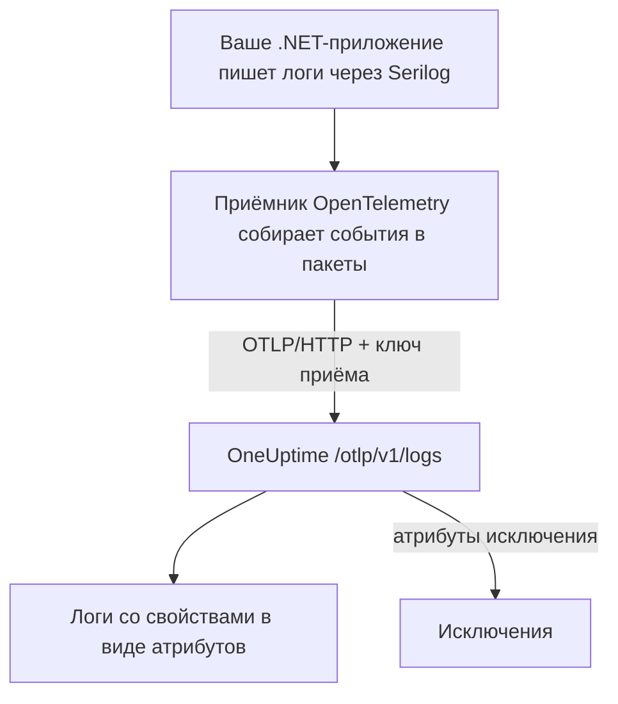

# Serilog (.NET)

[Serilog](https://serilog.net) — самая популярная библиотека структурированного логирования для .NET. С официальным приёмником [`Serilog.Sinks.OpenTelemetry`](https://github.com/serilog/serilog-sinks-opentelemetry) каждое событие, которое ваше приложение пишет через Serilog, отправляется в OneUptime по протоколу OpenTelemetry Protocol (OTLP) и становится доступным для поиска в **Продукты → Журналы** — со своими структурированными свойствами, уровнем важности и связью с трассировками.

Отдельный пакет для OneUptime не нужен: приёмник работает с тем же OTLP-адресом, который OneUptime предоставляет для всех данных OpenTelemetry. Это подходит для консольных приложений, фоновых служб, приложений ASP.NET Core и всего остального, что работает на .NET.

:::cards
- [Настройка приёмника](#настройка-приёмника): Установите два пакета и настройте их в коде или в `appsettings.json`.
- [Исключения](#исключения): Записанные в лог исключения становятся проблемами в разделе «Исключения».
- [Устранение неполадок](#устранение-неполадок): Что проверить, если логи не приходят.
:::

## Как это работает



Приёмник собирает события логов в пакеты и отправляет их в фоне. Каждое именованное свойство становится атрибутом лога, а исключение, записанное через Serilog, приходит с атрибутами, из которых OneUptime создаёт проблему.

## Перед началом

- Проект OneUptime. В OneUptime Cloud телеметрия оплачивается за каждый принятый ГБ — см. [цены](https://oneuptime.com/pricing), — а проекту на плане Free нужен способ оплаты, прежде чем он сможет отправлять телеметрию.
- Приложение .NET, которое использует или может использовать Serilog.
- Ключ приёма телеметрии для аутентификации ваших логов. Если его ещё нет:

:::steps
### Откройте ключи приёма

Перейдите в **Продукты → Настройки проекта**, откройте в боковом меню **Телеметрия и APM** и выберите **Ключи приема**.


### Создайте ключ

Нажмите **Создать ключ приёма**. В окне уже заполнено имя ключа и выбран тип **Сервер** — именно с таким ключом отправляют данные приложение или коллектор, — так что нажмите **Создать ключ приёма**, чтобы создать его, или сначала переименуйте.

### Скопируйте секрет

Новый ключ открывается на отдельной странице. Скопируйте его **Секретный ключ**: это `YOUR_TELEMETRY_INGESTION_TOKEN` в примерах ниже.


:::

## Что нужно от OneUptime

| Параметр | Значение |
| ------------- | ------------------------------------------------------------ |
| OTLP-адрес | `https://oneuptime.com/otlp` |
| Заголовок аутентификации | `x-oneuptime-token: YOUR_TELEMETRY_INGESTION_TOKEN` |
| Имя службы | Имя, под которым должна отображаться ваша служба, например `my-service` |

> [!NOTE]
> Используете собственную установку OneUptime? Замените `https://oneuptime.com/otlp` на `https://YOUR-ONEUPTIME-HOST/otlp` (или `http://...`, если вы не завершаете TLS). Всё остальное остаётся прежним.

Если протокол задан как `HttpProtobuf`, приёмник добавляет к адресу путь `/v1/logs`, поэтому итоговый URL, на который он отправляет данные, — `https://oneuptime.com/otlp/v1/logs`. Указывать нужно только базовый адрес `/otlp`.

## Настройка приёмника

:::steps
### Установите пакеты NuGet

Добавьте в проект Serilog и приёмник OpenTelemetry:

```bash
dotnet add package Serilog
dotnet add package Serilog.Sinks.OpenTelemetry
```

Если вы настраиваете приёмник через `appsettings.json`, добавьте также `Serilog.Settings.Configuration`. Для приложений ASP.NET Core добавьте `Serilog.AspNetCore`, который подключает Serilog к хосту и конвейеру запросов:

```bash
dotnet add package Serilog.Settings.Configuration
dotnet add package Serilog.AspNetCore
```

### Настройте приёмник

Направьте приёмник на ваш OTLP-адрес OneUptime, задайте протокол `HttpProtobuf`, передайте токен приёма в заголовке и пометьте логи атрибутом `service.name`. Настройте его в коде, в `appsettings.json` или в хосте ASP.NET Core:

:::tabs
@tab В коде
```csharp title="Program.cs"
using Serilog;
using Serilog.Sinks.OpenTelemetry;

Log.Logger = new LoggerConfiguration()
    .MinimumLevel.Information()
    .Enrich.FromLogContext()
    .WriteTo.Console() // optional: keep local logs too
    .WriteTo.OpenTelemetry(options =>
    {
        // Base OTLP endpoint. The sink appends /v1/logs automatically.
        options.Endpoint = "https://oneuptime.com/otlp";
        options.Protocol = OtlpProtocol.HttpProtobuf;

        // Authenticate with your OneUptime telemetry ingestion token.
        options.Headers = new Dictionary<string, string>
        {
            ["x-oneuptime-token"] = "YOUR_TELEMETRY_INGESTION_TOKEN"
        };

        // Identify your service in OneUptime.
        options.ResourceAttributes = new Dictionary<string, object>
        {
            ["service.name"] = "my-service",
            ["deployment.environment"] = "production"
        };
    })
    .CreateLogger();

try
{
    Log.Information("Application starting up");
    // ... your application code ...
}
finally
{
    // Flush any buffered logs before the process exits.
    Log.CloseAndFlush();
}
```
@tab appsettings.json
Поместите настройки приёмника в `appsettings.json`:

```json title="appsettings.json"
{
  "Serilog": {
    "Using": ["Serilog.Sinks.OpenTelemetry"],
    "MinimumLevel": "Information",
    "WriteTo": [
      {
        "Name": "OpenTelemetry",
        "Args": {
          "endpoint": "https://oneuptime.com/otlp",
          "protocol": "HttpProtobuf",
          "headers": {
            "x-oneuptime-token": "YOUR_TELEMETRY_INGESTION_TOKEN"
          },
          "resourceAttributes": {
            "service.name": "my-service",
            "deployment.environment": "production"
          }
        }
      }
    ]
  }
}
```

Затем создайте логгер из конфигурации:

```csharp title="Program.cs"
using Serilog;
using Microsoft.Extensions.Configuration;

IConfiguration configuration = new ConfigurationBuilder()
    .AddJsonFile("appsettings.json")
    .Build();

Log.Logger = new LoggerConfiguration()
    .ReadFrom.Configuration(configuration)
    .CreateLogger();
```
@tab ASP.NET Core
Для ASP.NET Core (минимальный хостинг, .NET 6 и новее) используйте `Serilog.AspNetCore`, чтобы Serilog заменил стандартный логгер и записывал также логи фреймворка и запросов:

```csharp title="Program.cs"
using Serilog;
using Serilog.Sinks.OpenTelemetry;

var builder = WebApplication.CreateBuilder(args);

builder.Host.UseSerilog((context, services, configuration) =>
{
    configuration
        .ReadFrom.Configuration(context.Configuration)
        .Enrich.FromLogContext()
        .WriteTo.OpenTelemetry(options =>
        {
            options.Endpoint = "https://oneuptime.com/otlp";
            options.Protocol = OtlpProtocol.HttpProtobuf;
            options.Headers = new Dictionary<string, string>
            {
                ["x-oneuptime-token"] = "YOUR_TELEMETRY_INGESTION_TOKEN"
            };
            options.ResourceAttributes = new Dictionary<string, object>
            {
                ["service.name"] = "my-service"
            };
        });
});

var app = builder.Build();

// Logs one summary event per HTTP request.
app.UseSerilogRequestLogging();

app.MapGet("/", () => "Hello World");
app.Run();
```
:::

> [!IMPORTANT]
> Приёмник собирает события логов в пакеты и отправляет их асинхронно. Всегда вызывайте `Log.CloseAndFlush()` (или освобождайте логгер) до завершения приложения, иначе последний пакет логов может потеряться. В ASP.NET Core `Serilog.AspNetCore` делает это за вас при корректном завершении работы.

> [!TIP]
> Не храните токен в системе контроля версий. Берите его из переменной окружения или хранилища секретов и подставляйте в конфигурацию при запуске, а не коммитьте в `appsettings.json`.

### Пишите логи

Пользуйтесь Serilog как обычно. Структурированные свойства сохраняются и становятся атрибутами, по которым можно искать в OneUptime:

```csharp
Log.Information("Order {OrderId} placed by {CustomerId} for {Amount:C}",
    orderId, customerId, amount);

Log.Warning("Payment gateway slow: {LatencyMs}ms", latencyMs);
```

Каждое именованное свойство (`OrderId`, `CustomerId`, `Amount`, `LatencyMs`) отправляется как атрибут лога, поэтому по ним можно фильтровать и искать в обозревателе **Продукты → Журналы**.

### Проверьте, что логи приходят

Запустите приложение и запишите несколько событий. Через несколько секунд они появятся в **Продукты → Журналы** и на странице вашей службы в **Продукты → Службы** — служба называется по заданному вами `service.name` (`my-service`). Их структурированные свойства доступны как фильтры.
:::

## Исключения

Когда вы записываете исключение через Serilog, приёмник добавляет к записи лога атрибуты OpenTelemetry `exception.type`, `exception.message` и `exception.stacktrace`:

```csharp
try
{
    ProcessPayment();
}
catch (Exception ex)
{
    Log.Error(ex, "Failed to process payment for order {OrderId}", orderId);
}
```

OneUptime распознаёт эти атрибуты и группирует ошибку в проблему в разделе **Исключения** — по отпечатку и с привязкой к нужной службе. Ошибка, о которой сообщили и трассировка, и лог, сводится в одну проблему. Как работает распознавание, описано в разделе [Исключения из логов](/docs/telemetry/open-telemetry#исключения-из-логов).

## Связь с трассировками

Если приложение также инструментировано OpenTelemetry .NET SDK для трассировок, события Serilog, созданные внутри активного спана, автоматически получают текущие `TraceId` и `SpanId` (это входит в набор `IncludedData` приёмника по умолчанию). Так OneUptime связывает строку лога с трассировкой, в которой она возникла, и вы можете перейти от лога к окружающему запросу и обратно.

Чтобы отправлять также трассировки и метрики, см. настройку .NET в [быстром старте OpenTelemetry](/docs/telemetry/open-telemetry#быстрый-старт).

## Устранение неполадок

:::details Логи не появляются
Проверьте значение `x-oneuptime-token` и убедитесь, что ключ относится к проекту, который вы просматриваете. Убедитесь, что адрес — `https://oneuptime.com/otlp` (только базовый путь, не добавляйте `/v1/logs` сами). Чтобы увидеть, почему приёмник не может отправить данные, включите при запуске собственный вывод ошибок Serilog с помощью `Serilog.Debugging.SelfLog.Enable(Console.Error)`: он покажет код статуса, которым отвечает OneUptime.
:::

:::details Логи появляются только при завершении приложения, или последние логи теряются
Убедитесь, что `Log.CloseAndFlush()` выполняется при завершении работы. Приёмник собирает события в пакеты, поэтому буферизованные логи теряются, если процесс завершается без сброса.
:::

:::details 401 Unauthorized, и ничего не принимается
Ключ отсутствует, неизвестен или истёк. Проверьте, что заголовок называется именно `x-oneuptime-token`, а его значение — **Секретный ключ** этого ключа.
:::

:::details 402 или 422, и ничего не принимается
`402`: в OneUptime Cloud проект на плане Free и без способа оплаты. Добавьте его в **Настройки проекта → Биллинг и счета → Биллинг**. `422`: ключ отключён, или это ключ браузера. Снова включите **Включено** в настройках ключа или создайте ключ типа **Сервер**.
:::

:::details Логи приходят под неправильным именем службы
Задайте `service.name` в `ResourceAttributes` (код) или в `resourceAttributes` (appsettings.json). Без него логи попадают под временное имя, которое вместо этого отправляет приёмник, а не под имя вашей службы.
:::

:::details Ошибки подключения к собственной установке
Убедитесь, что протокол соответствует схеме вашего адреса (`https://` или `http://`) и что хост OneUptime доступен из приложения.
:::

Если у вас есть вопросы или нужна помощь, напишите нам на support@oneuptime.com.

## Что дальше

:::cards
- [OpenTelemetry](/docs/telemetry/open-telemetry): Отправляйте из .NET также трассировки и метрики.
- [Конвейеры логов](/docs/telemetry/log-pipelines): Разбирайте и обогащайте логи при поступлении.
- [Мониторинг журналов](/docs/monitor/logs-monitor): Получайте оповещения, когда появляются подходящие логи.
- [Синтаксис поиска](/docs/telemetry/search-syntax): Фильтруйте по свойствам Serilog.
:::
