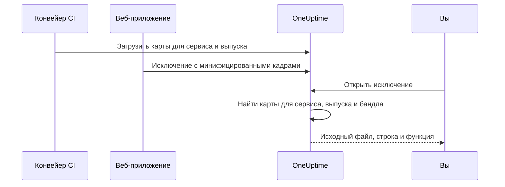

# Карты исходного кода

Загрузите в OneUptime карты исходного кода (source maps) вашей фронтенд-сборки, и исключения браузера в разделе **Исключения** будут показывать исходные имена файлов, строки и функции вместо минифицированных. Эта страница для фронтенд-разработчиков, которые уже отправляют телеметрию браузера в OneUptime.

:::cards
- [Как работает сопоставление](#как-работает-сопоставление): Имя сервиса, выпуск и файл бандла.
- [Загрузка карт](#загрузка-карт): Один запрос `curl` из CI.
- [Ограничения](#ограничения): Размеры, количество и настройки для собственной установки.
- [Просмотр восстановленных трассировок стека](#просмотр-восстановленных-трассировок-стека): Как выглядит восстановленный кадр.
:::

## Обзор

Продакшн-бандлы фронтенда минифицированы, поэтому исключение браузера, перехваченное через веб-SDK OpenTelemetry, приходит с кадрами стека вроде этого:

```text
TypeError: Cannot read properties of undefined (reading 'id')
    at e.onSelect (https://app.example.com/assets/main.a8f1b2.js:1:48291)
```

Загрузите карты исходного кода своей сборки в OneUptime, и дашборд исключений восстановит эти кадры до исходного файла, строки и имени функции, а если карта собрана с `sourcesContent`, то и до соседних строк вашего исходного кода.

Карты загружаются в OneUptime через аутентифицированный API и **никогда не запрашиваются с вашего сайта**, поэтому можно (и нужно) и дальше собирать с `hidden-source-map` (webpack) или `sourcemap: 'hidden'` (Vite / Rollup) и никогда не публиковать файлы `.map` рядом с бандлами.



## Как работает сопоставление

Карта исходного кода хранится по трём ключам:

| Ключ | Должен совпадать с |
|---|---|
| Имя сервиса | Атрибутом ресурса OpenTelemetry `service.name`, с которым ваше веб-приложение отправляет телеметрию |
| Версия сервиса | Атрибутом ресурса `service.version` (идентификатором вашего выпуска) |
| Путь бандла | Минифицированным файлом, для которого создана карта, например `main.a8f1b2.js` |

Когда вы открываете исключение, OneUptime находит карты, загруженные для сервиса и выпуска этого исключения, сопоставляет каждый кадр стека с бандлом по имени файла (суффиксы пути подходят: `main.a8f1b2.js` совпадает с `https://app.example.com/assets/main.a8f1b2.js`) и восстанавливает минифицированные строку и столбец по карте. Восстановление происходит лениво, при просмотре исключения, и никогда при приёме, поэтому карта, загруженная через несколько минут *после* первой ошибки нового выпуска, всё равно применяется задним числом.

## Перед началом работы

- Ключ приёма телеметрии типа **Сервер** из **Настройки проекта → Телеметрия и APM → Ключи приема**. См. [Создание ключа приёма](/docs/telemetry/open-telemetry#создайте-ключ-приёма).
- Веб-приложение, которое уже отправляет исключения в OneUptime через веб-SDK OpenTelemetry: см. [Настройка для браузера](/docs/rum/browser-setup).
- Сборка, которая записывает карты исходного кода, с `sourcesContent` (по умолчанию у большинства сборщиков), если нужны фрагменты кода вокруг каждого кадра.

## Загрузка карт

:::steps
### Отправляйте `service.version` вместе с телеметрией

Ваше веб-приложение должно отправлять `service.version`, и это должна быть та же строка, с которой вы загружаете карты:

```javascript
import { resourceFromAttributes } from "@opentelemetry/resources";

const resource = resourceFromAttributes({
  "service.name": "my-web-app",
  "service.version": "1.4.2", // same value you upload maps with
});
```

Подойдёт любой стабильный идентификатор выпуска (семантическая версия, SHA коммита git, номер сборки), если загруженный `serviceVersion` и атрибут ресурса `service.version` совпадают как строки.

### Загружайте карты после каждой продакшн-сборки

Загружайте из CI, передавая ключ приёма в заголовке `x-oneuptime-token`:

```bash
curl --fail -X POST "https://oneuptime.com/source-maps/v1/upload" \
  -H "x-oneuptime-token: YOUR_TELEMETRY_INGESTION_KEY" \
  -F "serviceName=my-web-app" \
  -F "serviceVersion=1.4.2" \
  -F "sourcemap=@dist/assets/main.a8f1b2.js.map" \
  -F "sourcemap=@dist/assets/vendor.9c3d4e.js.map"
```

Для собственных установок замените `oneuptime.com` на свой хост OneUptime. Вместо заголовка `x-oneuptime-token` принимается и `Authorization: Bearer YOUR_KEY`.

### Проверьте загрузку

Успешная загрузка возвращает тело JSON со списком сохранённых карт, так что CI может это проверить. Карты также перечислены на странице **Source Maps** сервиса в OneUptime.
:::

Типичный шаг CI загружает все карты, которые создала сборка:

```bash
VERSION="$(git rev-parse --short HEAD)"

find dist -name "*.js.map" -print0 | while IFS= read -r -d '' map; do
  curl --fail -X POST "https://oneuptime.com/source-maps/v1/upload" \
    -H "x-oneuptime-token: $ONEUPTIME_INGESTION_KEY" \
    -F "serviceName=my-web-app" \
    -F "serviceVersion=$VERSION" \
    -F "sourcemap=@$map"
done
```

### Правила загрузки

- Путь бандла каждого загруженного файла — это имя файла без завершающего `.map`: `main.a8f1b2.js.map` превращается в `main.a8f1b2.js`. Если имя вашего файла карты не следует этому соглашению, загружайте по одному файлу на запрос и передавайте явное поле `bundlePath`.
- Повторная загрузка того же бандла для того же сервиса и версии заменяет предыдущую карту, поэтому повторы CI безопасны.
- Файлы должны быть в формате JSON [source map v3](https://tc39.es/ecma426/) (его создаёт любой современный сборщик; индексированные карты с `sections` тоже поддерживаются).
- Если оператор вашей собственной установки отключил приём телеметрии (`DISABLE_TELEMETRY_INGESTION`), загрузки возвращают пустой успешный ответ и ничего не сохраняют, так же как любая конечная точка приёма телеметрии в этом режиме. Настоящая загрузка всегда возвращает тело JSON со списком сохранённых карт, поэтому CI может отличить одно от другого.

## Ограничения

Каждый файл `.map` может весить до 50 МБ, но ingress также ограничивает **всё тело запроса** 50 МБ, поэтому большие карты загружайте по одной на запрос. В одном запросе принимается до 50 файлов, а один выпуск (сервис + версия) может хранить не больше 1000 карт в сумме; загрузка, которая превысила бы это число, отклоняется с сообщением, где названо ограничение. Сборка, которая создаёт больше карт, чем принимает один запрос, просто отправляет несколько запросов: загрузки для одного выпуска накапливаются.

В собственных установках эти значения можно изменить. Все пять — обычные переменные окружения, а Helm-чарт предоставляет их в разделе `sourceMaps` файла `values.yaml`:

| `values.yaml` | Переменная окружения | По умолчанию |
| --- | --- | --- |
| `sourceMaps.maxMapsPerRelease` | `SOURCE_MAP_MAX_MAPS_PER_RELEASE` | `1000` |
| `sourceMaps.maxFilesPerRequest` | `SOURCE_MAP_MAX_FILES_PER_REQUEST` | `50` |
| `sourceMaps.maxFileSizeBytes` | `SOURCE_MAP_MAX_FILE_SIZE_BYTES` | `52428800` |
| `sourceMaps.maxBytesPerResolve` | `SOURCE_MAP_MAX_BYTES_PER_RESOLVE` | `536870912` |
| `sourceMaps.retentionDays` | `SOURCE_MAP_RETENTION_DAYS` | `90` |

`maxMapsPerRelease` стоит увеличить, если ваша сборка выходит за значение по умолчанию; это лишь ограничение формы хранения, потому что восстановление ограничено `maxBytesPerResolve`, а не числом карт в выпуске. `maxFilesPerRequest` и `maxFileSizeBytes` можно только **уменьшить**: тело multipart разбирается до аутентификации запроса, поэтому для любого неаутентифицированного вызывающего действуют общие верхние пределы над ними, а большее значение сужается, а не применяется.

## Просмотр восстановленных трассировок стека

Откройте любое исключение в разделе **Исключения** дашборда. Кадры, восстановленные через карту исходного кода, показывают значок **Source mapped**, а также исходное имя функции и расположение в файле; раскрытый кадр показывает фрагмент исходного кода (если карта содержит `sourcesContent`) рядом с минифицированным расположением.

Загруженные карты сервиса можно просмотреть и удалить в **Продукты → Сервисы → ваш сервис → Source Maps**, где для каждой карты указаны выпуск, бандл, размер и время загрузки.

## Срок хранения

Карты исходного кода хранятся 90 дней после загрузки, а затем удаляются автоматически. Карта полезна, только пока исключения её выпуска находятся в пределах срока хранения вашей телеметрии, поэтому этот срок с запасом превышает время жизни исключений, которые она делает читаемыми. Если карты выпуска снова понадобятся, загрузите их повторно.

## Безопасность

- Карты загружаются через аутентифицированную конечную точку и хранятся в вашем проекте OneUptime: они никогда не запрашиваются с вашего сайта, поэтому скрытые карты остаются скрытыми.
- Исходное содержимое карты (которое включает ваш исходный код, если она собрана с `sourcesContent`) могут прочитать только владельцы и администраторы проекта, а также все, у кого есть разрешение **Read Telemetry Source Map**. Остальные участники команды видят только восстановленные кадры и несколько строк кода вокруг места сбоя в исключениях, к которым у них уже есть доступ.
- При удалении сервиса удаляются и его карты исходного кода.

## Устранение неполадок

:::details Кадры по-прежнему минифицированы
Для выпуска исключения нет подходящих карт. Проверьте, что `service.version`, который отправляет ваше приложение, в точности совпадает с `serviceVersion`, с которым вы загружали карты, что `serviceName` совпадает с `service.name` и что для этого файла бандла загружена карта: страница **Source Maps** сервиса показывает выпуск и бандл каждой карты.
:::

:::details Загрузка отклоняется, потому что карта слишком большая
Одна карта может весить до 50 МБ, как и весь запрос. Загружайте большие карты по одной на запрос, как это делает цикл CI выше.
:::

## Дальнейшие шаги

:::cards
- [Настройка для браузера](/docs/rum/browser-setup): Отправлять трассировки и исключения браузера через веб-SDK OpenTelemetry.
- [Мониторинг исключений](/docs/monitor/exceptions-monitor): Получать оповещения о новых исключениях.
- [OpenTelemetry](/docs/telemetry/open-telemetry): Конечные точки, ключи и ограничения для всей телеметрии.
:::
