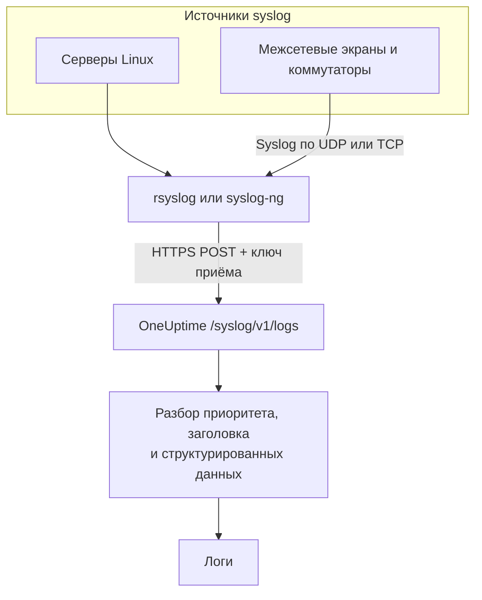

# Syslog

OneUptime принимает syslog по HTTPS. Отправляйте сообщения в формате RFC 5424 или RFC 3164 на `/syslog/v1/logs` с вашим ключом приёма, и каждое станет логом, по которому можно искать, — с приоритетом, facility, уровнем важности, хостом, приложением и структурированными данными в виде атрибутов. Так можно пересылать логи из rsyslog, syslog-ng или любого ретранслятора, который умеет делать HTTP-запросы.

:::cards
- [Отправка тестового сообщения](#отправка-тестового-сообщения): Один запрос `curl`.
- [Пересылка из rsyslog](#пересылка-из-rsyslog): Отправляйте всё, что получает сервер или ретранслятор.
- [Извлекаемые атрибуты](#извлекаемые-атрибуты): Что OneUptime извлекает из каждого сообщения.
- [Устранение неполадок](#устранение-неполадок): Отклонённые запросы и неожиданные службы.
:::

## Как это работает



OneUptime отвечает сразу после того, как прочитает сообщения из запроса, а разбирает и сохраняет их мгновением позже. Текст сообщения остаётся в теле лога; всё остальное становится атрибутами.

> [!TIP]
> Сетевые устройства, которые вы отслеживаете зондом OneUptime, могут отправлять свой syslog прямо на зонд по UDP, без ретранслятора, — тогда логи появляются у устройства в OneUptime. См. [Руководства по сетевым вендорам](/docs/monitor/network-vendor-guides).

## Перед началом

- **Проект OneUptime** — в OneUptime Cloud телеметрия оплачивается за каждый принятый ГБ, а проекту на плане Free нужен способ оплаты, прежде чем он сможет отправлять телеметрию.
- **Ключ приёма телеметрии** — создайте ключ типа **Сервер** в **Продукты → Настройки проекта → Телеметрия и APM → Ключи приема** и скопируйте его **Секретный ключ**. Его вы отправляете в заголовке `x-oneuptime-token`.
- **Пересыльщик syslog** — любой инструмент, умеющий отправлять запросы HTTP POST (например, `curl`, `rsyslog` через `omhttp` или `syslog-ng` с его HTTP-назначением).
- **Имя службы (необязательно)** — задайте заголовок `x-oneuptime-service-name`, чтобы группировать входящие логи под определённой службой телеметрии. Если его нет, OneUptime берёт `APP-NAME` из syslog, имя хоста или `Syslog`.

## Адрес

```http
POST https://oneuptime.com/syslog/v1/logs
```

| Заголовок | Обязателен | Значение |
| --- | --- | --- |
| `x-oneuptime-token` | Да | Ваш ключ приёма. |
| `Content-Type` | Да, для тел в JSON | `application/json` |
| `x-oneuptime-service-name` | Нет | Служба, к которой относятся логи. |
| `Content-Encoding` | Нет | `gzip`, для сжатого тела. |

Если OneUptime установлен у вас, замените `oneuptime.com` своим хостом.

## Тело запроса

Отправляйте JSON с массивом `messages`. Поддерживаются форматы RFC 5424 и RFC 3164 (BSD), и их можно смешивать в одном запросе:

```json
{
  "messages": [
    "<34>1 2025-03-02T14:48:05.003Z web-01 nginx 7421 ID47 [env@32473 host=\"web-01\"] 502 on /api/login",
    "<13>Feb  5 17:32:18 db-01 postgres[2419]: connection received from 10.0.0.12"
  ]
}
```

### Поддерживаемые форматы тела

| Тело | Как его отправить |
| --- | --- |
| Объект JSON с массивом `messages` | `Content-Type: application/json` — рекомендуется. |
| Массив сообщений JSON | `Content-Type: application/json`. |
| Объект JSON с одним `message` | `Content-Type: application/json`. Значение из нескольких строк читается как несколько сообщений. |
| Сообщения, разделённые переводами строк | Сжатые gzip и отправленные с `Content-Encoding: gzip`. |

Тело в виде обычного текста без сжатия gzip не читается, и запрос отклоняется с кодом `400`. Тело, сжатое gzip, всегда читается как сообщения, разделённые переводами строк, поэтому не сжимайте тело в JSON. Держите каждый запрос меньше 1 МБ: входной шлюз OneUptime не повышает для этого адреса стандартный лимит nginx на размер тела запроса.

## Отправка тестового сообщения

```bash
curl \
  -X POST https://oneuptime.com/syslog/v1/logs \
  -H "Content-Type: application/json" \
  -H "x-oneuptime-token: YOUR_TELEMETRY_KEY" \
  -H "x-oneuptime-service-name: production-web" \
  -d '{
    "messages": [
      "<34>1 2025-03-02T14:48:05.003Z web-01 nginx 7421 ID47 [env@32473 host=\"web-01\"] 502 on /api/login"
    ]
  }'
```

Ответ `200` означает, что сообщение принято. Откройте **Продукты → Журналы**: лог появится в службе `production-web` с телом `502 on /api/login`, уровнем важности `Error` и атрибутами из раздела [Извлекаемые атрибуты](#извлекаемые-атрибуты).

## Пересылка из rsyslog

rsyslog отправляет данные в OneUptime через свой модуль вывода по HTTP — `omhttp`.

:::steps
### Убедитесь, что `omhttp` доступен

Конфигурация ниже загружает его через `module(load="omhttp")`. Если rsyslog сообщает, что не может загрузить модуль, установите пакет, который предоставляет `omhttp` в вашем дистрибутиве.

### Добавьте назначение OneUptime

Создайте `/etc/rsyslog.d/oneuptime.conf`. Шаблон заново собирает каждое сообщение как строку RFC 5424 и упаковывает её в тело JSON, которое ожидает OneUptime:

```text title="/etc/rsyslog.d/oneuptime.conf"
module(load="omhttp")

template(name="OneUptimeJson" type="string"
         string="{\"messages\":[\"<%PRI%>1 %TIMESTAMP:::date-rfc3339% %HOSTNAME% %APP-NAME% %PROCID% %MSGID% - %msg:::json%\"]}")

action(
  type="omhttp"
  server="oneuptime.com"
  serverport="443"
  usehttps="on"
  restpath="syslog/v1/logs"
  httpheaders=[
    "x-oneuptime-token: YOUR_TELEMETRY_KEY",
    "x-oneuptime-service-name: rsyslog-demo"
  ]
  template="OneUptimeJson"
)
```

`restpath` принимает путь без начальной косой черты. `omhttp` по умолчанию отправляет `Content-Type` для JSON — ровно то, что формирует этот шаблон.

### Проверьте конфигурацию и перезапустите rsyslog

```bash
sudo rsyslogd -N1
sudo systemctl restart rsyslog
```

`rsyslogd -N1` проверяет конфигурацию, не запуская rsyslog. После перезапуска новые сообщения появятся в **Продукты → Журналы** в службе `rsyslog-demo`.
:::

Действие пересылает каждое сообщение, которое обрабатывает rsyslog: локальные программы, журнал systemd, если rsyslog его читает, и всё, что приходит из сети.

### Ретрансляция syslog с сетевых устройств

Межсетевые экраны, коммутаторы и другие устройства часто отправляют syslog только по UDP или TCP. Направьте их на ретранслятор rsyslog и пусть он пересылает данные по HTTPS. Добавьте в конфигурацию ретранслятора слушатель перед `action`:

```text title="/etc/rsyslog.d/oneuptime.conf"
module(load="imudp")
input(type="imudp" port="514")
```

Задайте в `x-oneuptime-service-name` имя вроде `perimeter-firewall` или уберите заголовок, чтобы логи каждого устройства группировались по его имени хоста. Многие устройства пишут сообщения парами `key=value`; [Key=Value Parser](/docs/telemetry/log-pipelines#keyvalue-parser) превращает их в атрибуты.

:::details Отправка пакетами вместо одного запроса на сообщение
rsyslog умеет объединять сообщения в пакеты и сжимать их gzip, а OneUptime читает такие пакеты как сообщения, разделённые переводами строк. Замените шаблон и действие на:

```text title="/etc/rsyslog.d/oneuptime.conf"
template(name="OneUptimeLine" type="string"
         string="<%PRI%>1 %TIMESTAMP:::date-rfc3339% %HOSTNAME% %APP-NAME% %PROCID% %MSGID% - %msg%")

action(
  type="omhttp"
  server="oneuptime.com"
  serverport="443"
  usehttps="on"
  restpath="syslog/v1/logs"
  httpheaders=["x-oneuptime-token: YOUR_TELEMETRY_KEY"]
  template="OneUptimeLine"
  batch="on"
  batch.format="newline"
  compress="on"
)
```

Оставьте `compress="on"`: OneUptime читает сообщения, разделённые переводами строк, только из тела, сжатого gzip.
:::

### Другие пересыльщики

- **syslog-ng** — используйте его HTTP-назначение с тем же URL, теми же заголовками и тем же телом JSON.
- **Fluent Bit** — принимайте syslog входом `syslog` в Fluent Bit и пересылайте его, как любой другой лог. См. [Fluent Bit](/docs/telemetry/fluentbit).

## Извлекаемые атрибуты

OneUptime автоматически добавляет к каждой записи лога такие атрибуты:

| Атрибут | Значение | Из тестового сообщения |
| --- | --- | --- |
| `syslog.priority` | Приоритет, `<PRI>` | `34` |
| `syslog.facility.code`, `syslog.facility.name` | Facility, по приоритету | `4`, `security` |
| `syslog.severity.code`, `syslog.severity.name` | Уровень важности, по приоритету | `2`, `critical` |
| `syslog.version` | Версия RFC 5424 | `1` |
| `syslog.hostname` | `HOSTNAME` | `web-01` |
| `syslog.appName` | `APP-NAME` или тег RFC 3164 | `nginx` |
| `syslog.processId` | `PROCID` | `7421` |
| `syslog.messageId` | `MSGID` | `ID47` |
| `syslog.structured.raw` | Структурированные данные RFC 5424 в том виде, в каком их отправили | `[env@32473 host="web-01"]` |
| `syslog.structured.*` | Каждый параметр структурированных данных, развёрнутый в плоский вид | `syslog.structured.env_32473.host` = `web-01` |
| `syslog.raw` | Исходное сообщение, для отслеживаемости | вся строка |

Эти атрибуты становятся доступными для поиска в обозревателе **Продукты → Журналы** — например, `@syslog.severity.name:error` или `@syslog.hostname:web-01`. См. [Синтаксис поиска](/docs/telemetry/search-syntax).

Само сообщение остаётся в теле лога. Межсетевые экраны вроде Sophos XGS и Fortinet FortiGate пишут его парами `key=value` (`log_component="IPSec" con_name="HQ-Branch1" status="Terminated"`); добавьте процессор **Key=Value Parser** в [конвейер логов](/docs/telemetry/log-pipelines#keyvalue-parser), чтобы превратить в атрибуты и эти пары.

### Уровень важности

| Уровень важности syslog | Код | Уровень важности в OneUptime |
| --- | --- | --- |
| Emergency, Alert | `0`, `1` | `Fatal` |
| Critical, Error | `2`, `3` | `Error` |
| Warning | `4` | `Warning` |
| Notice, Informational | `5`, `6` | `Information` |
| Debug | `7` | `Debug` |
| В сообщении нет приоритета | — | `Unspecified` |

Сообщение без отметки времени сохраняется со временем, когда OneUptime его получил.

### Служба

Каждый лог сохраняется под службой телеметрии, которую OneUptime создаёт при первой отправке. Служба определяется первым имеющимся значением из:

1. заголовка `x-oneuptime-service-name`;
2. `APP-NAME` (или тега) сообщения;
3. имени хоста в сообщении;
4. `Syslog`.

## Устранение неполадок

:::details HTTP 401
Ключ отсутствует, неизвестен или истёк. Проверьте, что заголовок `x-oneuptime-token` содержит **Секретный ключ** ключа приёма из проекта, который должен получать логи.
:::

:::details HTTP 402 или 422
`402`: в OneUptime Cloud проект на плане Free и без способа оплаты. Добавьте его в **Настройки проекта → Биллинг и счета → Биллинг**. `422`: ключ отключён, или это ключ браузера. Снова включите **Включено** в настройках ключа или создайте ключ типа **Сервер**.
:::

:::details HTTP 400, или логи не появляются
Убедитесь, что тело запроса действительно содержит строки syslog в виде JSON с `Content-Type: application/json`. Пустые тела, а также тела в виде обычного текста без сжатия gzip, отклоняются с HTTP 400.
:::

:::details HTTP 413
Запрос больше, чем принимает входной шлюз. Отправляйте меньше сообщений в одном запросе.
:::

:::details Логи приходят под неожиданным именем службы
Задайте `x-oneuptime-service-name`, чтобы заменить определение по умолчанию, которое берёт `APP-NAME`, а затем имя хоста.
:::

## Что дальше

:::cards
- [Конвейеры логов](/docs/telemetry/log-pipelines): Превращайте сообщения `key=value` в атрибуты.
- [Правила записи для логов](/docs/telemetry/log-recording-rules): Превращайте числа из syslog в метрики.
- [Мониторинг журналов](/docs/monitor/logs-monitor): Получайте оповещения, когда приходят подходящие сообщения syslog.
:::
