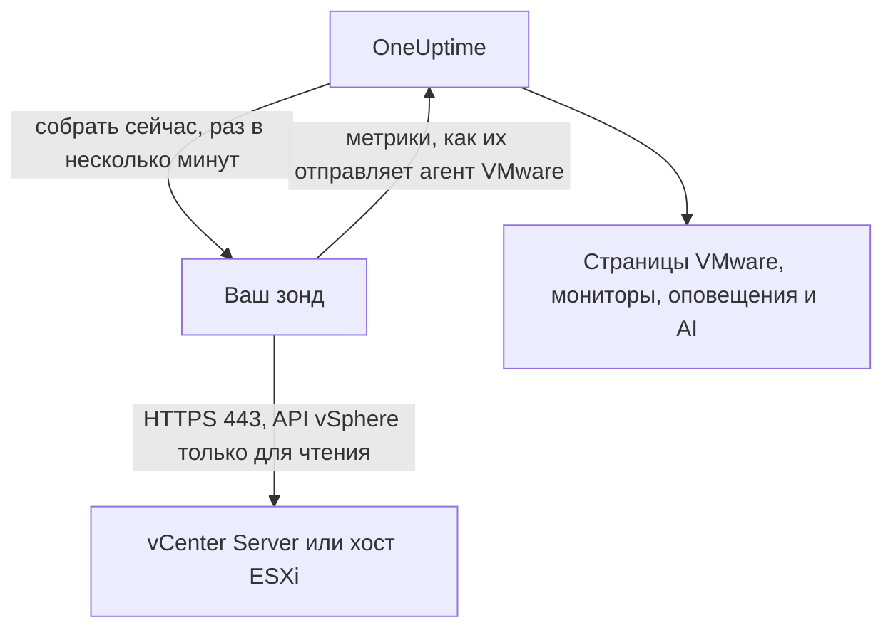

# VMware без агента

Отслеживайте vCenter Server или отдельный хост ESXi, ничего не устанавливая: введите в OneUptime адрес vCenter и учётную запись только для чтения, выберите зонд, у которого есть к нему доступ, и зонд будет собирать те же данные, что и [агент VMware](/docs/telemetry/vmware). Не нужно ни устанавливать, обновлять и поддерживать агент, ни выделять под него отдельную машину.

:::cards
- [Перед началом](#перед-началом): Зонд с доступом к vCenter и учётная запись только для чтения.
- [Подключение vCenter](#подключение-vcenter): Четыре поля, проверка и имя.
- [Устранение неполадок](#устранение-неполадок): Что означает каждое сообщение и как это исправить.
:::

## Как это работает

Раз в несколько минут зонд входит в vCenter с сохранённой учётной записью, читает инвентарь, счётчики производительности и статистику vSAN и отправляет их в OneUptime. Они приходят точно так же, как данные агента VMware, поэтому каждая страница VMware, каждый [монитор VMware](/docs/monitor/vmware-monitor), каждый шаблон оповещения и OneUptime AI читают их одинаково. Зонд сохраняет сеанс vCenter между сборами, поэтому журнал событий vCenter не заполняется входами.

## Зонд или агент?

| | Зонд (эта страница) | Агент VMware |
|---|---|---|
| Что вы запускаете | Зонд, который у вас уже работает, или новый | Агент на отдельной машине |
| Где хранится учётная запись | Зашифрована в OneUptime, отправляется только зонду | В файле `.env` агента |
| Куда нужен доступ | К vCenter по TCP 443 с зонда | К vCenter по TCP 443 с агента |
| Самый крупный vCenter | Около 48 МиБ метрик за один сбор | Без ограничений |
| Syslog ESXi и AI-агент | Не входят | Входят |

Оба отправляют одни и те же данные. Переключить vCenter с одного способа на другой можно в любой момент на его странице **Настройки**.

## Перед началом

- **Зонд с доступом к vCenter по TCP 443.** Обычно это [пользовательский зонд](/docs/probe/custom-probe) в сети vCenter. В OneUptime Cloud общие зонды никогда не получают пароль vCenter, поэтому добавьте собственный зонд. В самостоятельно размещённом экземпляре собирать данные могут и зонды самого экземпляра.
- **Пользователь vSphere с ролью Read-Only** на объекте vCenter верхнего уровня с включённым параметром **Propagate to children**. Следуйте инструкции [Создание пользователя vSphere только для чтения](/docs/telemetry/vmware#create-the-read-only-vsphere-user): это та же учётная запись, что использует агент.

> [!IMPORTANT]
> Без **Propagate to children** пользователь входит, но ничего не видит, и зонд сообщает, что учётная запись не может читать инвентарь vCenter.

## Подключение vCenter

:::steps
### Откройте список vCenter
В OneUptime откройте **VMware → Все vCenter** и нажмите **Подключить vCenter**.

### Введите адрес и учётную запись
Введите адрес, по которому вы открываете vSphere Client, например `https://vcsa.example.com`, имя пользователя с доменом, например `oneuptime@vsphere.local`, и пароль. Выберите зонд, у которого есть доступ к vCenter.

### Проверьте подключение
На следующем шаге нажмите **Проверить подключение**. Зонд входит, читает то, что видит учётная запись, и выходит, а в результате указано, сколько он нашёл центров обработки данных, кластеров, хостов, виртуальных машин и хранилищ данных.

### Доверьтесь сертификату vCenter
По умолчанию vCenter использует сертификат собственного центра сертификации, которому зонд не доверяет. Тогда проверка показывает сертификат: сверьте его отпечаток с отпечатком самого vCenter и нажмите **Доверять этому сертификату**.

### Задайте имя и подключите
По умолчанию имя — это имя хоста vCenter. Нажмите **Подключить vCenter**, чтобы сохранить.
:::

На странице **Обзор** vCenter появляется карточка **Сбор данных**. До первого сбора, который начинается в течение минуты, на ней написано **Проверка**, затем **Сбор идёт**, и инвентарь заполняется.

## Сертификаты

Зонд никогда не пропускает проверку сертификата. Каждое подключение проходит полное TLS-рукопожатие, а затем:

- если доверенный сертификат не задан, сертификат vCenter должен быть выдан центром сертификации, которому доверяет машина зонда, для введённого адреса;
- если доверенный сертификат задан, vCenter должен предъявить именно этот сертификат, определяемый по отпечатку SHA-256. Ничто другое не принимается, даже публично доверенный сертификат.

Чтобы проверить отпечаток, откройте в vSphere Client **Administration → Certificates → Certificate Management** или выполните `openssl s_client -connect vcsa.example.com:443 </dev/null | openssl x509 -noout -fingerprint -sha256` на машине зонда.

Когда сертификат vCenter обновляется, сбор останавливается с сообщением **Сертификат vCenter изменился**, и показывается новый сертификат. В vCenter ничего не отправляется, пока вы ему не доверитесь на странице **Обзор** или **Настройки** vCenter.

## Сохранённый пароль

Пароль зашифрован и доступен только для записи: никто не может прочитать его обратно, и API никогда его не возвращает. Он отправляется только зонду, который собирает данные vCenter, и тот хранит его в памяти.

Сохранённый пароль отправляется только по тому адресу, через тот зонд и тому сертификату, для которых он был введён. При изменении адреса, зонда или доверенного сертификата пароль запрашивается снова, поэтому никто, кто может редактировать vCenter, не может отправить его в другое место. Если довериться сертификату, который зонд нашёл по сохранённому адресу, пароль сохраняется.

## Переключение между агентом и зондом

Откройте страницу **Настройки** vCenter. Его карточка **Сбор данных** предлагает **Собирать зондом** для vCenter, данные которого отправляет агент, и **Использовать агент VMware** для vCenter, который собирает зонд. При переходе на агент сохранённый пароль забывается.

> [!WARNING]
> Остановите агент VMware, как только первый сбор зондом пройдёт успешно. Пока работают оба, каждая метрика приходит дважды.

## Справочник

| Параметр | По умолчанию | Примечания |
|---|---|---|
| Интервал сбора | 2 минуты | От 1 до 60 минут. Собирайте данные крупного vCenter реже, чтобы меньше его нагружать. |
| Одновременные сборы | 4 на зонд | Сбор, который длится дольше своего интервала, пропускается, а не ставится в очередь. |
| Самый крупный сбор | Около 48 МиБ | Более крупным vCenter нужен агент VMware. |
| Проверка подключения | 90 секунд на запуск | Проверка, которую ни один зонд не взял вовремя или которая идёт дольше 2 минут, считается неудачной. |

## Устранение неполадок

:::details Сертификат vCenter не является доверенным
vCenter предъявляет сертификат собственного центра сертификации. Сверьте показанный отпечаток с сертификатом vCenter и нажмите **Доверять этому сертификату**.
:::

:::details vCenter отклонил вход
Используйте полное имя пользователя с доменом, например `oneuptime@vsphere.local`, и проверьте пароль, а также что учётная запись не заблокирована. Измените их кнопкой **Изменить подключение** на странице **Настройки** vCenter.
:::

:::details Пользователь не может читать инвентарь vCenter
Назначьте пользователю роль Read-Only на объекте vCenter верхнего уровня с включённым параметром **Propagate to children**.
:::

:::details Зонд не получает ответа от vCenter
Из сети зонда нет доступа к vCenter по TCP 443. Разрешите этот трафик в брандмауэре или выберите зонд в сети vCenter.
:::

:::details Зонд не взял это в работу
Зонд отключён или работает на версии OneUptime, выпущенной до появления сбора данных VMware. Проверьте в таблице **Пользовательские probes**, что он подключён, и обновите его.
:::

:::details Этот vCenter слишком велик для сбора зондом
Его метрики больше, чем может вместить одна выгрузка зонда. Используйте для этого vCenter [агент VMware](/docs/telemetry/vmware).
:::

## Дальнейшие шаги

:::cards
- [Монитор VMware](/docs/monitor/vmware-monitor): Оповещения о хостах, виртуальных машинах, хранилищах данных и кластерах.
- [Пользовательский зонд](/docs/probe/custom-probe): Запустите зонд в сети vCenter.
- [Агент VMware](/docs/telemetry/vmware): Собирайте данные vCenter агентом.
:::
