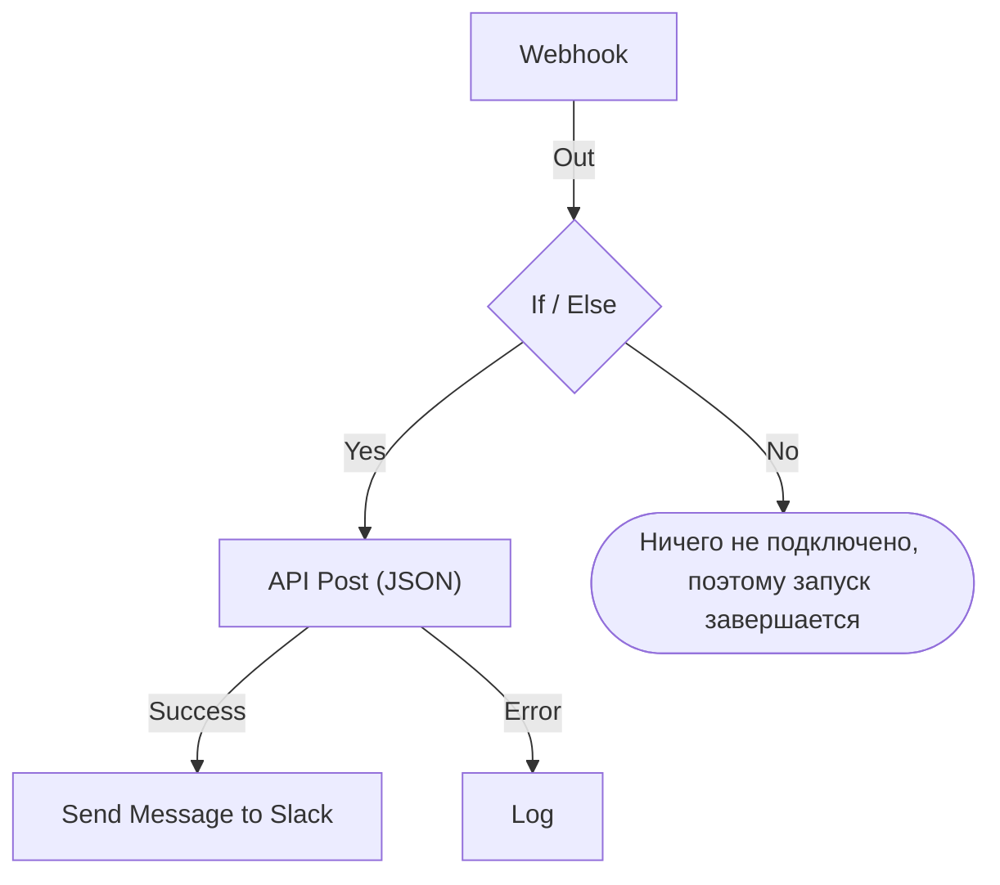

# Создание рабочего процесса

Рабочий процесс собирается на его странице **Конструктор**: это холст, на котором вы добавляете блоки, соединяете их и заполняете их настройки. На этой странице показано, как создать рабочий процесс, [добавить блоки](#добавление-блоков), [соединить](#соединение-блоков) и [настроить](#настройка-блока) их, [передавать значения между ними](#использование-значений-из-предыдущих-блоков) и [включить рабочий процесс](#включение).

Чтобы создать рабочий процесс, откройте **Рабочие процессы** и нажмите **Создать рабочий процесс**. Диалог **Создать рабочий процесс** сначала спрашивает, с чего начать, а затем — имя. Шаблон, которому нужны собственные настройки, например URL вебхука Slack, запрашивает их на дополнительном шаге и сохраняет как переменные рабочего процесса, чтобы потом их можно было изменить, не редактируя рабочий процесс.

Выберите, с чего начать:

- **Начать с нуля**, вверху диалога, даёт пустой холст. Большинство рабочих процессов начинается здесь.
- **Или начать с шаблона** показывает несколько шаблонов в разделе **Рекомендуемые**. Для остальных выберите категорию рядом с полем поиска, например **Инциденты**, **Мониторы** или **Jira**, либо **Все шаблоны**, или введите текст в **Поиск шаблонов…**. Совпасть должно каждое введённое слово.

Нажмите на шаблон, чтобы увидеть, что он делает: его триггер, блоки, из которых он состоит, и настройки, которые он запросит. Затем нажмите **Использовать шаблон** или дважды щёлкните по шаблону. В поле поиска клавиши со стрелками выбирают шаблон, а **Enter** использует его. `/` возвращает в поле поиска.

Рабочие процессы создаются выключенными, поэтому ничего не выполняется, пока вы их не включите. Новый рабочий процесс открывается на странице **Конструктор** — холсте, на котором вы его проектируете.

## Холст

Рабочий процесс с нуля открывается с одним пунктирным блоком с надписью **Choose what starts this workflow**. Этот блок — отправная точка: нажмите на него, чтобы выбрать триггер. Рабочий процесс, созданный из шаблона, открывается с уже расставленными блоками.

У каждого рабочего процесса ровно один **триггер** вверху. Всё остальное — **компоненты**, которые что-то делают. Чтобы сменить триггер, удалите его: на его место вернётся пунктирная заглушка, и нажатие на неё позволит выбрать другой. При удалении блока удаляются и его линии, поэтому снова соедините новый триггер с первым блоком.

Изменения сохраняются автоматически. За этим следит метка на панели инструментов: **Сохранение…**, пока изменение в пути, затем **Сохранено** или **Не удалось сохранить**, если сохранить не получилось. На холсте нет кнопки сохранения и отдельного шага публикации.

## Добавление блоков

| Что добавить           | Нажмите                                                        | Открывается панель            |
| ---------------------- | -------------------------------------------------------------- | ----------------------------- |
| Триггер                | Пунктирный блок-заглушку                                       | **Add Trigger**               |
| Любой другой блок      | **Добавить компонент** на панели инструментов над холстом      | **Добавить компонент**        |

Обе панели открываются на блоках, которыми пользуется большинство рабочих процессов, в разделе **Popular**, а за ними идут остальные встроенные блоки. В разделе **OneUptime resources** нажмите на ресурс, например **Инцидент**, чтобы увидеть, что с ним можно сделать; **Browse all resources** показывает их все. Или воспользуйтесь поиском: введите несколько слов, например `create incident`, и лучшее совпадение окажется первым. Нажмите `/`, чтобы перейти к полю поиска, клавиши со стрелками — чтобы перемещаться по результатам, и **Enter** — чтобы добавить выделенный блок. Нажатие на блок добавляет его.

Новый блок появляется под самым нижним блоком на холсте, а новый триггер занимает место пунктирного блока вверху. Новый блок выделен, и если он оказался за пределами видимой области, холст прокручивается ровно настолько, чтобы его показать. Его настройки сами не открываются: нажмите на блок, когда будете готовы его настроить. Пока обязательные настройки не заполнены, на нём написано **Click to set up**.

Перетаскивайте блоки куда угодно; при перетаскивании холст привязывает их к сетке. Положение блоков сохраняется, поэтому следующий человек увидит ту же раскладку, что оставили вы.

## Из чего состоит блок

| Поле                                  | Что делает                                                                                                                                                                                                                                                                                                    |
| ------------------------------------- | ------------------------------------------------------------------------------------------------------------------------------------------------------------------------------------------------------------------------------------------------------------------------------------------------------------- |
| **Identifier** (в разделе **ID**)     | Короткий ID, показанный на блоке, например `log-1`. По нему на этот блок ссылаются другие блоки, поэтому если его переименовать, все ссылки `{{local.components.…}}`, указывающие на него, перестанут работать. Заголовок блока — это собственное имя компонента, его изменить нельзя.                        |
| **Настройки**                         | То, что нужно блоку для работы, — URL, канал Slack, текст сообщения. Необязательные поля помечены **(Необязательно)**; всё остальное обязательно. У переключателя нет ни того, ни другого, потому что у него всегда есть значение. Реже используемые настройки свёрнуты в **Дополнительные поля**, заголовок которых перечисляет их и показывает заполненные. |
| **Input**                             | Точка на верхнем крае, куда входят линии от предыдущих блоков. У триггеров её нет — перед ними ничего не выполняется.                                                                                                                                                                                          |
| **Outputs**                           | Точки вдоль нижнего края с подписями прямо над ними, откуда линии идут к следующим блокам. У многих блоков есть отдельные выходы **Success** и **Error**, чтобы вы могли обработать оба случая.                                                                                                             |

## Соединение блоков

Протяните линию от точки внизу одного блока к точке вверху следующего. Проведённая линия определяет, что выполняется дальше.

- Если соединить от **Success**, следующий блок выполнится, только когда предыдущий завершился успешно.
- Если соединить от **Error**, следующий блок выполнится, только когда предыдущий завершился с ошибкой.
- Если выход ни с чем не соединить, этот путь просто заканчивается.

Один выход можно соединить с несколькими блоками. Выполнятся все — но друг за другом, в одной очереди, а не параллельно. Не рассчитывайте на порядок между ветвями и не рассчитывайте, что они пересекаются по времени.

Каждый блок выполняется не больше одного раза за запуск. Линия, ведущая к блоку, который уже выполнился, — назад вверх по холсту или из другой ветви после того, как его достигла первая, — останавливает запуск с ошибкой, поэтому рабочий процесс не может зациклиться.

## Настройка блока

Нажмите на блок, чтобы открыть его настройки в диалоге, или перейдите к нему клавишей **Tab** и нажмите **Enter**. Заполните настройки и нажмите **Сохранить**.

У каждой настройки то поле ввода, которое требуется её значению:

| Настройка содержит                               | Что вы получаете                                                               |
| ------------------------------------------------ | ------------------------------------------------------------------------------ |
| Слова: сообщение, промпт, значение для журнала   | Поле, которое растёт по мере ввода. **Enter** начинает новую строку.           |
| Короткое значение: URL, ID, тема письма          | Одну строку.                                                                   |
| Код или HTML                                     | Редактор кода.                                                                 |
| JSON                                             | Редактор JSON.                                                                 |
| Вкл. или выкл.                                   | Переключатель с названием рядом. Нажмите на переключатель или название, чтобы его переключить. |

Диалог открывается на том, за чем вы, скорее всего, пришли. Для триггера **Webhook** — это его URL с кнопкой **Скопировать URL**, методы, которые он принимает, и пример запроса. Для триггера **Manual** — способ запуска рабочего процесса. Любой другой блок открывается на своих настройках. У блока без настроек раздела **Настройки** нет вовсе.

Ниже, сверху вниз:

- **ID**, **Inputs** и **Outputs** рядом друг с другом — идентификатор блока, откуда к нему приходят и что выполняется после него.
- **Returns** — данные, которые этот блок передаёт последующим шагам. Для каждого значения показана точная ссылка, которая его читает, с кнопкой для копирования.
- **How to use** — что делает блок, одним предложением, шаги по его настройке, пример для копирования и ошибки, которые часто допускают. Пример построен по вашему рабочему процессу: в нём используется ID этого блока и значения триггера там, где он вставляет данные в сообщение. **Learn more** открывает подробное объяснение, а ссылки ведут к полному руководству. Такой раздел есть у каждого блока, и кнопка **How to use** вверху диалога сразу переходит к нему.

Внизу находятся:

- **Удалить** — удаляет этот блок. Сначала спрашивает подтверждение и называет блок по типу и идентификатору, например **Send Email (send-email-2)**, чтобы вы знали, какой из нескольких одинаковых блоков исчезнет.
- **Run just this step** — выполняет только этот блок, без остального рабочего процесса. Значения, которые он прочитал бы из других шагов, приходят пустыми, а всё, что он отправляет, записывает или удаляет, происходит на самом деле. Он пропускает все условия перед блоком, поэтому пользоваться им могут только те, кому разрешено редактировать рабочий процесс.

### Использование значений из предыдущих блоков

Большинство настроек может использовать значение из предыдущего блока или переменную — так данные переходят от одного блока к следующему. У каждой такой настройки в конце есть кнопка **{ }**. Она открывает список значений, которые можно использовать: каждый предыдущий блок по имени со всеми значениями, которые он возвращает, — как оно называется, что содержит и его тип, — затем переменные рабочего процесса и глобальные. Найдите нужное в списке, выберите мышью или клавишами со стрелками и **Enter**, и значение вставится там, где стоит курсор.

В настройке значение показывается как плашка, например **Webhook › Request Body**. Наведите на неё указатель, чтобы увидеть ссылку, которую она обозначает, `{{local.components.webhook-1.returnValues.request-body}}`, — именно она и сохраняется. Курсор перескакивает плашку целиком, **Backspace** удаляет её полностью, а при копировании копируется ссылка. Если вы знаете синтаксис, введите `{{`: тот же список откроется под настройкой и будет сужаться по мере ввода.

- **Предлагаются только значения, которые будут существовать.** Это триггер и блоки, выполняющиеся до этого. У блока, который выполняется позже, ещё нет выходных данных. Пока блок не соединён, показываются только значения триггера, и список об этом сообщает.
- **Запись открывается на своих полях.** Блок Find One или On Create возвращает запись целиком. Выберите её, чтобы увидеть поля, — первыми идут те, что читает **Select Fields** блока. Значение JSON или набор заголовков открывается на поле, куда вы вводите путь, например `title` или `alerts[0].status`.
- **После того как блок выполнился, список знает, что в его значениях.** Каждое значение показывает, что оно содержало в последнем запуске, — `"production"` или `3 fields`, — а значение JSON или набор заголовков открывается на тех полях, которые в нём были, каждое со своим содержимым. Так, из **Request Body** вебхука вы выбираете **incident.title** вместо того, чтобы вводить путь. Поиск тоже находит эти поля: введите `title` или `{{` и начало пути. Поля записи тоже показывают, что в них было. Поля берутся из последнего запуска, поэтому поле, которое более поздний запрос не передал, в том запуске пустое. Значение, похожее на секрет, например заголовок `Authorization`, токен или пароль, показывается без содержимого.
- **Вебхук, который ещё не получил ни одного запроса, сообщает об этом** вверху своих значений и предлагает **Copy test request**: команду `curl`, которая отправляет `{"message": "Hello"}` на URL вебхука рабочего процесса. Выполните её в терминале, пока список открыт, и поля запроса появятся в нём, как только завершится запуск, который он начал, обычно через несколько секунд. Рабочий процесс должен быть включён, иначе запрос отклоняется. Кнопку видят только те, кому разрешено видеть URL вебхука. Триггер Incoming Email, который ещё не получил ни одного письма, сообщает об этом там же; отправьте письмо на его адрес, и его заголовки и вложения появятся так же.
- **У редакторов кода есть Insert value на панели инструментов.** В JSON он добавляет кавычки, которые нужны значению внутри документа. **Run Custom JavaScript** читает значения через свои **Arguments**, поэтому в его коде выбора нет.
- **Числа, пароли, переключатели и даты сохраняют собственный элемент управления,** а рядом с ним — **{ }**. Выбранное значение заменяет элемент управления, а **abc** возвращает к вводу.

Плашка становится оранжевой, когда того, что она читает, не существует: блок переименован или удалён, блок не возвращает такое значение, блок выполняется позже или переменной нет. Всплывающая подсказка говорит, что именно. Синтаксис ссылок описан в разделе [Переменные](/docs/workflows/variables).

## Проверки по ходу работы

Конструктор проверяет весь граф при каждом изменении и сообщает о найденном в метке на панели инструментов. Нажмите на метку, чтобы открыть **Problems with this workflow**: там перечислены все проблемы, и оттуда можно перейти к блоку, к которому они относятся. На холсте на блоке, обязательные настройки которого ещё пусты, написано **Click to set up**, а у блока с другой проблемой в углу есть значок: красный — для ошибки, оранжевый — для предупреждения. Наведите указатель на значок, чтобы прочитать, что не так.

Он ловит ошибки, которые иначе незаметны, пока запуск не пойдёт не так:

- рабочий процесс без триггера;
- два блока с одинаковым ID или ID с точкой;
- блок, к которому ничего не подключено;
- обязательная настройка, оставленная пустой;
- некорректный JSON;
- пробелы внутри `{{ }}`;
- ссылки на шаг или возвращаемое значение, которых не существует.

Одного он проверить не может: существует ли имя переменной. Настройки блока могут — ссылка на несуществующую переменную показывается там оранжевой плашкой. Везде в остальных местах переименованная переменная обнаруживается только в журнале запуска.

## Ваш первый рабочий процесс

Быстрее всего освоить холст на рабочем процессе из двух блоков, который вы запускаете вручную:

:::steps
1. Нажмите на пунктирный блок-заглушку, затем нажмите **Manual** на панели **Add Trigger**.
2. Нажмите **Добавить компонент**, затем нажмите **Журнал** в разделе **Popular**. Новый блок появится под триггером. Соедините точку **Execute** триггера с входной точкой блока Log.
3. Нажмите на блок Log, на котором написано **Click to set up**, и введите `Hello from ` в его **Value**. Нажмите **{ }**, затем нажмите **JSON** в разделе **Manual**. Настройка покажет **Manual › JSON** и сохранит `{{local.components.manual-1.returnValues.value}}`. `manual-1` — это **Identifier** триггера, показанный на блоке триггера. Нажмите **Сохранить**.
4. Включите переключатель **Включено** вверху Конструктора. Отключённый рабочий процесс вообще нельзя выполнить, даже вручную; если пропустить этот шаг, **Запустить рабочий процесс** сначала попросит его включить.
5. Вернувшись на страницу **Конструктор**, нажмите **Запустить рабочий процесс**, введите `{ "name": "Ada" }` в поле **JSON**, нажмите **Run Workflow Manually** и подтвердите кнопкой **Run**.
6. Панель **Запуск рабочего процесса** откроется сама и будет следить за запуском. В журнале появится `Value:`, а за ним `Hello from { "name": "Ada" }`.
:::

Этот цикл — добавить, соединить, настроить, запустить, прочитать журнал — и есть то, как собирается каждый рабочий процесс.

> [!TIP]
> JSON, введённый в **Запустить рабочий процесс**, приходит в триггер Manual как набранный вами текст. Чтобы прочитать в нём поле, например `name`, добавьте блок **Text to JSON**, передайте в его **Text** значение **JSON** триггера и читайте поле из **JSON** этого блока: `{{local.components.text-to-json-1.returnValues.json.name}}`.

## Включение

Новые рабочие процессы создаются отключёнными, как и любой рабочий процесс, который вы дублируете или импортируете. Пока рабочий процесс выключен, Конструктор сообщает об этом над холстом и показывает кнопку **Включить рабочий процесс**.

Переключатель **Включено** находится вверху страницы **Конструктор**, рядом с **Добавить компонент** и **Запустить рабочий процесс**. Он есть и на странице **Обзор** рабочего процесса, где карточка **Сведения о рабочем процессе** показывает текущее состояние зелёной меткой **Включено** или красной меткой **Отключено**: нажмите **Редактировать рабочий процесс** и откройте **Дополнительные поля**. Включать и выключать рабочий процесс могут только те, кому разрешено его редактировать; остальные видят переключатель неактивным.

Отключённый рабочий процесс вообще не может выполняться, как бы его ни запускали:

| Чем запущен                                                | Пока рабочий процесс выключен                                                                                                                                                             |
| ---------------------------------------------------------- | ----------------------------------------------------------------------------------------------------------------------------------------------------------------------------------------- |
| Его триггером: расписанием, событием OneUptime или письмом | Игнорируется.                                                                                                                                                                             |
| **Запустить рабочий процесс** или **Run just this step**   | Вместо этого Конструктор спрашивает **Включить этот рабочий процесс?**. **Включить и запустить** (или **Включить и выполнить шаг**) включает рабочий процесс, а затем выполняет то, что вы просили, с указанными вами значениями. |
| Вызовом его URL вебхука                                    | Отклоняется с HTTP 400 и сообщением "This workflow is turned off, so it can't run. Turn it on with the Enabled switch at the top of its Builder, then try again."                         |
| Блоком **Execute Workflow** другого рабочего процесса      | Этот блок идёт по своему пути **Error**, а ошибка называет рабочий процесс, который он вызывал.                                                                                           |

Поэтому порядок такой: соберите его, проверьте через **Запустить рабочий процесс**, прочитайте журнал запуска и снова выключите **Включено**, если вы не готовы к тому, что сработает его триггер. Чтобы проверить один блок, не запуская всё, используйте **Run just this step** в настройках этого блока.

Чтобы приостановить рабочий процесс, не удаляя его, выключите **Включено**. Новые запуски не начинаются. Уже идущий запуск завершается, но запуск, который ждёт на блоке **Sleep**, отменяется при пробуждении и записывается как ошибка.

## Наведение порядка

- Перетаскивайте блоки, чтобы перемещать их. Раскладка сохраняется.
- Чтобы удалить линию, оттяните один из её концов от точки и отпустите на пустом месте холста.
- Чтобы удалить блок, нажмите на него и используйте **Удалить** внизу диалога его настроек. Выделение блока или линии и нажатие Backspace тоже удаляет их.
- Дублировать отдельный блок нельзя. **Дублировать: Рабочий процесс** на странице **Настройки** рабочего процесса копирует его целиком. Имя копии заполняется с номером, следующим за рабочими процессами проекта («Nightly Sync» копируется как «Nightly Sync 2»), и копия открывается отключённой.
- Располагайте блоки сверху вниз, чтобы они читались в том направлении, в котором выполняются, — вход на верхнем крае, выходы на нижнем, поэтому поток естественно идёт вниз.

## Что дальше

:::cards
- [Триггеры](/docs/workflows/triggers): Пять способов запустить рабочий процесс.
- [Компоненты](/docs/workflows/components): Все блоки, которые можно добавить, с их настройками и выходами.
- [Переменные](/docs/workflows/variables): Передавайте данные между блоками и держите секреты вне их.
- [Запуски](/docs/workflows/runs-and-logs): Проверьте, что сделал каждый запуск, шаг за шагом.
:::
