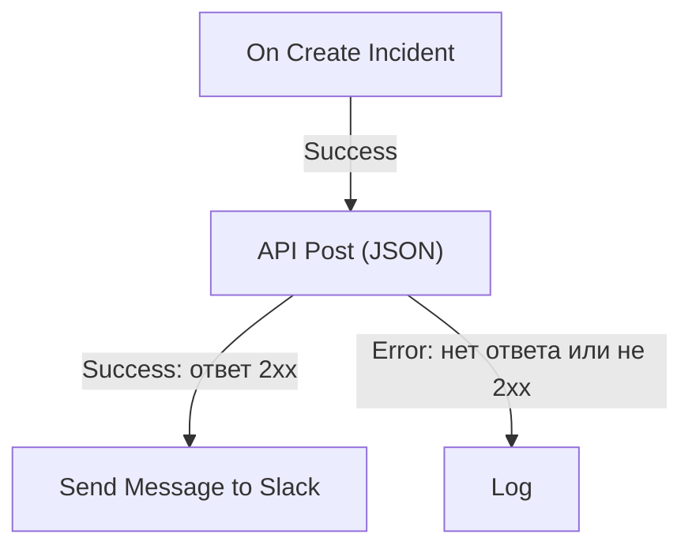

# Компоненты рабочего процесса

Компоненты — это блоки, которые вы добавляете после триггера. Каждый делает одно дело — отправляет сообщение, вызывает API, проверяет условие, изменяет запись OneUptime — и затем выбирает один из своих выходов, ведущий к соединённым с ним блокам. Эта страница — каталог: что нужно каждому блоку, что он возвращает и когда выбирает каждый выход.

Держать её открытой во время работы приходится редко. Настройки каждого блока заканчиваются разделом **How to use**: что делает блок, шаги по его настройке, пример, построенный по вашему рабочему процессу, и ошибки, которые часто допускают. О добавлении и соединении блоков см. [Создание рабочего процесса](/docs/workflows/authoring).

:::cards
- [Отправить сообщение](#slack): Slack, Microsoft Teams, Discord, Telegram, IRC и электронная почта.
- [Вызвать API](#api): Отправьте запрос в любой HTTP API и прочитайте ответ.
- [Добавить логику](#conditions): Ветвление по значению, преобразование данных, ожидание или запись в журнал.
- [Работать с записями OneUptime](#компоненты-данных-oneuptime): Находите, создавайте, обновляйте и удаляйте мониторы, инциденты и многое другое.
:::

## Какой компонент выбрать?

| Чтобы…                                                        | Используйте                                                       |
| ------------------------------------------------------------- | ----------------------------------------------------------------- |
| Опубликовать в чате                                           | [Slack](#slack), [Microsoft Teams](#microsoft-teams), [Discord](#discord), [Telegram](#telegram) или [IRC](#irc) |
| Отправить письмо через собственный почтовый сервер            | [Email](#email)                                                   |
| Вызвать любой другой API или собственный сервис               | [API](#api)                                                       |
| Кратко изложить, классифицировать или набросать текст         | [Generate Text with AI](#generate-text-with-ai)                   |
| Пойти по одному или другому пути в зависимости от значения    | [Conditions](#conditions)                                         |
| Преобразовать данные между двумя блоками                      | [JSON](#json) или [Custom Code](#custom-code)                     |
| Подождать перед следующим блоком                              | [Sleep](#sleep)                                                   |
| Запустить другой рабочий процесс                              | [Execute Workflow](#execute-workflow)                             |
| Читать или изменять инциденты, мониторы и другие записи       | [Компоненты данных OneUptime](#компоненты-данных-oneuptime)         |

Специализированный блок лучше универсального: блок Slack знает ограничения Slack, а блок записи знает поля записи, поэтому ошибки и журналы у них понятнее, чем у блока **API**, выполняющего ту же работу.

## Как работает каждый блок

Блок выполняется, когда предыдущий блок выбирает выход, соединённый с ним. Он читает свои настройки, делает свою работу и затем выбирает один из своих выходов. Дальше выполняются только блоки, соединённые с этим выходом.



- **Настройки** — то, что вы заполняете. Настройки с пометкой **(Необязательно)** можно оставить пустыми. Реже используемые настройки свёрнуты в **Дополнительные поля**.
- **Outputs** — точки на нижнем крае. У большинства блоков есть **Success** и **Error**; у [Conditions](#conditions) — **Yes** и **No**.
- **Returns** — значения, которые блок передаёт последующим блокам, например **Response Body** у API. Последующий блок читает значение через `{{local.components.<block ID>.returnValues.<value ID>}}`; кнопка **{ }** в настройке вставляет его за вас. См. [Переменные](/docs/workflows/variables#выходные-данные-компонентов-данные-от-предыдущих-блоков).

Блок, выбравший **Error**, не делает запуск неудачным: запуск идёт по пути **Error** или заканчивается там, если к нему ничего не подключено. А вот обязательная настройка, оставленная пустой, или настройка, которая никогда не сможет работать, останавливает запуск с ошибкой.

## API

Выполните HTTP-запрос к любому URL. Для каждого метода есть свой блок: **API Get (JSON)**, **API Post (JSON)**, **API Put (JSON)**, **API Patch (JSON)** и **API Delete (JSON)**.

| Настройка           | Что делает                                                                                                                           |
| ------------------- | ------------------------------------------------------------------------------------------------------------------------------------ |
| **URL**             | Адрес для вызова, `http` или `https`.                                                                                                |
| **Request Body**    | JSON для отправки. Обычно он нужен только запросам `POST`, `PUT` и `PATCH`.                                                          |
| **Request Headers** | Заголовки для отправки, например ключ API. В **Дополнительные поля**. Их значения скрываются в журнале запуска.                      |

| Выход       | Когда                                                                                          |
| ----------- | ---------------------------------------------------------------------------------------------- |
| **Success** | Сервер ответил статусом 2xx.                                                                   |
| **Error**   | Запрос не удался: сервер недоступен или ответил другим статусом.                               |

В любом случае блок возвращает **Response Status**, **Response Headers** и **Response Body**, а также **Error** с причиной, если запрос не удался. Чтобы прочитать поле JSON-ответа, добавьте его имя к ссылке, как в `{{local.components.api-get-1.returnValues.response-body.id}}`.

Перенаправления не выполняются, поэтому указывайте блоку адрес, который отвечает. Запросы отправляются из OneUptime: URL, который указывает на частный сетевой адрес, отклоняется, если администратор собственной установки этого не разрешил, и запуск останавливается с причиной. См. [Исходящий доступ в сеть](/docs/workflows/configuration#исходящий-доступ-в-сеть).

## AI

### Generate Text with AI

Генерирует один текстовый ответ по промпту и необязательному JSON-контексту. Блок использует LLM-провайдера проекта по умолчанию или глобального провайдера установки, если у проекта его нет. Провайдеры настраиваются централизованно в **Настройки проекта → ИИ → Провайдеры LLM**; их ключи и конечные точки никогда не являются настройками блока.

| Настройка                 | Что делает                                                                                                                                                        |
| ------------------------- | ----------------------------------------------------------------------------------------------------------------------------------------------------------------- |
| **System Instructions**   | Необязательные указания о роли, тоне и ограничениях модели.                                                                                                      |
| **Prompt**                | Задача. Отправляется ровно в том виде, в каком вы её написали, поэтому Markdown подойдёт, и она может содержать переменные и значения из предыдущих блоков.      |
| **Context**               | Необязательный JSON, который вы сознательно отправляете. Добавляется после явной метки конца сообщения и рассматривается как недоверенные данные.                 |
| **Temperature**           | В **Дополнительные поля**. Вариативность от `0` до `1`; по умолчанию `0.2` — для предсказуемой автоматизации. Текущие модели Claude, Opus 4.7 и новее и все модели Claude 5, сами выбирают параметры сэмплирования: OneUptime не передаёт им **Temperature**, поэтому на них она не влияет. |
| **Maximum Output Tokens** | В **Дополнительные поля**. От `1` до `4096`; по умолчанию `1024`.                                                                                                |

System Instructions, Prompt и сериализованный Context вместе ограничены 50 000 символов. Изображение, встроенное в них в формате base64, например скриншот синтетического монитора в описании инцидента, перед подсчётом заменяется короткой пометкой вроде `[image omitted: PNG, 340 KB]`, потому что модель читает текст, а не изображения. Журнал запуска сообщает, что было опущено. Запрос к провайдеру длится не более 60 секунд и выполняется один раз. Одновременно на проект может выполняться не более трёх ИИ-запросов из рабочих процессов.

Он возвращает **Response** (сгенерированный текст), **Provider** и **Model** (кто ответил), **Total Tokens** и **Completion Tokens** (расход по данным провайдера), **LLM Log ID** (запись вызова в журналах ИИ) и **Error**.

Соедините **Success** с блоками, которые используют ответ, а **Error** — с запасным вариантом: ошибки проверки, доступа, провайдера, бюджета, биллинга и тайм-аута идут по этому пути. Блок не передаёт никаких инструментов, поэтому модель не может сама обращаться к OneUptime, вызывать API или изменять данные.

> [!WARNING]
> Вывод модели — недоверенный текст. Проверяйте его, прежде чем он попадёт к клиентам, и никогда не позволяйте свободному тексту ИИ в одиночку решать разрушительное действие. Что отправляется провайдеру, что записывается в журнал и сколько это стоит, описано в разделе [Компоненты AI](/docs/workflows/configuration#компоненты-ai).

## Slack

Публикует сообщение в канал Slack через входящий вебхук.

| Настройка                      | Что делает                                                                                                                                                                                                   |
| ------------------------------ | ------------------------------------------------------------------------------------------------------------------------------------------------------------------------------------------------------------ |
| **Slack Incoming Webhook URL** | Вебхук канала, в который нужно публиковать. Должен начинаться с `https://hooks.slack.com/services/`. Инструкция Slack по [созданию вебхука](https://api.slack.com/messaging/webhooks) займёт несколько минут. |
| **Message Text**               | Текст для отправки. Отправляется ровно в том виде, в каком вы его написали, поэтому используйте форматирование Slack: `*bold*`, `_italic_`, `~strikethrough~` и `<https://example.com|a link>`. Текст длиннее одной секции Slack (3000 символов) отправляется несколькими секциями; после десяти секций он обрезается и заканчивается на "… (truncated — see OneUptime for the full text)". |

**Success** срабатывает, когда Slack принял сообщение, а **Error** — когда Slack его отклонил, с причиной от Slack в **Error**. Эти блоки публикуют через вебхук из своих настроек, а не через подключение Slack вашего проекта.

## Microsoft Teams

Публикует сообщение в канал Microsoft Teams. Блок называется **Send Message to Teams**.

| Настройка                      | Что делает                                                                                                                                                                                                                                    |
| ------------------------------ | --------------------------------------------------------------------------------------------------------------------------------------------------------------------------------------------------------------------------------------------- |
| **Teams Incoming Webhook URL** | Вебхук канала, в который нужно публиковать, — URL `https` на `office.com`, `office365.com`, `logic.azure.com` или `environment.api.powerplatform.com`. Инструкция Microsoft показывает, как [создать его с помощью Teams Workflows](https://support.microsoft.com/en-us/teams/apps-service/create-incoming-webhooks-with-workflows-for-microsoft-teams). |
| **Message Text**               | Текст для отправки. Сообщение больше, чем принимает входящий вебхук (около 12 000 символов, считая в отправляемом виде), обрезается и заканчивается на "… (truncated — see OneUptime for the full text)".                                       |

## Discord

Публикует сообщение в канал Discord через входящий вебхук.

| Настройка                        | Что делает                                                                                                                                         |
| -------------------------------- | -------------------------------------------------------------------------------------------------------------------------------------------------- |
| **Discord Incoming Webhook URL** | Вебхук канала — URL `https` на `discord.com` или `discordapp.com`.                                                                                 |
| **Message Text**                 | Текст для отправки. Сообщение длиннее 2000 символов, предела Discord, обрезается и заканчивается на "… (truncated — see OneUptime for the full text)". |

## Telegram

Отправляет сообщение в чат Telegram с помощью бота.

| Настройка              | Что делает                                                                                                                                         |
| ---------------------- | -------------------------------------------------------------------------------------------------------------------------------------------------- |
| **Telegram Bot Token** | Токен, который BotFather выдал вашему боту, например `123456789:ABCdef…`. Токен в любом другом виде останавливает запуск, и сам токен в журнал не записывается. |
| **Chat ID**            | Чат для публикации: его ID или `@username` канала. Сначала добавьте бота в группу или канал. Чтобы писать человеку, он должен сам начать чат с ботом. |
| **Message Text**       | Текст для отправки. Сообщение длиннее 4096 символов, предела Telegram, обрезается и заканчивается на "… (truncated — see OneUptime for the full text)". |

Когда Telegram отклоняет сообщение, срабатывает **Error** с причиной от Telegram.

## IRC

Публикует сообщение в канал IRC в любой сети IRC: Libera.Chat, OFTC или на вашем собственном сервере. У IRC нет вебхуков, поэтому блок сам подключается к серверу, входит в канал, отправляет сообщение и выходит.

| Настройка        | Что делает                                                                                                                                                                                                                                         |
| ---------------- | -------------------------------------------------------------------------------------------------------------------------------------------------------------------------------------------------------------------------------------------------- |
| **IRC Server**   | Имя хоста сервера, например `irc.libera.chat`. Только имя: без `ircs://` и без порта.                                                                                                                                                              |
| **Channel**      | Канал для публикации, например `#ops`. Это должен быть канал: никнейм, введённый здесь, отклоняется, а не получает личное сообщение.                                                                                                                |
| **Message Text** | Текст для отправки. Каждая строка отправляется отдельным сообщением IRC, а длинная строка разбивается, чтобы поместиться. Сообщение отправляется не более чем 15 строками IRC: более длинное обрезается, и его последняя строка об этом говорит. В IRC нет Markdown, поэтому текст отправляется как есть; собственные коды форматирования IRC, например жирный шрифт и цвета, работают. |

В **Дополнительные поля**:

| Настройка                                | Что делает                                                                                                                                                                                                         |
| ---------------------------------------- | ------------------------------------------------------------------------------------------------------------------------------------------------------------------------------------------------------------------ |
| **Nickname**                             | От кого сообщение. По умолчанию `OneUptime`. Если никнейм занят, блок пробует его с добавленным подчёркиванием или цифрой, а затем с таким символом вместо последних символов — для сервера, который не принимает более длинный никнейм. |
| **Port**                                 | Порт сервера. По умолчанию `6697` или `6667`, если включён **Disable TLS**.                                                                                                                                        |
| **Disable TLS**                          | Блок подключается по TLS и проверяет сертификат сервера. Включайте это только для сервера, который не поддерживает TLS; пароль, если он есть, тогда отправляется незашифрованным. Чтобы доверять сертификату вашего собственного центра сертификации, собственная установка вместо этого задаёт `NODE_EXTRA_CA_CERTS`. |
| **Channel Key**                          | Ключ канала, у которого он есть (режим `+k`).                                                                                                                                                                      |
| **Send Without Joining**                 | Публикует, не входя в канал, чтобы канал не видел, как блок приходит и уходит. Работает только там, где канал принимает сообщения извне (без режима `+n`).                                                         |
| **Server Password**                      | Пароль, который сервер или ваш баунсер запрашивает при подключении.                                                                                                                                               |
| **SASL Username** и **SASL Password**    | Вход в вашу учётную запись в сетях, использующих SASL, например Libera.Chat, которая требует его для подключений с некоторых облачных и VPN-адресов. Заполните оба поля или ни одного.                              |

**Success** срабатывает, когда сервер принял каждую строку. Блок проверяет это, попросив сервер ответить на ping после последней строки: сервер отвечает по порядку, поэтому отказ в сообщении, если он есть, придёт раньше. Баунсер вроде ZNC сам отвечает на ping, поэтому блок ещё секунду ждёт ответа от сети за ним.

**Error** срабатывает, когда сервер недоступен, отклоняет подключение, никнейм, пароль или канал либо отклоняет сообщение. Он передаёт причину словами самого сервера, если тот их дал. А вот отсутствующие **IRC Server**, **Channel** или **Message Text** или настройка, которая никогда не смогла бы работать, останавливают запуск.

Каждое выполнение блока — отдельное подключение, а сети IRC ограничивают, как часто один адрес может подключаться: поток сообщений может быть отклонён с причиной вроде "Reconnecting too fast" и идёт по **Error**, как любой другой отказ. Для рабочего процесса, который может срабатывать много раз в минуту, собирайте всё, что нужно сказать, в одно сообщение или отправляйте через собственный сервер.

Храните пароли в [секретных глобальных переменных](/docs/workflows/variables#глобальные-переменные) и используйте переменную в настройке; в журналах запусков они скрыты в любом случае. Подключения к loopback (`localhost`, `127.0.0.1`), link-local и адресам облачных метаданных отклоняются. В OneUptime Cloud отклоняется и сервер с частным сетевым адресом или имя, которое в него разрешается. Собственные установки могут обращаться к серверу IRC в своей сети, если `DATA_SOURCE_BLOCK_PRIVATE_ADDRESSES` не равно `true`.

## Email

Отправляет письмо через SMTP-сервер, который вы указываете в блоке. Блок называется **Send Email**.

| Настройка                               | Что делает                                                                                            |
| --------------------------------------- | ----------------------------------------------------------------------------------------------------- |
| **From Email**                          | Отправитель, например `Alerts <alerts@company.com>`.                                                  |
| **To Email**                            | Адрес получателя. Несколько адресов разделяйте запятыми или точками с запятой.                        |
| **Subject**                             | Тема письма.                                                                                          |
| **Email Body**                          | Сообщение, отправляемое как HTML.                                                                     |
| **SMTP HOST** и **SMTP Port**           | Почтовый сервер для подключения.                                                                      |
| **SMTP Username** и **SMTP Password**   | Необязательны. Заполните оба или ни одного.                                                           |
| **Use Implicit TLS**                    | Включите для неявного TLS, обычно на порту 465. Оставьте выключенным для STARTTLS, обычно на порту 587. |

**Success** срабатывает, когда SMTP-сервер принял сообщение. **Error** срабатывает, когда SMTP-хост отклонён, сервер недоступен или он отклоняет сообщение, и передаёт сообщение об ошибке. А вот отсутствующие **To Email**, **From Email**, **SMTP HOST** или **SMTP Port** останавливают запуск.

Блок подключается напрямую к серверу из своих настроек. Он не использует настройки [SMTP](/docs/emails/smtp) вашего проекта или собственный почтовый сервер OneUptime, и письма, которые он отправляет, не появляются в журналах уведомлений. Чтобы проверить, что он сделал, смотрите [Запуски](/docs/workflows/runs-and-logs) рабочего процесса.

Подключения к loopback (`localhost`, `127.0.0.1`), link-local и адресам облачных метаданных отклоняются. В OneUptime Cloud отклоняется и SMTP-хост с частным сетевым адресом или имя, которое в него разрешается. Собственные установки могут обращаться к почтовому серверу в своей сети, если `DATA_SOURCE_BLOCK_PRIVATE_ADDRESSES` не равно `true`. Отклонённый хост идёт по выходу **Error**, и ничего не отправляется.

## Custom Code

Выполняет несколько строк JavaScript, когда другие блоки не могут сделать то, что нужно. Блок называется **Run Custom JavaScript**.

| Настройка           | Что делает                                                                                                                           |
| ------------------- | ------------------------------------------------------------------------------------------------------------------------------------ |
| **JavaScript Code** | Ваш код. То, что он возвращает через `return`, становится **Value** блока. Можно использовать `await`.                              |
| **Arguments**       | Объект JSON со значениями для кода, который читает их как `args`. Помещайте сюда переменные и значения из предыдущих блоков; сам код их прочитать не может. |

```json title="Arguments"
{ "title": "{{local.components.incident-on-create-1.returnValues.model.title}}" }
```

```javascript title="JavaScript Code"
const words = args.title.split(" ");

return {
  shortTitle: words.slice(0, 5).join(" "),
  wordCount: words.length,
};
```

Последующий блок читает короткий заголовок как `{{local.components.javascript-1.returnValues.returnValue.shortTitle}}`.

Код выполняется в песочнице с `args`, `console.log` (записывается в журнал запуска), `axios` для HTTP-запросов, `crypto` и `sleep`. У него нет файловой системы и процесса, а его запросы подчиняются тем же правилам для адресов, что и блок API. По умолчанию у него 5 секунд; собственная установка меняет это через `WORKFLOW_SCRIPT_TIMEOUT_IN_MS`.

**Success** срабатывает с возвращённым **Value**, а **Error** — когда код выбрасывает исключение или исчерпывает время, с сообщением в **Error**. Для более тяжёлых скриптов используйте [Runbook](/docs/runbooks/index).

## JSON

Преобразует текст в JSON и обратно или объединяет два объекта JSON.

| Блок             | Принимает                                | Возвращает                                                                                                 |
| ---------------- | ---------------------------------------- | ---------------------------------------------------------------------------------------------------------- |
| **JSON to Text** | **JSON**, объект                         | **Text**: объект в виде строки. Удобно, когда следующий блок ожидает текст.                                |
| **Text to JSON** | **Text**, который может быть многострочным | **JSON**: разобранный объект, чтобы вы могли читать его поля. Используйте для JSON, пришедшего текстом.  |
| **Merge JSON**   | **JSON 1** и **JSON 2**                  | **JSON**: один объект с ключами обоих. Если ключ есть в обоих, побеждает **JSON 2**.                       |

**Text to JSON** идёт по **Error**, когда текст не является JSON. Отсутствующие входные данные или входные данные **Merge JSON**, которые не являются объектом, останавливают запуск.

## Conditions

Ветвление по сравнению. На панели **Добавить компонент** этот блок называется **If / Else** и находится в разделе **Popular**.

Его настройки читаются как предложение: **Если** *проверяемое значение* *сравнение* *значение для сравнения*, продолжить по **Yes**, иначе по **No**. Под настройками условие пересказывается словами, чтобы вы видели, что оно говорит то, что вы имеете в виду. На холсте блок тоже показывает своё условие, например *Если environment is equal to “production”*.

| Настройка          | Что делает                                                                                                                               |
| ------------------ | ---------------------------------------------------------------------------------------------------------------------------------------- |
| **Value to check** | Обычно значение из предыдущего блока. Нажмите **{ }** в поле, чтобы выбрать его, или введите `{{`.                                       |
| **Comparison**     | Как сравнивать, словами. Сравнения перечислены ниже.                                                                                     |
| **Compare with**   | То, с чем сравнивать, введённое или выбранное так же. **пусто**, **не пусто**, **is true** и **is false** его не используют.               |
| **Compare as**     | Свёрнуто под сравнением: **Text**, **Число** или **True / False**. Выберите **Text**, чтобы упорядочивать даты, записанные как `2026-10-01`, или **Число**, чтобы `200` и `200.0` считались равными. |

Сравнения:

- **is equal to** и **is not equal to**;
- для текста: **содержит**, **не содержит**, **начинается с** и **заканчивается на**;
- для чисел: **больше чем**, **is greater than or equal to**, **меньше чем** и **is less than or equal to**;
- **пусто** и **не пусто**, которые проверяют, есть ли значение вообще;
- **is true** и **is false**.

Числовые сравнения сравнивают числа, а текстовые — текст, поэтому **Compare as** нужен редко. Значения сравниваются так:

- Как текст регистр имеет значение: `Error` — это не `error`.
- Как число текст, который не является числом, считается `0`. Настройки предупреждают о таком введённом значении.
- Как истина или ложь истиной считается только `true`.
- **пусто** выполняется, если значения нет совсем, текст пустой, список или объект пустые или значения не было у предыдущего блока, например поля, которое вебхук не прислал. `0` и `false` — это значения, поэтому они не пустые.

**Yes** выполняется, когда условие выполнено, а **No** — когда нет. Блоки, настроенные до того, как настройки получили эти названия, работают в точности как раньше. Один старый вариант больше не предлагается: сравнивать значение как **Null** или **Undefined**, что игнорировало, что значение содержит. Блок, который всё ещё его использует, сообщает об этом при открытии; чтобы проверить отсутствие значения, выберите **пусто**.

## Sleep

Приостанавливает запуск перед следующим блоком, чтобы дать другой системе время догнать или выполнить действие позже.

**Days**, **Hours**, **Minutes** и **Seconds** складываются. Самое долгое ожидание — 30 дней: более долгое сокращается до 30 дней, и журнал запуска об этом сообщает.

Пока он ждёт, запуск откладывается со статусом **Ожидание** и подхватывается снова, когда время истекло, поэтому долгое ожидание ничего не задерживает. Запуск, рабочий процесс которого за это время был выключен или архивирован, отменяется при пробуждении.

## Log

Записывает значение в журнал запуска. Больше он ничего не меняет, поэтому это самый простой способ посмотреть, что содержало значение.

**Value** — то, что нужно записать. Оно может быть многострочным и содержать значения из предыдущих блоков, например `{{local.components.webhook-1.returnValues.request-body}}`. Закончив, блок выбирает **Out**.

## Execute Workflow

Запускает другой рабочий процесс в том же проекте. Ваш рабочий процесс продолжает работу, не дожидаясь, пока другой завершится.

| Настройка     | Что делает                                                                                                                                |
| ------------- | ----------------------------------------------------------------------------------------------------------------------------------------- |
| **Workflow**  | Рабочий процесс, который нужно запустить. Он должен быть включён и, чтобы получать аргументы, иметь триггер **Manual**.                    |
| **Arguments** | JSON для передачи. Триггер Manual другого рабочего процесса передаёт каждый ключ отдельным значением: с `{"customerId": "42"}` он читает `{{local.components.manual-1.returnValues.customerId}}`. |

**Out** срабатывает, как только другой рабочий процесс поставлен в очередь. **Error** срабатывает, когда это невозможно: его не существует, он выключен или архивирован, либо его запуск создал бы цикл.

Используйте его, чтобы делиться общей логикой: соберите рабочий процесс «опубликовать в канал инцидента» один раз и запускайте его из каждого рабочего процесса, которому он нужен. Цепочка рабочих процессов, запускающих друг друга, не может замкнуться на себя и имеет глубину не больше 10. См. [Конфигурация и безопасность](/docs/workflows/configuration#ограничение-на-вызов-других-рабочих-процессов).

## Компоненты данных OneUptime

Для каждого типа записей в OneUptime (мониторы, инциденты, оповещения, страницы статуса, политики дежурства и многие другие) на панели **Добавить компонент** есть эти компоненты: в разделе **OneUptime resources** нажмите на тип записи (**Browse all resources** содержит те, что не показаны) или найдите тип по названию. Каждое название формируется из типа записи, поэтому набор для Monitor выглядит так:

| Компонент                | Что делает                                                                     |
| ------------------------ | ------------------------------------------------------------------------------ |
| **Find One Monitor**     | Читает одну запись, подходящую под запрос.                                     |
| **Find Many Monitors**   | Читает список записей, подходящих под запрос.                                  |
| **Create One Monitor**   | Добавляет одну запись из объекта JSON.                                         |
| **Create Many Monitors** | Добавляет несколько записей из массива JSON.                                   |
| **Update One Monitor**   | Применяет данные для записи к одной подходящей записи.                         |
| **Update Many Monitors** | Применяет данные для записи к подходящим записям, не больше **Limit**.         |
| **Delete One Monitor**   | Удаляет одну подходящую запись.                                                |
| **Delete Many Monitors** | Удаляет подходящие записи, не больше **Limit**.                                |

Тот же набор даёт три триггера — **On Create Monitor**, **On Update Monitor** и **On Delete Monitor**. См. [Триггеры](/docs/workflows/triggers#триггеры-событий-oneuptime).

Тип предлагает только те компоненты, которые допускает его модель. У типа только для чтения есть два компонента Find и ничего больше, поэтому если вы не находите **Delete One Monitor** на панели, этот тип такого не допускает.

Так рабочий процесс читает и изменяет данные OneUptime. Например, вебхук из вашего CI-инструмента может с помощью **Create One Incident** открыть инцидент с подробностями о сбое.

Эти компоненты действуют как Project Admin проекта, которому принадлежит рабочий процесс: то, что Project Admin делать нельзя или что не входит в ваш план, отклоняется, а журнал запуска объясняет причину. См. [Что могут делать шаги рабочего процесса](/docs/workflows/configuration#что-могут-делать-шаги-рабочего-процесса).

### Объявление инцидента по шаблону

**Create One Incident** может объявить инцидент по одному из ваших [шаблонов инцидентов](/docs/incidents/settings#шаблоны-инцидентов): выберите его в **Incident Template**, первой настройке шага. Шаблон заполняет все поля, которые опускает **JSON Object**, — заголовок, описание, серьёзность, начальное состояние, мониторы и другие ресурсы, политики дежурства, метки, страницы статуса и пользовательские поля, — а его владельцы становятся владельцами инцидента. Всё, что вы задаёте в **JSON Object**, имеет приоритет над шаблоном, включая состояние, поэтому при выбранном шаблоне в **JSON Object** нужно только то, что должно отличаться, и его можно оставить пустым.

Инцидент записывает шаблон, по которому он объявлен, в `createdIncidentTemplateId`. Этот столбец задаёт сам OneUptime: шаг, который передаёт его в **JSON Object**, отклоняется, а его журнал запуска отсылает вас к **Incident Template**. Шаблон из другого проекта или удалённый шаблон заставляет шаг пойти по выходу **Error**, а на плане, в который не входят шаблоны инцидентов, шаг отклоняется с указанием нужного плана. См. [Как применяется шаблон](/docs/incidents/settings#как-применяется-шаблон).

## Работа с записями

Каждое поле компонента данных использует собственные имена **столбцов** записи — те же имена, что и в API, а не подписи в форме дашборда. Столбец ID — `_id`. Написание `id` принимается как псевдоним везде, где можно ввести имя столбца, но запись возвращает `_id`, поэтому на выходе читайте именно его:

```json
{ "_id": "00000000-0000-0000-0000-000000000000" }
```

**Query** определяет, с какими записями работает компонент. Ключи — это столбцы, значения — то, чему они должны соответствовать:

```json
{ "monitorType": "Website", "isEnabled": true }
```

Запрос всегда ограничен проектом, в котором выполняется рабочий процесс. Записи другого проекта недоступны, и добавлять проект в запрос самостоятельно не нужно.

**JSON Object** в Create One, **JSON Array** в Create Many и **Data (JSON Object)** в компонентах Update несут поля для записи с теми же ключами:

```json
{ "name": "Checkout API", "monitorType": "Website" }
```

Ключ, который не является столбцом, игнорируется, а не отклоняется, — журнал запуска перечисляет отброшенные, поэтому смотрите туда, когда поле не записалось. **Select Fields** в компонентах Find и триггерах использует те же ключи столбцов со значением `true`: `{"_id": true, "name": true}`.

**Пользовательские поля** — это один столбец, `customFields`, в котором значение каждого пользовательского поля хранится под его именем. Компоненты Update меняют только те пользовательские поля, которые вы указали, а все остальные сохраняют своё значение:

```json
{ "customFields": { "Notification Count": 1 } }
```

задаёт **Notification Count** и оставляет остальные пользовательские поля записи как были. Задайте пользовательскому полю `null`, чтобы очистить его, или задайте `null` самому `customFields`, чтобы очистить их все. Два рабочих процесса, которые одновременно обновляют разные пользовательские поля одной записи, сохраняют оба изменения. Это относится только к компонентам Update: API OneUptime записывает `customFields` целиком, поэтому запрос к нему должен включать каждое пользовательское поле, которое вы хотите сохранить.

Вводить эти ключи вручную приходится редко. В настройках компонента **Add a field** (или **Add a condition** в запросе) показывает столбцы модели по названиям вместе с типом значения, который принимает каждый. Ищите по названию, по ключу столбца или по тому, что делает поле, и нажмите **Enter**, чтобы добавить лучшее совпадение. При создании первыми идут поля, без которых запись не создать, затем основные поля модели (те, что она заполняет сама, если вы их не укажете), а затем остальные.

Поля, которые OneUptime заполняет сам, не предлагаются при записи: `_id` записи, **Создано**, **Обновлено**, **Created by User**, слаги, номера записей и статусы уведомлений. Кто и когда создал, архивировал или разрешил запись, рабочий процесс никогда не задаёт: запись, созданная рабочим процессом, создана никем, значение одного из этих полей, которое рабочий процесс передаёт вместе с другими полями, игнорируется, а Update, который не передаёт ничего другого, завершается ошибкой с сообщением, называющим их. Обновление предлагает только поля, которые можно менять после создания записи. Запрос по-прежнему предлагает ID, отметки времени и **Created by User**, потому что по ним удобно фильтровать. **Deleted At** не предлагается нигде: записи удаляются полностью, поэтому оно всегда пусто.

**Skip** и **Limit** — два числовых поля в Find Many, Update Many и Delete Many, в **Дополнительные поля**: `Skip: 0` с `Limit: 100` берёт первые сто совпадений. По умолчанию **Limit** равен `10`, а в Update Many и Delete Many он ограничивает, сколько записей действительно изменяется, а не только сколько возвращается. Поэтому `Items Deleted: 10` означает, что удалено десять записей, а не что совпало десять. Увеличьте **Limit**, если нужно изменить больше десяти.

**Success** и **Error** говорят, выполнился ли запрос, а не что он нашёл. Запрос, которому ничего не соответствует, возвращает `0` и всё равно выходит через **Success** — это не ошибка. Чтобы ветвиться в зависимости от того, нашлось ли что-то, прочитайте возвращённое количество в блоке **If / Else**.

## Что дальше

:::cards
- [Переменные](/docs/workflows/variables): Передавайте значения между блоками и держите секреты вне их.
- [Запуски](/docs/workflows/runs-and-logs): Посмотрите, что каждый блок получил и вернул в запуске.
- [Конфигурация и безопасность](/docs/workflows/configuration): Ограничения, разрешения и то, что могут делать шаги.
:::
