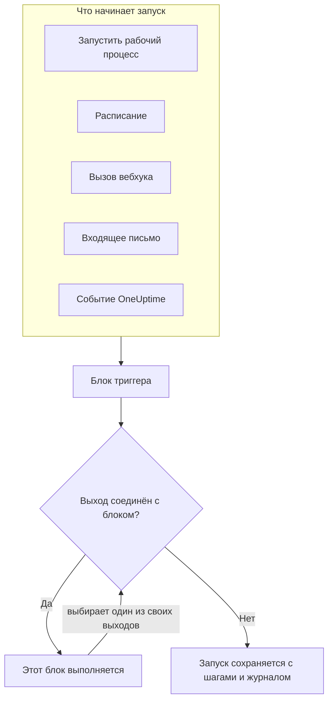
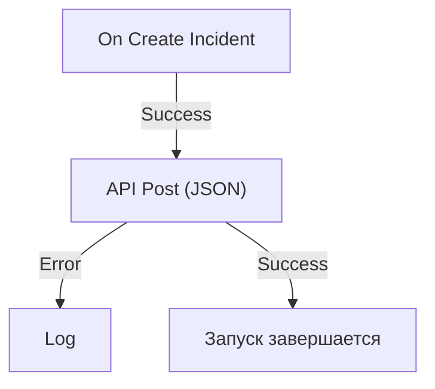

# Обзор рабочих процессов

Рабочие процессы автоматизируют работу в OneUptime без кода. Вы размещаете блоки на холсте, соединяете их, и рабочий процесс выполняется сам каждый раз, когда срабатывает его триггер: создаётся инцидент, наступает время по расписанию, другой инструмент вызывает URL или приходит письмо. Используйте их, чтобы связать OneUptime с остальным вашим стеком и взять на себя рутинные последующие действия, пока вы заняты самой проблемой.

:::cards
- [Создание рабочего процесса](/docs/workflows/authoring): Создайте рабочий процесс, затем добавьте, соедините и настройте его блоки на холсте.
- [Триггеры](/docs/workflows/triggers): Запускайте рабочий процесс вручную, по расписанию, из вебхука, письма или события OneUptime.
- [Компоненты](/docs/workflows/components): Все блоки, которые можно добавить, от вызовов API до записей OneUptime.
- [Запуски](/docs/workflows/runs-and-logs): Посмотрите, что сделал каждый запуск, шаг за шагом.
:::

## Как работает рабочий процесс

У каждого рабочего процесса три части:

1. **Триггер** — то, что запускает рабочий процесс: ручной запуск, расписание, вызов вебхука, входящее письмо или событие в OneUptime, например новый инцидент. У каждого рабочего процесса ровно один триггер.
2. **Компоненты** — то, что делает рабочий процесс: отправляет сообщение, вызывает API, проверяет условие, создаёт или обновляет запись OneUptime.
3. **Соединения** — линии, которые вы проводите от одного блока к следующему. Они определяют, что выполняется после чего.

Когда срабатывает триггер, OneUptime начинает **запуск**. Каждый блок завершается тем, что выбирает один из своих выходов, например **Success** или **Error**, **Yes** или **No**, и дальше выполняются только блоки, соединённые с этим выходом. Если с выходом, который выбрал блок, не соединён ни один блок, этот путь заканчивается. Запуск сохраняется со своим статусом, пройденным путём и тем, что каждый блок получил и вернул.



Всё это вы собираете визуально на холсте. Большинству рабочих процессов код совсем не нужен; а когда нужен, блок **Run Custom JavaScript** выполняет несколько строк JavaScript.

## Что можно делать с рабочими процессами

- **Связать OneUptime с другими инструментами** — публиковать в Slack, Microsoft Teams, Discord, Telegram или IRC, создавать задачи в Jira или отправлять запрос в любой API вашего стека.
- **Реагировать на то, что происходит в OneUptime** — когда создаётся инцидент, сообщить нужному каналу и автоматически открыть тикет.
- **Выполнять задачи по расписанию** — каждые пять минут, каждую ночь, каждое утро понедельника.
- **Принимать данные извне** — позволить другим системам запускать рабочий процесс, вызывая его URL или отправляя письмо на его адрес.
- **Повторно использовать общую автоматизацию** — соберите её один раз и запускайте из любого другого рабочего процесса блоком **Execute Workflow**.

## Ключевые понятия

| Понятие                  | Что означает                                                                                                   |
| ------------------------ | -------------------------------------------------------------------------------------------------------------- |
| **Рабочий процесс**      | Вся автоматизация целиком: имя, холст с блоками и переключатель, чтобы включить или отключить её.             |
| **Триггер**              | Первый блок. Он определяет, когда выполняется рабочий процесс. У каждого рабочего процесса ровно один триггер. |
| **Компонент**            | Любой другой блок: он отправляет сообщение, делает запрос, проверяет условие или изменяет запись.              |
| **Выход**                | Точка внизу блока, например **Success** или **Error**. Линии из неё ведут к следующим блокам.                  |
| **Запуск**               | Одно выполнение рабочего процесса, сохранённое со статусом, отметками времени и тем, что сделал каждый блок.   |
| **Глобальная переменная** | Значение, например ключ API, которое вы сохраняете один раз и используете в любом рабочем процессе проекта.   |

## Прежде чем начать

- **Тарифный план с рабочими процессами.** В OneUptime Cloud рабочим процессам нужен план **Growth** или выше, и каждый план допускает определённое число запусков за каждые 30 дней — см. [Ограничения тарифного плана](/docs/workflows/configuration#ограничения-тарифного-плана). В собственных установках без выставления счетов нет ни того, ни другого ограничения.
- **Право на создание.** Для создания и изменения рабочих процессов нужна роль **Workflow Admin**, **Project Admin** или **Project Owner** либо пользовательская роль с соответствующими разрешениями. **Workflow Member** может открывать рабочие процессы и запускать их вручную, но не изменять их. См. [Разрешения](/docs/workflows/configuration#разрешения).

## Где найти рабочие процессы в OneUptime

Откройте **Продукты** на верхней панели и выберите **Рабочие процессы** в разделе **Дашборды и автоматизация**. Его меню содержит:

- **Рабочие процессы** — список ваших рабочих процессов. Создайте новый или откройте существующий.
- **Глобальные переменные** — значения, общие для всех ваших рабочих процессов.
- **Журналы → Запуски** — история выполнения всех рабочих процессов проекта.
- **Настройки → Правила меток** и **Правила владельца** — автоматически назначайте метки новым рабочим процессам и их владельцев.
- **Расширенный → Архивировано** — рабочие процессы, которые вы архивировали. Они никогда не выполняются и не показываются в списке; извлекайте их из архива здесь. См. [Архивирование рабочего процесса](/docs/workflows/configuration#архивирование-рабочего-процесса).
- **Для разработчиков** — как управлять рабочими процессами через Terraform, API или ИИ-ассистента.

Откройте отдельный рабочий процесс, и его собственное меню содержит:

- **Обзор** — имя, описание, метки и переключатель **Включено**.
- **Конструктор** — холст, на котором вы проектируете рабочий процесс, с переключателем **Включено** вверху.
- **Переменные рабочих процессов** — значения, которые относятся только к этому рабочему процессу.
- **Журналы → Запуски** — каждый запуск этого рабочего процесса с подробностями.
- **Владельцы** — люди и команды, отвечающие за рабочий процесс.
- **Для разработчиков** — как управлять этим рабочим процессом через Terraform, API или ИИ-ассистента.
- **Настройки** — дублирование, экспорт и архивирование.

**Настройки** находятся в разделе меню **Расширенный** вместе с **Журналы аудита** и **Удалить рабочий процесс**. **Расширенный** и **Для разработчиков** изначально свёрнуты, в этом меню и во всех остальных, чтобы страницы, которыми вы пользуетесь каждый день, шли первыми. Нажмите на название раздела, чтобы показать его страницы. Он раскрывается сам, когда вы находитесь на одной из них.

## Создайте свой первый рабочий процесс

Каждый рабочий процесс складывается одинаково:

:::steps
1. **Создайте** — выберите отправную точку, затем дайте рабочему процессу имя. См. [Создание рабочего процесса](/docs/workflows/authoring).
2. **Выберите триггер** — ручной, по расписанию, вебхук, входящее письмо или событие из OneUptime. См. [Триггеры](/docs/workflows/triggers).
3. **Добавьте компоненты** — разместите действия на холсте и соедините их. См. [Компоненты](/docs/workflows/components).
4. **Включите его** — включите переключатель **Включено** вверху страницы **Конструктор**. Отключённый рабочий процесс вообще не может выполняться, даже вручную.
5. **Проверьте** — нажмите **Запустить рабочий процесс** на странице **Конструктор** и следите за запуском по ходу выполнения.
:::

Пример ниже проходит эти шаги для настоящего рабочего процесса.

## Пример: отправка новых инцидентов в вебхук

Этот рабочий процесс отправляет JSON-сводку каждого нового инцидента на выбранный вами URL — в систему тикетов, хранилище данных, куда угодно, что принимает вебхук, — и записывает причину в журнал запуска, если запрос не удался.



> [!TIP]
> Шаблон **Forward new incidents to another system** собирает такой же рабочий процесс за вас. Найдите его в разделе **Инциденты**, когда создаёте рабочий процесс.

:::steps
### Создайте рабочий процесс

Откройте **Рабочие процессы** и нажмите **Создать рабочий процесс**. Нажмите **Начать с нуля**, назовите рабочий процесс `Send new incidents to a webhook` и нажмите **Создать рабочий процесс**.

Новый рабочий процесс откроется на странице **Конструктор**, выключенным.

### Добавьте триггер

Нажмите на пунктирный блок **Choose what starts this workflow**, затем нажмите **On Create Incident** в разделе **Popular** на панели **Add Trigger**.

Триггер займёт место пунктирного блока. Его ID, `incident-on-create-1`, — это то, по чему на него ссылаются последующие блоки.

### Выберите поля инцидента

Нажмите на триггер. В **Select Fields** отметьте поля, которые должен нести запрос, например заголовок и описание, и нажмите **Сохранить**.

Триггер передаёт новый инцидент дальше с этими полями. Поле, которое вы не выбрали, приходит пустым.

### Добавьте блок API

Нажмите **Добавить компонент**, затем нажмите **API Post (JSON)** в разделе **Popular**. Протяните линию от точки **Success** триггера вниз к верхней точке нового блока.

### Заполните запрос

Нажмите на блок API, на котором написано **Click to set up**. Укажите свою конечную точку в **URL**. В **Request Body** напишите JSON для отправки, используя **{ }**, чтобы вставить поля инцидента там, где они нужны, и нажмите **Сохранить**.

```json title="Request Body"
{
  "id": "{{local.components.incident-on-create-1.returnValues.model._id}}",
  "title": "{{local.components.incident-on-create-1.returnValues.model.title}}",
  "description": "{{local.components.incident-on-create-1.returnValues.model.description}}"
}
```

Каждая ссылка `{{…}}` заменяется значением из инцидента, когда рабочий процесс выполняется. Синтаксис описан в разделе [Переменные](/docs/workflows/variables).

### Перехватите ошибки

Нажмите **Добавить компонент**, затем нажмите **Журнал**. Соедините с ним точку **Error** блока API, затем задайте в блоке Log значение **Value** равным `Could not send the incident: {{local.components.api-post-1.returnValues.error}}`.

Запрос, который не удался, — недоступный URL или ответ не из диапазона 2xx — теперь идёт по этому пути, и журнал запуска объясняет причину.

### Включите его

Включите переключатель **Включено** вверху страницы **Конструктор**.

### Проверьте его

Нажмите **Запустить рабочий процесс**, введите **ID инцидента** для инцидента в этом проекте, нажмите **Run Workflow Manually** и подтвердите кнопкой **Run**.

Откроется панель **Запуск рабочего процесса**, которая следит за запуском. Откройте шаг **API Post (JSON)**, чтобы увидеть отправленное тело и полученный ответ.
:::

Теперь каждый новый инцидент в проекте начинает запуск. Все они собраны в разделе [Запуски](/docs/workflows/runs-and-logs) рабочего процесса.

> [!NOTE]
> Запрос отправляется из OneUptime. В OneUptime Cloud URL должен быть доступен из интернета. Собственная установка отклоняет частные сетевые адреса, если администратор их не разрешил, — см. [Исходящий доступ в сеть](/docs/workflows/configuration#исходящий-доступ-в-сеть).

## Как рабочие процессы связаны с остальным OneUptime

- **Мониторы** замечают проблему. **Инциденты** и **оповещения** её фиксируют. **Рабочие процессы** на неё реагируют.
- **Runbook-и** — это процедуры реагирования, которые ваша команда проходит при инциденте, оповещении или обслуживании: ручные шаги, согласования и скрипты, с участием людей. Рабочие процессы выполняются без присмотра. Используйте [runbook](/docs/runbooks/index), когда человеку нужно принимать решения по ходу дела, и рабочий процесс, когда каждый шаг автоматический.
- **Подключения рабочих пространств** связывают проект со Slack и Microsoft Teams для каналов инцидентов и уведомлений. Блоки Slack и Microsoft Teams в рабочих процессах их не используют: каждый блок публикует через свой собственный URL входящего вебхука.

## Что дальше

:::cards
- [Создание рабочего процесса](/docs/workflows/authoring): Работа с холстом, блоками и их настройками.
- [Переменные](/docs/workflows/variables): Передавайте данные между блоками и держите секреты вне рабочих процессов.
- [Конфигурация и безопасность](/docs/workflows/configuration): Разрешения, ограничения и безопасность перед запуском в работу.
:::
