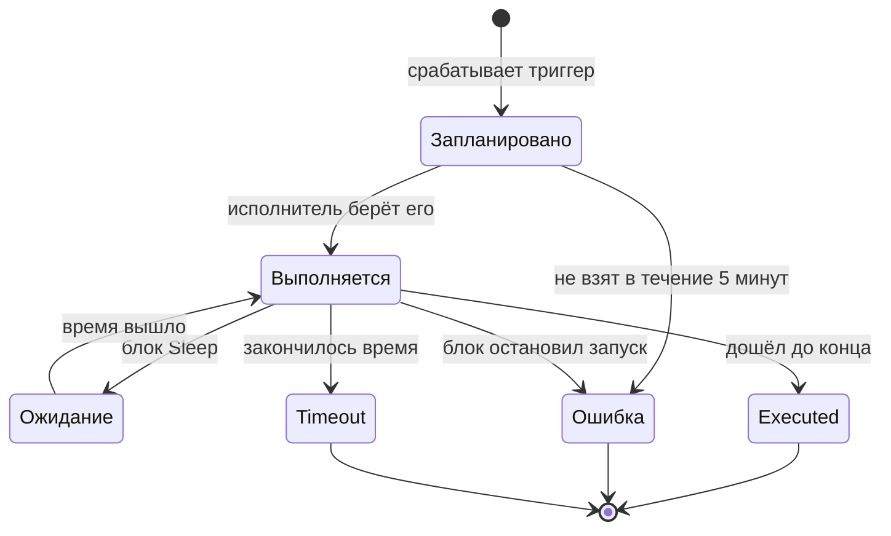

# Запуски рабочего процесса

Каждый раз, когда выполняется рабочий процесс, OneUptime сохраняет запись о том, что произошло: когда он выполнялся, успешно ли и что каждый блок получил и вернул. Такая запись называется **запуском**. По запускам вы убеждаетесь, что рабочий процесс сработал, разбираетесь с тем, который не сработал, и просматриваете прошлую активность.

:::cards
- [Статусы запуска](#статусы-запуска): Что означают Запланировано, Ожидание, Executed и другие статусы.
- [Чтение запуска](#чтение-запуска): Проследите путь, который прошёл запуск, блок за блоком.
- [Устранение неполадок](#устранение-неполадок): Рабочий процесс, который не выполнился, блок, который так и не выполнился, значение, пришедшее пустым.
:::

## Где их найти

| Страница                                             | Что вы видите                                                                                      |
| ---------------------------------------------------- | -------------------------------------------------------------------------------------------------- |
| **Рабочие процессы → Журналы → Запуски**             | Каждый запуск каждого рабочего процесса в проекте. Фильтры по имени рабочего процесса, статусу и времени. |
| **Рабочий процесс → Журналы → Запуски**              | Только запуски этого рабочего процесса. Здесь вместо фильтра по рабочему процессу есть фильтр **ID запуска**. |
| **Отдельный запуск**                                 | Открывается кнопкой **Просмотреть логи** в строке запуска — сами строки не кликабельны.            |

Запуск, начатый со страницы **Конструктор**, открывает то же представление **Запуск рабочего процесса**, которое уже следит за запуском, так что вы видите его в процессе, а не ищете потом.

## Статусы запуска

| Статус                              | Что означает                                                                                                                                                                                                                                                          |
| ----------------------------------- | --------------------------------------------------------------------------------------------------------------------------------------------------------------------------------------------------------------------------------------------------------------------- |
| **Запланировано**                   | Триггер сработал, и запуск стоит в очереди к исполнителю. Обычно доли секунды. Запуск, который всё ещё запланирован через 5 минут, завершается неудачей: его никто не взял.                                                                                          |
| **Выполняется**                     | Рабочий процесс выполняется.                                                                                                                                                                                                                                          |
| **Ожидание**                        | Запуск остановлен на блоке **Sleep** и продолжится сам. Пока он ждёт, он не занимает обработчик.                                                                                                                                                                     |
| **Executed**                        | Запуск дошёл до конца без ошибок. Это успешное состояние: на метке написано **Executed**, а не «Успешно».                                                                                                                                                            |
| **Ошибка**                          | Блок остановил запуск. Используется также, когда запуск в очереди так никто и не взял, когда потеряно возобновление спящего запуска, когда выражение расписания не удаётся разрешить и когда рабочий процесс был выключен или архивирован, пока запуск ждал на блоке **Sleep**. |
| **Timeout**                         | Запуск длился дольше разрешённого: по умолчанию 2 минуты. См. [Сколько может длиться запуск](/docs/workflows/configuration#сколько-может-длиться-запуск).                                                                                                                |
| **Execution Exceeded Current Plan** | Проект исчерпал запуски рабочих процессов за последние 30 дней, или подписка не оплачена. Запуск записывается, но не выполняется. Только OneUptime Cloud.                                                                                                            |

Блок, выбравший выход **Error**, — например, блок API, получивший 4xx, — не делает запуск неудачным. Блоки, соединённые с **Error**, выполняются, и запуск всё равно заканчивается как **Executed**. Сам шаг выделяется красным, чтобы вы его нашли.

## Чтение запуска

Нажмите **Просмотреть логи** у запуска, чтобы открыть его. У представления **Запуск рабочего процесса** две вкладки: **Шаги** и **Full Log**.

### Вкладка Шаги

Путь, который прошёл запуск, — по одной пронумерованной карточке на блок, в порядке выполнения. Не открывая ничего, каждая карточка показывает:

- Заголовок и ID блока, помечен ли он как **Успешно** или **Не удалось** и сколько времени это заняло.
- Какой выход он выбрал, с названием, как на холсте, и куда этот выход привёл: номер и название следующего шага или пометку, что к нему ничего не подключено, поэтому запуск или эта ветвь на этом закончились. Шаг, к которому он привёл, но который так и не выполнился, помечен **(did not run)**. Выход Error выделяется красным; Yes и No — это просто путь, по которому пошёл запуск. Наведите указатель на название выхода, чтобы узнать, что он означает.
- Ошибку шага, если он завершился неудачей, и любое предупреждение о нём, например ссылку `{{…}}`, которая разрешилась в пустоту.

Откройте карточку, чтобы увидеть два блока подробностей:

| Блок         | Что показывает                                                                                                                                                                                                  |
| ------------ | --------------------------------------------------------------------------------------------------------------------------------------------------------------------------------------------------------------- |
| **Received** | Настройки, которые получил блок, по названиям и в том порядке, в котором их перечисляет список настроек, после подстановки всех переменных. Настройка, которая ссылается на другой шаг или переменную, показывает ссылку рядом со значением, которым она стала, и **Did not resolve**, если она стала пустотой. |
| **Returned** | То, что он произвёл, с ID каждого значения (последняя часть ссылки `returnValues`). Списки и объекты показываются с отступами.                                                                                  |

Неудачные шаги, шаги с предупреждением и единственный шаг запуска открываются развёрнутыми. Счётчик вкладки **Шаги** становится красным, если что-то не удалось, и оранжевым, если у шага есть предупреждение.

Некоторые запуски читаются иначе:

- **Проверка одного шага.** Запуск, начатый через **Run just this step**, вверху помечен **Only this step ran**. Шаги перед ним не выполнялись, поэтому значений, которые он из них читает, нет (ожидайте для них предупреждение **Did not resolve**), а шаги после него помечены **(not run in this test)**. Чтобы проверить весь путь, используйте **Запустить рабочий процесс**.
- **Запуск, остановившийся между шагами.** Если запуск остановился по причине, которую не объясняет ни один шаг, — время вышло между шагами или сбой произошёл до первого шага, — путь заканчивается пометкой **The run stopped here** и причиной.
- **Спящий запуск.** Запуск, который ждёт на блоке **Sleep**, заканчивается пометкой **Sleeping** и временем, когда он продолжится сам; шаги после Sleep помечены **(not run yet)**.

ID под заголовком каждого шага — это ровно то, что ставится в ссылку `{{local.components.<id>.returnValues.…}}`, поэтому так быстрее всего составить ссылку правильно.

Показанные значения — это то, что получил блок после подстановки переменных и до того, как блок что-либо с ними сделал, с двумя исключениями: секреты и поля, которые блок помечает как конфиденциальные, скрыты, а значение длиннее 4000 символов обрезается с "… (truncated)". Запуск хранит последние 100 шагов; у длинного или часто возобновляемого запуска на месте отброшенных ранних шагов показана оранжевая пометка. Запуски, записанные до того, как стали сохраняться названия выходов, показывают выход по его ID, без указания, куда он привёл.

### Вкладка Full Log

Сырой построчный журнал, который записал исполнитель, включая всё, что блоки записали сами, например значение блока **Log** или `console.log` скрипта. Используйте его, когда вкладка Шаги не объясняет сбой.

## Копирование и скачивание запуска

Вверху представления **Запуск рабочего процесса**, рядом с кнопкой закрытия, **Скопировать журнал** помещает весь **Full Log** в буфер обмена, чтобы его можно было вставить в чат или тикет. **Скачать** сохраняет запуск в файл:

| Скачивание                              | Что вы получаете                                                                                                                                                                                                                       |
| --------------------------------------- | -------------------------------------------------------------------------------------------------------------------------------------------------------------------------------------------------------------------------------------- |
| **Скачать журнал**                      | Файл `.txt` с полным журналом ровно в том виде, в каком его записал исполнитель, любой длины, под коротким заголовком: имя и ID рабочего процесса, ID запуска, его статус и время, когда он был запланирован, начат и завершён.         |
| **Скачать запуск в формате JSON**       | Файл `.json` с теми же сведениями в виде данных, шагами, которые показывает вкладка **Шаги** (что каждый получил и вернул и какой выход выбрал), и журналом в виде списка строк. Шаги имеют ту же форму, в которой API возвращает `stepTrace` запуска, и, как на вкладке **Шаги**, это последние 100 шагов запуска. Журнал всегда полный. |

Те же два варианта скачивания есть в меню **⋯** каждого запуска в обоих списках запусков, так что запуск можно сохранить, не открывая его. Запуск, начатый со страницы **Конструктор**, можно копировать или скачивать, пока он ещё идёт; вы получите то, что он успел записать.

Файлы называются по рабочему процессу, запуску и времени начала в UTC, поэтому папка с ними сортируется по рабочему процессу, а затем по времени: `nightly-sync-run-<run id>-2026-09-30T10-00-01.txt`.

В скачанном файле нет ничего, чего нельзя было бы прочитать в самом запуске. Секреты и поля, которые блок помечает как конфиденциальные, скрываются при записи запуска, поэтому в файле они тоже скрыты, а скачать запуск может любой, кто может его открыть.

## Устранение неполадок

:::details Мой рабочий процесс не выполнился
1. Убедитесь, что рабочий процесс **Включено**: переключатель находится вверху его страницы **Конструктор**, которая сообщает об этом над холстом, когда рабочий процесс выключен. Новые рабочие процессы создаются отключёнными, а отключённый рабочий процесс отклоняет каждый запуск — в том числе ручной. Вызов его вебхука получает HTTP 400 с сообщением о том, как его включить.
2. Для триггера события OneUptime убедитесь, что событие действительно произошло: откройте запись и проверьте её историю. Триггер **On Update** с **Listen on** срабатывает, только когда изменилось одно из этих полей.
3. Для триггера вебхука убедитесь, что другая система отправляет запросы на правильный URL. Большинство инструментов записывают в журнал отправку вебхука — проверьте там.
4. Для триггера расписания убедитесь, что cron-выражение соответствует ожидаемому времени. Расписания работают в UTC.

Если запуск появился со статусом **Execution Exceeded Current Plan**, проект израсходовал все запуски рабочих процессов за последние 30 дней или подписка не оплачена. В журнале запуска указаны их количество и лимит вашего плана. Это относится только к OneUptime Cloud.
:::

:::details Последующий блок так и не выполнился
Блок, который не выполняется, — обычно проблема соединений. Откройте **Конструктор** и проверьте:

- Соединён ли выход предыдущего блока со входом этого блока?
- Выбрал ли предыдущий блок не тот выход, которого вы ожидали, — **Error** вместо **Success** или **No** вместо **Yes**? Вкладка **Шаги** показывает, какой выход он выбрал и куда тот привёл или что к нему ничего не подключено.
:::

:::details Значение пришло пустым или как текст {{…}}
Откройте запуск и посмотрите на шаг. Ссылка, которая не разрешилась, отмечается на самом шаге как предупреждение, а её настройка в блоке **Received** помечена **Did not resolve**.

- Если вы видите буквальный текст `{{local.components.…}}`, ссылка не разрешилась. Обычно это опечатка в ID компонента или ID возвращаемого значения — помните, что это **Identifier** блока, а не надпись на нём. Проверьте также написание самого `local.components`: `{{local.componets.api-get-1.returnValues.response-body}}` отправляется как буквальный текст, а запуск всё равно сообщает **Executed**. Если запуск был проверкой через **Run just this step**, предыдущий блок вообще не выполнялся — запустите весь рабочий процесс.
- Если вы видите **Empty text**, предыдущий блок выполнился, но не произвёл это поле.

То же предупреждение есть на вкладке **Full Log** в строке, начинающейся с `Warning:`.
:::

:::details Работает, когда я запускаю вручную, но не от триггера
Откройте **Конструктор**, нажмите **Запустить рабочий процесс** и заполните поля триггера значениями, похожими на то, что присылает настоящий триггер. Затем сравните значения **Received** этого запуска со значениями настоящего запуска бок о бок. Разница обычно в имени или типе одного поля.
:::

## Повторный запуск рабочего процесса

Кнопки «повторить этот запуск» нет. Старые запуски никогда не повторяются автоматически, потому что их побочные эффекты — сообщения в Slack, вызовы API, тикеты — может быть небезопасно повторять. Чтобы выполнить работу заново, исправьте рабочий процесс и дождитесь, пока его запустит следующий настоящий триггер, или откройте **Конструктор** и нажмите **Запустить рабочий процесс** с теми же значениями.

## Сколько хранятся запуски?

В OneUptime Cloud запуски хранятся **30 дней**, а затем удаляются — поэтому оба списка запусков описывают себя как охватывающие последние 30 дней. Собственные установки хранят запуски, пока вы их не удалите; если рабочий процесс выполняется очень часто и захламляет историю, выключите или удалите его.

У запусков, записанных до появления трассировки шагов, нет содержимого на вкладке **Шаги**, и они показывают только **Full Log**.

## Что дальше

:::cards
- [Конфигурация и безопасность](/docs/workflows/configuration): Ограничения по времени и плану и то, что скрывается в записях запусков.
- [Переменные](/docs/workflows/variables): Синтаксис ссылок, который используют ваши блоки.
- [Компоненты](/docs/workflows/components): Что возвращает каждый блок и когда он выбирает каждый выход.
:::
