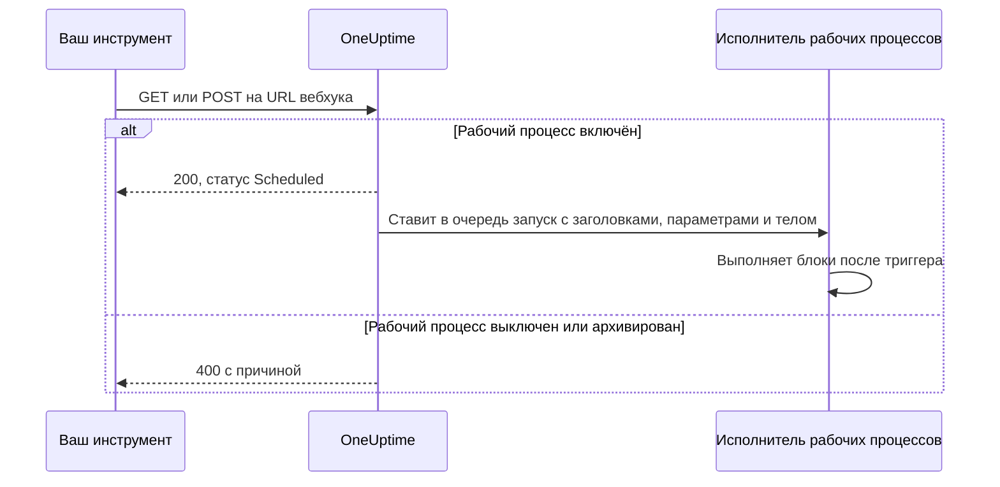
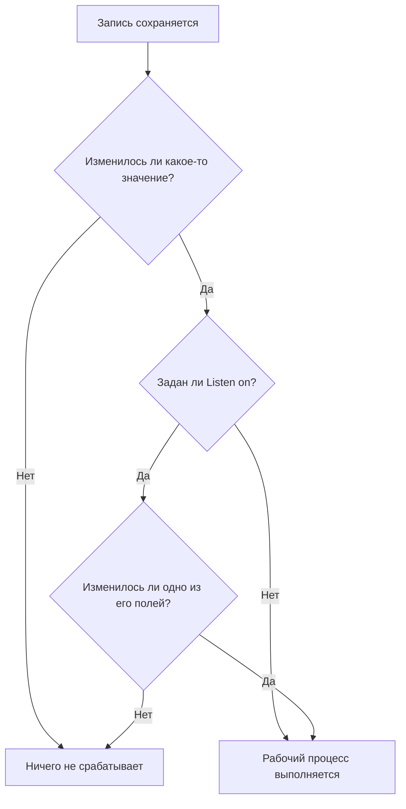

# Триггеры рабочего процесса

Триггер — это первый блок рабочего процесса: он определяет, когда рабочий процесс выполняется. У каждого рабочего процесса ровно один триггер. Выбрать можно из пяти типов.

:::cards
- [Вручную](#manual): Запускайте рабочий процесс из Конструктора или из другого рабочего процесса.
- [Расписание](#schedule): Выполняйте его по повторяющемуся расписанию, заданному cron-выражением.
- [Вебхук](#webhook): Позвольте другой системе запускать его вызовом URL.
- [Входящая почта](#incoming-email): Запускайте его каждым письмом, отправленным на его собственный адрес.
- [Триггеры событий OneUptime](#триггеры-событий-oneuptime): Реагируйте, когда запись создаётся, обновляется или удаляется.
:::

Чтобы добавить триггер, нажмите на пунктирный блок **Choose what starts this workflow** на холсте нового рабочего процесса. Чтобы его изменить, удалите блок триггера, и пунктирный блок вернётся. См. [Создание рабочего процесса](/docs/workflows/authoring#добавление-блоков).

## Какой триггер выбрать?

| Если вы хотите…                                | Выберите                    |
| ---------------------------------------------- | --------------------------- |
| Запускать рабочий процесс нажатием кнопки      | **Manual**                  |
| Выполнять по повторяющемуся расписанию         | **Расписание**              |
| Позволить другой системе присылать данные      | **Webhook**                 |
| Начинать с письма                              | **Incoming Email**          |
| Реагировать на что-то в OneUptime              | **Событие OneUptime**       |

У рабочего процесса может быть только один триггер. Если нужны два способа запускать одну и ту же автоматизацию, соберите общую логику в рабочем процессе с триггером **Manual** и запускайте его из двух тонких рабочих процессов-«обёрток» блоком **Execute Workflow**.

## Manual

Запускайте рабочий процесс когда угодно: нажмите **Запустить рабочий процесс** на странице **Конструктор**, заполните **JSON** триггера, нажмите **Run Workflow Manually** и подтвердите кнопкой **Run**. Другой рабочий процесс тоже может запустить его блоком **Execute Workflow**.

Подходит для: автоматизации в один щелчок, для которой нужна кнопка, например «сменить этот ключ» или «отправить тестовое оповещение», и логики, общей для нескольких рабочих процессов.

**Returns**: **JSON** — то, с чем был начат запуск.

- Из **Запустить рабочий процесс** это введённый вами JSON в виде текста. Чтобы прочитать в нём поле, сначала пропустите его через блок **Text to JSON**.
- Из блока **Execute Workflow** каждый ключ в **Arguments** блока — отдельное значение. С `{"customerId": "42"}` последующий блок читает `{{local.components.manual-1.returnValues.customerId}}`, где `manual-1` — ID триггера Manual.

## Schedule

Выполняйте рабочий процесс по повторяющемуся расписанию. Задайте частоту в **Schedule at**: выберите один из вариантов **Common schedules**, введите выражение **Custom cron** или выберите **Переменная**, которая его содержит. Под полем расписание описано словами вместе с **Next runs**.

Подходит для: ночной очистки, ежечасной синхронизации, еженедельных отчётов.

Время указывается в UTC, поэтому при выборе часа пересчитывайте его из своего часового пояса. Пять частей cron-выражения — это минута, час, день месяца, месяц и день недели:

| Выражение     | Выполняется                            |
| ------------- | -------------------------------------- |
| `*/5 * * * *` | Каждые 5 минут.                        |
| `0 * * * *`   | Каждый час, ровно в начале часа.       |
| `0 0 * * *`   | Каждый день в полночь UTC.             |
| `0 9 * * 1-5` | Каждый будний день в 9:00 UTC.         |
| `0 9 * * 1`   | Каждый понедельник в 9:00 UTC.         |

Пока рабочий процесс выключен, ничего не планируется. Расписание с **Переменная** читает переменную рабочего процесса или глобальную переменную, например `{{local.variables.schedule}}`. Если она не превращается в корректное cron-выражение, рабочий процесс не планируется, а неудачный запуск в его списке запусков объясняет причину.

Чтобы проверить рабочий процесс, не дожидаясь расписания, нажмите **Запустить рабочий процесс** на странице **Конструктор**: запуск начнётся сразу.

## Webhook

OneUptime выдаёт рабочему процессу собственный URL. Всё, что вызывает этот URL, запускает рабочий процесс и передаёт заголовки, параметры запроса и тело запроса.

Подходит для: приёма в OneUptime данных из другого инструмента — обратных вызовов CI/CD, оповещений из другой системы мониторинга, регистраций в вашей CRM.

Чтобы получить URL, нажмите на триггер Webhook на холсте. URL показан вверху его настроек вместе с кнопкой **Скопировать URL**, методами, которые он принимает, и командой `curl`, которую можно вставить в терминал, чтобы его проверить:

```bash
curl -X POST "https://oneuptime.example.com/workflow/trigger/<secret key>" \
  -H "Content-Type: application/json" \
  -d '{"message": "Hello"}'
```

URL принимает и `GET`, и `POST`. Вызывающая сторона получает быстрое подтверждение, `{"status": "Scheduled"}`, — сам рабочий процесс выполняется в фоне, поэтому вызывающая сторона никогда не видит, что он делает. Вызов отключённого или архивированного рабочего процесса отклоняется с HTTP 400 и причиной.



**Returns**:

| Значение                 | Что содержит                                                                                                           |
| ------------------------ | ---------------------------------------------------------------------------------------------------------------------- |
| **Request Headers**      | Все заголовки запроса по именам в нижнем регистре, например `content-type`.                                           |
| **Request Query Params** | Параметры запроса в URL по именам.                                                                                     |
| **Request Body**         | Тело, которое отправила вызывающая сторона. Тело JSON, отправленное с `Content-Type: application/json`, читается поле за полем. |

Чтобы прочитать отдельное поле, добавьте его имя к ссылке, как в `{{local.components.webhook-1.returnValues.request-body.message}}`.

Когда запрос пришёл, выбор значений в каждом блоке после триггера знает, что в нём было: он показывает поля тела, заголовки и параметры запроса, каждое со своим содержимым, так что вы можете выбрать `incident.title` вместо того, чтобы вводить путь. До этого он сообщает, что запрос ещё не приходил, и предлагает **Copy test request** — команду `curl` для этого URL; поля появятся, как только завершится запуск, начатый запросом. См. [Использование значений из предыдущих блоков](/docs/workflows/authoring#использование-значений-из-предыдущих-блоков).

Чтобы проверить рабочий процесс без другого инструмента, нажмите **Запустить рабочий процесс** на странице **Конструктор** и введите заголовки, параметры запроса и тело.

### Держите URL в секрете

Последняя часть URL — это секретный ключ рабочего процесса, и любой, у кого есть URL, может запустить рабочий процесс. Поэтому ключ скрыт, пока вы не нажмёте **Показать**, а **Скопировать URL** копирует весь URL, не показывая его.

Если URL утёк, нажмите **Сбросить URL** там же: рабочий процесс получит новый URL, а старый сразу перестанет работать, поэтому обновите всё, что его вызывает. Видеть и сбрасывать URL могут только те, кому разрешено редактировать рабочий процесс, — см. [Безопасность вебхуков](/docs/workflows/configuration#безопасность-вебхуков).

> [!WARNING]
> Относитесь к URL как к паролю. Любой, у кого он есть, может запустить ваш рабочий процесс без входа в систему.

## Incoming Email

OneUptime выдаёт рабочему процессу собственный адрес электронной почты. Каждое письмо, отправленное на этот адрес, запускает рабочий процесс и передаёт письмо: кто его отправил, кому оно адресовано, тему, текст и HTML, заголовки и имена вложений, если они есть.

Подходит для: действий по письмам из систем, которые не умеют вызывать вебхук, — оповещений из старых инструментов мониторинга, уведомлений поставщика о статусе, отчёта, который рассылает ночная задача.

Чтобы получить адрес, нажмите на триггер Incoming Email на холсте. Адрес показан вверху его настроек вместе с кнопкой **Скопировать адрес**. Передайте его тому, что должно запускать рабочий процесс: инструменту, который умеет только отправлять почту, настройкам уведомлений поставщика или правилу пересылки в вашем собственном почтовом ящике.

Каждое письмо начинает отдельный запуск. Письмо доходит до рабочего процесса, стоит ли адрес в поле «Кому» или «Копия», в скрытой копии или письмо пришло через правило пересылки. Письмо, в котором адрес указан дважды, начинает один запуск.

**Returns**:

| Значение        | Что содержит                                                                                             |
| --------------- | -------------------------------------------------------------------------------------------------------- |
| **From**        | Адрес отправителя.                                                                                       |
| **To**          | Все, кому адресовано письмо, одной строкой, например `ops@example.com, oncall@example.com`.              |
| **CC**          | Все, кому письмо отправлено в копии, одной строкой.                                                      |
| **Subject**     | Тема письма.                                                                                             |
| **Body**        | Обычный текст письма.                                                                                    |
| **HTML Body**   | HTML письма, если он есть. Body и HTML Body обрезаются до 1 МБ каждое.                                   |
| **Headers**     | Все заголовки письма по именам в нижнем регистре, например `message-id`.                                 |
| **Attachments** | Имя, тип и размер каждого вложения. Сами файлы не сохраняются.                                           |
| **Received At** | Когда OneUptime получил письмо.                                                                          |

Когда письмо пришло, выбор значений в каждом блоке после триггера знает, что в нём было: он показывает каждый заголовок и каждое вложение письма с их содержимым, так что вы можете выбрать `headers.message-id` вместо того, чтобы вводить путь. До этого он сообщает, что на адрес ещё не пришло ни одного письма. См. [Использование значений из предыдущих блоков](/docs/workflows/authoring#использование-значений-из-предыдущих-блоков).

Чтобы проверить рабочий процесс, не отправляя письмо, нажмите **Запустить рабочий процесс** на странице **Конструктор** и заполните отправителя, тему и тело. Значения, которые вы не укажете, придут пустыми.

Почта запускает рабочий процесс, только пока он включён. Письма отключённому рабочему процессу игнорируются, как и письма рабочему процессу, триггер которого больше не Incoming Email.

### Держите адрес в секрете

Часть адреса до `@` содержит секретный ключ рабочего процесса, и любой, у кого есть адрес, может запустить рабочий процесс. Поэтому ключ скрыт, пока вы не нажмёте **Показать**, а **Скопировать адрес** копирует весь адрес, не показывая его.

Если адрес утёк, нажмите **Сбросить адрес** там же: рабочий процесс получит новый адрес, а письма на старый с этого момента игнорируются, поэтому сообщите новый всем, кто пишет рабочему процессу. Видеть и сбрасывать адрес могут только те, кому разрешено редактировать рабочий процесс, — см. [Безопасность входящей почты](/docs/workflows/configuration#безопасность-входящей-почты).

> [!WARNING]
> Любой может поставить в письмо любого отправителя, поэтому **From** не доказывает, кто его отправил. Прежде чем шаг сделает что-то важное, проверьте то, что знает только настоящий отправитель.

> [!NOTE]
> В собственной установке OneUptime получает почту через поставщика входящей почты, которого настраивает ваш администратор, — см. [SendGrid Inbound Email](/docs/self-hosted/sendgrid-inbound-email). До тех пор у триггера нет адреса, и его настройки об этом сообщают.

## Триггеры событий OneUptime

Почти всё в OneUptime — мониторы, инциденты, оповещения, плановые обслуживания, страницы статуса, политики дежурства, команды — может запустить рабочий процесс. Каждый ресурс предлагает до трёх событий:

- **On Create** — срабатывает, когда добавляется новый.
- **On Update** — срабатывает, когда он изменяется. Сохранение записи с теми значениями, которые у неё уже есть, например форма, сохранённая без изменений, или переключатель, отправленный в том же положении, — это не изменение, и триггер не срабатывает.
- **On Delete** — срабатывает, когда он удаляется.

Так строится «когда в OneUptime происходит X, сделать Y» без опроса в цикле.

**On Update** можно ограничить некоторыми полями через **Listen on**: тогда он срабатывает, только когда обновление меняет одно из них, на любое значение, — выключение переключателя или очистка поля тоже считаются.



**On Create** и **On Update** передают запись следующему блоку с полями, выбранными в **Select Fields** триггера. Например, триггер **Incident → On Create** передаёт новый инцидент, чтобы следующий блок мог прочитать его заголовок, описание, серьёзность или любое другое выбранное поле, например `{{local.components.incident-on-create-1.returnValues.model.title}}`. Поле, которое вы не выбрали, приходит пустым.

**On Delete** передаёт только ID удалённой записи: к моменту выполнения рабочего процесса записи уже нет, поэтому её остальные поля прочитать нельзя.

Чтобы проверить триггер события, не дожидаясь события, нажмите **Запустить рабочий процесс** на странице **Конструктор** и введите ID существующей записи, например **ID инцидента**. Запуск прочитает эту запись с выбранными полями.

### События, которые команды используют чаще всего

| Ресурс                                    | Для чего его используют команды                                                           |
| ----------------------------------------- | ----------------------------------------------------------------------------------------- |
| **Инцидент**                              | Реагировать, когда инцидент объявлен, обновлён (подтверждён, разрешён) или удалён.        |
| **Оповещение**                            | Те же три события для оповещений.                                                         |
| **Монитор**                               | Реагировать, когда монитор добавлен, изменён или удалён.                                  |
| **Запланированный Обслуживание Событие**  | Автоматически объявлять окно обслуживания, когда оно запланировано.                       |
| **Страница статуса Подписчик**            | Приветствовать того, кто подписался на страницу статуса.                                  |
| **Политика дежурства**                    | Синхронизировать изменения политики с другой системой дежурств.                           |

На панели **Add Trigger** они находятся в разделе **OneUptime resources**: нажмите на ресурс, затем на триггер. В **Browse all resources** есть все, а поле поиска находит триггер по нескольким словам, например `incident created`.

## Что дальше

:::cards
- [Компоненты](/docs/workflows/components): Действия, которые вы добавляете после триггера.
- [Переменные](/docs/workflows/variables): Читайте в последующих блоках то, что передал триггер.
- [Запуски](/docs/workflows/runs-and-logs): Убедитесь, что триггер сработал, и посмотрите, что он принёс.
:::
