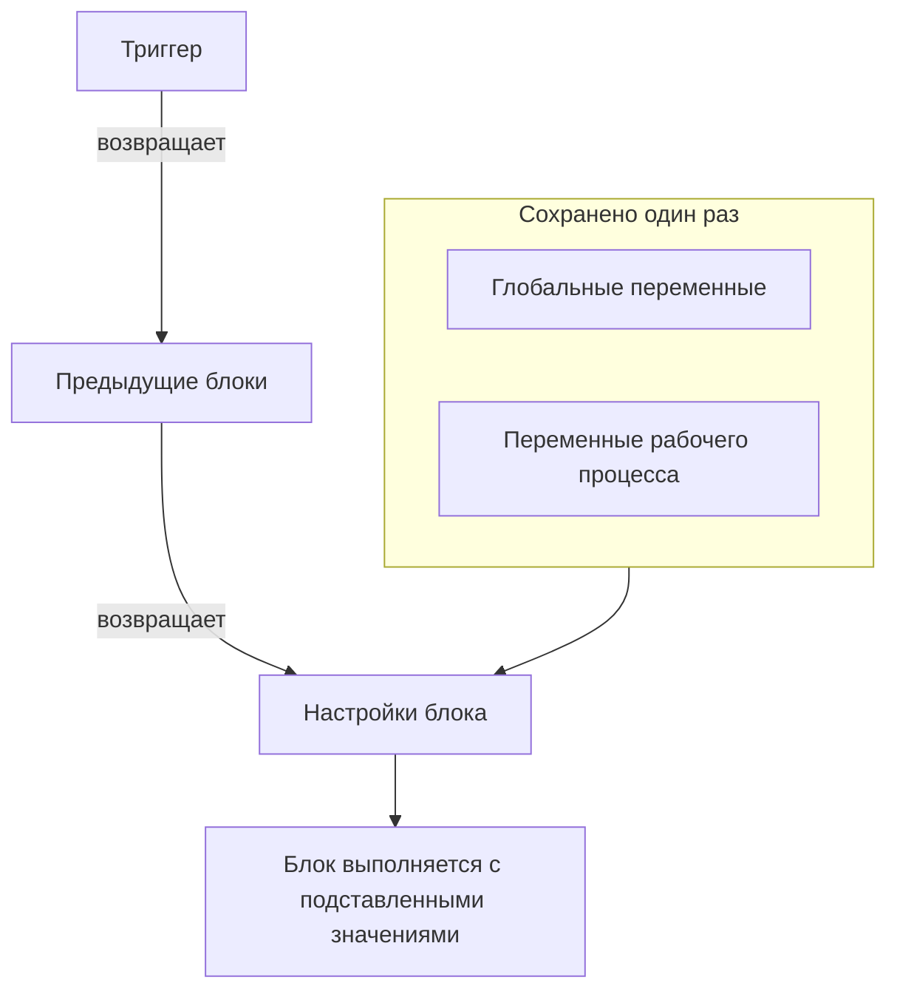
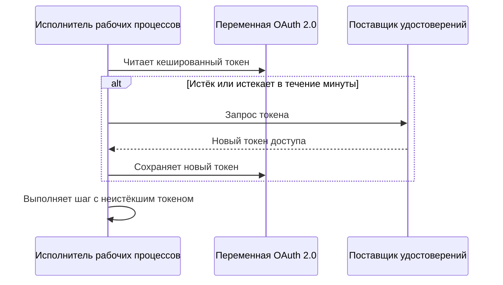

# Переменные рабочего процесса

Переменные — это способ, которым данные движутся по рабочему процессу: от триггера к первому блоку, от одного блока к следующему и от значений, которые вы сохраняете один раз, к каждому блоку, которому они нужны. Настройка блока читает значение по ссылке в двойных фигурных скобках, а исполнитель подставляет его непосредственно перед выполнением блока.

| Значение                       | Откуда берётся                                                       | Как блок его читает                                   |
| ------------------------------ | -------------------------------------------------------------------- | ----------------------------------------------------- |
| **Глобальная переменная**      | Сохранена в **Рабочие процессы → Глобальные переменные**             | `{{global.variables.NAME}}`                          |
| **Переменная рабочего процесса** | Сохранена на странице **Переменные рабочих процессов** одного рабочего процесса | `{{local.variables.NAME}}`                 |
| **Значение предыдущего блока** | То, что триггер или предыдущий блок вернул в этом запуске            | `{{local.components.BLOCK_ID.returnValues.VALUE_ID}}` |



Вводить ссылку вручную приходится редко. Нажмите **{ }** в конце настройки или введите в ней `{{` и выберите значение из списка. См. [Использование значений из предыдущих блоков](/docs/workflows/authoring#использование-значений-из-предыдущих-блоков).

## Глобальные переменные

Значения для всего проекта, которые вы сохраняете один раз и используете в каждом рабочем процессе: ключи API, URL, названия каналов — всё, что не хочется копировать в десять разных рабочих процессов.

:::steps
### Откройте глобальные переменные

Перейдите в **Рабочие процессы → Глобальные переменные** и нажмите **Создать: Рабочий процесс Переменная**.

### Назовите переменную

На шаге **Переменная** заполните:

- **Имя** — то, по чему вы на неё ссылаетесь. Не менее двух символов, без пробелов, только буквы, цифры, дефисы и подчёркивания. `UPPER_SNAKE_CASE` — хорошая привычка, потому что такие имена выделяются в ваших блоках.
- **Описание** — необязательный произвольный текст, напоминающий, для чего она нужна.

Нажмите **Далее**.

### Задайте значение

На шаге **Значение** заполните:

- **Содержимое** — само значение. Это поле для длинного текста, поэтому многострочные значения работают.
- **Секрет** — если включено, значение вырезается из журналов запусков и трассировок шагов.

Нажмите **Создать: Рабочий процесс Переменная**. Чтобы до этого изменить имя или описание, нажмите **Переменная** в списке шагов рядом с формой (виден на широких экранах); введённое на обоих шагах сохраняется.
:::

Используйте глобальную переменную в любом рабочем процессе так:

```text
{{global.variables.NAME}}
```

Например, если вы сохранили ключ PagerDuty как `PAGERDUTY_KEY`, любой блок может использовать его как `{{global.variables.PAGERDUTY_KEY}}` — редактор сохраняет ссылку, а журналирование рабочего процесса вырезает подставленное секретное значение.

В списке показаны имя и описание каждой переменной. Нажмите **Просмотр** в строке, чтобы открыть страницу переменной. Она показывает, статическая переменная или OAuth 2.0, и на ней делается всё остальное:

| Кнопка                                     | Что делает                                                                                                                                       |
| ------------------------------------------ | ------------------------------------------------------------------------------------------------------------------------------------------------ |
| **Редактировать: Переменная**              | Меняет имя, описание и — для статической переменной, которая ещё не секретная, — отметку секрета. Ставшая секретной переменная остаётся секретной. |
| **Update Content**                         | Заменяет статическое значение. Сохранённое содержимое нельзя прочитать обратно, поэтому новое значение вводится целиком.                         |
| **Use in Workflows**                       | Показывает точную ссылку для вставки в ваши блоки с кнопкой копирования.                                                                         |
| **Удалить: Рабочий процесс Переменная**    | Удаляет её после подтверждения. В подтверждении названа переменная, чтобы вы могли проверить, что удаляете нужную.                               |

Чтобы вместо этого создать переменную для **токена доступа OAuth 2.0**, откройте меню **Ещё** (**⋯**) рядом с **Создать: Рабочий процесс Переменная** и выберите **Create OAuth 2.0 Variable**. Переменным OAuth 2.0 посвящён [отдельный раздел](#переменные-oauth-20-токены-которые-обновляются-сами) ниже. Тип переменной после сохранения изменить нельзя.

Обновить переменную можно и через API — это описано [в конце этой страницы](#обновление-переменной-из-рабочего-процесса). Глобальные переменные и переменные рабочих процессов — функция плана Growth.

## Локальные переменные рабочего процесса

Переменные, которые принадлежат одному рабочему процессу и управляются в разделе **Переменные рабочих процессов** его меню. Они работают так же, как глобальные: **Создать: Рабочий процесс Переменная** создаёт статическую переменную, меню **Ещё** (**⋯**) создаёт переменную OAuth 2.0, а **Просмотр** открывает страницу переменной. Ссылайтесь на них так:

```text
{{local.variables.NAME}}
```

Используйте такую переменную для значения, которое нужно только этому рабочему процессу, например URL вебхука Slack у шаблона. Шаблоны, которые запрашивают настройки, сохраняют их как переменные рабочего процесса, чтобы потом их можно было изменить, не редактируя блоки.

## Переменные OAuth 2.0 (токены, которые обновляются сами)

Bearer-токен, вставленный в статическую переменную, работает, пока не истечёт, обычно в течение часа. После этого каждый запуск, который его использует, завершается ошибкой `401 Unauthorized`, пока кто-нибудь не вставит новый. Переменная для **токена доступа OAuth 2.0** хранит то, что нужно для обмена токенов OAuth, а не сам токен, и OneUptime поддерживает токен актуальным.

Используется она точно так же, как любая другая переменная:

```http
Authorization: Bearer {{global.variables.CRM_API_TOKEN}}
```

### Как токен остаётся действительным



- Когда рабочий процесс впервые использует переменную, OneUptime запрашивает токен доступа у конечной точки токенов вашего поставщика удостоверений и сохраняет его.
- Перед каждым шагом, который ссылается на переменную, исполнитель проверяет токен. Если он истёк или истекает в течение следующей минуты, новый токен запрашивается до выполнения шага. Компонент всегда получает неистёкший токен, сколько бы переменная ни простаивала и сколько бы ни длился запуск.
- Обновление вызывают только шаги, которые действительно ссылаются на переменную. Запуск, который переменную никогда не использует, никогда не запрашивает её токен и не завершается ошибкой из-за того, что этот поставщик недоступен.
- Когда новый токен нужен сразу многим запускам, его запрашивает один, а остальные используют.
- Если поставщик не сообщает, когда истекает токен (нет `expires_in`, и токен не является JWT с утверждением `exp`), OneUptime запрашивает новый один раз за запуск и использует его во всех шагах этого запуска.

### Типы предоставления

| Тип предоставления             | Для чего                                                                                                                                                                                                                                            |
| ------------------------------ | --------------------------------------------------------------------------------------------------------------------------------------------------------------------------------------------------------------------------------------------------- |
| **Client Credentials**         | OneUptime входит как ваше приложение. Обычный выбор для API между серверами, например Microsoft Graph, API Auth0 или Okta либо внутреннего сервиса за Keycloak.                                                                                    |
| **Токен обновления**           | Делегированный доступ от имени пользователя. Один раз авторизуйте приложение (например, в OAuth playground вашего поставщика или в Postman) и вставьте полученный refresh token. OneUptime обменивает его на токены доступа и сохраняет каждый новый refresh token, если ваш поставщик их ротирует. Публичный клиент без секрета клиента тоже работает. |

### Создание

**Create OAuth 2.0 Variable** спрашивает по одному на каждом шаге:

1. **Переменная**: имя, по которому на неё ссылаются рабочие процессы, и описание.
2. **Провайдер**: выберите **Поставщик удостоверений**, и OneUptime заполнит его **URL токена**:

   | Поставщик удостоверений | Заполняемый URL токена |
   |---|---|
   | Microsoft Entra ID | `https://login.microsoftonline.com/{tenant-id}/oauth2/v2.0/token` |
   | Google | `https://oauth2.googleapis.com/token` |
   | Okta | `https://{your-domain}/oauth2/default/v1/token` |
   | Auth0 | `https://{your-domain}/oauth/token` |

   Замените часть в фигурных скобках своим значением, например ID каталога (tenant) или доменом Okta. Форма не перейдёт дальше, пока в URL она остаётся. Для любого другого поставщика выберите **Другой поставщик** и укажите его конечную точку токенов сами. Затем выберите **Тип предоставления**. Если выбрать Google, выбирается **Токен обновления**, потому что клиенты OAuth в Google не могут использовать Client Credentials. Поставщик только заполняет форму; вместе с переменной он не сохраняется.
3. **Учётные данные**: **Client ID** и **Client Secret** приложения, которое вы зарегистрировали у поставщика, а для типа предоставления Refresh Token — **Токен обновления**. Публичный клиент с типом предоставления Refresh Token может оставить секрет клиента пустым.
4. **Расширенный**, всё необязательно:
   - **Область**: через пробел. Оставьте пустым, чтобы получить области поставщика по умолчанию. Для Client Credentials Microsoft Entra ID требует область, оканчивающуюся на `/.default` (например, `https://graph.microsoft.com/.default`), а Okta требует пользовательскую область.
   - **Дополнительные параметры**: дополнительные поля формы для запроса токена, например `audience` для Auth0 (обязателен для Client Credentials) или `resource` для Azure AD v1. Их может прочитать любой, кто может прочитать переменную, поэтому не помещайте сюда секреты.
   - **Аутентификация клиента**: отправлять ли ID и секрет клиента в заголовке HTTP Basic (по умолчанию) или в теле запроса. Если ваш поставщик отвечает `invalid_client`, попробуйте другой вариант.

Под некоторыми полями форма добавляет строку подсказки для выбранного поставщика, например где Microsoft Entra ID показывает ID вашего tenant и что секрет клиента — это **Value** секрета, а не его **Secret ID**.

Когда вы сохраняете новую переменную OAuth 2.0, OneUptime сразу запрашивает её первый токен и сообщает, что ответил поставщик. Опечатка в секрете или URL обнаруживается сразу, а не через несколько часов в неудачном запуске. Запрос токена записывает в переменную, поэтому для него нужно разрешение на изменение переменных рабочих процессов; если вы можете создавать переменные, но не изменять их, токен запросит первый запуск рабочего процесса, который использует переменную.

На странице переменной (нажмите **Просмотр** в её строке) есть карточка **OAuth 2.0 Settings**. **Изменить настройки** проходит те же шаги **Провайдер** (URL токена), **Учётные данные** (ID клиента) и **Расширенный** (область, дополнительные параметры, аутентификация клиента). **Далее** переходит дальше, а **Сохранить изменения** — на последнем шаге. Все шаги уже заполнены, поэтому список шагов рядом с формой открывает любой из них: измените одну настройку на её шаге, затем откройте последний шаг и сохраните. Тип предоставления после сохранения фиксирован.

### Карточка Токен доступа

Карточка **Токен доступа** на странице переменной OAuth 2.0 показывает один из этих статусов:

| Статус                     | Что означает                                                                                                                         |
| -------------------------- | ------------------------------------------------------------------------------------------------------------------------------------ |
| **Valid**                  | Кешированный токен ещё не истёк.                                                                                                     |
| **Истёк**                  | Нормально для переменной, которую давно не использовал ни один рабочий процесс. Следующий запуск, который её использует, получит новый токен. |
| **Ещё не запрашивалась**   | С момента создания переменной или изменения её настроек токен не запрашивался.                                                       |
| **No expiry reported**     | Поставщик не сообщил, когда истекает токен, поэтому каждый запуск получает новый.                                                    |
| **Refresh failed**         | Последняя попытка получить токен не удалась. Причина от поставщика показана полностью вместе со временем. Следующее успешное обновление её убирает. |

**Обновить сейчас** под статусом сразу запрашивает новый токен. Используйте её, чтобы проверить новые настройки, не запуская рабочий процесс. **Update Credentials** на карточке **OAuth 2.0 Settings** заменяет секрет клиента или refresh token и затем запрашивает с ними токен. Если вы меняете настройку (URL токена, ID клиента, область и так далее), кешированный токен отбрасывается, чтобы следующий запуск получил токен с новыми настройками.

### Когда поставщик отказывает

Шаг, которому был нужен токен, завершается ошибкой ещё до выполнения, а журнал запуска называет переменную и цитирует ответ поставщика, например `Could not get an OAuth 2.0 access token for {{global.variables.CRM_API_TOKEN}}: The token endpoint refused the request (HTTP 400): invalid_grant - Token has been expired or revoked.` Та же причина показана на карточке **Токен доступа** переменной. `invalid_grant` у переменной Refresh Token почти всегда означает, что сам refresh token истёк или отозван, и решение — **Update Credentials**.

Если обновление не удалось, а кешированный токен на самом деле ещё не истёк (он был только в пределах минутного запаса), шаг продолжается с кешированным токеном, и журнал об этом сообщает.

### Безопасность

- Переменные OAuth 2.0 всегда секретные. Токен доступа заменяется на `[REDACTED]` в журналах запусков и трассировках шагов, включая токен, заменённый посреди запуска.
- Секрет клиента, refresh token и токен доступа зашифрованы в базе данных и никогда не читаются обратно через API или дашборд. **Обновить сейчас** сообщает, когда истекает новый токен, но никогда не показывает сам токен.
- URL токена должен быть `http` или `https`. Запросы к loopback, link-local и адресам облачных метаданных отклоняются. В OneUptime Cloud отклоняются и частные сетевые адреса. Собственные установки могут обращаться к поставщику удостоверений в своей сети. OneUptime не выполняет перенаправления при запросах токенов, поэтому указывайте в URL токена адрес, по которому конечная точка действительно отвечает. Запрос токена прекращается через 20 секунд.

### Перевод существующего статического токена на OAuth 2.0

Тип переменной после сохранения фиксирован. Удалите статическую переменную и создайте переменную OAuth 2.0 с **тем же именем**. Рабочие процессы ссылаются на переменные по имени, поэтому подхватят новую без каких-либо изменений.

## Выходные данные компонентов (данные от предыдущих блоков)

Каждый триггер и каждый компонент может производить выходные данные во время запуска. Вставляйте ссылку кнопкой **{ }** в настройке или вводом `{{` в ней, а не набирайте её вручную: так вставляются точные ID, которые ожидает исполнитель, а значение показывается плашкой с названием блока и значения.

Можно начать и с блока, который производит значение: его настройки показывают каждый выход в разделе **Returns** с точной ссылкой и кнопкой для её копирования.

Ссылайтесь на выходные данные предыдущего блока так:

```text
{{local.components.COMPONENT_ID.returnValues.FIELD_ID}}
```

`COMPONENT_ID` — это **Identifier** блока: короткий ID, показанный на блоке, а не надпись на нём. Новые блоки получают ID вроде `api-get-1`, и его можно переименовать в разделе **ID** блока. Если его переименовать, все ссылки, которые уже на него указывают, перестанут работать, так же как при переименовании переменной. `FIELD_ID` — это ID значения, а путь после него читает поле в значении JSON.

| После такого блока, как…                                  | Читайте                                                                                |
| --------------------------------------------------------- | -------------------------------------------------------------------------------------- |
| Блок **API** с ID `lookup-user`                           | Код статуса: `{{local.components.lookup-user.returnValues.response-status}}`. Тело: `{{local.components.lookup-user.returnValues.response-body}}`. |
| Блок **Run Custom JavaScript** с ID `transform`           | То, что он вернул: `{{local.components.transform.returnValues.returnValue}}`.          |
| Триггер **On Create Incident** с ID `incident-on-create-1` | Заголовок инцидента: `{{local.components.incident-on-create-1.returnValues.model.title}}`. Триггеры записей возвращают одно значение, `model`, внутрь которого вы спускаетесь. |

Значения блоков существуют только в течение текущего запуска. Каждый новый запуск начинается с чистого листа.

## Где работают переменные

Переменные принимают почти все текстовые поля:

- URL в блоке API.
- Текст сообщения в Slack, Teams, Discord, Telegram, IRC, Email.
- Тема и тело письма.
- Заголовки и поля тела (внутри строковых значений).
- Обе стороны блока **If / Else**.

В полях JSON — **Data (JSON Object)**, **Query** и **Select Fields** в компонентах записей, **Request Body** блока API, **Arguments** в **Run Custom JavaScript** — ссылка подставляется в зависимости от того, где она стоит:

- **В кавычках это текст.** `{"title": "Down: {{local.components.ci-webhook.returnValues.request-body.service}}"}` вставляет значение в строку. Кавычки, обратные косые черты и переводы строк в значении экранируются, поэтому JSON остаётся корректным, а значение — одной строкой.
- **Сама по себе это само значение.** `{"customFields": {{local.components.transform.returnValues.returnValue}}}` вставляет объект целиком, список остаётся списком, а число — числом. Текст, который сам является JSON, — `5`, `true` или объект, который блок вернул как JSON-текст, — вставляется как это значение. Любой другой текст вставляется как строка.

Ссылка внутри кавычек ключа тоже является текстом. Если нужно построить структуру динамически, постройте её блоком **Run Custom JavaScript** и передайте его выходные данные следующему блоку.

Блок **Run Custom JavaScript** не получает переменные автоматически — в песочницу ничего не внедряется. Поместите `{{global.variables.NAME}}` (или любую ссылку на компонент) в JSON-поле **Arguments** блока; эти значения подставляются перед выполнением скрипта и приходят как `args`.

## Перебор массивов

В текстовом поле можно повторить кусок текста для каждого элемента списка с помощью `{{#each path}}…{{/each}}`. Внутри блока `{{property}}` читает из текущего элемента, `{{@index}}` — его позиция начиная с 0, а `{{this}}` — сам элемент в списках простых значений. Имена внутри блока `{{#each}}` обрезаются, поэтому лишние пробелы там не мешают — в отличие от всех остальных мест.

Например, такой **Message Text** перечисляет каждое оповещение, которое прислал вебхук:

```text title="Message Text"
{{#each local.components.ci-webhook.returnValues.request-body.alerts}}
- {{@index}}: {{name}} is {{status}}
{{/each}}
```

## Примеры

### Собрать полезную нагрузку из вебхука

Вебхук приходит с телом вроде `{ "service": "checkout", "status": "failed" }`. Чтобы превратить его в инцидент OneUptime:

1. Триггер **Webhook** с ID `ci-webhook`.
2. Блок **If / Else**: **Value to check** — поле `status` в Request Body вебхука (`{{local.components.ci-webhook.returnValues.request-body.status}}`), **Comparison** — **is equal to**, а **Compare with** — `failed`.
3. Из ветви **Yes** — блок **Create One Incident** с:
   - Заголовок: `CI build failed: {{local.components.ci-webhook.returnValues.request-body.service}}`
   - Описание: `See {{local.components.ci-webhook.returnValues.request-body.url}} for the logs.`

### Использовать секрет в вызове API

Рабочий процесс, который вызывает PagerDuty:

1. Сохраните `PAGERDUTY_KEY` как секретную глобальную переменную.
2. В блоке **API** задайте заголовку `Authorization` значение `Token token={{global.variables.PAGERDUTY_KEY}}`.

Ключ не попадает ни в рабочий процесс, ни в журналы.

### Связать два вызова API

Первый вызов даёт ID, который нужен второму:

1. Компонент **API** `lookup-order`: в его **URL** после `/orders?email=` используйте **{ }**, чтобы вставить JSON ручного триггера с путём `email`.
2. Компонент **API** `cancel-order`: `POST /orders/{{local.components.lookup-order.returnValues.response-body.id}}/cancel`.

Если `lookup-order` завершится неудачей, вместо **Success** сработает его выход **Error**. Соедините его с блоком Email или Slack, чтобы сбои не проходили незамеченными.

## Обновление переменной из рабочего процесса

Распространённый приём — ротировать учётные данные по расписанию: получить новый токен у третьей стороны и сохранить его обратно в переменную, чтобы следующий запуск использовал его. Делается это блоком **API**, который вызывает API OneUptime.

Если учётные данные — это токен доступа OAuth 2.0, собирать это самостоятельно не нужно. [Переменная OAuth 2.0](#переменные-oauth-20-токены-которые-обновляются-сами) сама получает и обновляет токен.

Отправьте `PUT /api/workflow-variable/<variable-id>` с заголовком `ApiKey` и — именно здесь чаще всего ошибаются — полями, которые нужно изменить, **обёрнутыми в объект `data`**:

```json title="Request Body"
{
  "data": {
    "content": "{{local.components.get-token.returnValues.response-body.access_token}}"
  }
}
```

Плоское тело без обёртки `data` отклоняется с кодом 400. Отправляйте только поля, которые действительно нужно изменить; `name` и `description` можно не включать в полезную нагрузку.

У ключа API должно быть разрешение **Edit Workflow Variables**. Разрешение на чтение не требуется — обновление не читает строку обратно.

Две вещи, за которыми нужно следить:

- **Не переименовывайте переменную, на которую ссылаетесь.** `name` — часть `{{local.variables.NAME}}`. Если его изменить, все существующие ссылки останутся неразрешёнными, а неразрешённая ссылка передаётся дальше как буквальный текст, — см. [Подвохи](#подвохи).
- **Переменную можно записать таким образом, но никогда нельзя прочитать обратно.** Через API `content` доступно только для записи у всех переменных, секретных или нет. Именно это делает переменную безопасным местом для хранения ротируемого токена. Если отметить её как секретную, значение к тому же не попадает в журналы запусков и трассировки шагов.

## Подвохи

- **Используйте { } (или введите `{{`).** Так вставляются точные ID компонентов, возвращаемых значений и переменных, которые ожидает исполнитель, и предлагаются только значения, которые будут существовать во время выполнения блока.
- **Имена переменных чувствительны к регистру.** `{{global.variables.MyKey}}` и `{{global.variables.mykey}}` — разные переменные.
- **Ссылка, которую не удаётся разрешить, остаётся как есть и не становится пустой.** Ссылка на несуществующее — не ошибка, и пустую строку вы тоже не получите: фигурные скобки передаются дальше как есть, поэтому `{{local.components.api-get-1.returnValues.body}}` с опечаткой в ID шага дословно попадает в ваше сообщение Slack, URL или тело запроса, а запуск всё равно сообщает **Executed**. Вкладка **Шаги** запуска показывает на шаге предупреждение со всеми проскочившими ссылками и помечает настройку, в которой она стояла, как **Did not resolve**; в журнале запуска есть та же строка предупреждения.
- **Панель проблем не может проверить имена переменных.** Она помечает ссылки на компоненты, которые не может сопоставить, — неизвестный ID шага, неизвестное возвращаемое значение, неверный корень — до сохранения. Существует ли переменная, она не видит. Настройки блока видят: ссылка на отсутствующую переменную показывается там оранжевой плашкой. В остальных случаях переименованную переменную выявит только журнал запуска.
- **Пробелы внутри фигурных скобок не обрезаются.** `{{ local.variables.NAME }}` — это другой поиск, чем `{{local.variables.NAME}}`, и он никогда не разрешается. Единственное исключение — внутри блока `{{#each}}`, где имена обрезаются.

## Что дальше

:::cards
- [Компоненты](/docs/workflows/components): Что нужно каждому блоку и что он возвращает.
- [Запуски](/docs/workflows/runs-and-logs): Посмотрите, каким значением стала каждая ссылка в запуске.
- [Конфигурация и безопасность](/docs/workflows/configuration#секреты): Держите секреты вне блоков, экспортов и журналов.
:::
