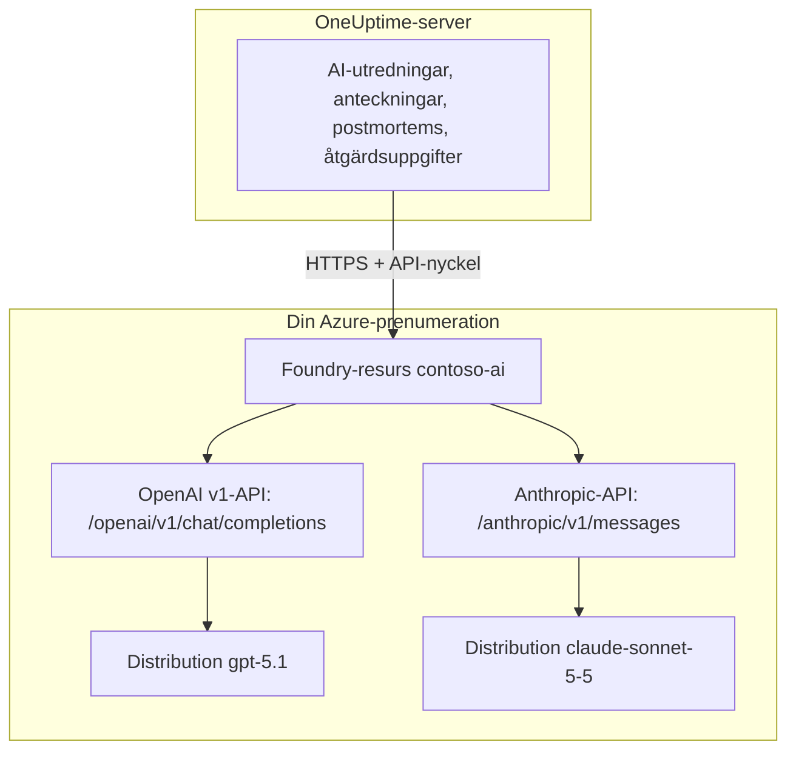

# Microsoft Foundry och Azure OpenAI

Kör OneUptimes AI-funktioner på modeller som du distribuerar i Microsoft Foundry (tidigare Azure AI Foundry) eller Azure OpenAI. OneUptime skickar varje begäran direkt till din resurs i din Azure-prenumeration, så prompter och svar behandlas av den distribution du valde, där du valde. Den här sidan tar dig från en tom prenumeration till en leverantör som fungerar: Azure-resursen, distributionen av modellen, slutpunkten och nyckeln, inställningarna i OneUptime, nätverket och vad du gör när en begäran misslyckas.

:::cards
- [Konfigurera Azure](#konfigurera-microsoft-foundry): Skapa en resurs, distribuera en modell, kopiera slutpunkten och nyckeln.
- [Anslut OneUptime](#anslut-oneuptime): Fyra fält i projektinställningarna, sedan knappen Testa.
- [Egen drift](#konfigurera-en-instans-i-egen-drift-med-miljövariabler): En leverantör för alla projekt, från miljövariabler.
- [Felsökning](#felsökning): 401, 403, en distribution som saknas, en api-version.
:::

## Så fungerar det

OneUptime anropar din Foundry-resurs över HTTPS från OneUptime-servern, aldrig från användarnas webbläsare. Varje begäran innehåller en av resursens API-nycklar och anger den distribution som ska besvara den.



En leverantörstyp, **Azure OpenAI / Microsoft Foundry**, täcker alla distributioner i resursen. Bas-URL:en talar om för OneUptime vilket API som ska anropas:

| Modell som du distribuerar | API som OneUptime anropar | Bas-URL |
| --- | --- | --- |
| OpenAI-modeller, till exempel GPT-5.1 och GPT-4.1 | OpenAI v1 chat completions | `https://contoso-ai.openai.azure.com/openai/v1` |
| Foundry Models med chat completions, till exempel DeepSeek och Grok | OpenAI v1 chat completions | `https://contoso-ai.services.ai.azure.com/openai/v1` |
| Claude | Anthropic Messages | `https://contoso-ai.services.ai.azure.com/anthropic` |

> [!IMPORTANT]
> OneUptimes AI-funktioner anropar verktyg: medan de arbetar frågar de dina monitorer, incidenter och din telemetri. Distribuera en modell som stöder verktygsanrop (function calling). Leverantörens knapp **Testa** kontrollerar det åt dig.

## Innan du börjar

Du behöver en Azure-prenumeration, en roll som låter dig skapa och läsa resursen och en OneUptime-roll som får lägga till LLM-leverantörer.

| För att | Det här behöver du i Azure |
| --- | --- |
| Skapa resursen | **Owner** eller **Contributor** på resursgruppen, eller **Foundry Account Owner** |
| Distribuera en modell | **Owner** eller **Contributor** på resursgruppen, eller **Foundry Owner** eller **Foundry Account Owner** på resursen. Claude kräver dessutom behörighet att prenumerera på erbjudanden i Azure Marketplace |
| Läsa resursens nycklar | En roll med `Microsoft.CognitiveServices/accounts/listKeys/action`, till exempel **Owner**, **Contributor** eller **Cognitive Services Contributor** |

OneUptime självt behöver ingen Azure-roll. En nyckel ger ensam åtkomst till alla distributioner i resursen utan rollkontroll, så behandla den som ett lösenord.

I OneUptime krävs **Project Owner**, **Project Admin**, **Project Member**, **Settings Admin**, **Settings Member** eller **Create LLM** för att lägga till en leverantör i ett projekt. En instans i egen drift kan i stället registrera en leverantör för alla projekt från miljövariabler, vilket kräver åtkomst till servern.

## Konfigurera Microsoft Foundry

:::steps
### Skapa en resurs

Skapa en Foundry-resurs i [Foundry-portalen](https://ai.azure.com), eller välj en som du redan har. En Azure OpenAI-resurs fungerar på samma sätt. Anteckna resursens namn: det är första delen av slutpunkten, till exempel `contoso-ai` i `https://contoso-ai.openai.azure.com`.

Välj en region som erbjuder den modell du vill ha. Låt resursens nätverksåtkomst vara öppen för alla nätverk tills vidare; [Nätverkskrav](#nätverkskrav) förklarar när och hur du stänger den.

### Distribuera en modell

Välj **Discover** i Foundry-portalen, sedan **Models**, och välj en modell, till exempel `gpt-5.1` eller `claude-sonnet-5-5`. Välj **Deploy** och sedan **Custom settings**:

- **Deployment name**: Foundry fyller i modellens namn. OneUptime ber om distributionen med det här namnet, så anteckna det exakt.
- **Deployment type**: avgör var prompter behandlas. Se [Var dina data behandlas](#var-dina-data-behandlas).

Välj **Deploy** och vänta tills distributionens status är **Succeeded**.

### Kopiera slutpunkten och en nyckel

Öppna resursen i [Azure-portalen](https://portal.azure.com) och sedan **Resource Management** > **Keys and Endpoint**. Kopiera **Endpoint** och **KEY 1**. Spara **KEY 2** för rotation: byt OneUptime till den och generera sedan om **KEY 1**.

I Foundry-portalen finns samma nyckel på distributionens flik **Details**, bredvid dess **Target URI**.
:::

:::details Föredrar du kommandoraden?
Samma steg med Azure CLI. `--model-version` tar en version som modellkatalogen anger för modellen.

```bash
az cognitiveservices account create \
  --name contoso-ai --resource-group oneuptime-ai \
  --kind AIServices --sku S0 --location eastus2 \
  --custom-domain contoso-ai

az cognitiveservices account deployment create \
  --name contoso-ai --resource-group oneuptime-ai \
  --deployment-name gpt-5.1 \
  --model-name gpt-5.1 --model-version <version> --model-format OpenAI \
  --sku-name GlobalStandard --sku-capacity 50

# KEY 1
az cognitiveservices account keys list \
  --name contoso-ai --resource-group oneuptime-ai \
  --query key1 --output tsv
```

Med `--custom-domain contoso-ai` är resursens slutpunkt `https://contoso-ai.openai.azure.com`.
:::

## Anslut OneUptime

:::steps
### Öppna LLM-leverantörer

Gå till **Projektinställningar** > **AI** > **LLM-leverantörer** och klicka på **Skapa LLM-leverantör**.

### Namnge leverantören

Under **Grundläggande information** anger du ett **Namn**, till exempel `Azure gpt-5.1`, och om du vill en **Beskrivning**. Klicka på **Nästa**.

### Fyll i leverantörsinställningarna

| Fält | Det här anger du |
| --- | --- |
| **LLM-leverantör** | **Azure OpenAI / Microsoft Foundry** |
| **API-nyckel** | Resursens **KEY 1** eller **KEY 2** |
| **Modellnamn** | Distributionens namn, exakt som Foundry visar det, till exempel `gpt-5.1` |
| **Bas-URL** | Resursens slutpunkt med `/openai/v1`, till exempel `https://contoso-ai.openai.azure.com/openai/v1`. För Claude: `https://contoso-ai.services.ai.azure.com/anthropic` |

**Ange som standard**, under **Fler fält**, är påslaget: AI-funktioner använder projektets standardleverantör. Klicka på **Skapa LLM-leverantör**.

### Testa anslutningen

Klicka på **Testa** på leverantörens rad. En leverantör som fungerar svarar "Connection successful. The LLM provider responded to a test prompt and used tool calling." Om testet misslyckas säger meddelandet vad Azure svarade och vad du ska ändra; se [Felsökning](#felsökning).
:::

Den färdiga leverantören som exempel:

```text
Namn: Azure gpt-5.1
LLM-leverantör: Azure OpenAI / Microsoft Foundry
API-nyckel: <KEY 1 från contoso-ai>
Modellnamn: gpt-5.1
Bas-URL: https://contoso-ai.openai.azure.com/openai/v1
```

Från och med nu använder projektets AI-funktioner den här distributionen. På OneUptime Cloud betalas deras begäranden inte med projektets AI-krediter: Azure fakturerar dem till din prenumeration.

## Format för bas-URL

OneUptime accepterar slutpunkten i de former som Azure-portalen och Foundry-portalen visar den i, och skickar varje begäran till adressen bredvid. Välj helst de korta: bas-URL:en rymmer högst 100 tecken.

| Bas-URL | Begäranden går till |
| --- | --- |
| `https://contoso-ai.openai.azure.com` | `https://contoso-ai.openai.azure.com/openai/v1/chat/completions` |
| `https://contoso-ai.openai.azure.com/openai/v1` | `https://contoso-ai.openai.azure.com/openai/v1/chat/completions` |
| `https://contoso-ai.services.ai.azure.com/openai/v1` | `https://contoso-ai.services.ai.azure.com/openai/v1/chat/completions` |
| `https://contoso-ai.openai.azure.com/openai/deployments/gpt-4o` | `https://contoso-ai.openai.azure.com/openai/deployments/gpt-4o/chat/completions?api-version=2024-10-21` |
| `https://contoso-ai.services.ai.azure.com/anthropic` | `https://contoso-ai.services.ai.azure.com/anthropic/v1/messages` |

- **v1-API:et** (`/openai/v1`) är Microsofts nuvarande API. Det behöver ingen `api-version`, tar distributionens namn som modell och betjänar både OpenAI-modeller och andra Foundry Models. Använd det för nya leverantörer.
- **En distributions-URL** (`/openai/deployments/<name>`) anger själv distributionen, och Azure följer det namnet i stället för **Modellnamn**. OneUptime lägger till `api-version=2024-10-21` om inte bas-URL:en har en egen `api-version`. Leverantörer som sparats så fortsätter att fungera som tidigare.
- **En distributions Target URI**, inklistrad i sin helhet från Foundry-portalen, fungerar också, så länge den ryms inom 100 tecken.
- **Claude**: Foundry levererar Claude bara via Anthropic Messages API, på resursens sökväg `/anthropic`. OneUptime anropar det med samma nyckel. Leverantörstypen **Anthropic** når det också, med samma bas-URL.

## Konfigurera en instans i egen drift med miljövariabler

På en instans i egen drift registrerar variablerna `GLOBAL_LLM_PROVIDER_*` vid start en global LLM-leverantör, som varje projekt utan egen leverantör använder, AI-åtgärdsuppgifter inräknade. Ett projekts egen leverantör går alltid först.

```bash
GLOBAL_LLM_PROVIDER_TYPE=AzureOpenAI
GLOBAL_LLM_PROVIDER_NAME=Azure gpt-5.1
GLOBAL_LLM_PROVIDER_BASE_URL=https://contoso-ai.openai.azure.com/openai/v1
GLOBAL_LLM_PROVIDER_MODEL_NAME=gpt-5.1
GLOBAL_LLM_PROVIDER_API_KEY=<KEY 1 of contoso-ai>
```

:::tabs
@tab Docker Compose
Lägg till variablerna i `config.env` och starta OneUptime igen på samma sätt som du startade det:

```bash
(export $(grep -v '^#' config.env | xargs) && docker compose up --remove-orphans -d)
```
@tab Kubernetes
Förvara nyckeln i en Secret och skicka variablerna med chartets globala `extraEnv`:

```bash
kubectl create secret generic azure-foundry \
  --namespace oneuptime --from-literal=api-key='<KEY 1 of contoso-ai>'
```

```yaml title="values.yaml"
extraEnv:
  - name: GLOBAL_LLM_PROVIDER_TYPE
    value: AzureOpenAI
  - name: GLOBAL_LLM_PROVIDER_NAME
    value: Azure gpt-5.1
  - name: GLOBAL_LLM_PROVIDER_BASE_URL
    value: https://contoso-ai.openai.azure.com/openai/v1
  - name: GLOBAL_LLM_PROVIDER_MODEL_NAME
    value: gpt-5.1
  - name: GLOBAL_LLM_PROVIDER_API_KEY
    valueFrom:
      secretKeyRef:
        name: azure-foundry
        key: api-key
```

Kör sedan `helm upgrade` med de här värdena.
:::

Leverantören följer variablerna: ändrar du dem uppdateras den vid nästa start, och tar du bort `GLOBAL_LLM_PROVIDER_TYPE` raderas den. Saknas en nyckel eller en bas-URL för den här typen nämns det i startloggen. Se [LLM-leverantörer](/docs/ai/llm-provider) för alla variabler och leverantörstyper.

## Nätverkskrav

OneUptime-servern öppnar HTTPS-anslutningar, på port 443, till resursens värdnamn, till exempel `contoso-ai.openai.azure.com` eller `contoso-ai.services.ai.azure.com`. Tillåt den utgående trafiken i din brandvägg eller proxy.

- **OneUptime Cloud** når resursen över internet, så resursen måste ta emot offentlig trafik. Kör OneUptime i egen drift om resursen ska hållas borta från internet.
- **Egen drift, privat slutpunkt**: placera resursen bakom en privat slutpunkt i ett virtuellt nätverk som OneUptime-servern når, och länka de privata DNS-zonerna `privatelink.openai.azure.com`, `privatelink.services.ai.azure.com` och `privatelink.cognitiveservices.azure.com` till det, så att resursens vanliga värdnamn slås upp till dess privata adress. Bas-URL:en förblir densamma.
- **Privata adresser**: en instans i egen drift ansluter till privata adresser om inte `DATA_SOURCE_BLOCK_PRIVATE_ADDRESSES=true` är satt. En global LLM-leverantör ansluter till dem i båda fallen.
- **Nätverksregler på resursen**: under resursens **Networking** håller **Selected networks and private endpoints** allt annat ute. En begäran som en regel avvisar misslyckas med 403.

## Var dina data behandlas

Den distributionstyp du väljer när du distribuerar modellen avgör var Azure behandlar OneUptimes prompter och modellens svar. Lagrade data stannar i resursens Azure-geografi.

| Distributionstyp | Prompter och svar behandlas |
| --- | --- |
| Global Standard, Global Provisioned | I vilken Azure-region som helst |
| Data Zone Standard, Data Zone Provisioned | Bara inom datazonen: USA, EU eller Asien och Stillahavsområdet |
| Standard, Regional Provisioned | Inom resursens Azure-geografi |

Claude-distributioner är antingen **Hosted on Azure** eller **Hosted on Anthropic**. Välj **Hosted on Azure** för att hålla prompter och svar inom Azure. Se Microsofts [distributionstyper](https://learn.microsoft.com/en-us/azure/foundry/foundry-models/concepts/deployment-types) för detaljer.

## Exempel på begäran och svar

För att kontrollera en distribution utanför OneUptime skickar du den begäran som OneUptime skickar, med `curl`:

:::tabs
@tab OpenAI v1 API
```bash
curl https://contoso-ai.openai.azure.com/openai/v1/chat/completions \
  -H "Content-Type: application/json" \
  -H "api-key: $AZURE_API_KEY" \
  -d '{
    "model": "gpt-5.1",
    "messages": [
      { "role": "user", "content": "Reply with the word: OK" }
    ]
  }'
```

Svaret, förkortat:

```json
{
  "id": "chatcmpl-7R1nGnsXO8n4oi9UPz2f3UHdgAYMn",
  "object": "chat.completion",
  "model": "gpt-5.1",
  "choices": [
    {
      "index": 0,
      "finish_reason": "stop",
      "message": { "role": "assistant", "content": "OK" }
    }
  ],
  "usage": { "prompt_tokens": 12, "completion_tokens": 2, "total_tokens": 14 }
}
```
@tab Anthropic API
```bash
curl https://contoso-ai.services.ai.azure.com/anthropic/v1/messages \
  -H "Content-Type: application/json" \
  -H "x-api-key: $AZURE_API_KEY" \
  -H "anthropic-version: 2023-06-01" \
  -d '{
    "model": "claude-sonnet-5-5",
    "max_tokens": 1024,
    "messages": [
      { "role": "user", "content": "Reply with the word: OK" }
    ]
  }'
```

Svaret, förkortat:

```json
{
  "id": "msg_01XFDUDYJgAACzvnptvVoYEL",
  "type": "message",
  "role": "assistant",
  "model": "claude-sonnet-5-5",
  "content": [{ "type": "text", "text": "OK" }],
  "stop_reason": "end_turn",
  "usage": { "input_tokens": 14, "output_tokens": 4 }
}
```
:::

OneUptimes egna begäranden innehåller mer: dess instruktioner, konversationen, de verktyg som modellen får anropa och en tokengräns. Ur svaret läser det texten, verktygsanropen, varför modellen slutade och tokenanvändningen, som **Projektinställningar** > **AI** > **AI-loggar** visar för varje begäran. Leverantörens **Ytterligare parametrar** läggs till i varje begäran.

## Microsoft Entra ID och resurser utan nycklar

OneUptime loggar in på resursen med en av dess API-nycklar. Inloggning med Microsoft Entra ID, som tjänsthuvudnamn eller hanterad identitet, stöds inte än.

Om din organisation stänger av nyckelåtkomst för AI-resurser (`disableLocalAuth`) misslyckas begäranden med `AuthenticationTypeDisabled`. Tillåt antingen nyckelåtkomst på den resurs som OneUptime använder, eller placera Azure API Management framför den:

1. Importera resursens distribution i API Management som ett Azure OpenAI-API. API Management loggar då in på resursen med sin egen hanterade identitet.
2. Ställ in API:ets rubriknamn för prenumerationsnyckeln på `api-key`.
3. I OneUptime ställer du in **Bas-URL** på API:ets adress i API Management för distributionen, till exempel `https://contoso-apim.azure-api.net/aoai/openai/deployments/gpt-5.1`, med den `api-version` som distributionen behöver, som för alla distributions-URL:er. Ställ in **API-nyckel** på en prenumerationsnyckel från API Management.

Claude-modeller som bara accepterar Microsoft Entra ID, till exempel Claude Mythos, kan inte användas än.

## Felsökning

OneUptime lägger det du ska ändra först i felet och därefter Azures eget svar. Knappen **Testa** visar hela felet; **AI-loggar** sparar de första 490 tecknen.

:::details "Azure did not accept the API key" (401)
Nyckeln är fel, har genererats om eller hör till en annan resurs. Kopiera **KEY 1** igen från **Keys and Endpoint** för den resurs som bas-URL:en anger, och klistra in den i **API-nyckel**.
:::

:::details "Key-based authentication is turned off for this resource" (403)
Azure svarade `AuthenticationTypeDisabled`: resursen accepterar bara Microsoft Entra ID. Se [Microsoft Entra ID och resurser utan nycklar](#microsoft-entra-id-och-resurser-utan-nycklar).
:::

:::details "Azure refused the request" (403)
En nätverksregel på resursen stängde ute begäran. Jämför resursens inställningar under **Networking** med [nätverkskraven](#nätverkskrav).
:::

:::details "This resource has no deployment named ..." (404)
Azure svarade `DeploymentNotFound`. Ställ in **Modellnamn** på distributionens namn exakt som Foundry-portalen listar det. En distribution som skapades under de senaste minuterna är kanske inte klar än. Om bas-URL:en är en distributions-URL är det namnet efter `/openai/deployments/` du ska kontrollera.
:::

:::details "Azure found nothing at this address" (404)
Bas-URL:en leder inte till något Azure OpenAI-API. Använd resursens slutpunkt med `/openai/v1`, till exempel `https://contoso-ai.openai.azure.com/openai/v1`. Slutpunkten för modellinferens i det avvecklade Azure AI Inference SDK (`/models`) är inget sådant: använd `/openai/v1` på samma resurs.
:::

:::details "This model needs api-version ... or later" (400)
En distributions-URL begär `api-version=2024-10-21` om den inte anger en annan, och nyare modeller, till exempel o-serien och GPT-5, avvisar så gamla versioner. Byt bas-URL:en till v1-API:et, `https://contoso-ai.openai.azure.com/openai/v1`, med distributionens namn som **Modellnamn**. Eller lägg till den version som Azure nämner, till exempel `?api-version=2024-12-01-preview`, i bas-URL:en.
:::

:::details "Azure's v1 API takes no dated api-version" (400)
Bas-URL:en slutar på `/openai/v1` och har dessutom en daterad `api-version`. Ta bort `api-version` från bas-URL:en.
:::

:::details "Bas-URL får inte vara längre än 100 tecken."
En Target URI med sin `api-version` är ofta längre än så. Använd resursens slutpunkt med `/openai/v1` och skriv distributionens namn i **Modellnamn**.
:::

:::details "...could not be reached" eller "...host name could not be resolved"
OneUptime-servern kunde inte ansluta till resursen. På OneUptime Cloud måste resursen gå att nå från internet. På en instans i egen drift kontrollerar du att servern kan slå upp resursens värdnamn, via den privata DNS-zonen vid en privat slutpunkt, och att utgående HTTPS är tillåtet.
:::

:::details För många begäranden (429)
Distributionens kvot av tokens per minut är slut. AI-funktioner väntar och försöker igen, upp till tio försök inom ungefär fem minuter, innan de rapporterar felet; knappen **Testa** ger upp tidigare. Höj distributionens kvot i Foundry-portalen, eller flytta den till en annan distributionstyp.
:::

## Nästa steg

:::cards
- [LLM-leverantörer](/docs/ai/llm-provider): Alla leverantörstyper och hur ett projekt väljer en.
- [AI SRE](/docs/ai/ai-sre): Utredningar som körs på den här leverantören.
- [Ask AI](/docs/ai/ask-ai): Frågor om ditt system, besvarade i instrumentpanelen.
:::
